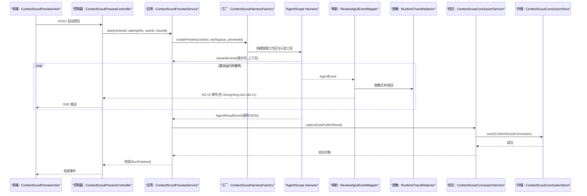
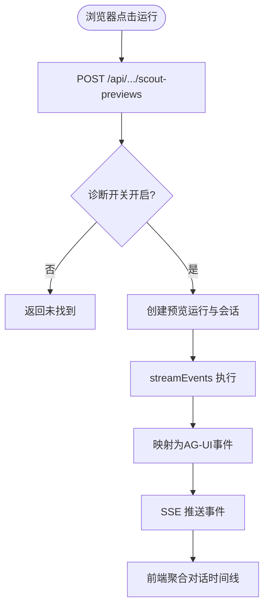
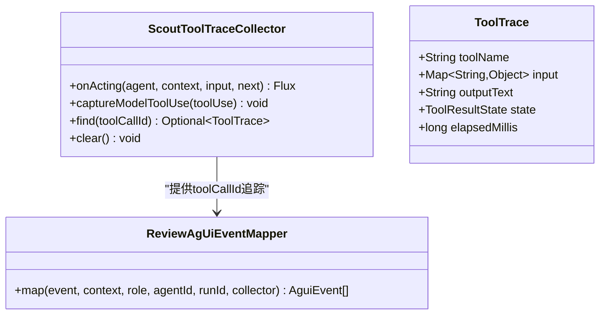
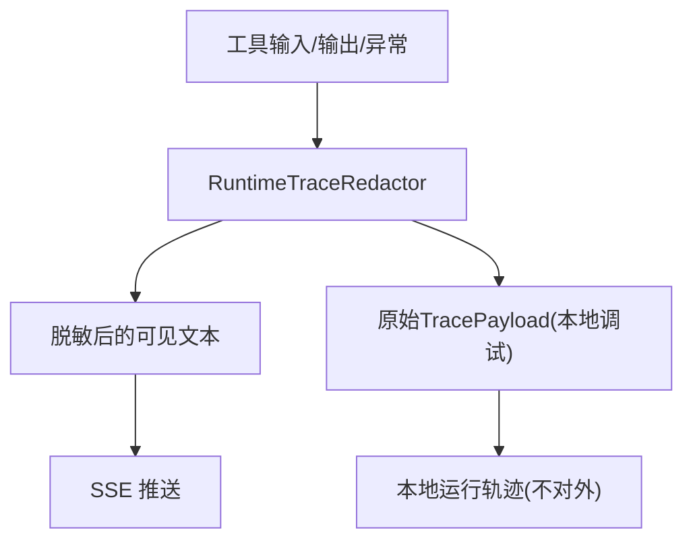
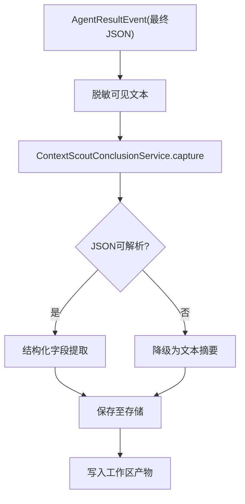
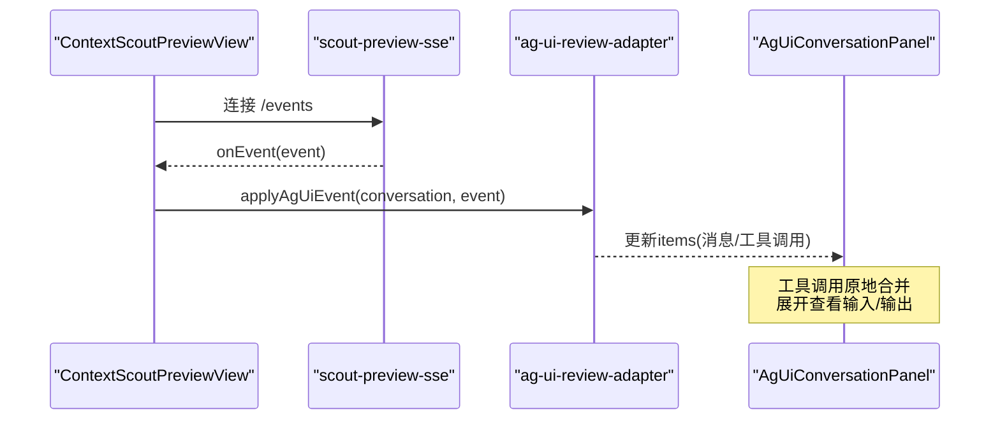
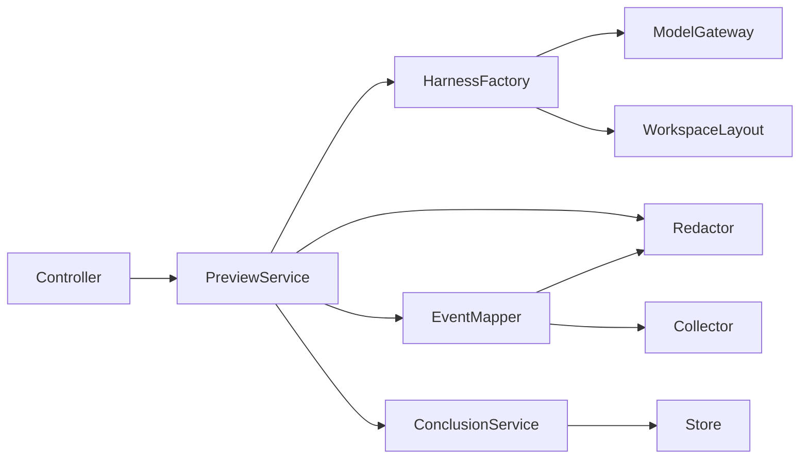

# ContextScout对话式工具流

<cite>
**本文引用的文件**
- [AIREVIEW-PLAN-019-ContextScout对话式工具流.md](file://docs/AIREVIEW-PLAN-019-ContextScout对话式工具流.md)
- [ContextScoutPreviewService.java](file://src/main/java/ai/cc/chongming/review/application/ContextScoutPreviewService.java)
- [ContextScoutConclusionService.java](file://src/main/java/ai/cc/chongming/review/application/ContextScoutConclusionService.java)
- [ContextScoutHarnessFactory.java](file://src/main/java/ai/cc/chongming/review/infrastructure/agentscope/ContextScoutHarnessFactory.java)
- [ScoutToolTraceCollector.java](file://src/main/java/ai/cc/chongming/review/infrastructure/agentscope/ScoutToolTraceCollector.java)
- [ReviewAgUiEventMapper.java](file://src/main/java/ai/cc/chongming/review/infrastructure/agentscope/ReviewAgUiEventMapper.java)
- [RuntimeTraceRedactor.java](file://src/main/java/ai/cc/chongming/review/infrastructure/agentscope/RuntimeTraceRedactor.java)
- [ContextScoutPreviewController.java](file://src/main/java/ai/cc/chongming/review/api/ContextScoutPreviewController.java)
- [ContextScoutConclusion.java](file://src/main/java/ai/cc/chongming/review/domain/model/ContextScoutConclusion.java)
- [scout-preview-sse.js](file://frontend/src/services/scout-preview-sse.js)
- [ContextScoutPreviewView.vue](file://frontend/src/views/ContextScoutPreviewView.vue)
- [ScoutConclusionPanel.vue](file://frontend/src/components/ScoutConclusionPanel.vue)
</cite>

## 目录
1. [简介](#简介)
2. [项目结构](#项目结构)
3. [核心组件](#核心组件)
4. [架构总览](#架构总览)
5. [详细组件分析](#详细组件分析)
6. [依赖关系分析](#依赖关系分析)
7. [性能与收敛特性](#性能与收敛特性)
8. [故障排查指南](#故障排查指南)
9. [结论](#结论)

## 简介
本说明聚焦于 Context Scout 的“对话式工具调用流、预览 SSE、结论存储与收敛机制”。它描述浏览器如何启动一次隔离的 Scout 预览，如何通过 SSE 实时看到模型调用的只读工具（glob_files、grep_files、read_file）的入参、出参摘要、耗时与状态，以及最终中文 JSON 概览如何被安全解析并持久化到尝试级结论中。该流程不改变正式评审领域事实，也不写入角色上下文，仅用于可重复诊断与可视化。

## 项目结构
Context Scout 预览由前端页面发起，后端通过控制器暴露 REST + SSE 接口；应用层服务编排 AgentScope Harness 执行；基础设施层负责工具观测、事件映射与安全脱敏；领域层定义结论模型；持久化层将结论落库或回退到内存实现。

```mermaid
graph TB
FE["前端: ContextScoutPreviewView.vue"] --> API["控制器: ContextScoutPreviewController"]
API --> SVC["应用: ContextScoutPreviewService"]
SVC --> HZ["工厂: ContextScoutHarnessFactory"]
HZ --> COL["观测: ScoutToolTraceCollector"]
SVC --> MAP["映射: ReviewAgUiEventMapper"]
MAP --> RED["脱敏: RuntimeTraceRedactor"]
SVC --> CON["结论: ContextScoutConclusionService"]
CON --> STORE["存储: ContextScoutConclusionStore"]
FE <-- SSE-- API
```

图表来源
- [ContextScoutPreviewController.java:44-74](file://src/main/java/ai/cc/chongming/review/api/ContextScoutPreviewController.java#L44-L74)
- [ContextScoutPreviewService.java:66-131](file://src/main/java/ai/cc/chongming/review/application/ContextScoutPreviewService.java#L66-L131)
- [ContextScoutHarnessFactory.java:71-135](file://src/main/java/ai/cc/chongming/review/infrastructure/agentscope/ContextScoutHarnessFactory.java#L71-L135)
- [ScoutToolTraceCollector.java:32-86](file://src/main/java/ai/cc/chongming/review/infrastructure/agentscope/ScoutToolTraceCollector.java#L32-L86)
- [ReviewAgUiEventMapper.java:53-159](file://src/main/java/ai/cc/chongming/review/infrastructure/agentscope/ReviewAgUiEventMapper.java#L53-L159)
- [RuntimeTraceRedactor.java:26-56](file://src/main/java/ai/cc/chongming/review/infrastructure/agentscope/RuntimeTraceRedactor.java#L26-L56)
- [ContextScoutConclusionService.java:47-72](file://src/main/java/ai/cc/chongming/review/application/ContextScoutConclusionService.java#L47-L72)

章节来源
- [AIREVIEW-PLAN-019-ContextScout对话式工具流.md:1-179](file://docs/AIREVIEW-PLAN-019-ContextScout对话式工具流.md#L1-L179)
- [ContextScoutPreviewController.java:24-99](file://src/main/java/ai/cc/chongming/review/api/ContextScoutPreviewController.java#L24-L99)
- [ContextScoutPreviewService.java:27-131](file://src/main/java/ai/cc/chongming/review/application/ContextScoutPreviewService.java#L27-L131)

## 核心组件
- 控制器：提供启动预览、查询状态、订阅事件的 REST/SSE 端点。
- 预览服务：创建隔离运行、调度 AgentScope 执行、发布 AG-UI 事件、记录可见结果。
- 观察器：基于官方中间件捕获工具开始、增量输出与结束事件，计算耗时。
- 事件映射：将运行时事件转换为标准 AG-UI 事件与自定义工具观测事件，并进行脱敏。
- 结论服务：对 Scout 输出的公开 JSON 进行解析、降级与持久化。
- 前端：发起预览、订阅 SSE、渲染连续对话时间线与结论面板。

章节来源
- [ContextScoutPreviewController.java:44-74](file://src/main/java/ai/cc/chongming/review/api/ContextScoutPreviewController.java#L44-L74)
- [ContextScoutPreviewService.java:66-158](file://src/main/java/ai/cc/chongming/review/application/ContextScoutPreviewService.java#L66-L158)
- [ScoutToolTraceCollector.java:21-105](file://src/main/java/ai/cc/chongming/review/infrastructure/agentscope/ScoutToolTraceCollector.java#L21-L105)
- [ReviewAgUiEventMapper.java:28-159](file://src/main/java/ai/cc/chongming/review/infrastructure/agentscope/ReviewAgUiEventMapper.java#L28-L159)
- [ContextScoutConclusionService.java:21-72](file://src/main/java/ai/cc/chongming/review/application/ContextScoutConclusionService.java#L21-L72)
- [scout-preview-sse.js:1-20](file://frontend/src/services/scout-preview-sse.js#L1-L20)
- [ContextScoutPreviewView.vue:35-67](file://frontend/src/views/ContextScoutPreviewView.vue#L35-L67)

## 架构总览
下图展示从浏览器到 AgentScope 再到数据库的完整数据流，包括工具观测、SSE 推送与结论落库。



图表来源
- [ContextScoutPreviewController.java:44-74](file://src/main/java/ai/cc/chongming/review/api/ContextScoutPreviewController.java#L44-L74)
- [ContextScoutPreviewService.java:106-158](file://src/main/java/ai/cc/chongming/review/application/ContextScoutPreviewService.java#L106-L158)
- [ContextScoutHarnessFactory.java:71-135](file://src/main/java/ai/cc/chongming/review/infrastructure/agentscope/ContextScoutHarnessFactory.java#L71-L135)
- [ReviewAgUiEventMapper.java:53-159](file://src/main/java/ai/cc/chongming/review/infrastructure/agentscope/ReviewAgUiEventMapper.java#L53-L159)
- [RuntimeTraceRedactor.java:26-56](file://src/main/java/ai/cc/chongming/review/infrastructure/agentscope/RuntimeTraceRedactor.java#L26-L56)
- [ContextScoutConclusionService.java:47-72](file://src/main/java/ai/cc/chongming/review/application/ContextScoutConclusionService.java#L47-L72)

## 详细组件分析

### 预览启动与 SSE 订阅
- 控制器接收请求，校验诊断开关，返回已接受的预览启动结果。
- 预览服务创建独立会话与工作区，异步执行 AgentScope 流，并将每个运行时事件映射为 AG-UI 事件后通过注册表发布。
- 前端使用 scout-preview-sse.js 连接 /events，按 lastEventId 支持重连。



图表来源
- [ContextScoutPreviewController.java:44-74](file://src/main/java/ai/cc/chongming/review/api/ContextScoutPreviewController.java#L44-L74)
- [ContextScoutPreviewService.java:66-131](file://src/main/java/ai/cc/chongming/review/application/ContextScoutPreviewService.java#L66-L131)
- [scout-preview-sse.js:1-20](file://frontend/src/services/scout-preview-sse.js#L1-L20)

章节来源
- [ContextScoutPreviewController.java:44-74](file://src/main/java/ai/cc/chongming/review/api/ContextScoutPreviewController.java#L44-L74)
- [ContextScoutPreviewService.java:66-131](file://src/main/java/ai/cc/chongming/review/application/ContextScoutPreviewService.java#L66-L131)
- [scout-preview-sse.js:1-20](file://frontend/src/services/scout-preview-sse.js#L1-L20)

### 对话式工具调用流
- 观察器通过官方中间件拦截工具调用，记录 toolCallId、工具名、输入副本、开始时间。
- 收到增量输出时追加文本，结束时计算耗时并标记状态。
- 事件映射器在 ToolCallStart 和 ToolResultEnd 时分别发送标准事件与自定义扩展事件 chongming.tool-call.v1，携带 phase、input/output/status/elapsedMs/truncated 等字段，供前端合并同一 toolCallId 的条目。



图表来源
- [ScoutToolTraceCollector.java:32-105](file://src/main/java/ai/cc/chongming/review/infrastructure/agentscope/ScoutToolTraceCollector.java#L32-L105)
- [ReviewAgUiEventMapper.java:127-159](file://src/main/java/ai/cc/chongming/review/infrastructure/agentscope/ReviewAgUiEventMapper.java#L127-L159)

章节来源
- [ScoutToolTraceCollector.java:21-105](file://src/main/java/ai/cc/chongming/review/infrastructure/agentscope/ScoutToolTraceCollector.java#L21-L105)
- [ReviewAgUiEventMapper.java:127-159](file://src/main/java/ai/cc/chongming/review/infrastructure/agentscope/ReviewAgUiEventMapper.java#L127-L159)

### 安全脱敏与预算约束
- 文本消息与最终结果经过 redactor 脱敏，隐藏凭证、Bearer Token、绝对路径等敏感信息。
- 工具输入/输出以 TracePayload 形式保留原始内容用于本地调试，但对外部 SSE 仍受长度限制与截断标记控制。
- 预览运行完成后保留一段时间以便回放，随后释放资源。



图表来源
- [RuntimeTraceRedactor.java:26-56](file://src/main/java/ai/cc/chongming/review/infrastructure/agentscope/RuntimeTraceRedactor.java#L26-L56)
- [ContextScoutPreviewService.java:169-178](file://src/main/java/ai/cc/chongming/review/application/ContextScoutPreviewService.java#L169-L178)

章节来源
- [RuntimeTraceRedactor.java:26-56](file://src/main/java/ai/cc/chongming/review/infrastructure/agentscope/RuntimeTraceRedactor.java#L26-L56)
- [ContextScoutPreviewService.java:169-178](file://src/main/java/ai/cc/chongming/review/application/ContextScoutPreviewService.java#L169-L178)

### 结论存储与收敛机制
- 当 Agent 返回最终结果时，预览服务提取可见文本并交由结论服务解析。
- 结论服务尝试解析结构化 JSON（summary、moduleRoots、entryPoints、constraints、risks、evidencePaths、roleScopes），失败则降级为纯文本摘要。
- 解析后的结论按 reviewId+attemptNo 唯一保存，支持幂等覆盖；同时写工作区产物便于审计。



图表来源
- [ContextScoutPreviewService.java:144-158](file://src/main/java/ai/cc/chongming/review/application/ContextScoutPreviewService.java#L144-L158)
- [ContextScoutConclusionService.java:47-72](file://src/main/java/ai/cc/chongming/review/application/ContextScoutConclusionService.java#L47-L72)
- [ContextScoutHarnessFactory.java:206-247](file://src/main/java/ai/cc/chongming/review/infrastructure/agentscope/ContextScoutHarnessFactory.java#L206-L247)

章节来源
- [ContextScoutPreviewService.java:144-158](file://src/main/java/ai/cc/chongming/review/application/ContextScoutPreviewService.java#L144-L158)
- [ContextScoutConclusionService.java:47-72](file://src/main/java/ai/cc/chongming/review/application/ContextScoutConclusionService.java#L47-L72)
- [ContextScoutHarnessFactory.java:206-247](file://src/main/java/ai/cc/chongming/review/infrastructure/agentscope/ContextScoutHarnessFactory.java#L206-L247)

### 前端对话与结论展示
- 预览视图启动后建立 SSE 订阅，将事件交给适配器统一处理，形成连续时间线。
- 工具调用项按 toolCallId 原地更新，默认显示名称、输入摘要、状态、耗时与输出摘要，展开后可见脱敏后的完整输入/输出。
- 结论面板展示结构化字段与证据路径，并提供完整上下文折叠查看。



图表来源
- [ContextScoutPreviewView.vue:35-67](file://frontend/src/views/ContextScoutPreviewView.vue#L35-L67)
- [scout-preview-sse.js:1-20](file://frontend/src/services/scout-preview-sse.js#L1-L20)

章节来源
- [ContextScoutPreviewView.vue:35-67](file://frontend/src/views/ContextScoutPreviewView.vue#L35-L67)
- [scout-preview-sse.js:1-20](file://frontend/src/services/scout-preview-sse.js#L1-L20)

## 依赖关系分析
- 控制器依赖预览服务与诊断配置。
- 预览服务依赖工作区布局、事件映射、脱敏器与结论服务。
- 工厂依赖模型网关、仓库工具工厂与工作区布局，注入观察器作为中间件。
- 观察器依赖 AgentScope 中间件与工具结果事件类型。
- 事件映射依赖脱敏器与观察器提供的 toolCallId 关联。
- 结论服务依赖存储与序列化器，并维护 schemaVersion 与降级策略。



图表来源
- [ContextScoutPreviewController.java:34-42](file://src/main/java/ai/cc/chongming/review/api/ContextScoutPreviewController.java#L34-L42)
- [ContextScoutPreviewService.java:39-63](file://src/main/java/ai/cc/chongming/review/application/ContextScoutPreviewService.java#L39-L63)
- [ContextScoutHarnessFactory.java:34-54](file://src/main/java/ai/cc/chongming/review/infrastructure/agentscope/ContextScoutHarnessFactory.java#L34-L54)
- [ReviewAgUiEventMapper.java:38-44](file://src/main/java/ai/cc/chongming/review/infrastructure/agentscope/ReviewAgUiEventMapper.java#L38-L44)
- [ContextScoutConclusionService.java:32-45](file://src/main/java/ai/cc/chongming/review/application/ContextScoutConclusionService.java#L32-L45)

章节来源
- [ContextScoutPreviewController.java:34-42](file://src/main/java/ai/cc/chongming/review/api/ContextScoutPreviewController.java#L34-L42)
- [ContextScoutPreviewService.java:39-63](file://src/main/java/ai/cc/chongming/review/application/ContextScoutPreviewService.java#L39-L63)
- [ContextScoutHarnessFactory.java:34-54](file://src/main/java/ai/cc/chongming/review/infrastructure/agentscope/ContextScoutHarnessFactory.java#L34-L54)
- [ReviewAgUiEventMapper.java:38-44](file://src/main/java/ai/cc/chongming/review/infrastructure/agentscope/ReviewAgUiEventMapper.java#L38-L44)
- [ContextScoutConclusionService.java:32-45](file://src/main/java/ai/cc/chongming/review/application/ContextScoutConclusionService.java#L32-L45)

## 性能与收敛特性
- 工具调用观测仅在三个白名单只读工具上生效，避免影响其他能力。
- 输入/输出/事件载荷具备独立上限，超长内容以摘要与 truncated 标志呈现，防止 SSE/UI 失控。
- 预览运行结束后保留一定窗口期用于回放，再释放内存引用，降低长期驻留风险。
- 结论解析失败时降级为文本摘要，保证可用性；结构化字段为空时不影响整体流程。
- 工作区权限与工具清单限制为只读检索，禁止写操作与 Shell，确保最小权限原则。

章节来源
- [AIREVIEW-PLAN-019-ContextScout对话式工具流.md:16-31](file://docs/AIREVIEW-PLAN-019-ContextScout对话式工具流.md#L16-L31)
- [ContextScoutHarnessFactory.java:141-145](file://src/main/java/ai/cc/chongming/review/infrastructure/agentscope/ContextScoutHarnessFactory.java#L141-L145)
- [RuntimeTraceRedactor.java:26-56](file://src/main/java/ai/cc/chongming/review/infrastructure/agentscope/RuntimeTraceRedactor.java#L26-L56)
- [ContextScoutPreviewService.java:169-178](file://src/main/java/ai/cc/chongming/review/application/ContextScoutPreviewService.java#L169-L178)
- [ContextScoutConclusionService.java:74-113](file://src/main/java/ai/cc/chongming/review/application/ContextScoutConclusionService.java#L74-L113)

## 故障排查指南
- 预览不可用：检查诊断开关是否启用；若未启用，控制器会返回未找到。
- SSE 无法连接：确认 previewId、attemptNo、reviewId 正确；浏览器不支持 EventSource 时会进入 unavailable 状态。
- 工具调用未显示详情：确认工具在白名单内且 toolCallId 存在；缺失 collector 数据时页面应降级显示安全状态。
- 结论为空：检查最终结果是否为空或空白；结论服务会尝试解析 JSON，失败则降级为文本摘要。
- 敏感信息泄露：验证 redactor 是否生效；确保输出不包含密钥、Bearer Token 与宿主绝对路径。

章节来源
- [ContextScoutPreviewController.java:91-95](file://src/main/java/ai/cc/chongming/review/api/ContextScoutPreviewController.java#L91-L95)
- [scout-preview-sse.js:1-20](file://frontend/src/services/scout-preview-sse.js#L1-L20)
- [ReviewAgUiEventMapper.java:185-190](file://src/main/java/ai/cc/chongming/review/infrastructure/agentscope/ReviewAgUiEventMapper.java#L185-L190)
- [ContextScoutConclusionService.java:74-113](file://src/main/java/ai/cc/chongming/review/application/ContextScoutConclusionService.java#L74-L113)
- [RuntimeTraceRedactor.java:26-56](file://src/main/java/ai/cc/chongming/review/infrastructure/agentscope/RuntimeTraceRedactor.java#L26-L56)

## 结论
Context Scout 预览通过“工具观测 + 安全映射 + 持续 SSE + 结论持久化”的组合，实现了类似 Codex 的连续对话体验：每次只读工具调用都能在原位显示入参、出参摘要、耗时与状态，最终中文 JSON 概览被安全解析并落库。该流程严格限定在预览范围内，不污染正式评审上下文，并通过预算、白名单与脱敏策略保障安全与稳定性。
