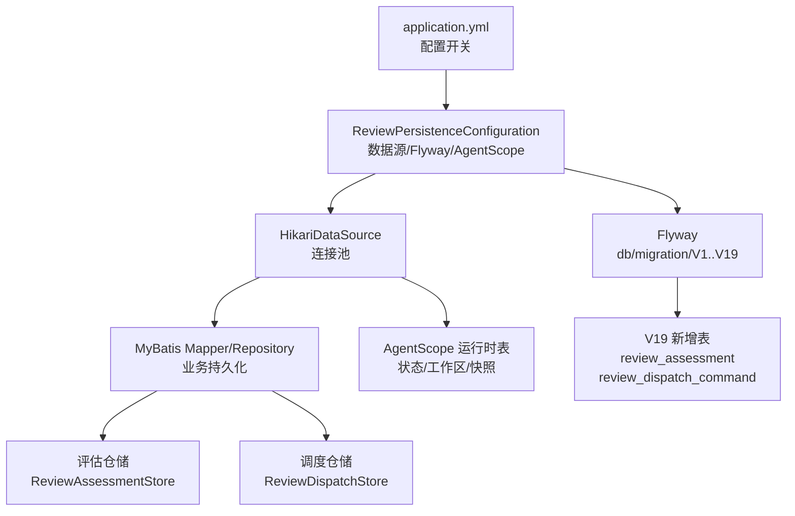
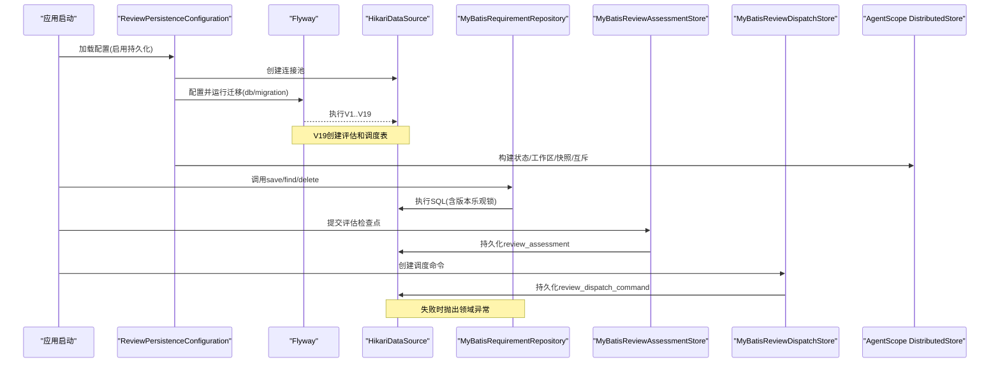
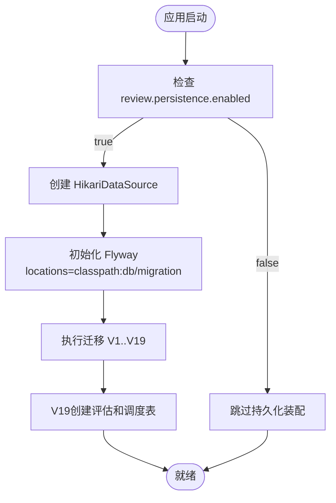
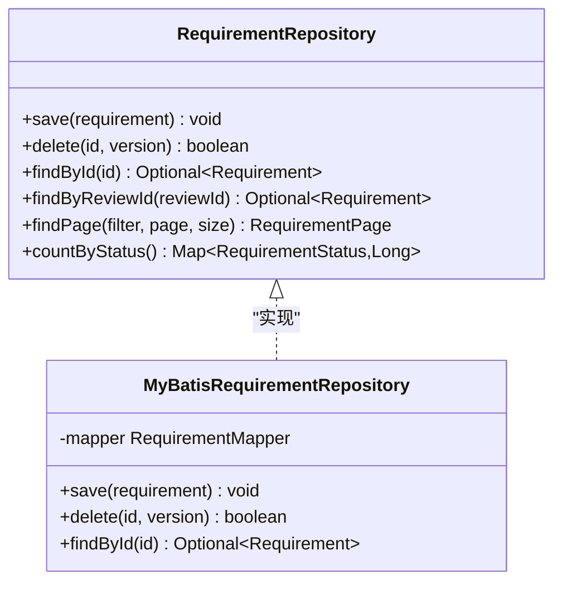
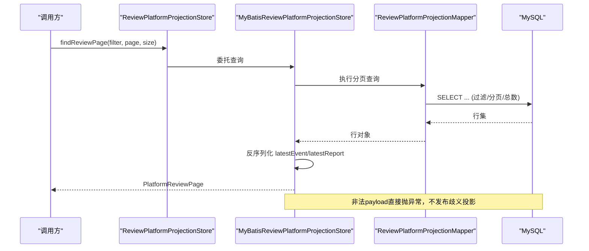
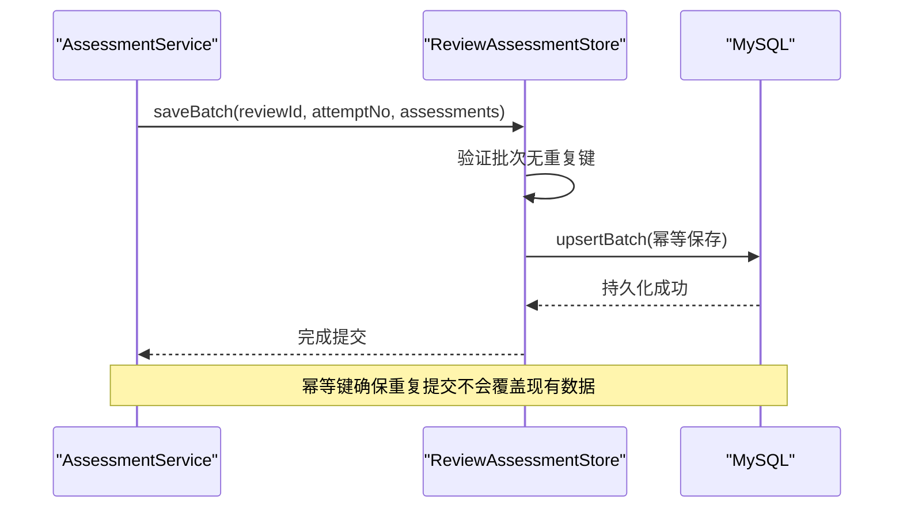
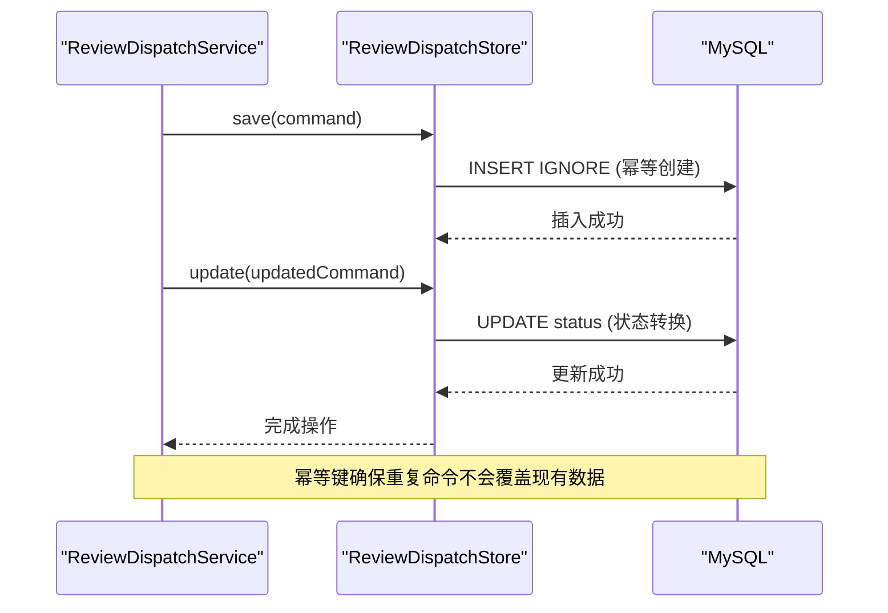
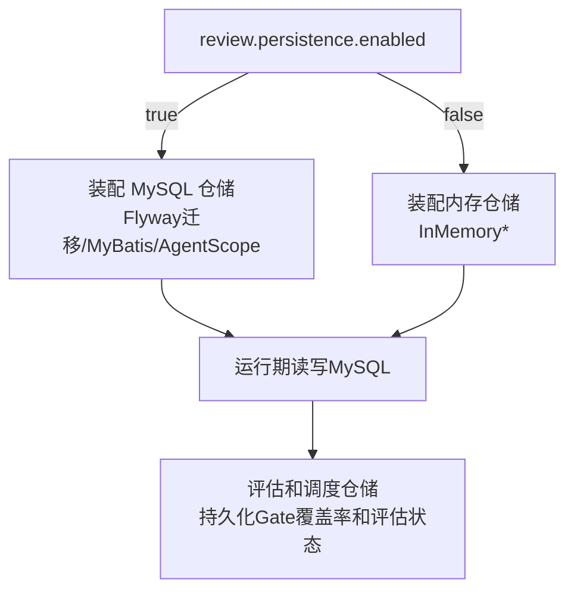
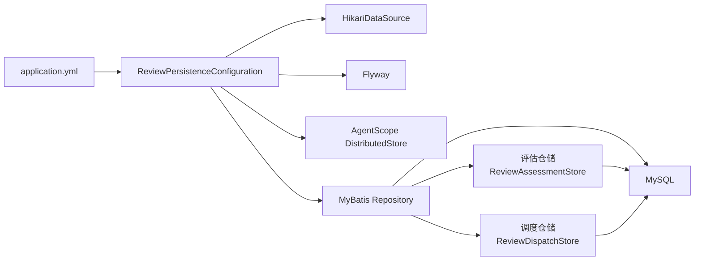

# MySQL持久化与数据迁移

<cite>
**本文引用的文件**
- [application.yml](file://src/main/resources/application.yml)
- [ReviewPersistenceConfiguration.java](file://src/main/java/ai/cc/chongming/review/config/ReviewPersistenceConfiguration.java)
- [RequirementRepository.java](file://src/main/java/ai/cc/chongming/review/domain/repository/RequirementRepository.java)
- [MyBatisRequirementRepository.java](file://src/main/java/ai/cc/chongming/review/infrastructure/persistence/repository/MyBatisRequirementRepository.java)
- [InMemoryRequirementRepository.java](file://src/main/java/ai/cc/chongming/review/infrastructure/review/InMemoryRequirementRepository.java)
- [ReviewPlatformProjectionStore.java](file://src/main/java/ai/cc/chongming/review/domain/repository/ReviewPlatformProjectionStore.java)
- [MyBatisReviewPlatformProjectionStore.java](file://src/main/java/ai/cc/chongming/review/infrastructure/persistence/repository/MyBatisReviewPlatformProjectionStore.java)
- [InMemoryReviewPlatformProjectionStore.java](file://src/main/java/ai/cc/chongming/review/infrastructure/review/InMemoryReviewPlatformProjectionStore.java)
- [ReviewPersistenceMigrationIntegrationTests.java](file://src/test/java/ai/cc/chongming/review/infrastructure/persistence/ReviewPersistenceMigrationIntegrationTests.java)
- [V19__create_review_assessment_and_dispatch_tables.sql](file://src/main/resources/db/migration/V19__create_review_assessment_and_dispatch_tables.sql)
- [ReviewAssessmentStore.java](file://src/main/java/ai/cc/chongming/review/domain/repository/ReviewAssessmentStore.java)
- [MyBatisReviewAssessmentStore.java](file://src/main/java/ai/cc/chongming/review/infrastructure/persistence/repository/MyBatisReviewAssessmentStore.java)
- [InMemoryReviewAssessmentStore.java](file://src/main/java/ai/cc/chongming/review/infrastructure/assessment/InMemoryReviewAssessmentStore.java)
- [ReviewDispatchStore.java](file://src/main/java/ai/cc/chongming/review/domain/repository/ReviewDispatchStore.java)
- [MyBatisReviewDispatchStore.java](file://src/main/java/ai/cc/chongming/review/infrastructure/persistence/repository/MyBatisReviewDispatchStore.java)
- [InMemoryReviewDispatchStore.java](file://src/main/java/ai/cc/chongming/review/infrastructure/dispatch/InMemoryReviewDispatchStore.java)
- [ReviewAssessment.java](file://src/main/java/ai/cc/chongming/review/domain/model/ReviewAssessment.java)
- [ReviewDispatchCommand.java](file://src/main/java/ai/cc/chongming/review/domain/model/ReviewDispatchCommand.java)
- [AssessmentService.java](file://src/main/java/ai/cc/chongming/review/application/AssessmentService.java)
- [ReviewDispatchService.java](file://src/main/java/ai/cc/chongming/review/application/ReviewDispatchService.java)
</cite>

## 更新摘要
**变更内容**
- 新增 V19 迁移脚本，实现 PLAN-024 方案5的持久化评估检查点与定向调度命令存储
- 新增 review_assessment 表，支持五状态检查点评估的复合主键持久化
- 新增 review_dispatch_command 表，提供幂等约束的定向调度命令存储
- 新增评估仓储与调度仓储的领域接口、内存实现与 MyBatis 持久化实现
- 扩展 Gate 覆盖率、报告计数和评估状态在系统重启后的持久化能力

## 目录
1. [简介](#简介)
2. [项目结构](#项目结构)
3. [核心组件](#核心组件)
4. [架构总览](#架构总览)
5. [详细组件分析](#详细组件分析)
6. [依赖关系分析](#依赖关系分析)
7. [性能考虑](#性能考虑)
8. [故障排查指南](#故障排查指南)
9. [结论](#结论)
10. [附录](#附录)

## 简介
本文件聚焦于重明评审系统的 MySQL 持久化与数据迁移方案，围绕以下主题展开：
- Flyway 迁移策略：如何启用、定位脚本、兼容 MySQL 5.6+ 的 LONGTEXT 设计。
- MyBatis 仓储实现：以 RequirementRepository 为例说明版本乐观锁、分页查询与事务边界。
- 领域投影监听器：平台级 Review 投影（过滤、总数、分页）如何通过持久化存储支撑高效查询。
- 内存/MySQL 双写切换机制：通过配置开关在进程内内存与 MySQL 之间无缝切换，便于开发与生产部署。
- **新增**：PLAN-024 方案5的持久化评估检查点与定向调度命令，确保 Gate 覆盖率、报告计数和评估状态在系统重启后仍然可用。

## 项目结构
- 应用配置集中在 application.yml，其中包含 Flyway 默认禁用、数据库连接池、AgentScope 运行时表名等关键开关。
- 持久化装配类 ReviewPersistenceConfiguration 负责：
  - 创建共享 HikariDataSource。
  - 初始化并运行 Flyway 业务迁移。
  - 组装 AgentScope 分布式存储（状态、工作区、快照、执行互斥）。
- 领域接口定义在 domain/repository 下；基础设施实现位于 infrastructure/persistence 与 infrastructure/review。
- 迁移脚本位于 resources/db/migration，按 V1..V19 顺序演进，避免 JSON 列，使用 LONGTEXT 兼容 MySQL 5.6+。
- **新增**：V19 迁移脚本包含 review_assessment 和 review_dispatch_command 两张表，支持五状态评估检查和定向调度命令的持久化。

**图表来源**
- [application.yml:119-132](file://src/main/resources/application.yml#L119-L132)
- [ReviewPersistenceConfiguration.java:39-105](file://src/main/java/ai/cc/chongming/review/config/ReviewPersistenceConfiguration.java#L39-L105)
- [V19__create_review_assessment_and_dispatch_tables.sql:5-40](file://src/main/resources/db/migration/V19__create_review_assessment_and_dispatch_tables.sql#L5-L40)

章节来源
- [application.yml:1-175](file://src/main/resources/application.yml#L1-L175)
- [ReviewPersistenceConfiguration.java:1-107](file://src/main/java/ai/cc/chongming/review/config/ReviewPersistenceConfiguration.java#L1-L107)

## 核心组件
- Flyway 迁移：由 ReviewPersistenceConfiguration 显式创建并运行，扫描 classpath:db/migration，开启 baselineOnMigrate 以兼容历史库。
- MyBatis 仓储：以 RequirementRepository 为入口，MyBatisRequirementRepository 实现基于版本的插入/更新/删除与只读查询。
- 平台投影：ReviewPlatformProjectionStore 提供带过滤、总数、分页的平台视图；MyBatis 实现将结果持久化到 MySQL。
- 内存/MySQL 切换：通过 review.persistence.enabled 控制是否启用 MySQL；未启用时回退到 InMemory* 实现。
- **新增**：评估检查点持久化：ReviewAssessmentStore 提供批处理保存和查询，支持五状态评估检查点的幂等提交。
- **新增**：定向调度命令持久化：ReviewDispatchStore 提供幂等命令创建和状态转换，支持 PENDING/CONSUMED/EXPIRED/REJECTED 生命周期。

章节来源
- [ReviewPersistenceConfiguration.java:57-66](file://src/main/java/ai/cc/chongming/review/config/ReviewPersistenceConfiguration.java#L57-L66)
- [MyBatisRequirementRepository.java:29-61](file://src/main/java/ai/cc/chongming/review/infrastructure/persistence/repository/MyBatisRequirementRepository.java#L29-L61)
- [ReviewPlatformProjectionStore.java:10-64](file://src/main/java/ai/cc/chongming/review/domain/repository/ReviewPlatformProjectionStore.java#L10-L64)
- [ReviewAssessmentStore.java:20-41](file://src/main/java/ai/cc/chongming/review/domain/repository/ReviewAssessmentStore.java#L20-L41)
- [ReviewDispatchStore.java:20-58](file://src/main/java/ai/cc/chongming/review/domain/repository/ReviewDispatchStore.java#L20-L58)

## 架构总览
下图展示从配置到迁移、再到仓储与 AgentScope 运行时存储的整体链路，包括新增的评估和调度持久化。

**图表来源**
- [ReviewPersistenceConfiguration.java:39-105](file://src/main/java/ai/cc/chongming/review/config/ReviewPersistenceConfiguration.java#L39-L105)
- [MyBatisRequirementRepository.java:37-57](file://src/main/java/ai/cc/chongming/review/infrastructure/persistence/repository/MyBatisRequirementRepository.java#L37-L57)
- [MyBatisReviewAssessmentStore.java:50-75](file://src/main/java/ai/cc/chongming/review/infrastructure/persistence/repository/MyBatisReviewAssessmentStore.java#L50-L75)
- [MyBatisReviewDispatchStore.java:44-65](file://src/main/java/ai/cc/chongming/review/infrastructure/persistence/repository/MyBatisReviewDispatchStore.java#L44-L65)

## 详细组件分析

### Flyway 迁移策略
- 启用方式：ReviewPersistenceConfiguration 中显式创建 Flyway Bean，指定 locations 为 classpath:db/migration，并在构造后调用 migrate()。
- 兼容性：测试用例表明迁移采用 baselineOnMigrate(true) 与基线版本策略，确保对已有库安全升级；同时验证所有 JSON 语义字段映射为 LONGTEXT，满足 MySQL 5.6+ 限制。
- 脚本范围：覆盖 V1..V19，涵盖评审请求、事件、证据/主张/辩论、审计/通知/报告、命令结果、JSON 列扩展、索引优化、运行时追踪、人工门禁、辩论持久化、上下文侦察结论、需求发布命令、**评估与调度命令**等。
- **新增**：V19 迁移脚本创建 review_assessment 和 review_dispatch_command 表，支持五状态评估检查和定向调度命令的持久化，确保 Gate 覆盖率、报告计数和评估状态在系统重启后存活。

**图表来源**
- [ReviewPersistenceConfiguration.java:57-66](file://src/main/java/ai/cc/chongming/review/config/ReviewPersistenceConfiguration.java#L57-L66)
- [ReviewPersistenceMigrationIntegrationTests.java:123-148](file://src/test/java/ai/cc/chongming/review/infrastructure/persistence/ReviewPersistenceMigrationIntegrationTests.java#L123-L148)
- [V19__create_review_assessment_and_dispatch_tables.sql:1-40](file://src/main/resources/db/migration/V19__create_review_assessment_and_dispatch_tables.sql#L1-L40)

章节来源
- [ReviewPersistenceConfiguration.java:57-66](file://src/main/java/ai/cc/chongming/review/config/ReviewPersistenceConfiguration.java#L57-L66)
- [ReviewPersistenceMigrationIntegrationTests.java:123-148](file://src/test/java/ai/cc/chongming/review/infrastructure/persistence/ReviewPersistenceMigrationIntegrationTests.java#L123-L148)
- [V19__create_review_assessment_and_dispatch_tables.sql:1-40](file://src/main/resources/db/migration/V19__create_review_assessment_and_dispatch_tables.sql#L1-L40)

### MyBatis 仓储实现（以 RequirementRepository 为例）
- 接口职责：定义保存、按 ID/评审关联查找、分页查询、按状态计数、条件删除等能力。
- 实现要点：
  - save：根据 version 判断 insert/update；影响行数不为 1 时抛出领域冲突异常，体现乐观锁。
  - delete：传入 expectedVersion，仅当版本匹配时删除一行。
  - findById：只读事务，返回 Optional。
- 事务边界：方法标注 @Transactional，保证一致性。

**图表来源**
- [RequirementRepository.java:16-52](file://src/main/java/ai/cc/chongming/review/domain/repository/RequirementRepository.java#L16-L52)
- [MyBatisRequirementRepository.java:29-61](file://src/main/java/ai/cc/chongming/review/infrastructure/persistence/repository/MyBatisRequirementRepository.java#L29-L61)

章节来源
- [RequirementRepository.java:16-52](file://src/main/java/ai/cc/chongming/review/domain/repository/RequirementRepository.java#L16-L52)
- [MyBatisRequirementRepository.java:29-61](file://src/main/java/ai/cc/chongming/review/infrastructure/persistence/repository/MyBatisRequirementRepository.java#L29-L61)

### 领域投影监听器（平台级 Review 投影）
- 目标：将"过滤、总数、分页"等复杂查询下沉到数据库层，避免在应用层做无界事件窗口过滤。
- 接口：ReviewPlatformProjectionStore 定义 findReviewPage(filter, page, size)，返回 PlatformReviewPage，包含最新事件与报告元信息。
- 持久化实现：MyBatisReviewPlatformProjectionStore 通过 Mapper 读取行并反序列化 payload，若 payload 非法则直接抛出异常，避免发布歧义投影。
- 内存实现：InMemoryReviewPlatformProjectionStore 在内存中聚合事件、报告与注册表，用于非持久化场景。

**图表来源**
- [ReviewPlatformProjectionStore.java:10-64](file://src/main/java/ai/cc/chongming/review/domain/repository/ReviewPlatformProjectionStore.java#L10-L64)
- [MyBatisReviewPlatformProjectionStore.java:26-44](file://src/main/java/ai/cc/chongming/review/infrastructure/persistence/repository/MyBatisReviewPlatformProjectionStore.java#L26-L44)

章节来源
- [ReviewPlatformProjectionStore.java:10-64](file://src/main/java/ai/cc/chongming/review/domain/repository/ReviewPlatformProjectionStore.java#L10-L64)
- [MyBatisReviewPlatformProjectionStore.java:26-44](file://src/main/java/ai/cc/chongming/review/infrastructure/persistence/repository/MyBatisReviewPlatformProjectionStore.java#L26-L44)

### 评估检查点持久化（新增）
- **领域模型**：ReviewAssessment 表示角色提交的结构化检查点评估，包含五状态（CONFIRMED、PARTIAL、GAP、UNKNOWN、BLOCKED）、摘要、原因摘要、证据ID列表和幂等键。
- **持久化接口**：ReviewAssessmentStore 提供批处理保存和查询操作，确保同一批次内无重复的检查点键，幂等提交时最新版本获胜。
- **MyBatis 实现**：MyBatisReviewAssessmentStore 通过 upsertBatch 实现幂等保存，使用复合主键 (review_id, attempt_no, role_type, checkpoint_key) 确保唯一性。
- **内存实现**：InMemoryReviewAssessmentStore 在进程内存中维护评估数据，支持开发环境快速迭代。
- **业务集成**：AssessmentService 验证检查点键属于角色清单，注入服务器生成的幂等键，支持重试回放。

**图表来源**
- [ReviewAssessment.java:21-85](file://src/main/java/ai/cc/chongming/review/domain/model/ReviewAssessment.java#L21-L85)
- [ReviewAssessmentStore.java:20-41](file://src/main/java/ai/cc/chongming/review/domain/repository/ReviewAssessmentStore.java#L20-L41)
- [MyBatisReviewAssessmentStore.java:50-75](file://src/main/java/ai/cc/chongming/review/infrastructure/persistence/repository/MyBatisReviewAssessmentStore.java#L50-L75)
- [V19__create_review_assessment_and_dispatch_tables.sql:5-19](file://src/main/resources/db/migration/V19__create_review_assessment_and_dispatch_tables.sql#L5-L19)

章节来源
- [ReviewAssessment.java:21-85](file://src/main/java/ai/cc/chongming/review/domain/model/ReviewAssessment.java#L21-L85)
- [ReviewAssessmentStore.java:20-41](file://src/main/java/ai/cc/chongming/review/domain/repository/ReviewAssessmentStore.java#L20-L41)
- [MyBatisReviewAssessmentStore.java:25-154](file://src/main/java/ai/cc/chongming/review/infrastructure/persistence/repository/MyBatisReviewAssessmentStore.java#L25-L154)
- [InMemoryReviewAssessmentStore.java:20-94](file://src/main/java/ai/cc/chongming/review/infrastructure/assessment/InMemoryReviewAssessmentStore.java#L20-L94)
- [AssessmentService.java:156-206](file://src/main/java/ai/cc/chongming/review/application/AssessmentService.java#L156-L206)
- [V19__create_review_assessment_and_dispatch_tables.sql:5-19](file://src/main/resources/db/migration/V19__create_review_assessment_and_dispatch_tables.sql#L5-L19)

### 定向调度命令持久化（新增）
- **领域模型**：ReviewDispatchCommand 表示由 Director 或服务器创建的不可变调度信封，包含命令ID、接收角色、允许的操作、目标实体、过期时间和状态。
- **生命周期**：PENDING -> CONSUMED | EXPIRED | REJECTED，每个状态转换生成新实例，确保不可变性。
- **持久化接口**：ReviewDispatchStore 提供幂等创建、状态更新和查询操作，支持按评审、尝试号、接收角色等维度检索。
- **MyBatis 实现**：MyBatisReviewDispatchStore 通过 idempotency_key 唯一索引确保幂等创建，使用 updateStatus 进行状态转换。
- **内存实现**：InMemoryReviewDispatchStore 在进程内存中维护调度命令，支持开发环境快速迭代。
- **业务集成**：ReviewDispatchService 验证命令有效性，处理过期和消费逻辑，确保单一写入操作的原子性。

**图表来源**
- [ReviewDispatchCommand.java:20-116](file://src/main/java/ai/cc/chongming/review/domain/model/ReviewDispatchCommand.java#L20-L116)
- [ReviewDispatchStore.java:20-58](file://src/main/java/ai/cc/chongming/review/domain/repository/ReviewDispatchStore.java#L20-L58)
- [MyBatisReviewDispatchStore.java:44-75](file://src/main/java/ai/cc/chongming/review/infrastructure/persistence/repository/MyBatisReviewDispatchStore.java#L44-L75)
- [ReviewDispatchService.java:158-173](file://src/main/java/ai/cc/chongming/review/application/ReviewDispatchService.java#L158-L173)
- [V19__create_review_assessment_and_dispatch_tables.sql:21-40](file://src/main/resources/db/migration/V19__create_review_assessment_and_dispatch_tables.sql#L21-L40)

章节来源
- [ReviewDispatchCommand.java:20-116](file://src/main/java/ai/cc/chongming/review/domain/model/ReviewDispatchCommand.java#L20-L116)
- [ReviewDispatchStore.java:20-58](file://src/main/java/ai/cc/chongming/review/domain/repository/ReviewDispatchStore.java#L20-L58)
- [MyBatisReviewDispatchStore.java:26-169](file://src/main/java/ai/cc/chongming/review/infrastructure/persistence/repository/MyBatisReviewDispatchStore.java#L26-L169)
- [InMemoryReviewDispatchStore.java:21-119](file://src/main/java/ai/cc/chongming/review/infrastructure/dispatch/InMemoryReviewDispatchStore.java#L21-L119)
- [ReviewDispatchService.java:158-173](file://src/main/java/ai/cc/chongming/review/application/ReviewDispatchService.java#L158-L173)
- [V19__create_review_assessment_and_dispatch_tables.sql:21-40](file://src/main/resources/db/migration/V19__create_review_assessment_and_dispatch_tables.sql#L21-L40)

### 内存/MySQL 双写切换机制
- 开关位置：application.yml 中的 review.persistence.enabled。
- 装配策略：
  - 当 enabled=true 时，ReviewPersistenceConfiguration 生效，创建 DataSource、运行 Flyway、装配 MyBatis 仓储与 AgentScope 运行时存储。
  - 当 enabled=false 或未设置时，InMemory* 仓储通过 ConditionalOnProperty 自动激活，提供进程内内存实现。
- 典型效果：开发/演示环境可关闭持久化快速迭代；生产环境开启持久化并配合 Flyway 迁移。
- **新增**：评估和调度仓储同样遵循此模式，通过 @ConditionalOnProperty 注解在内存和 MySQL 实现间切换。

**图表来源**
- [application.yml:119-132](file://src/main/resources/application.yml#L119-L132)
- [ReviewPersistenceConfiguration.java:27-31](file://src/main/java/ai/cc/chongming/review/config/ReviewPersistenceConfiguration.java#L27-L31)
- [InMemoryRequirementRepository.java:19-26](file://src/main/java/ai/cc/chongming/review/infrastructure/review/InMemoryRequirementRepository.java#L19-L26)
- [MyBatisReviewAssessmentStore.java:34-36](file://src/main/java/ai/cc/chongming/review/infrastructure/persistence/repository/MyBatisReviewAssessmentStore.java#L34-L36)
- [MyBatisReviewDispatchStore.java:34-36](file://src/main/java/ai/cc/chongming/review/infrastructure/persistence/repository/MyBatisReviewDispatchStore.java#L34-L36)

章节来源
- [application.yml:119-132](file://src/main/resources/application.yml#L119-L132)
- [ReviewPersistenceConfiguration.java:27-31](file://src/main/java/ai/cc/chongming/review/config/ReviewPersistenceConfiguration.java#L27-L31)
- [InMemoryRequirementRepository.java:19-26](file://src/main/java/ai/cc/chongming/review/infrastructure/review/InMemoryRequirementRepository.java#L19-L26)
- [MyBatisReviewAssessmentStore.java:34-36](file://src/main/java/ai/cc/chongming/review/infrastructure/persistence/repository/MyBatisReviewAssessmentStore.java#L34-L36)
- [MyBatisReviewDispatchStore.java:34-36](file://src/main/java/ai/cc/chongming/review/infrastructure/persistence/repository/MyBatisReviewDispatchStore.java#L34-L36)

## 依赖关系分析
- 配置驱动：application.yml 控制持久化开关、数据库连接参数、AgentScope 表名与行为。
- 装配耦合：ReviewPersistenceConfiguration 依赖 HikariDataSource、Flyway、AgentScope 扩展；并通过 @DependsOn 确保 Flyway 先于 AgentScope 存储初始化。
- 仓储解耦：领域接口隔离了内存与 MySQL 实现，上层服务无需感知底层存储差异。
- 迁移与运行时：测试用例验证迁移脚本对 LONGTEXT 的兼容性与实际 SQL 行为，保障向后兼容。
- **新增**：评估和调度仓储通过相同的条件装配模式与现有仓储保持一致的依赖关系。

**图表来源**
- [application.yml:119-132](file://src/main/resources/application.yml#L119-L132)
- [ReviewPersistenceConfiguration.java:39-105](file://src/main/java/ai/cc/chongming/review/config/ReviewPersistenceConfiguration.java#L39-L105)
- [ReviewAssessmentStore.java:20-41](file://src/main/java/ai/cc/chongming/review/domain/repository/ReviewAssessmentStore.java#L20-L41)
- [ReviewDispatchStore.java:20-58](file://src/main/java/ai/cc/chongming/review/domain/repository/ReviewDispatchStore.java#L20-L58)

章节来源
- [application.yml:119-132](file://src/main/resources/application.yml#L119-L132)
- [ReviewPersistenceConfiguration.java:39-105](file://src/main/java/ai/cc/chongming/review/config/ReviewPersistenceConfiguration.java#L39-L105)
- [ReviewAssessmentStore.java:20-41](file://src/main/java/ai/cc/chongming/review/domain/repository/ReviewAssessmentStore.java#L20-L41)
- [ReviewDispatchStore.java:20-58](file://src/main/java/ai/cc/chongming/review/domain/repository/ReviewDispatchStore.java#L20-L58)

## 性能考虑
- 连接池：HikariDataSource 最大池大小可通过配置调整，建议结合并发与慢查询情况调优。
- 迁移成本：baselineOnMigrate 在首次迁移大库时可能耗时，建议在低峰期执行或提前准备基线。
- 查询下推：平台投影将过滤、总数、分页下推到数据库，减少应用层内存压力与网络往返。
- 版本乐观锁：仓储层通过版本号校验避免并发覆盖，冲突时快速失败，利于系统稳定性。
- **新增**：评估检查点批量操作减少数据库往返，复合主键确保唯一性查询效率。
- **新增**：调度命令的幂等键索引避免重复创建开销，状态转换使用单行更新保证原子性。

## 故障排查指南
- 无法连接数据库：检查 review.persistence.enabled 与 JDBC URL、用户名、密码是否正确注入。
- 迁移失败：确认 Flyway 已启用且 db/migration 路径正确；必要时使用 baselineOnMigrate 与基线版本对齐历史库。
- 版本冲突异常：保存/删除时若影响行数不为预期，会抛出领域冲突异常，需检查并发写入与版本号传递。
- 投影解析异常：当数据库中 latestEvent/latestReport 的 payload 损坏时，MyBatis 实现会直接抛出异常，避免发布错误投影；应修复脏数据或回滚迁移。
- **新增**：评估检查点重复键异常：检查批次中是否存在重复的 (role_type, checkpoint_key) 组合。
- **新增**：调度命令幂等键冲突：检查是否存在相同 idempotency_key 但不同内容的命令创建请求。

章节来源
- [MyBatisRequirementRepository.java:37-57](file://src/main/java/ai/cc/chongming/review/infrastructure/persistence/repository/MyBatisRequirementRepository.java#L37-L57)
- [ReviewPersistenceMigrationIntegrationTests.java:123-148](file://src/test/java/ai/cc/chongming/review/infrastructure/persistence/ReviewPersistenceMigrationIntegrationTests.java#L123-L148)
- [MyBatisReviewAssessmentStore.java:61-75](file://src/main/java/ai/cc/chongming/review/infrastructure/persistence/repository/MyBatisReviewAssessmentStore.java#L61-L75)
- [MyBatisReviewDispatchStore.java:52-65](file://src/main/java/ai/cc/chongming/review/infrastructure/persistence/repository/MyBatisReviewDispatchStore.java#L52-L65)

## 结论
本方案通过 Flyway 管理版本化数据库变更，以 MyBatis 仓储封装持久化细节，并以平台投影将复杂查询下推到数据库；通过单一配置开关即可在内存与 MySQL 间切换，兼顾开发效率与生产可靠性。AgentScope 运行时状态也通过同一数据源进行持久化，形成统一的持久化基座。**新增的评估检查点和调度命令持久化进一步增强了系统的可靠性，确保 Gate 覆盖率、报告计数和评估状态在系统重启后仍然可用，为生产环境的稳定运行提供了坚实的数据基础。**

## 附录
- 迁移脚本清单：V1..V19，覆盖评审生命周期各阶段的数据结构与索引优化。
- 配置项参考：review.persistence.*、agentscope.*、runtime-trace.*、sse.*、notification.* 等。
- **新增**：评估检查点状态：CONFIRMED、PARTIAL、GAP、UNKNOWN、BLOCKED。
- **新增**：调度命令状态：PENDING、CONSUMED、EXPIRED、REJECTED。
- **新增**：调度命令允许操作：CHALLENGE、REBUTTAL、POSITION_CHANGE、EVIDENCE_REQUEST。
