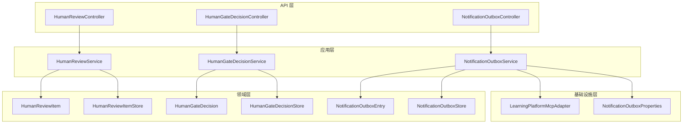
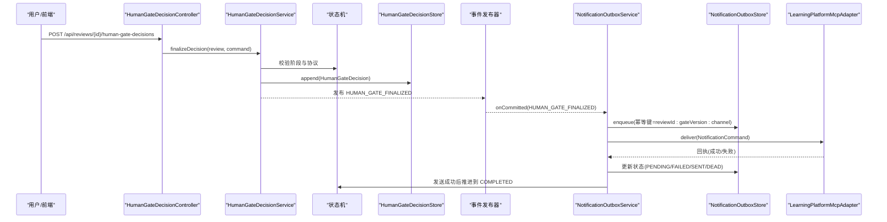
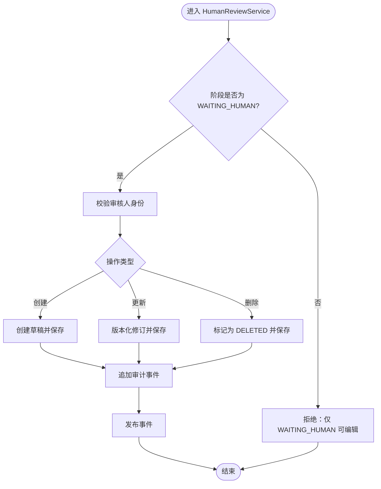
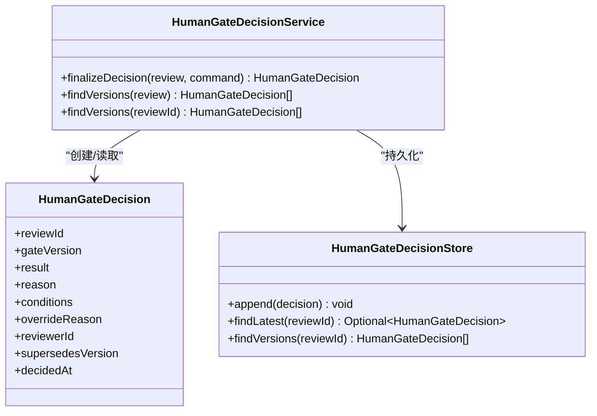
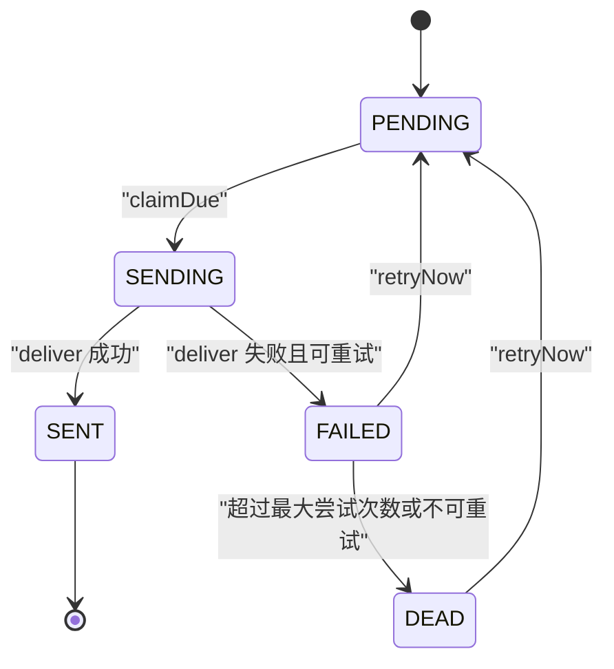
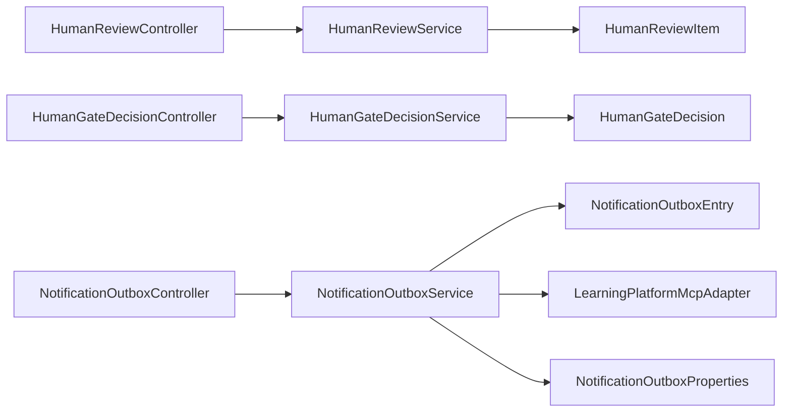

# 人工审核与通知

<cite>
**本文引用的文件**
- [HumanGateDecisionService.java](file://src/main/java/ai/cc/chongming/review/application/HumanGateDecisionService.java)
- [HumanReviewService.java](file://src/main/java/ai/cc/chongming/review/application/HumanReviewService.java)
- [NotificationOutboxService.java](file://src/main/java/ai/cc/chongming/review/application/NotificationOutboxService.java)
- [HumanGateDecision.java](file://src/main/java/ai/cc/chongming/review/domain/model/HumanGateDecision.java)
- [HumanReviewItem.java](file://src/main/java/ai/cc/chongming/review/domain/model/HumanReviewItem.java)
- [NotificationOutboxEntry.java](file://src/main/java/ai/cc/chongming/review/domain/model/NotificationOutboxEntry.java)
- [HumanGateDecisionController.java](file://src/main/java/ai/cc/chongming/review/api/HumanGateDecisionController.java)
- [HumanReviewController.java](file://src/main/java/ai/cc/chongming/review/api/HumanReviewController.java)
- [NotificationOutboxController.java](file://src/main/java/ai/cc/chongming/review/api/NotificationOutboxController.java)
- [HumanGateDecisionStore.java](file://src/main/java/ai/cc/chongming/review/domain/repository/HumanGateDecisionStore.java)
- [HumanReviewItemStore.java](file://src/main/java/ai/cc/chongming/review/domain/repository/HumanReviewItemStore.java)
- [NotificationOutboxStore.java](file://src/main/java/ai/cc/chongming/review/domain/repository/NotificationOutboxStore.java)
- [LearningPlatformMcpAdapter.java](file://src/main/java/ai/cc/chongming/review/infrastructure/notification/LearningPlatformMcpAdapter.java)
- [NotificationOutboxProperties.java](file://src/main/java/ai/cc/chongming/review/config/NotificationOutboxProperties.java)
- [AIREVIEW-PLAN-011-人工审核报告与通知.md](file://docs/AIREVIEW-PLAN-011-人工审核报告与通知.md)
- [学习通通知MCP契约.md](file://docs/集成/学习通通知MCP契约.md)
</cite>

## 目录
1. [简介](#简介)
2. [项目结构](#项目结构)
3. [核心组件](#核心组件)
4. [架构总览](#架构总览)
5. [详细组件分析](#详细组件分析)
6. [依赖关系分析](#依赖关系分析)
7. [性能考虑](#性能考虑)
8. [故障排查指南](#故障排查指南)
9. [结论](#结论)
10. [附录](#附录)

## 简介
本说明聚焦评审生命周期中 HUMAN_REQUIRED（对应实现中的 WAITING_HUMAN）阶段的人工 Gate 决策、审核项管理、报告生成以及通知发件箱机制。该能力由应用层服务、领域模型、控制器与存储接口共同构成，并通过事件驱动将最终 Gate 结果转化为可重试、幂等的通知投递流程。计划文档明确了草稿 CRUD、版本化决定、报告与 Outbox 的边界与验收标准；当前实现已覆盖核心链路，生产持久化与外部 MCP 联调仍为发布门禁。

## 项目结构
围绕“人工审核与通知”的关键代码分布在以下层次：
- API 层：提供人类操作入口，如提交最终 Gate 决定、编辑审核草稿、查询与重试通知。
- 应用层：编排业务规则、状态机转换、审计与事件发布。
- 领域层：定义不可变、版本化的领域对象与存储边界。
- 基础设施层：通知投递适配器与配置属性。
- 文档层：计划与契约约束，指导实施与验收。

**图表来源**
- [HumanReviewController.java:33-101](file://src/main/java/ai/cc/chongming/review/api/HumanReviewController.java#L33-L101)
- [HumanGateDecisionController.java:27-73](file://src/main/java/ai/cc/chongming/review/api/HumanGateDecisionController.java#L27-L73)
- [NotificationOutboxController.java:24-66](file://src/main/java/ai/cc/chongming/review/api/NotificationOutboxController.java#L24-L66)
- [HumanReviewService.java:31-159](file://src/main/java/ai/cc/chongming/review/application/HumanReviewService.java#L31-L159)
- [HumanGateDecisionService.java:33-157](file://src/main/java/ai/cc/chongming/review/application/HumanGateDecisionService.java#L33-L157)
- [NotificationOutboxService.java:41-259](file://src/main/java/ai/cc/chongming/review/application/NotificationOutboxService.java#L41-L259)
- [HumanReviewItem.java:18-167](file://src/main/java/ai/cc/chongming/review/domain/model/HumanReviewItem.java#L18-L167)
- [HumanGateDecision.java:15-66](file://src/main/java/ai/cc/chongming/review/domain/model/HumanGateDecision.java#L15-L66)
- [NotificationOutboxEntry.java:12-133](file://src/main/java/ai/cc/chongming/review/domain/model/NotificationOutboxEntry.java#L12-L133)
- [HumanReviewItemStore.java:18-30](file://src/main/java/ai/cc/chongming/review/domain/repository/HumanReviewItemStore.java#L18-L30)
- [HumanGateDecisionStore.java:14-22](file://src/main/java/ai/cc/chongming/review/domain/repository/HumanGateDecisionStore.java#L14-L22)
- [NotificationOutboxStore.java:16-30](file://src/main/java/ai/cc/chongming/review/domain/repository/NotificationOutboxStore.java#L16-L30)
- [LearningPlatformMcpAdapter.java:23-74](file://src/main/java/ai/cc/chongming/review/infrastructure/notification/LearningPlatformMcpAdapter.java#L23-L74)
- [NotificationOutboxProperties.java:12-45](file://src/main/java/ai/cc/chongming/review/config/NotificationOutboxProperties.java#L12-L45)

**章节来源**
- [HumanReviewController.java:33-101](file://src/main/java/ai/cc/chongming/review/api/HumanReviewController.java#L33-L101)
- [HumanGateDecisionController.java:27-73](file://src/main/java/ai/cc/chongming/review/api/HumanGateDecisionController.java#L27-L73)
- [NotificationOutboxController.java:24-66](file://src/main/java/ai/cc/chongming/review/api/NotificationOutboxController.java#L24-L66)
- [HumanReviewService.java:31-159](file://src/main/java/ai/cc/chongming/review/application/HumanReviewService.java#L31-L159)
- [HumanGateDecisionService.java:33-157](file://src/main/java/ai/cc/chongming/review/application/HumanGateDecisionService.java#L33-L157)
- [NotificationOutboxService.java:41-259](file://src/main/java/ai/cc/chongming/review/application/NotificationOutboxService.java#L41-L259)
- [HumanReviewItem.java:18-167](file://src/main/java/ai/cc/chongming/review/domain/model/HumanReviewItem.java#L18-L167)
- [HumanGateDecision.java:15-66](file://src/main/java/ai/cc/chongming/review/domain/model/HumanGateDecision.java#L15-L66)
- [NotificationOutboxEntry.java:12-133](file://src/main/java/ai/cc/chongming/review/domain/model/NotificationOutboxEntry.java#L12-L133)
- [HumanReviewItemStore.java:18-30](file://src/main/java/ai/cc/chongming/review/domain/repository/HumanReviewItemStore.java#L18-L30)
- [HumanGateDecisionStore.java:14-22](file://src/main/java/ai/cc/chongming/review/domain/repository/HumanGateDecisionStore.java#L14-L22)
- [NotificationOutboxStore.java:16-30](file://src/main/java/ai/cc/chongming/review/domain/repository/NotificationOutboxStore.java#L16-L30)
- [LearningPlatformMcpAdapter.java:23-74](file://src/main/java/ai/cc/chongming/review/infrastructure/notification/LearningPlatformMcpAdapter.java#L23-L74)
- [NotificationOutboxProperties.java:12-45](file://src/main/java/ai/cc/chongming/review/config/NotificationOutboxProperties.java#L12-L45)

## 核心组件
- HumanReviewService：在 WAITING_HUMAN 阶段提供审核草稿的增删改查与审计追踪，强制版本冲突控制与角色权限校验。
- HumanGateDecisionService：在 WAITING_HUMAN 或 NOTIFYING 阶段完成最终 Gate 决定，生成不可变版本化决定并推进状态到 NOTIFYING。
- NotificationOutboxService：监听最终 Gate 事件，创建幂等通知命令，负责投递、失败重试、死信与状态回写，并在发送成功后推进到 COMPLETED。
- LearningPlatformMcpAdapter：将领域通知命令映射到部署侧提供的 MCP 客户端，默认 fail-closed，未启用或未配置时拒绝调用。
- 领域模型：HumanReviewItem（版本化草稿）、HumanGateDecision（版本化最终决定）、NotificationOutboxEntry（幂等投递状态）。
- 存储接口：分别对草稿、最终决定与通知出队进行持久化边界抽象。
- 控制器：暴露 REST 接口用于草稿 CRUD、最终 Gate 决定提交与通知查询/重试。

**章节来源**
- [HumanReviewService.java:31-159](file://src/main/java/ai/cc/chongming/review/application/HumanReviewService.java#L31-L159)
- [HumanGateDecisionService.java:33-157](file://src/main/java/ai/cc/chongming/review/application/HumanGateDecisionService.java#L33-L157)
- [NotificationOutboxService.java:41-259](file://src/main/java/ai/cc/chongming/review/application/NotificationOutboxService.java#L41-L259)
- [LearningPlatformMcpAdapter.java:23-74](file://src/main/java/ai/cc/chongming/review/infrastructure/notification/LearningPlatformMcpAdapter.java#L23-L74)
- [HumanReviewItem.java:18-167](file://src/main/java/ai/cc/chongming/review/domain/model/HumanReviewItem.java#L18-L167)
- [HumanGateDecision.java:15-66](file://src/main/java/ai/cc/chongming/review/domain/model/HumanGateDecision.java#L15-L66)
- [NotificationOutboxEntry.java:12-133](file://src/main/java/ai/cc/chongming/review/domain/model/NotificationOutboxEntry.java#L12-L133)
- [HumanReviewItemStore.java:18-30](file://src/main/java/ai/cc/chongming/review/domain/repository/HumanReviewItemStore.java#L18-L30)
- [HumanGateDecisionStore.java:14-22](file://src/main/java/ai/cc/chongming/review/domain/repository/HumanGateDecisionStore.java#L14-L22)
- [NotificationOutboxStore.java:16-30](file://src/main/java/ai/cc/chongming/review/domain/repository/NotificationOutboxStore.java#L16-L30)

## 架构总览
下图展示了从人工操作到通知投递的端到端流程：控制器接收请求，应用服务执行业务规则与状态机转换，领域对象保证数据一致性，存储接口负责持久化，事件驱动触发通知入队，适配器通过 MCP 投递并记录回执。

**图表来源**
- [HumanGateDecisionController.java:39-50](file://src/main/java/ai/cc/chongming/review/api/HumanGateDecisionController.java#L39-L50)
- [HumanGateDecisionService.java:72-119](file://src/main/java/ai/cc/chongming/review/application/HumanGateDecisionService.java#L72-L119)
- [NotificationOutboxService.java:111-131](file://src/main/java/ai/cc/chongming/review/application/NotificationOutboxService.java#L111-L131)
- [NotificationOutboxService.java:177-189](file://src/main/java/ai/cc/chongming/review/application/NotificationOutboxService.java#L177-L189)
- [NotificationOutboxService.java:191-209](file://src/main/java/ai/cc/chongming/review/application/NotificationOutboxService.java#L191-L209)
- [LearningPlatformMcpAdapter.java:36-60](file://src/main/java/ai/cc/chongming/review/infrastructure/notification/LearningPlatformMcpAdapter.java#L36-L60)

## 详细组件分析

### 人工审核草稿管理（WAITING_HUMAN）
- 能力边界：仅在 WAITING_HUMAN 允许新增、编辑、删除草稿；每次写操作追加审计事件，删除采用软删除。
- 并发控制：使用 expectedVersion 防止覆盖写；不匹配则拒绝。
- 权限控制：必须具有可审身份；未认证时仅允许本地 Demo profile。
- 查询过滤：支持按严重度过滤草稿。
- 事件输出：创建、更新、删除均发布对应事件，便于前端与审计追踪。

**图表来源**
- [HumanReviewService.java:58-92](file://src/main/java/ai/cc/chongming/review/application/HumanReviewService.java#L58-L92)
- [HumanReviewService.java:110-125](file://src/main/java/ai/cc/chongming/review/application/HumanReviewService.java#L110-L125)
- [HumanReviewItem.java:60-93](file://src/main/java/ai/cc/chongming/review/domain/model/HumanReviewItem.java#L60-L93)

**章节来源**
- [HumanReviewService.java:31-159](file://src/main/java/ai/cc/chongming/review/application/HumanReviewService.java#L31-L159)
- [HumanReviewItem.java:18-167](file://src/main/java/ai/cc/chongming/review/domain/model/HumanReviewItem.java#L18-L167)
- [HumanReviewController.java:45-76](file://src/main/java/ai/cc/chongming/review/api/HumanReviewController.java#L45-L76)

### 最终 Gate 决策（HUMAN_REQUIRED/WAITING_HUMAN → NOTIFYING）
- 决策类型：PASS、CONDITIONAL、BLOCK、RETURN、OVERRIDE；CONDITIONAL 必须包含至少一个条件；OVERRIDE 必须提供 overrideReason。
- 前置校验：要求存在 AI Gate 草案；协议校验通过；expectedVersion 与 Review 版本一致。
- 版本化不可变：旧版本不可修改，调整需创建新版本并保留 supersedesVersion。
- 状态推进：从 WAITING_HUMAN 推进到 NOTIFYING；若在 NOTIFYING 调整则记录最终修订。
- 权限控制：需要可审身份；OVERRIDE 需要额外权限。

**图表来源**
- [HumanGateDecisionService.java:72-119](file://src/main/java/ai/cc/chongming/review/application/HumanGateDecisionService.java#L72-L119)
- [HumanGateDecision.java:15-66](file://src/main/java/ai/cc/chongming/review/domain/model/HumanGateDecision.java#L15-L66)
- [HumanGateDecisionStore.java:14-22](file://src/main/java/ai/cc/chongming/review/domain/repository/HumanGateDecisionStore.java#L14-L22)

**章节来源**
- [HumanGateDecisionService.java:33-157](file://src/main/java/ai/cc/chongming/review/application/HumanGateDecisionService.java#L33-L157)
- [HumanGateDecision.java:15-66](file://src/main/java/ai/cc/chongming/review/domain/model/HumanGateDecision.java#L15-L66)
- [HumanGateDecisionController.java:39-50](file://src/main/java/ai/cc/chongming/review/api/HumanGateDecisionController.java#L39-L50)

### 通知发件箱机制（幂等、重试、死信）
- 幂等性：以 reviewId:gateVersion:channel 作为幂等键，同一组合只入队一次。
- 状态机：PENDING → SENDING → SENT/FAILED → DEAD；每个状态变更都持久化并附带版本号。
- 重试策略：指数退避，最大尝试次数可配；失败可人工重试但幂等键不变。
- 事件联动：最终 Gate 事件触发入队；发送成功推进 Review 到 COMPLETED；失败/死信发布相应事件。
- 安全默认：worker 与 MCP 默认关闭；凭证从环境变量读取；无验证 Client 时 fail-closed。

**图表来源**
- [NotificationOutboxService.java:111-149](file://src/main/java/ai/cc/chongming/review/application/NotificationOutboxService.java#L111-L149)
- [NotificationOutboxService.java:155-173](file://src/main/java/ai/cc/chongming/review/application/NotificationOutboxService.java#L155-L173)
- [NotificationOutboxService.java:191-222](file://src/main/java/ai/cc/chongming/review/application/NotificationOutboxService.java#L191-L222)
- [NotificationOutboxEntry.java:49-88](file://src/main/java/ai/cc/chongming/review/domain/model/NotificationOutboxEntry.java#L49-L88)
- [NotificationOutboxProperties.java:12-45](file://src/main/java/ai/cc/chongming/review/config/NotificationOutboxProperties.java#L12-L45)

**章节来源**
- [NotificationOutboxService.java:41-259](file://src/main/java/ai/cc/chongming/review/application/NotificationOutboxService.java#L41-L259)
- [NotificationOutboxEntry.java:12-133](file://src/main/java/ai/cc/chongming/review/domain/model/NotificationOutboxEntry.java#L12-L133)
- [NotificationOutboxController.java:41-58](file://src/main/java/ai/cc/chongming/review/api/NotificationOutboxController.java#L41-L58)
- [LearningPlatformMcpAdapter.java:36-60](file://src/main/java/ai/cc/chongming/review/infrastructure/notification/LearningPlatformMcpAdapter.java#L36-L60)

### 报告生成（关联与回链）
- 报告内容：结构化 JSON 与 Markdown 同步生成，包含 Plan、角色、Claim、Evidence、Debate、Judge、Gate、人工决定。
- 回链能力：每个结论可反向链接到单行证据；不展示隐藏思维链。
- 可用性：报告生成失败不回滚人工决定，可重试并保留版本；提供报告查询与版本列表接口。
- 通知链接：通知中包含报告 URL，便于接收方查看完整评审结论。

**章节来源**
- [AIREVIEW-PLAN-011-人工审核报告与通知.md:34-40](file://docs/AIREVIEW-PLAN-011-人工审核报告与通知.md#L34-L40)
- [AIREVIEW-PLAN-011-人工审核报告与通知.md:125-132](file://docs/AIREVIEW-PLAN-011-人工审核报告与通知.md#L125-L132)
- [NotificationOutboxService.java:117-131](file://src/main/java/ai/cc/chongming/review/application/NotificationOutboxService.java#L117-L131)

### 学习通通知 MCP 契约与适配
- 契约现状：仓库内尚未同步权威工具名、Schema、鉴权字段与错误码样例；因此代码不会猜测 HTTP 地址、工具名或请求字段。
- 适配边界：将领域命令映射为既有 MCP Schema；凭证从环境变量读取；日志脱敏；超时、错误码、重复请求统一转换。
- 安全默认：worker 与 MCP 默认关闭；无验证 Client 时返回 MCP_CLIENT_UNAVAILABLE。

**章节来源**
- [学习通通知MCP契约.md:7-22](file://docs/集成/学习通通知MCP契约.md#L7-L22)
- [LearningPlatformMcpAdapter.java:36-60](file://src/main/java/ai/cc/chongming/review/infrastructure/notification/LearningPlatformMcpAdapter.java#L36-L60)
- [NotificationOutboxProperties.java:12-45](file://src/main/java/ai/cc/chongming/review/config/NotificationOutboxProperties.java#L12-L45)

## 依赖关系分析
- 控制器依赖应用服务，应用服务依赖领域模型与存储接口，通知服务依赖事件发布与状态机。
- 通知适配器依赖配置属性与可选的 MCP 客户端；未启用或未配置时 fail-closed。
- 领域模型之间通过 ReviewId、GateResult、ClaimSeverity 等类型建立强约束，避免非法状态。

**图表来源**
- [HumanReviewController.java:33-101](file://src/main/java/ai/cc/chongming/review/api/HumanReviewController.java#L33-L101)
- [HumanGateDecisionController.java:27-73](file://src/main/java/ai/cc/chongming/review/api/HumanGateDecisionController.java#L27-L73)
- [NotificationOutboxController.java:24-66](file://src/main/java/ai/cc/chongming/review/api/NotificationOutboxController.java#L24-L66)
- [HumanReviewService.java:31-159](file://src/main/java/ai/cc/chongming/review/application/HumanReviewService.java#L31-L159)
- [HumanGateDecisionService.java:33-157](file://src/main/java/ai/cc/chongming/review/application/HumanGateDecisionService.java#L33-L157)
- [NotificationOutboxService.java:41-259](file://src/main/java/ai/cc/chongming/review/application/NotificationOutboxService.java#L41-L259)
- [HumanReviewItem.java:18-167](file://src/main/java/ai/cc/chongming/review/domain/model/HumanReviewItem.java#L18-L167)
- [HumanGateDecision.java:15-66](file://src/main/java/ai/cc/chongming/review/domain/model/HumanGateDecision.java#L15-L66)
- [NotificationOutboxEntry.java:12-133](file://src/main/java/ai/cc/chongming/review/domain/model/NotificationOutboxEntry.java#L12-L133)
- [LearningPlatformMcpAdapter.java:23-74](file://src/main/java/ai/cc/chongming/review/infrastructure/notification/LearningPlatformMcpAdapter.java#L23-L74)
- [NotificationOutboxProperties.java:12-45](file://src/main/java/ai/cc/chongming/review/config/NotificationOutboxProperties.java#L12-L45)

**章节来源**
- [HumanReviewController.java:33-101](file://src/main/java/ai/cc/chongming/review/api/HumanReviewController.java#L33-L101)
- [HumanGateDecisionController.java:27-73](file://src/main/java/ai/cc/chongming/review/api/HumanGateDecisionController.java#L27-L73)
- [NotificationOutboxController.java:24-66](file://src/main/java/ai/cc/chongming/review/api/NotificationOutboxController.java#L24-L66)
- [HumanReviewService.java:31-159](file://src/main/java/ai/cc/chongming/review/application/HumanReviewService.java#L31-L159)
- [HumanGateDecisionService.java:33-157](file://src/main/java/ai/cc/chongming/review/application/HumanGateDecisionService.java#L33-L157)
- [NotificationOutboxService.java:41-259](file://src/main/java/ai/cc/chongming/review/application/NotificationOutboxService.java#L41-L259)
- [LearningPlatformMcpAdapter.java:23-74](file://src/main/java/ai/cc/chongming/review/infrastructure/notification/LearningPlatformMcpAdapter.java#L23-L74)
- [NotificationOutboxProperties.java:12-45](file://src/main/java/ai/cc/chongming/review/config/NotificationOutboxProperties.java#L12-L45)

## 性能考虑
- 幂等键去重：通知入队基于 reviewId:gateVersion:channel 去重，避免重复投递与重复业务影响。
- 指数退避重试：失败后按初始延迟翻倍重试，降低瞬时压力与抖动。
- 批量出队：dispatchDue 支持批次抓取，减少数据库访问与网络开销。
- 版本化模型：所有写操作通过 version 乐观锁保护，避免并发覆盖导致的额外补偿逻辑。
- 事件解耦：Gate 决定与通知入队通过事件解耦，提升系统弹性与可扩展性。

[本节为通用性能建议，不直接分析具体文件]

## 故障排查指南
- 无法提交最终 Gate：检查 Review 阶段是否为 WAITING_HUMAN 或 NOTIFYING；确认存在 AI Gate 草案；核对 expectedVersion 与 Review 版本；确认审核人具备必要权限（特别是 OVERRIDE）。
- 草稿编辑失败：确认阶段为 WAITING_HUMAN；检查 expectedVersion 是否匹配；确认草稿处于 DRAFT 状态。
- 通知未送达：检查 workerEnabled 与 mcpEnabled 是否开启；确认环境变量凭证已配置；查看 Outbox 状态（PENDING/FAILED/SENT/DEAD）；必要时执行 retryNow。
- MCP 调用失败：若未提供已验证的 MCP Client，会返回 MCP_CLIENT_UNAVAILABLE；确保契约材料齐全后再启用生产调用。

**章节来源**
- [HumanGateDecisionService.java:72-119](file://src/main/java/ai/cc/chongming/review/application/HumanGateDecisionService.java#L72-L119)
- [HumanReviewService.java:58-92](file://src/main/java/ai/cc/chongming/review/application/HumanReviewService.java#L58-L92)
- [NotificationOutboxService.java:136-173](file://src/main/java/ai/cc/chongming/review/application/NotificationOutboxService.java#L136-L173)
- [LearningPlatformMcpAdapter.java:36-60](file://src/main/java/ai/cc/chongming/review/infrastructure/notification/LearningPlatformMcpAdapter.java#L36-L60)
- [AIREVIEW-PLAN-011-人工审核报告与通知.md:125-138](file://docs/AIREVIEW-PLAN-011-人工审核报告与通知.md#L125-L138)

## 结论
本方案在 WAITING_HUMAN 阶段提供了完善的人工审核草稿管理与最终 Gate 决策能力，并通过事件驱动实现了幂等、可重试的通知发件箱机制。领域模型与存储接口确保了数据一致性与可追溯性；学习通 MCP 适配器遵循安全默认与契约优先原则，待权威材料到位后接入生产。整体设计兼顾了可靠性、可观测性与扩展性，满足评审闭环的核心需求。

[本节为总结性内容，不直接分析具体文件]

## 附录
- 计划与契约参考：
  - 人工审核、报告与通知计划：涵盖草稿 CRUD、版本化决定、报告与 Outbox 的边界与验收标准。
  - 学习通通知 MCP 契约：明确接入前必须交接的权威材料与默认关闭策略。

**章节来源**
- [AIREVIEW-PLAN-011-人工审核报告与通知.md:1-60](file://docs/AIREVIEW-PLAN-011-人工审核报告与通知.md#L1-L60)
- [学习通通知MCP契约.md:7-22](file://docs/集成/学习通通知MCP契约.md#L7-L22)
