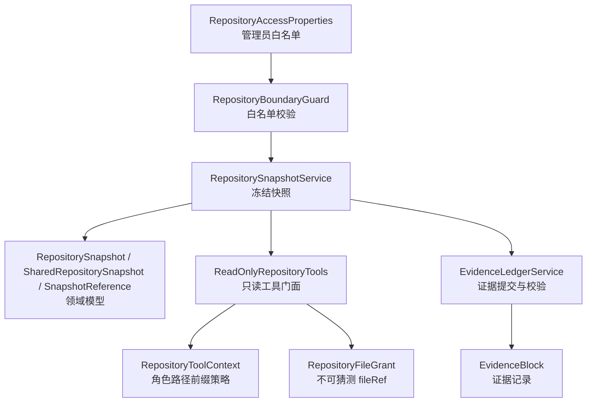
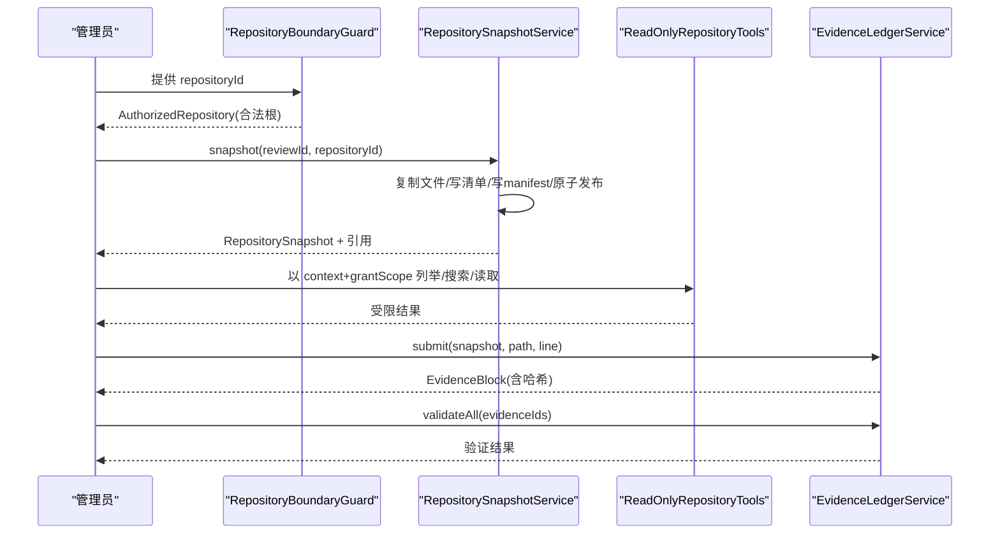
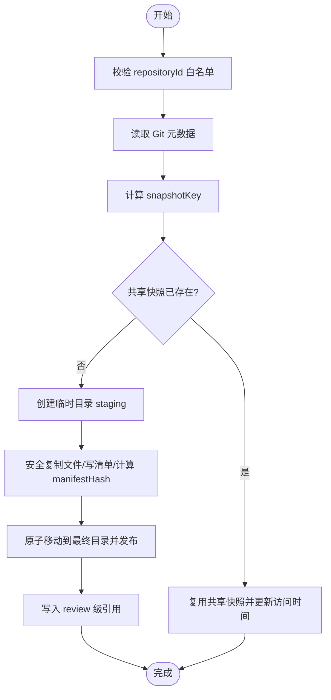
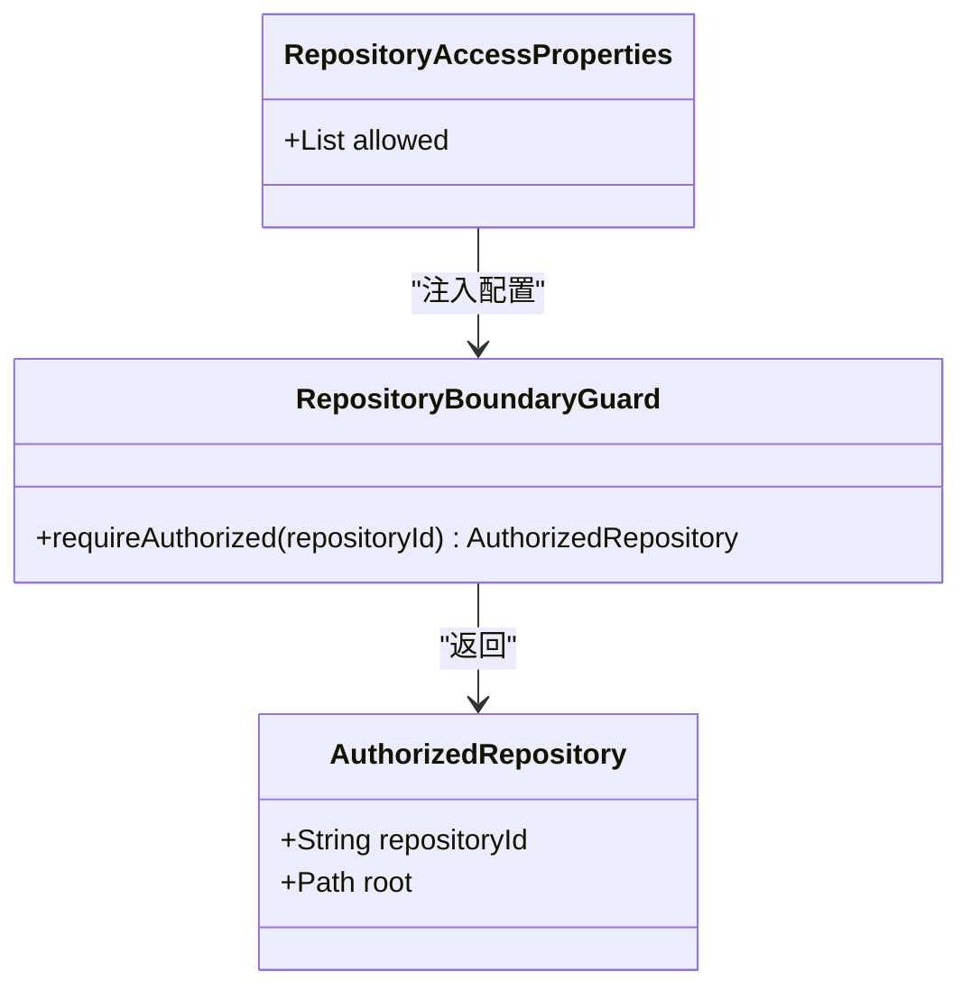
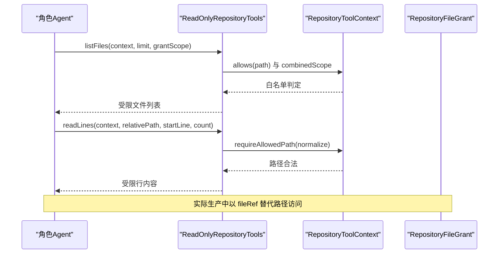
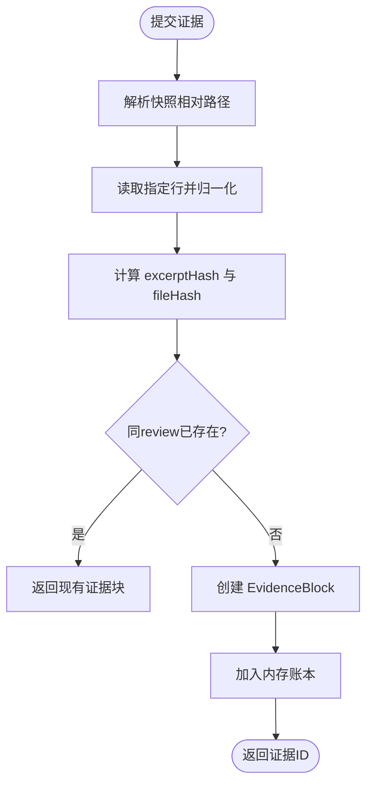
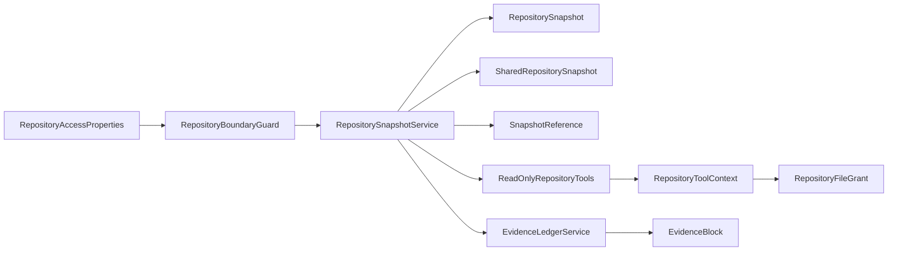

# 仓库快照与证据账本

<cite>
**本文引用的文件**
- [RepositorySnapshotService.java](file://src/main/java/ai/cc/chongming/review/application/RepositorySnapshotService.java)
- [EvidenceLedgerService.java](file://src/main/java/ai/cc/chongming/review/application/EvidenceLedgerService.java)
- [ReadOnlyRepositoryTools.java](file://src/main/java/ai/cc/chongming/review/infrastructure/agentscope/tool/ReadOnlyRepositoryTools.java)
- [RepositoryFileGrant.java](file://src/main/java/ai/cc/chongming/review/infrastructure/agentscope/tool/RepositoryFileGrant.java)
- [RepositoryToolContext.java](file://src/main/java/ai/cc/chongming/review/infrastructure/agentscope/tool/RepositoryToolContext.java)
- [RepositoryBoundaryGuard.java](file://src/main/java/ai/cc/chongming/review/infrastructure/repository/RepositoryBoundaryGuard.java)
- [RepositoryAccessProperties.java](file://src/main/java/ai/cc/chongming/review/config/RepositoryAccessProperties.java)
- [RepositorySnapshot.java](file://src/main/java/ai/cc/chongming/review/domain/model/RepositorySnapshot.java)
- [SharedRepositorySnapshot.java](file://src/main/java/ai/cc/chongming/review/domain/model/SharedRepositorySnapshot.java)
- [SnapshotReference.java](file://src/main/java/ai/cc/chongming/review/domain/model/SnapshotReference.java)
- [EvidenceBlock.java](file://src/main/java/ai/cc/chongming/review/domain/model/EvidenceBlock.java)
</cite>

## 目录
1. [简介](#简介)
2. [项目结构](#项目结构)
3. [核心组件](#核心组件)
4. [架构总览](#架构总览)
5. [详细组件分析](#详细组件分析)
6. [依赖关系分析](#依赖关系分析)
7. [性能与安全特性](#性能与安全特性)
8. [故障排查指南](#故障排查指南)
9. [结论](#结论)

## 简介
本说明聚焦四个相互关联的安全与可审计能力：
- 本地仓库冻结快照：将受管 Git 仓库安全复制为不可变、内容寻址的共享快照，供评审生命周期内只读使用。
- 白名单控制：仅允许访问管理员配置的仓库标识与根路径，拒绝任意路径输入。
- 角色受限文件读取：Agent 角色只能读取其被授权的快照子集，并通过不可猜测的 fileRef 令牌访问具体文件。
- 证据提交账本机制：从冻结快照中抽取单行代码片段作为证据，生成稳定哈希并支持批量验证，确保“所见即所证”。

这些能力共同构成评审过程中“只读、可追溯、可验证”的数据基座。

## 项目结构
围绕目标能力的代码分布在应用层、领域模型、基础设施工具与配置边界处：
- 应用层：RepositorySnapshotService（快照构建与生命周期）、EvidenceLedgerService（证据提交与校验）。
- 领域模型：RepositorySnapshot、SharedRepositorySnapshot、SnapshotReference、EvidenceBlock。
- 基础设施工具：ReadOnlyRepositoryTools（面向 Agent 的只读工具门面）、RepositoryFileGrant（文件授权令牌）、RepositoryToolContext（上下文与路径前缀策略）、RepositoryBoundaryGuard（仓库白名单边界）。
- 配置：RepositoryAccessProperties（管理员维护的可访问仓库清单）。

图表来源
- [RepositoryAccessProperties.java:20-57](file://src/main/java/ai/cc/chongming/review/config/RepositoryAccessProperties.java#L20-L57)
- [RepositoryBoundaryGuard.java:20-66](file://src/main/java/ai/cc/chongming/review/infrastructure/repository/RepositoryBoundaryGuard.java#L20-L66)
- [RepositorySnapshotService.java:51-166](file://src/main/java/ai/cc/chongming/review/application/RepositorySnapshotService.java#L51-L166)
- [ReadOnlyRepositoryTools.java:22-159](file://src/main/java/ai/cc/chongming/review/infrastructure/agentscope/tool/ReadOnlyRepositoryTools.java#L22-L159)
- [RepositoryToolContext.java:18-94](file://src/main/java/ai/cc/chongming/review/infrastructure/agentscope/tool/RepositoryToolContext.java#L18-L94)
- [RepositoryFileGrant.java:21-85](file://src/main/java/ai/cc/chongming/review/infrastructure/agentscope/tool/RepositoryFileGrant.java#L21-L85)
- [EvidenceLedgerService.java:31-93](file://src/main/java/ai/cc/chongming/review/application/EvidenceLedgerService.java#L31-L93)
- [RepositorySnapshot.java:14-55](file://src/main/java/ai/cc/chongming/review/domain/model/RepositorySnapshot.java#L14-L55)
- [SharedRepositorySnapshot.java:12-60](file://src/main/java/ai/cc/chongming/review/domain/model/SharedRepositorySnapshot.java#L12-L60)
- [SnapshotReference.java:12-44](file://src/main/java/ai/cc/chongming/review/domain/model/SnapshotReference.java#L12-L44)
- [EvidenceBlock.java:14-56](file://src/main/java/ai/cc/chongming/review/domain/model/EvidenceBlock.java#L14-L56)

章节来源
- [RepositorySnapshotService.java:51-166](file://src/main/java/ai/cc/chongming/review/application/RepositorySnapshotService.java#L51-L166)
- [EvidenceLedgerService.java:31-93](file://src/main/java/ai/cc/chongming/review/application/EvidenceLedgerService.java#L31-L93)
- [RepositoryBoundaryGuard.java:20-66](file://src/main/java/ai/cc/chongming/review/infrastructure/repository/RepositoryBoundaryGuard.java#L20-L66)
- [RepositoryAccessProperties.java:20-57](file://src/main/java/ai/cc/chongming/review/config/RepositoryAccessProperties.java#L20-L57)
- [ReadOnlyRepositoryTools.java:22-159](file://src/main/java/ai/cc/chongming/review/infrastructure/agentscope/tool/ReadOnlyRepositoryTools.java#L22-L159)
- [RepositoryToolContext.java:18-94](file://src/main/java/ai/cc/chongming/review/infrastructure/agentscope/tool/RepositoryToolContext.java#L18-L94)
- [RepositoryFileGrant.java:21-85](file://src/main/java/ai/cc/chongming/review/infrastructure/agentscope/tool/RepositoryFileGrant.java#L21-L85)
- [RepositorySnapshot.java:14-55](file://src/main/java/ai/cc/chongming/review/domain/model/RepositorySnapshot.java#L14-L55)
- [SharedRepositorySnapshot.java:12-60](file://src/main/java/ai/cc/chongming/review/domain/model/SharedRepositorySnapshot.java#L12-L60)
- [SnapshotReference.java:12-44](file://src/main/java/ai/cc/chongming/review/domain/model/SnapshotReference.java#L12-L44)
- [EvidenceBlock.java:14-56](file://src/main/java/ai/cc/chongming/review/domain/model/EvidenceBlock.java#L14-L56)

## 核心组件
- 仓库白名单边界：RepositoryBoundaryGuard 基于 RepositoryAccessProperties 加载管理员配置的仓库 id 到物理根映射，并在进入系统时进行路径安全检查（拒绝 UNC、符号链接、重解析点等），返回 AuthorizedRepository。
- 冻结快照服务：RepositorySnapshotService 将受管仓库复制到共享快照目录，生成内容寻址的 snapshotKey，写入 manifest 与文件清单 NDJSON，原子发布；同时维护 review 维度的引用文件，支持恢复与清理。
- 只读工具门面：ReadOnlyRepositoryTools 暴露 listFiles/searchText/findSymbol/readLines/getFileMetadata 等只读能力，所有调用均通过 RepositoryToolContext 的路径前缀策略与 grantScope 双重限制。
- 文件授权令牌：RepositoryFileGrant 将规范化后的快照相对路径绑定到不可猜测的 fileRef，用于后续以 token 形式访问文件，避免直接暴露路径。
- 证据账本：EvidenceLedgerService 从冻结快照读取指定行，生成 EvidenceBlock，计算 excerptHash/fileHash，并提供批量 validateAll 校验，确保证据与快照一致性。

章节来源
- [RepositoryBoundaryGuard.java:20-66](file://src/main/java/ai/cc/chongming/review/infrastructure/repository/RepositoryBoundaryGuard.java#L20-L66)
- [RepositoryAccessProperties.java:20-57](file://src/main/java/ai/cc/chongming/review/config/RepositoryAccessProperties.java#L20-L57)
- [RepositorySnapshotService.java:51-166](file://src/main/java/ai/cc/chongming/review/application/RepositorySnapshotService.java#L51-L166)
- [ReadOnlyRepositoryTools.java:22-159](file://src/main/java/ai/cc/chongming/review/infrastructure/agentscope/tool/ReadOnlyRepositoryTools.java#L22-L159)
- [RepositoryFileGrant.java:21-85](file://src/main/java/ai/cc/chongming/review/infrastructure/agentscope/tool/RepositoryFileGrant.java#L21-L85)
- [EvidenceLedgerService.java:31-93](file://src/main/java/ai/cc/chongming/review/application/EvidenceLedgerService.java#L31-L93)

## 架构总览
下图展示从白名单校验到快照冻结、角色受限读取与证据提交的端到端流程。

图表来源
- [RepositoryBoundaryGuard.java:43-66](file://src/main/java/ai/cc/chongming/review/infrastructure/repository/RepositoryBoundaryGuard.java#L43-L66)
- [RepositorySnapshotService.java:81-166](file://src/main/java/ai/cc/chongming/review/application/RepositorySnapshotService.java#L81-L166)
- [ReadOnlyRepositoryTools.java:34-136](file://src/main/java/ai/cc/chongming/review/infrastructure/agentscope/tool/ReadOnlyRepositoryTools.java#L34-L136)
- [EvidenceLedgerService.java:51-93](file://src/main/java/ai/cc/chongming/review/application/EvidenceLedgerService.java#L51-L93)

## 详细组件分析

### 本地仓库冻结快照
- 白名单入口：通过 RepositoryBoundaryGuard.requireAuthorized 将 repositoryId 解析为安全的 canonical 根，并校验 .git 存在且未被链接或重解析。
- 快照键与共享复用：根据 repositoryId、headCommit、工作树指纹（dirty 时为纳入文件的指纹）计算 snapshotKey；相同 key 的共享快照只创建一次，并发请求在 key 锁内二次检查后复用。
- 安全复制：遍历源仓库，跳过敏感文件、二进制文件、排除目录与嵌套 .git；禁止符号链接与 Junction；目标路径必须位于工作区根下。
- 元数据与清单：写入 snapshot-manifest.json 与 repository-files.ndjson，包含 headCommit、branch、dirty、manifestHash、includedFileCount、时间戳等；每次访问更新 lastAccessedAt。
- 引用与恢复：每个 attempt 写入 snapshot-reference.json；启动时优先加载已有引用；若发现不完整快照目录则删除并告警重建。
- 清理策略：按保留期扫描 repository-snapshots 下的候选快照，先检查 lastAccessedAt 与是否仍有引用，再在 key 锁内二次确认后删除。

图表来源
- [RepositoryBoundaryGuard.java:43-66](file://src/main/java/ai/cc/chongming/review/infrastructure/repository/RepositoryBoundaryGuard.java#L43-L66)
- [RepositorySnapshotService.java:81-166](file://src/main/java/ai/cc/chongming/review/application/RepositorySnapshotService.java#L81-L166)
- [RepositorySnapshotService.java:230-283](file://src/main/java/ai/cc/chongming/review/application/RepositorySnapshotService.java#L230-L283)

章节来源
- [RepositorySnapshotService.java:81-166](file://src/main/java/ai/cc/chongming/review/application/RepositorySnapshotService.java#L81-L166)
- [RepositorySnapshotService.java:230-283](file://src/main/java/ai/cc/chongming/review/application/RepositorySnapshotService.java#L230-L283)
- [RepositorySnapshotService.java:285-346](file://src/main/java/ai/cc/chongming/review/application/RepositorySnapshotService.java#L285-L346)
- [RepositorySnapshotService.java:407-431](file://src/main/java/ai/cc/chongming/review/application/RepositorySnapshotService.java#L407-L431)
- [RepositorySnapshotService.java:464-478](file://src/main/java/ai/cc/chongming/review/application/RepositorySnapshotService.java#L464-L478)
- [RepositorySnapshotService.java:514-534](file://src/main/java/ai/cc/chongming/review/application/RepositorySnapshotService.java#L514-L534)

### 白名单控制
- 配置来源：RepositoryAccessProperties 定义 allowed 列表，每个条目包含 id、root、displayName；id 唯一性在构造时校验。
- 边界守卫：RepositoryBoundaryGuard 在启动时加载映射，requireAuthorized 拒绝未配置、不存在、UNC、符号链接、重解析点的仓库根，并验证 .git 目录合法性。
- 作用范围：所有快照创建、查找、清理等操作均以 AuthorizedRepository 为入口，杜绝外部传入路径直接参与文件系统操作。

图表来源
- [RepositoryAccessProperties.java:20-57](file://src/main/java/ai/cc/chongming/review/config/RepositoryAccessProperties.java#L20-L57)
- [RepositoryBoundaryGuard.java:20-66](file://src/main/java/ai/cc/chongming/review/infrastructure/repository/RepositoryBoundaryGuard.java#L20-L66)
- [RepositoryBoundaryGuard.java:101-114](file://src/main/java/ai/cc/chongming/review/infrastructure/repository/RepositoryBoundaryGuard.java#L101-L114)

章节来源
- [RepositoryAccessProperties.java:20-57](file://src/main/java/ai/cc/chongming/review/config/RepositoryAccessProperties.java#L20-L57)
- [RepositoryBoundaryGuard.java:20-66](file://src/main/java/ai/cc/chongming/review/infrastructure/repository/RepositoryBoundaryGuard.java#L20-L66)

### 角色受限文件读取
- 上下文约束：RepositoryToolContext 携带 reviewId、roleType、snapshot 与 allowedPathPrefixes；allows 方法实现目录边界匹配与路径规范化，拒绝不安全路径。
- 工具门面：ReadOnlyRepositoryTools 的所有方法都要求 context 与 cancellation，并将 grantScope 与 context.allows 组合成最终谓词，确保 Agent 只能访问其权限范围内的快照文件。
- 文件授权令牌：RepositoryFileGrant 将 normalizedPath 与 review/attempt/role/snapshotCommit 绑定，生成不可猜测的 fileRef；Agent 仅持有 fileRef，无法推导真实路径。

图表来源
- [ReadOnlyRepositoryTools.java:34-136](file://src/main/java/ai/cc/chongming/review/infrastructure/agentscope/tool/ReadOnlyRepositoryTools.java#L34-L136)
- [RepositoryToolContext.java:18-94](file://src/main/java/ai/cc/chongming/review/infrastructure/agentscope/tool/RepositoryToolContext.java#L18-L94)
- [RepositoryFileGrant.java:21-85](file://src/main/java/ai/cc/chongming/review/infrastructure/agentscope/tool/RepositoryFileGrant.java#L21-L85)

章节来源
- [ReadOnlyRepositoryTools.java:34-136](file://src/main/java/ai/cc/chongming/review/infrastructure/agentscope/tool/ReadOnlyRepositoryTools.java#L34-L136)
- [RepositoryToolContext.java:18-94](file://src/main/java/ai/cc/chongming/review/infrastructure/agentscope/tool/RepositoryToolContext.java#L18-L94)
- [RepositoryFileGrant.java:21-85](file://src/main/java/ai/cc/chongming/review/infrastructure/agentscope/tool/RepositoryFileGrant.java#L21-L85)

### 证据提交账本机制
- 提交：EvidenceLedgerService.submit 从冻结快照读取指定行，归一化后计算 excerptHash，结合 fileHash、repoRevision、snapshotRelativePath、lineNumber 生成稳定的 EvidenceBlock；同一 review 内按 excerptHash 去重。
- 批量验证：validateAll 按文件分组读取所需行，比较当前文件 hash、行内容与 excerptHash，输出每条证据的验证结果与原因码（如 FILE_HASH_MISMATCH、EXCERPT_MISMATCH、SNAPSHOT_MISMATCH 等）。
- 预算与取消：限制单次请求的证据 ID 数量与行数上限，全程支持 IntakeCancellation 中断。

图表来源
- [EvidenceLedgerService.java:51-93](file://src/main/java/ai/cc/chongming/review/application/EvidenceLedgerService.java#L51-L93)
- [EvidenceLedgerService.java:126-164](file://src/main/java/ai/cc/chongming/review/application/EvidenceLedgerService.java#L126-L164)
- [EvidenceLedgerService.java:166-202](file://src/main/java/ai/cc/chongming/review/application/EvidenceLedgerService.java#L166-L202)
- [EvidenceLedgerService.java:234-281](file://src/main/java/ai/cc/chongming/review/application/EvidenceLedgerService.java#L234-L281)

章节来源
- [EvidenceLedgerService.java:51-93](file://src/main/java/ai/cc/chongming/review/application/EvidenceLedgerService.java#L51-L93)
- [EvidenceLedgerService.java:126-164](file://src/main/java/ai/cc/chongming/review/application/EvidenceLedgerService.java#L126-L164)
- [EvidenceLedgerService.java:166-202](file://src/main/java/ai/cc/chongming/review/application/EvidenceLedgerService.java#L166-L202)
- [EvidenceLedgerService.java:234-281](file://src/main/java/ai/cc/chongming/review/application/EvidenceLedgerService.java#L234-L281)

## 依赖关系分析
- 低耦合高内聚：白名单边界与快照服务解耦；只读工具门面与证据账本各自专注单一职责；领域模型仅承载不变状态。
- 关键依赖链：
  - RepositoryAccessProperties → RepositoryBoundaryGuard → RepositorySnapshotService
  - RepositorySnapshotService → RepositorySnapshot / SharedRepositorySnapshot / SnapshotReference
  - ReadOnlyRepositoryTools → RepositoryToolContext → RepositoryFileGrant
  - EvidenceLedgerService → RepositorySnapshot → EvidenceBlock

图表来源
- [RepositoryAccessProperties.java:20-57](file://src/main/java/ai/cc/chongming/review/config/RepositoryAccessProperties.java#L20-L57)
- [RepositoryBoundaryGuard.java:20-66](file://src/main/java/ai/cc/chongming/review/infrastructure/repository/RepositoryBoundaryGuard.java#L20-L66)
- [RepositorySnapshotService.java:51-166](file://src/main/java/ai/cc/chongming/review/application/RepositorySnapshotService.java#L51-L166)
- [ReadOnlyRepositoryTools.java:22-159](file://src/main/java/ai/cc/chongming/review/infrastructure/agentscope/tool/ReadOnlyRepositoryTools.java#L22-L159)
- [RepositoryToolContext.java:18-94](file://src/main/java/ai/cc/chongming/review/infrastructure/agentscope/tool/RepositoryToolContext.java#L18-L94)
- [RepositoryFileGrant.java:21-85](file://src/main/java/ai/cc/chongming/review/infrastructure/agentscope/tool/RepositoryFileGrant.java#L21-L85)
- [EvidenceLedgerService.java:31-93](file://src/main/java/ai/cc/chongming/review/application/EvidenceLedgerService.java#L31-L93)
- [RepositorySnapshot.java:14-55](file://src/main/java/ai/cc/chongming/review/domain/model/RepositorySnapshot.java#L14-L55)
- [SharedRepositorySnapshot.java:12-60](file://src/main/java/ai/cc/chongming/review/domain/model/SharedRepositorySnapshot.java#L12-L60)
- [SnapshotReference.java:12-44](file://src/main/java/ai/cc/chongming/review/domain/model/SnapshotReference.java#L12-L44)
- [EvidenceBlock.java:14-56](file://src/main/java/ai/cc/chongming/review/domain/model/EvidenceBlock.java#L14-L56)

章节来源
- [RepositorySnapshotService.java:51-166](file://src/main/java/ai/cc/chongming/review/application/RepositorySnapshotService.java#L51-L166)
- [EvidenceLedgerService.java:31-93](file://src/main/java/ai/cc/chongming/review/application/EvidenceLedgerService.java#L31-L93)
- [ReadOnlyRepositoryTools.java:22-159](file://src/main/java/ai/cc/chongming/review/infrastructure/agentscope/tool/ReadOnlyRepositoryTools.java#L22-L159)
- [RepositoryToolContext.java:18-94](file://src/main/java/ai/cc/chongming/review/infrastructure/agentscope/tool/RepositoryToolContext.java#L18-L94)
- [RepositoryFileGrant.java:21-85](file://src/main/java/ai/cc/chongming/review/infrastructure/agentscope/tool/RepositoryFileGrant.java#L21-L85)
- [RepositoryBoundaryGuard.java:20-66](file://src/main/java/ai/cc/chongming/review/infrastructure/repository/RepositoryBoundaryGuard.java#L20-L66)
- [RepositoryAccessProperties.java:20-57](file://src/main/java/ai/cc/chongming/review/config/RepositoryAccessProperties.java#L20-L57)

## 性能与安全特性
- 共享快照缓存：相同 snapshotKey 的快照只复制一次，减少重复 IO；lastAccessedAt 用于过期清理。
- 流式清单：repository-files.ndjson 边写边算 manifestHash，降低内存占用。
- 二进制与敏感过滤：快照阶段跳过二进制与敏感文件，减少不必要拷贝与风险面。
- 并发安全：按 snapshotKey 加锁，避免竞态；原子移动保证发布一致性。
- 证据去重：按 excerptHash 去重，避免重复存储与验证。
- 预算控制：证据 ID 数量与行数上限，防止资源滥用。
- 路径安全：多层校验拒绝符号链接、Junction、UNC、越界路径与重解析点。

[本节为通用指导，不直接分析具体文件]

## 故障排查指南
- 白名单错误：
  - 现象：仓库未配置或路径不安全。
  - 定位：RepositoryBoundaryGuard.requireAuthorized 抛出 REPOSITORY_NOT_CONFIGURED / REPOSITORY_PATH_UNSAFE。
  - 处理：检查 RepositoryAccessProperties.allowed 配置与目标路径是否存在、是否为独立 Git 仓库。
- 快照失败：
  - 现象：创建或加载快照失败。
  - 定位：RepositorySnapshotService 抛出 SNAPSHOT_FAILED；可能因 IO、完整性校验失败或不完整目录。
  - 处理：查看 snapshot-manifest.json 与 repository-files.ndjson 是否完整；必要时删除不完整目录并重建。
- 引用不一致：
  - 现象：引用与共享快照不匹配。
  - 定位：findExistingSnapshot 或 readSharedSnapshot 校验 snapshotKey、repositoryId、worktreeFingerprint、manifestHash。
  - 处理：确认 repositoryId 与 commit 一致；清理异常引用后重新绑定。
- 证据验证失败：
  - 现象：validateAll 返回 FILE_HASH_MISMATCH / EXCERPT_MISMATCH / SNAPSHOT_MISMATCH。
  - 定位：EvidenceLedgerService.validateAll 与 validationFailureReason。
  - 处理：确认证据来自同一快照与同一 revision；检查文件是否被修改或路径/行号是否正确。
- 角色越权：
  - 现象：ReadOnlyRepositoryTools 拒绝访问。
  - 定位：RepositoryToolContext.allows 或 requireAllowedPath。
  - 处理：调整 allowedPathPrefixes 或 grantScope；确保 fileRef 由正确 review/attempt/role 签发。

章节来源
- [RepositoryBoundaryGuard.java:43-66](file://src/main/java/ai/cc/chongming/review/infrastructure/repository/RepositoryBoundaryGuard.java#L43-L66)
- [RepositorySnapshotService.java:173-214](file://src/main/java/ai/cc/chongming/review/application/RepositorySnapshotService.java#L173-L214)
- [RepositorySnapshotService.java:536-566](file://src/main/java/ai/cc/chongming/review/application/RepositorySnapshotService.java#L536-L566)
- [EvidenceLedgerService.java:166-202](file://src/main/java/ai/cc/chongming/review/application/EvidenceLedgerService.java#L166-L202)
- [ReadOnlyRepositoryTools.java:151-157](file://src/main/java/ai/cc/chongming/review/infrastructure/agentscope/tool/ReadOnlyRepositoryTools.java#L151-L157)
- [RepositoryToolContext.java:51-72](file://src/main/java/ai/cc/chongming/review/infrastructure/agentscope/tool/RepositoryToolContext.java#L51-L72)

## 结论
该方案通过白名单边界、内容寻址共享快照、角色受限读取与证据账本，构建了评审过程中的可信数据基座：
- 白名单确保只有管理员授权的仓库可被访问。
- 冻结快照提供不可变、可复用的只读视图，支持并发与恢复。
- 角色受限读取通过上下文与授权令牌，使 Agent 仅能访问其权限内的文件。
- 证据账本以稳定哈希绑定“哪份快照的哪一行”，支持批量验证与审计回放。

这些能力共同保障评审过程的安全性、可追溯性与可验证性。
