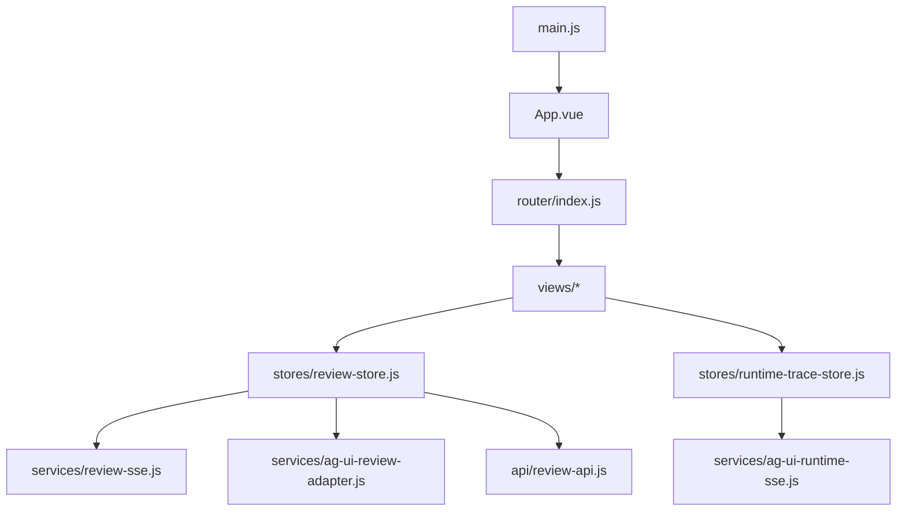
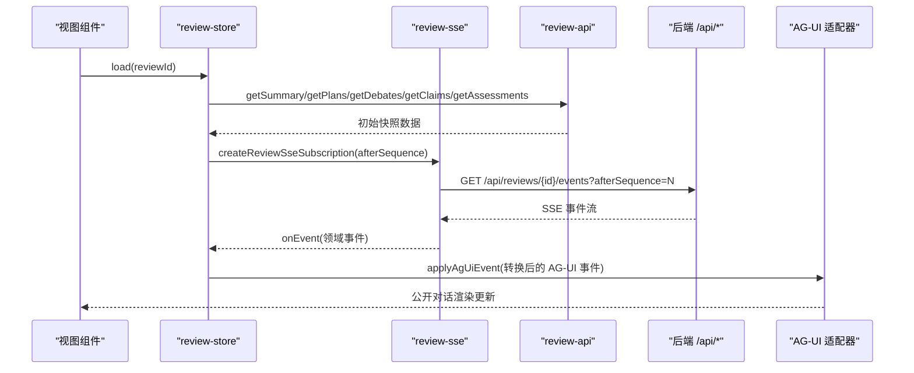
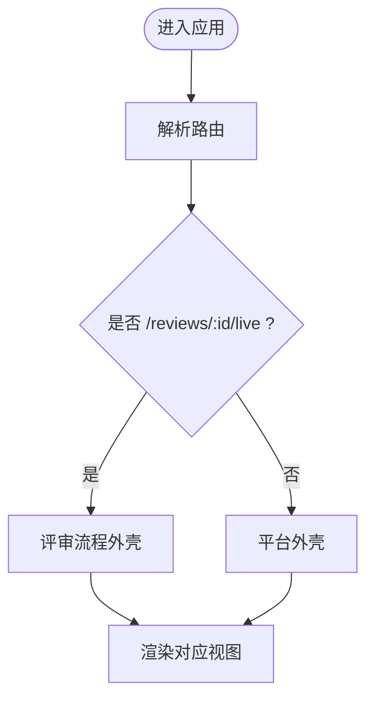
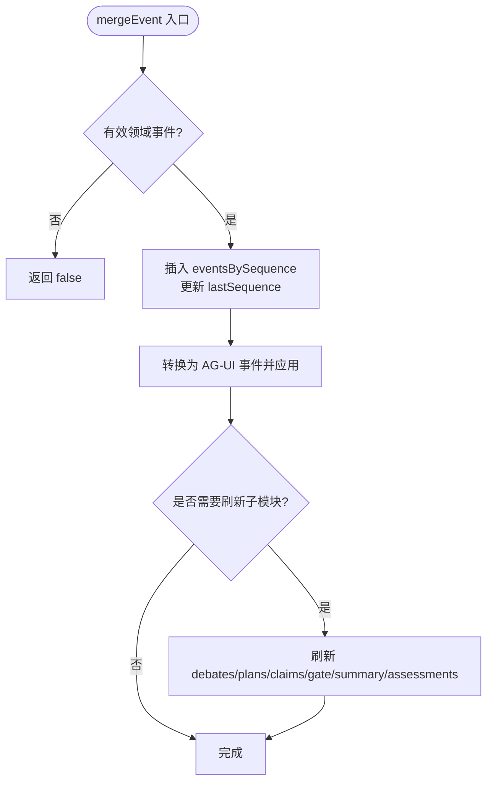
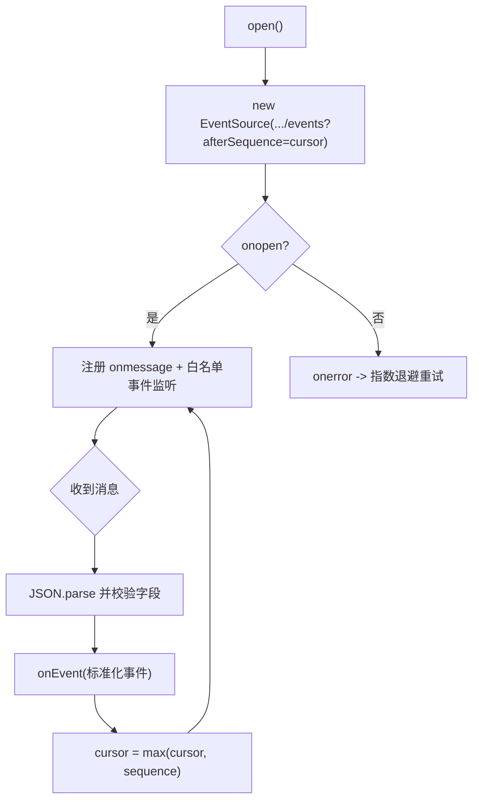
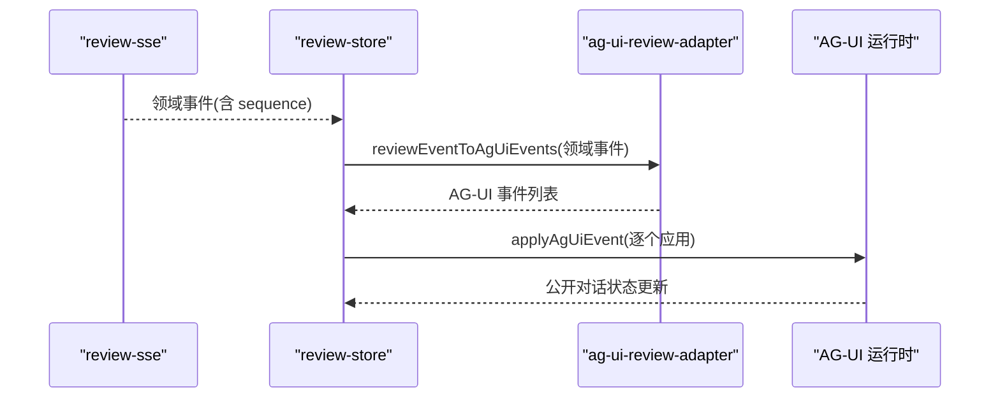
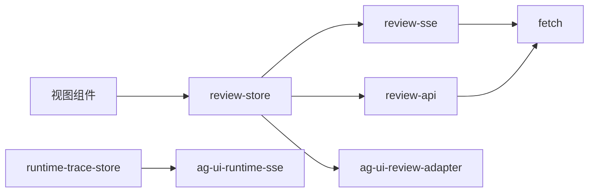

# 前端评审工作台

<cite>
**本文引用的文件**
- [main.js](file://frontend/src/main.js)
- [App.vue](file://frontend/src/App.vue)
- [index.js](file://frontend/src/router/index.js)
- [review-api.js](file://frontend/src/api/review-api.js)
- [review-store.js](file://frontend/src/stores/review-store.js)
- [runtime-trace-store.js](file://frontend/src/stores/runtime-trace-store.js)
- [review-sse.js](file://frontend/src/services/review-sse.js)
- [ag-ui-review-adapter.js](file://frontend/src/services/ag-ui-review-adapter.js)
- [ag-ui-runtime-sse.js](file://frontend/src/services/ag-ui-runtime-sse.js)
- [ReviewWorkbenchView.vue](file://frontend/src/views/ReviewWorkbenchView.vue)
- [ReviewReportView.vue](file://frontend/src/views/ReviewReportView.vue)
- [ReviewAssessment.java](file://src/main/java/ai/cc/chongming/review/domain/model/ReviewAssessment.java)
- [ReviewTypes.java](file://src/main/java/ai/cc/chongming/review/domain/model/ReviewTypes.java)
- [ReviewReportService.java](file://src/main/java/ai/cc/chongming/review/application/ReviewReportService.java)
- [AG-UI前端对话契约.md](file://docs/集成/AG-UI前端对话契约.md)
</cite>

## 更新摘要
**变更内容**
- 新增五态评估系统功能，包括检查点结论展示、评估状态管理（确认、部分、缺口、未知、不适用）
- 在工作台和报告视图中的可视化展示
- 新增对assessments API的集成和store中的评估状态管理
- 更新了API契约和状态管理逻辑以支持新的评估功能

## 目录
1. [简介](#简介)
2. [项目结构](#项目结构)
3. [核心组件](#核心组件)
4. [架构总览](#架构总览)
5. [详细组件分析](#详细组件分析)
6. [依赖关系分析](#依赖关系分析)
7. [性能考虑](#性能考虑)
8. [故障排查指南](#故障排查指南)
9. [结论](#结论)
10. [附录：API 契约速查](#附录api-契约速查)

## 简介
本文件聚焦 Vue 3/Vite 前端的评审工作台，说明页面路由与布局、状态管理、SSE 事件订阅与重连、AG-UI 公开对话适配，以及与后端 REST/SSE API 的契约。目标是让读者在不深入源码的情况下，理解"从页面到 SSE 再到 AG-UI 展示"的完整链路，并掌握关键扩展点与风险点。

**更新** 新增了五态评估系统功能，包括检查点结论展示、评估状态管理（确认、部分、缺口、未知、不适用），以及在工作台和报告视图中的可视化展示。

## 项目结构
前端采用单入口 + 路由分发的组织方式：
- 应用入口 main.js 创建 Vue 实例并挂载 Router。
- App.vue 提供平台外壳（侧边栏、顶栏、主内容区），并根据当前路由切换评审流程专属样式。
- router/index.js 使用 Hash History 以兼容静态资源托管；集中声明所有页面路由，包括需求、评审、报告、实时评审等。
- api/review-api.js 封装对后端的 REST 调用，统一错误处理、幂等键与追踪头。
- stores 层维护评审级状态与运行时轨迹，负责 SSE 订阅、事件合并、AG-UI 对话状态同步。
- services 层实现 SSE 连接、AG-UI 事件适配、运行时 SSE 订阅等可复用能力。

图表来源
- [main.js:1-8](file://frontend/src/main.js#L1-L8)
- [App.vue:1-103](file://frontend/src/App.vue#L1-L103)
- [index.js:1-35](file://frontend/src/router/index.js#L1-L35)
- [review-store.js:1-349](file://frontend/src/stores/review-store.js#L1-L349)
- [runtime-trace-store.js:1-49](file://frontend/src/stores/runtime-trace-store.js#L1-L49)
- [review-sse.js:1-88](file://frontend/src/services/review-sse.js#L1-L88)
- [ag-ui-review-adapter.js:1-200](file://frontend/src/services/ag-ui-review-adapter.js#L1-L200)
- [ag-ui-runtime-sse.js:1-200](file://frontend/src/services/ag-ui-runtime-sse.js#L1-L200)
- [review-api.js:1-307](file://frontend/src/api/review-api.js#L1-L307)

章节来源
- [main.js:1-8](file://frontend/src/main.js#L1-L8)
- [App.vue:1-103](file://frontend/src/App.vue#L1-L103)
- [index.js:1-35](file://frontend/src/router/index.js#L1-L35)

## 核心组件
- 页面与路由
  - 通过 Hash History 暴露 /dashboard、/requirements、/reviews、/reports、/create、/reviews/:id/live、/reviews/:id/scout、/reviews/:id/report 等路径，便于静态资源部署与刷新兼容。
  - App.vue 根据 route.name 决定是否为评审流程视图，从而切换外壳样式与导航可见性。
- 状态管理
  - review-store.js：按 reviewId 维护领域事件、计划、辩论、证据、人类审核项、报告、通知、角色激活进度、连接状态、AG-UI 对话状态；负责 SSE 订阅、事件去重、增量刷新。
  - runtime-trace-store.js：订阅 AG-UI 运行时 SSE，按角色分组执行细节，限制事件数量并去重。
- SSE 与 AG-UI 适配
  - review-sse.js：基于浏览器 EventSource 建立可恢复的 SSE 连接，支持 afterSequence 游标、指数退避重连、事件类型白名单。
  - ag-ui-review-adapter.js：将领域事件转换为 AG-UI 事件（RUN_STARTED/RUN_FINISHED/RUN_ERROR/TEXT_MESSAGE_*/CUSTOM），并维护 threadId=review:{reviewId} 的会话上下文。
  - ag-ui-runtime-sse.js：订阅运行时 SSE，用于 AgentTraceDrawer 等调试视图。
- API 客户端
  - review-api.js：统一的 REST 客户端，封装 JSON/Form 请求、错误对象 ReviewApiError、幂等键 Idempotency-Key、追踪头 X-Trace-Id、分页拉取 plans 等。

**更新** 新增了五态评估系统的状态管理，包括评估视图计算、覆盖率统计和角色评估进度跟踪。

章节来源
- [index.js:14-35](file://frontend/src/router/index.js#L14-L35)
- [App.vue:6-64](file://frontend/src/App.vue#L6-L64)
- [review-store.js:35-105](file://frontend/src/stores/review-store.js#L35-L105)
- [runtime-trace-store.js:1-49](file://frontend/src/stores/runtime-trace-store.js#L1-L49)
- [review-sse.js:1-88](file://frontend/src/services/review-sse.js#L1-L88)
- [ag-ui-review-adapter.js:1-200](file://frontend/src/services/ag-ui-review-adapter.js#L1-L200)
- [ag-ui-runtime-sse.js:1-200](file://frontend/src/services/ag-ui-runtime-sse.js#L1-L200)
- [review-api.js:1-307](file://frontend/src/api/review-api.js#L1-L307)

## 架构总览
下图展示了"页面 → Store → SSE/REST → 后端"的数据流与控制流。

图表来源
- [review-store.js:282-313](file://frontend/src/stores/review-store.js#L282-L313)
- [review-sse.js:20-88](file://frontend/src/services/review-sse.js#L20-L88)
- [review-api.js:76-297](file://frontend/src/api/review-api.js#L76-L297)
- [ag-ui-review-adapter.js:1-200](file://frontend/src/services/ag-ui-review-adapter.js#L1-L200)

## 详细组件分析

### 页面结构与路由
- 路由策略
  - 使用 Hash History，避免服务端未配置 SPA 回退时的刷新问题。
  - 集中定义评审相关路由：/reviews/:reviewId/live（实时）、/reviews/:reviewId/scout（Context Scout 预览）、/reviews/:reviewId（工作台）、/reviews/:reviewId/report（报告）。
- 外壳与导航
  - App.vue 根据 route.name === 'review-live' 切换评审流程外壳，隐藏侧边栏或调整主区域样式。
  - 顶部面包屑与标题由路由名映射，提升导航一致性。

图表来源
- [index.js:17-35](file://frontend/src/router/index.js#L17-L35)
- [App.vue:6-100](file://frontend/src/App.vue#L6-L100)

章节来源
- [index.js:14-35](file://frontend/src/router/index.js#L14-L35)
- [App.vue:6-100](file://frontend/src/App.vue#L6-L100)

### 状态管理：review-store
- 职责边界
  - 维护单个评审的全量视图状态：summary、plans、debates、claims、humanItems、report、notifications、evidence、connection 状态、lastSequence、AG-UI 对话状态。
  - 通过 SSE 接收领域事件，进行幂等去重（按 sequence），并触发局部刷新（如 debate/plan/claim/human gate 等）。
  - 将领域事件转换为 AG-UI 事件，驱动公开对话 UI。
- 关键流程
  - load(reviewId)：并行拉取初始快照，启动 SSE，设置 RUN_STARTED。
  - mergeEvent(event)：校验并插入领域事件，更新 lastSequence，派生 AG-UI 事件，按需刷新关联数据。
  - applyStageFromEvent：基于事件中的 stage/progress 保持头部进度一致，忽略不同 attempt 的重放。
- 持久化与重连
  - 使用 localStorage 记录 lastSequence，配合 SSE 的 afterSequence 实现断线续传。
  - connection.status 暴露连接状态，供 UI 显示连接质量。

**更新** 新增了五态评估系统的状态管理：
- assessmentView：计算评估视图，包含覆盖率统计和评估条目
- assessmentCoverage：计算评估覆盖率（required/covered/confirmed/partial/gap/unknown/notApplicable）
- assessmentBreakdown：计算评估分解（未执行、执行但未知、确认无问题、确认有缺口）
- roleAssessmentProgress：按角色跟踪评估进度和状态分布

图表来源
- [review-store.js:98-185](file://frontend/src/stores/review-store.js#L98-L185)
- [review-store.js:234-247](file://frontend/src/stores/review-store.js#L234-L247)

章节来源
- [review-store.js:35-105](file://frontend/src/stores/review-store.js#L35-L105)
- [review-store.js:187-247](file://frontend/src/stores/review-store.js#L187-L247)
- [review-store.js:282-313](file://frontend/src/stores/review-store.js#L282-L313)

### 运行时轨迹：runtime-trace-store
- 职责边界
  - 订阅 AG-UI 运行时 SSE，收集每个角色的执行事件，按 runId 缓存角色映射。
  - 限制内存中事件数量（默认保留最近 500 条），并通过 id 去重。
- 使用场景
  - 为 AgentTraceDrawer 等调试视图提供逐角色执行明细。

章节来源
- [runtime-trace-store.js:1-49](file://frontend/src/stores/runtime-trace-store.js#L1-L49)

### SSE 适配：review-sse
- 连接管理
  - 基于浏览器 EventSource，构造 /api/reviews/{id}/events?afterSequence=N。
  - 维护 cursor 游标，仅接受属于当前 reviewId 且 sequence>=1 的事件。
  - 对未知事件类型通过白名单过滤，降低无关噪音。
- 重连策略
  - onerror 时关闭连接，指数退避重试（上限 30s），并在每次重连前更新 onState。
  - 支持外部注入 setTimeout/clearTimeout 以便测试。

图表来源
- [review-sse.js:20-88](file://frontend/src/services/review-sse.js#L20-L88)

章节来源
- [review-sse.js:1-88](file://frontend/src/services/review-sse.js#L1-L88)

### AG-UI 对话适配与契约
- 公开对话契约要点
  - 领域事件统一映射为 CUSTOM 事件，name 固定为 chongming.review.domain-event.v1，value 为原始公开领域事实。
  - Claim、质询、答辩、立场变化、裁决、Gate 摘要通过 TEXT_MESSAGE_START/CONTENT/END 序列呈现，仅使用白名单字段。
  - 评审连接建立发送 RUN_STARTED（threadId=review:{reviewId}，runId 使用当前 attempt）；取消/失败分别映射为 RUN_FINISHED/RUN_ERROR。
  - 不处理 REASONING_* 事件，避免泄露推理过程。
- 前端状态要求
  - 以 reviewId+sequence 幂等去重；attempt 不作为去重键。
  - 文本消息 ID 固定为 review-{reviewId}-sequence-{sequence}，避免回放重复。
  - Markdown/代码/错误纯文本渲染，禁止 HTML。
- 适配器职责
  - ag-ui-review-adapter.js 负责领域事件与 AG-UI 事件的互转，以及 conversation 生命周期管理。

图表来源
- [AG-UI前端对话契约.md:1-44](file://docs/集成/AG-UI前端对话契约.md#L1-L44)
- [review-store.js:98-185](file://frontend/src/stores/review-store.js#L98-L185)
- [ag-ui-review-adapter.js:1-200](file://frontend/src/services/ag-ui-review-adapter.js#L1-L200)

章节来源
- [AG-UI前端对话契约.md:1-44](file://docs/集成/AG-UI前端对话契约.md#L1-L44)
- [review-store.js:98-185](file://frontend/src/stores/review-store.js#L98-L185)
- [ag-ui-review-adapter.js:1-200](file://frontend/src/services/ag-ui-review-adapter.js#L1-L200)

### 五态评估系统
**新增** 五态评估系统提供了结构化的检查点结论管理，支持五种评估状态：

- **评估状态定义**
  - CONFIRMED（确认）：证据充分，检查点符合或无问题
  - PARTIAL（部分满足）：部分符合，未满足部分已说明
  - GAP（风险缺口）：确认存在缺口，需要处置
  - UNKNOWN（证据不足）：授权证据不足以确认，"未看到"不等于"未实现"
  - NOT_APPLICABLE（不适用）：该检查点不适用于当前评审

- **前端实现**
  - parseAssessmentsView：规范化评估视图数据结构，确保字段安全
  - ASSESSMENT_STATUSES：冻结的五态词汇表，被 Gate、报告和工作台共享
  - 在 store 中集成评估状态管理，响应 ROLE_COMPLETED、INITIAL_REVIEW_COMPLETED、REVIEW_RETRIED 等事件

- **可视化展示**
  - 工作台中显示检查点覆盖进度条和五态数量统计
  - 报告中按状态分类展示评估条目，包含角色、检查点、摘要和理由
  - 支持按角色查看评估进度和状态分布

章节来源
- [review-api.js:9-52](file://frontend/src/api/review-api.js#L9-L52)
- [review-store.js:23-27](file://frontend/src/stores/review-store.js#L23-L27)
- [ReviewWorkbenchView.vue:220-244](file://frontend/src/views/ReviewWorkbenchView.vue#L220-L244)
- [ReviewReportView.vue:188-217](file://frontend/src/views/ReviewReportView.vue#L188-L217)

### 与后端 API 契约
- REST 端点（节选）
  - 概览与资源
    - GET /api/dashboard：获取工作台计数。
    - GET /api/repositories：列出可用仓库标识。
    - GET /api/requirements：分页查询需求（status/assignee/keyword/page/size）。
    - POST /api/requirements：新建需求草稿。
    - GET/PUT/DELETE /api/requirements/:id：读取/修订/删除需求（支持 expectedVersion 乐观锁）。
    - POST /api/requirements/:id/submit：提交需求至评审（携带 reviewId、expectedVersion）。
  - 评审生命周期
    - POST /api/reviews：发起评审（表单：requirementFile/repositoryPath/branch/commit/submitter/forceNewAttempt）。
    - POST /api/reviews/:id/start：启动评审（JSON：expectedVersion/userId/publicTasks/changeReason/initialMessage；Header：Idempotency-Key/X-Trace-Id）。
    - POST /api/reviews/:id/cancel、/retry：取消/重试（expectedVersion）。
    - GET /api/reviews/:id：获取评审摘要。
    - GET /api/reviews/:id/plans：分页获取计划（afterSequence/limit）。
    - GET /api/reviews/:id/debates、/claims、/evidence/:id：获取辩论、主张、证据。
    - GET/POST/PATCH/DELETE /api/reviews/:id/human-review-items：人类审核项 CRUD（支持 severity 过滤与 expectedVersion）。
    - GET/POST /api/reviews/:id/human-gate-decisions：人类 Gate 决策版本与提交。
    - GET/POST /api/reviews/:id/report：获取/生成报告（支持 version/format）。
    - GET /api/reviews/:id/report/versions：报告版本列表。
    - GET /api/reviews/:id/notifications、/.../retry：通知列表与重试。
  - Context Scout
    - POST /api/reviews/:id/attempts/:attemptNo/scout-previews：启动预览。
    - GET /api/reviews/:id/attempts/:attemptNo/scout-previews/:previewId：获取预览结果。
  - **新增** 评估系统
    - GET /api/reviews/:id/assessments：获取五态评估投影数据

- SSE 端点
  - GET /api/reviews/:id/events?afterSequence=N：评审领域事件流，事件类型见 review-sse.js 白名单。
- 错误与追踪
  - 非 2xx 响应抛出 ReviewApiError，包含 status/errorCode/traceId/body。
  - 建议通过 X-Trace-Id 透传追踪号，便于定位。

**更新** 新增了评估系统相关的 API 端点和数据结构。

章节来源
- [review-api.js:76-297](file://frontend/src/api/review-api.js#L76-L297)
- [review-sse.js:6-18](file://frontend/src/services/review-sse.js#L6-L18)

## 依赖关系分析
- 组件耦合
  - 视图依赖 store；store 依赖 SSE 与 API；SSE 依赖浏览器 EventSource；AG-UI 适配器解耦领域事件与 AG-UI 事件。
- 外部依赖
  - @ag-ui/core 提供 EventType 与运行时事件模型。
  - 浏览器 fetch/EventSource 作为网络传输基础。
- 潜在循环
  - 无直接循环导入；store 与 adapter 通过函数式接口交互，降低耦合。

图表来源
- [review-store.js:1-11](file://frontend/src/stores/review-store.js#L1-L11)
- [review-sse.js:20-44](file://frontend/src/services/review-sse.js#L20-L44)
- [review-api.js:32-49](file://frontend/src/api/review-api.js#L32-L49)
- [runtime-trace-store.js:1-10](file://frontend/src/stores/runtime-trace-store.js#L1-L10)

章节来源
- [review-store.js:1-11](file://frontend/src/stores/review-store.js#L1-L11)
- [review-sse.js:20-44](file://frontend/src/services/review-sse.js#L20-L44)
- [review-api.js:32-49](file://frontend/src/api/review-api.js#L32-L49)
- [runtime-trace-store.js:1-10](file://frontend/src/stores/runtime-trace-store.js#L1-L10)

## 性能考虑
- SSE 重连与游标
  - 指数退避重连避免雪崩；afterSequence 游标减少回放数据量。
- 事件去重与裁剪
  - 按 sequence 去重；runtime-trace-store 限制事件数量，防止内存膨胀。
- 批量与并行
  - 初始加载并行拉取 summary/plans/debates/claims/assessments 等，缩短首屏时间。
- 渲染优化
  - AG-UI 文本消息使用固定 ID，避免重复渲染；Markdown/代码纯文本渲染，避免 DOM 操作开销。
- **新增** 评估数据优化
  - 评估视图计算使用 computed 属性，自动缓存和依赖追踪
  - 按角色分组的评估进度计算避免重复遍历
  - 评估条目排序和过滤在计算属性中完成，减少视图层复杂度

[本节为通用指导，不直接分析具体文件]

## 故障排查指南
- 连接异常
  - 检查浏览器是否支持 EventSource；确认 /api/reviews/:id/events 可达且返回 SSE。
  - 关注 connection.status：connecting/reconnecting/connected/malformed-event/closed。
- 事件丢失或重复
  - 确认 afterSequence 是否正确递增；检查 sequence 是否连续且 >=1。
  - 若出现重复消息，检查 AG-UI 消息 ID 是否固定为 review-{reviewId}-sequence-{sequence}。
- 权限与错误
  - 查看 ReviewApiError 的 errorCode 与 traceId，结合后端日志定位。
  - 对于 404 等预期缺失，review-store 已做容错处理，但需确保上层 UI 有降级展示。
- **新增** 评估系统问题
  - 检查 assessments API 是否正常返回数据
  - 验证评估状态值是否符合预定义的五个状态
  - 确认评估事件（ROLE_COMPLETED、INITIAL_REVIEW_COMPLETED、REVIEW_RETRIED）是否正确触发刷新

章节来源
- [review-sse.js:40-88](file://frontend/src/services/review-sse.js#L40-L88)
- [review-store.js:24-33](file://frontend/src/stores/review-store.js#L24-L33)
- [review-api.js:8-49](file://frontend/src/api/review-api.js#L8-L49)

## 结论
该前端评审工作台通过清晰的分层设计，将页面、状态、SSE 与 AG-UI 适配解耦，既保证了公开对话的安全性与一致性，又提供了强大的运行时可观测能力。**新增的五态评估系统**进一步增强了评审工作的结构化程度，使检查点结论更加明确和可追溯。后续若后端提供原生 AG-UI 双向会话端点，可在不改动 Store 的前提下平滑迁移。

[本节为总结性内容，不直接分析具体文件]

## 附录：API 契约速查
- 评审事件流
  - 端点：GET /api/reviews/:id/events?afterSequence=N
  - 事件类型：见 review-sse.js 白名单，涵盖计划、角色、辩论、证据、人类审核、通知、评审生命周期等。
- 评审命令
  - 启动：POST /api/reviews/:id/start（JSON + Idempotency-Key + X-Trace-Id）
  - 取消/重试：POST /api/reviews/:id/cancel、/retry（expectedVersion）
- 数据查询
  - 摘要：GET /api/reviews/:id
  - 计划：GET /api/reviews/:id/plans?afterSequence=&limit=
  - 辩论/主张/证据：GET /api/reviews/:id/debates、/claims、/evidence/:id
- 人类审核与 Gate
  - 审核项：GET/POST/PATCH/DELETE /api/reviews/:id/human-review-items
  - Gate 决策：GET/POST /api/reviews/:id/human-gate-decisions
- 报告与通知
  - 报告：GET/POST /api/reviews/:id/report（version/format）
  - 通知：GET /api/reviews/:id/notifications，重试：POST .../notifications/:id/retry
- **新增** 评估系统
  - 评估投影：GET /api/reviews/:id/assessments
  - 评估状态：CONFIRMED、PARTIAL、GAP、UNKNOWN、NOT_APPLICABLE
  - 评估数据包含：覆盖率统计、各状态数量、未覆盖检查点、详细评估条目

**更新** 新增了评估系统相关的 API 端点和数据结构。

章节来源
- [review-api.js:76-297](file://frontend/src/api/review-api.js#L76-L297)
- [review-sse.js:6-18](file://frontend/src/services/review-sse.js#L6-L18)