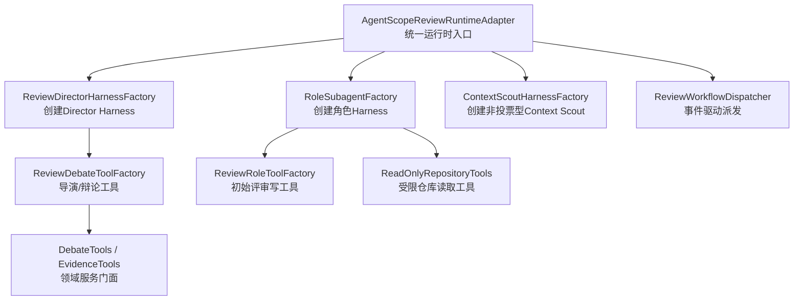
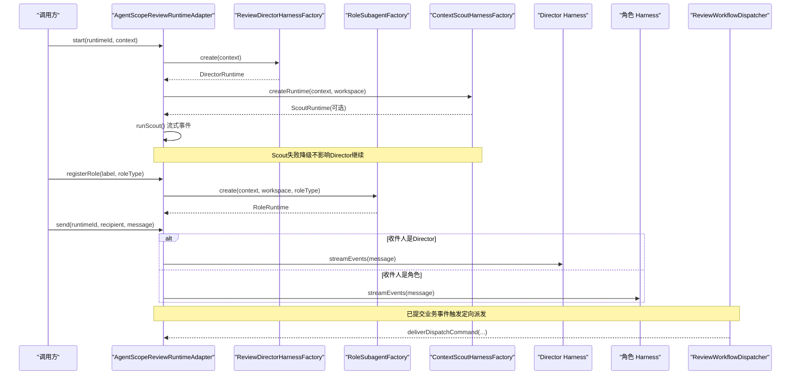
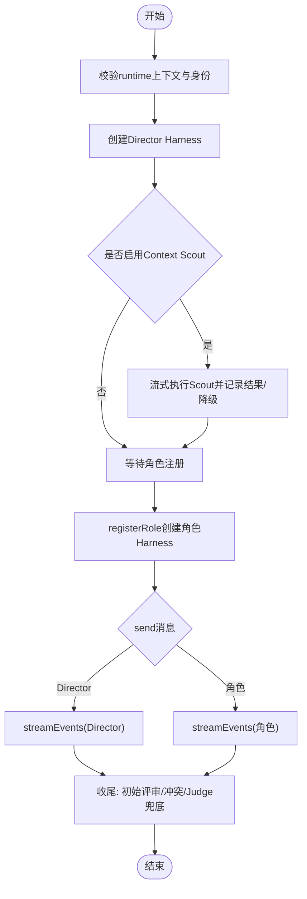
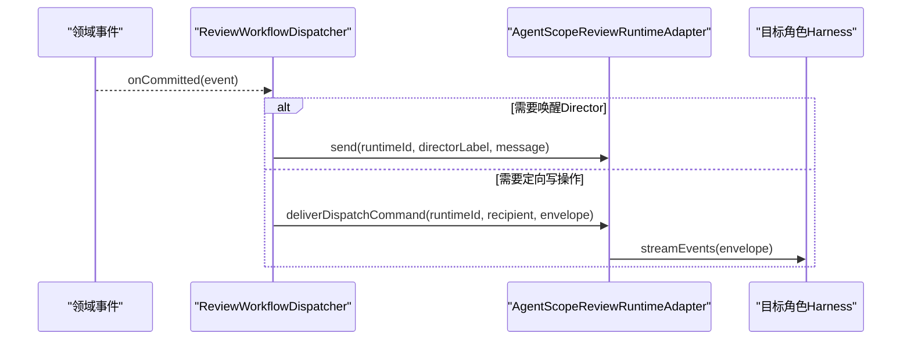
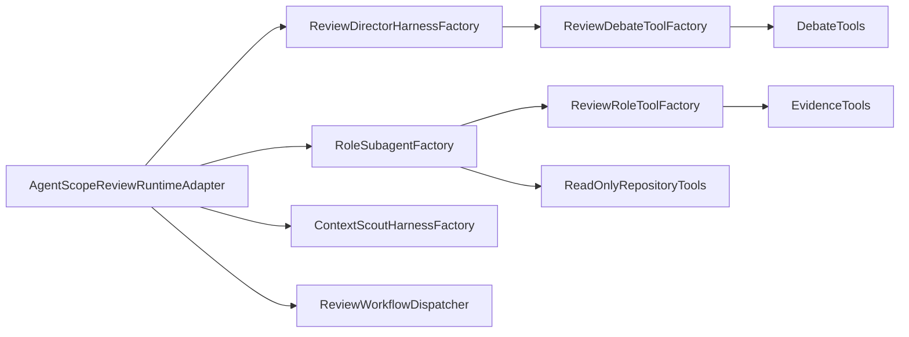

# 多Agent Harness与角色编排

<cite>
**本文引用的文件**
- [AgentScopeReviewRuntimeAdapter.java](file://src/main/java/ai/cc/chongming/review/infrastructure/agentscope/AgentScopeReviewRuntimeAdapter.java)
- [ReviewWorkflowDispatcher.java](file://src/main/java/ai/cc/chongming/review/infrastructure/agentscope/ReviewWorkflowDispatcher.java)
- [ReviewDirectorHarnessFactory.java](file://src/main/java/ai/cc/chongming/review/infrastructure/agentscope/ReviewDirectorHarnessFactory.java)
- [RoleSubagentFactory.java](file://src/main/java/ai/cc/chongming/review/infrastructure/agentscope/RoleSubagentFactory.java)
- [ContextScoutHarnessFactory.java](file://src/main/java/ai/cc/chongming/review/infrastructure/agentscope/ContextScoutHarnessFactory.java)
- [ReviewRoleToolFactory.java](file://src/main/java/ai/cc/chongming/review/infrastructure/agentscope/ReviewRoleToolFactory.java)
- [ReviewDebateToolFactory.java](file://src/main/java/ai/cc/chongming/review/infrastructure/agentscope/ReviewDebateToolFactory.java)
- [DebateTools.java](file://src/main/java/ai/cc/chongming/review/infrastructure/agentscope/tool/DebateTools.java)
- [EvidenceTools.java](file://src/main/java/ai/cc/chongming/review/infrastructure/agentscope/tool/EvidenceTools.java)
- [ReadOnlyRepositoryTools.java](file://src/main/java/ai/cc/chongming/review/infrastructure/agentscope/tool/ReadOnlyRepositoryTools.java)
- [product.yml](file://src/main/resources/roles/product.yml)
- [judge.yml](file://src/main/resources/roles/judge.yml)
- [RolePack.java](file://src/main/java/ai/cc/chongming/review/domain/role/RolePack.java)
- [RolePackRegistry.java](file://src/main/java/ai/cc/chongming/review/domain/role/RolePackRegistry.java)
</cite>

## 目录
1. [简介](#简介)
2. [项目结构](#项目结构)
3. [核心组件](#核心组件)
4. [架构总览](#架构总览)
5. [详细组件分析](#详细组件分析)
6. [依赖关系分析](#依赖关系分析)
7. [性能与可观测性](#性能与可观测性)
8. [故障排查指南](#故障排查指南)
9. [结论](#结论)
10. [附录：角色契约与工具白名单](#附录角色契约与工具白名单)

## 简介
本说明聚焦 AgentScope 运行时适配层如何将领域工具绑定到 Harness，并解释 Director、角色与 Judge 的编排与调度机制。整体思路是：以 ReviewDirectorHarnessFactory 创建受控的 Director Harness；以 RoleSubagentFactory 为每个评审角色创建隔离的 Harness；通过 ReviewRoleToolFactory 和 ReviewDebateToolFactory 将领域写操作封装为强类型工具；由 AgentScopeReviewRuntimeAdapter 统一管理生命周期、事件流与收尾逻辑；由 ReviewWorkflowDispatcher 基于已提交业务事件驱动定向派发，确保“模型只读可见上下文，写操作必须经服务器校验”。

## 项目结构
- 运行时适配层位于 infrastructure/agentscope，负责 Harness 构建、工具装配、事件映射与流程协调。
- 领域工具位于 infrastructure/agentscope/tool，提供证据、辩论、仓库读取等能力。
- 角色契约位于 domain/role 与 resources/roles/*.yml，声明每个角色的职责、检查点、允许的工具与输出模式。

图表来源
- [AgentScopeReviewRuntimeAdapter.java:140-539](file://src/main/java/ai/cc/chongming/review/infrastructure/agentscope/AgentScopeReviewRuntimeAdapter.java#L140-L539)
- [ReviewDirectorHarnessFactory.java:75-122](file://src/main/java/ai/cc/chongming/review/infrastructure/agentscope/ReviewDirectorHarnessFactory.java#L75-L122)
- [RoleSubagentFactory.java:98-154](file://src/main/java/ai/cc/chongming/review/infrastructure/agentscope/RoleSubagentFactory.java#L98-L154)
- [ContextScoutHarnessFactory.java:56-135](file://src/main/java/ai/cc/chongming/review/infrastructure/agentscope/ContextScoutHarnessFactory.java#L56-L135)
- [ReviewDebateToolFactory.java:98-122](file://src/main/java/ai/cc/chongming/review/infrastructure/agentscope/ReviewDebateToolFactory.java#L98-L122)
- [ReviewRoleToolFactory.java:53-62](file://src/main/java/ai/cc/chongming/review/infrastructure/agentscope/ReviewRoleToolFactory.java#L53-L62)
- [ReadOnlyRepositoryTools.java:31-136](file://src/main/java/ai/cc/chongming/review/infrastructure/agentscope/tool/ReadOnlyRepositoryTools.java#L31-L136)
- [DebateTools.java:30-71](file://src/main/java/ai/cc/chongming/review/infrastructure/agentscope/tool/DebateTools.java#L30-L71)
- [EvidenceTools.java:28-48](file://src/main/java/ai/cc/chongming/review/infrastructure/agentscope/tool/EvidenceTools.java#L28-L48)
- [ReviewWorkflowDispatcher.java:68-122](file://src/main/java/ai/cc/chongming/review/infrastructure/agentscope/ReviewWorkflowDispatcher.java#L68-L122)

章节来源
- [AgentScopeReviewRuntimeAdapter.java:140-539](file://src/main/java/ai/cc/chongming/review/infrastructure/agentscope/AgentScopeReviewRuntimeAdapter.java#L140-L539)
- [ReviewDirectorHarnessFactory.java:75-122](file://src/main/java/ai/cc/chongming/review/infrastructure/agentscope/ReviewDirectorHarnessFactory.java#L75-L122)
- [RoleSubagentFactory.java:98-154](file://src/main/java/ai/cc/chongming/review/infrastructure/agentscope/RoleSubagentFactory.java#L98-L154)
- [ContextScoutHarnessFactory.java:56-135](file://src/main/java/ai/cc/chongming/review/infrastructure/agentscope/ContextScoutHarnessFactory.java#L56-L135)
- [ReviewDebateToolFactory.java:98-122](file://src/main/java/ai/cc/chongming/review/infrastructure/agentscope/ReviewDebateToolFactory.java#L98-L122)
- [ReviewRoleToolFactory.java:53-62](file://src/main/java/ai/cc/chongming/review/infrastructure/agentscope/ReviewRoleToolFactory.java#L53-L62)
- [ReadOnlyRepositoryTools.java:31-136](file://src/main/java/ai/cc/chongming/review/infrastructure/agentscope/tool/ReadOnlyRepositoryTools.java#L31-L136)
- [DebateTools.java:30-71](file://src/main/java/ai/cc/chongming/review/infrastructure/agentscope/tool/DebateTools.java#L30-L71)
- [EvidenceTools.java:28-48](file://src/main/java/ai/cc/chongming/review/infrastructure/agentscope/tool/EvidenceTools.java#L28-L48)
- [ReviewWorkflowDispatcher.java:68-122](file://src/main/java/ai/cc/chongming/review/infrastructure/agentscope/ReviewWorkflowDispatcher.java#L68-L122)

## 核心组件
- AgentScopeReviewRuntimeAdapter：统一启动 Director、注册角色、发送消息、取消/关闭、事件采集与收尾（初始评审完成校验、冲突阶段收尾、Judge Gate 兜底）。
- ReviewDirectorHarnessFactory：构建 Director Harness，启用 Plan Mode，禁用 Shell/子代理/动态技能，仅暴露辩论工具，限定工作区根。
- RoleSubagentFactory：按角色契约装配工具集，注入只读权限上下文，支持初始评审收尾 finalizer。
- ContextScoutHarnessFactory：在评审前运行非投票型 Scout，限制原生工具调用次数，产出公开摘要并持久化。
- ReviewRoleToolFactory：将 submit_assessment、submit_claim、complete_initial_review 等写操作封装为严格参数工具。
- ReviewDebateToolFactory：将 list_persisted_claims、register_topics、dispatch_debate_action、begin_judging、draft_gate 等编排动作封装为工具，并通过 ReviewDispatchService 实现定向派发。
- DebateTools/EvidenceTools/ReadOnlyRepositoryTools：面向领域的服务门面与受限读取工具，保证路径、快照与作用域安全。
- ReviewWorkflowDispatcher：订阅已提交事件，向 Director 或目标角色投递定向指令或命令信封，避免广播式自由文本。

章节来源
- [AgentScopeReviewRuntimeAdapter.java:140-539](file://src/main/java/ai/cc/chongming/review/infrastructure/agentscope/AgentScopeReviewRuntimeAdapter.java#L140-L539)
- [ReviewDirectorHarnessFactory.java:75-122](file://src/main/java/ai/cc/chongming/review/infrastructure/agentscope/ReviewDirectorHarnessFactory.java#L75-L122)
- [RoleSubagentFactory.java:98-154](file://src/main/java/ai/cc/chongming/review/infrastructure/agentscope/RoleSubagentFactory.java#L98-L154)
- [ContextScoutHarnessFactory.java:56-135](file://src/main/java/ai/cc/chongming/review/infrastructure/agentscope/ContextScoutHarnessFactory.java#L56-L135)
- [ReviewRoleToolFactory.java:53-62](file://src/main/java/ai/cc/chongming/review/infrastructure/agentscope/ReviewRoleToolFactory.java#L53-L62)
- [ReviewDebateToolFactory.java:98-122](file://src/main/java/ai/cc/chongming/review/infrastructure/agentscope/ReviewDebateToolFactory.java#L98-L122)
- [DebateTools.java:30-71](file://src/main/java/ai/cc/chongming/review/infrastructure/agentscope/tool/DebateTools.java#L30-L71)
- [EvidenceTools.java:28-48](file://src/main/java/ai/cc/chongming/review/infrastructure/agentscope/tool/EvidenceTools.java#L28-L48)
- [ReadOnlyRepositoryTools.java:31-136](file://src/main/java/ai/cc/chongming/review/infrastructure/agentscope/tool/ReadOnlyRepositoryTools.java#L31-L136)
- [ReviewWorkflowDispatcher.java:68-122](file://src/main/java/ai/cc/chongming/review/infrastructure/agentscope/ReviewWorkflowDispatcher.java#L68-L122)

## 架构总览
下图展示从启动到角色执行、再到编排派发的关键交互。

图表来源
- [AgentScopeReviewRuntimeAdapter.java:140-539](file://src/main/java/ai/cc/chongming/review/infrastructure/agentscope/AgentScopeReviewRuntimeAdapter.java#L140-L539)
- [ReviewDirectorHarnessFactory.java:75-122](file://src/main/java/ai/cc/chongming/review/infrastructure/agentscope/ReviewDirectorHarnessFactory.java#L75-L122)
- [RoleSubagentFactory.java:98-154](file://src/main/java/ai/cc/chongming/review/infrastructure/agentscope/RoleSubagentFactory.java#L98-L154)
- [ContextScoutHarnessFactory.java:56-135](file://src/main/java/ai/cc/chongming/review/infrastructure/agentscope/ContextScoutHarnessFactory.java#L56-L135)
- [ReviewWorkflowDispatcher.java:68-122](file://src/main/java/ai/cc/chongming/review/infrastructure/agentscope/ReviewWorkflowDispatcher.java#L68-L122)

## 详细组件分析

### 运行时适配器：AgentScopeReviewRuntimeAdapter
- 职责
  - 启动 Director，并在启动后先运行可选的 Context Scout。
  - 注册角色，维护角色会话与工作区隔离。
  - 分发消息给 Director 或具体角色，收集事件并映射为原始观察与生命周期事件。
  - 收尾保障：初始评审完成校验、冲突阶段收尾、Judge Gate 兜底草稿。
- 关键流程
  - start：校验上下文身份，创建 Director，记录活跃 runtime，启动 Scout。
  - registerRole：按角色类型创建 RoleRuntime，去重保护。
  - send：根据收件人路由到 Director 或角色 agent 的事件流。
  - stopRoleRuns/cancel/close：中断所有角色，发布 CLOSED/CANCELLED 生命周期事件。
  - runInitialReviewFinalizerIfNeeded：当角色达到迭代上限但未完成时，创建 finalizer 补齐缺失评估并提交 complete_initial_review。
  - runDirectorConflictFinalizerIfNeeded：冲突阶段结束时若未转换状态，强制调用 skip_debate_when_no_conflicts。
  - draftJudgeGateFallbackIfNeeded：若 Judge 结束未生成 Gate，则使用确定性策略生成 Gate 草稿，避免流程卡死。

图表来源
- [AgentScopeReviewRuntimeAdapter.java:140-539](file://src/main/java/ai/cc/chongming/review/infrastructure/agentscope/AgentScopeReviewRuntimeAdapter.java#L140-L539)

章节来源
- [AgentScopeReviewRuntimeAdapter.java:140-539](file://src/main/java/ai/cc/chongming/review/infrastructure/agentscope/AgentScopeReviewRuntimeAdapter.java#L140-L539)

### Director Harness：ReviewDirectorHarnessFactory
- 构建策略
  - 启用 Plan Mode，禁用 Shell、子代理、动态技能与默认工作区技能。
  - 挂载尝试级文件系统根，限制只能访问当前 attempt 工作区。
  - 注入 ModelBridge 与工具追踪器，仅暴露导演工具集合。
  - 支持无冲突收尾 finalizer，仅暴露 skip_debate_when_no_conflicts。
- 提示词约束
  - 明确禁止直接决定 Gate、绕过协议守卫、读取外部文件或泄露隐藏推理。
  - 要求仅在冲突检测阶段先读取权威 Claim 清单再打开议题。
  - 强调通过 dispatch_debate_action 进行定向派发，而非自由文本广播。

章节来源
- [ReviewDirectorHarnessFactory.java:75-122](file://src/main/java/ai/cc/chongming/review/infrastructure/agentscope/ReviewDirectorHarnessFactory.java#L75-L122)
- [ReviewDirectorHarnessFactory.java:128-177](file://src/main/java/ai/cc/chongming/review/infrastructure/agentscope/ReviewDirectorHarnessFactory.java#L128-L177)
- [ReviewDirectorHarnessFactory.java:197-225](file://src/main/java/ai/cc/chongming/review/infrastructure/agentscope/ReviewDirectorHarnessFactory.java#L197-L225)

### 角色 Harness：RoleSubagentFactory
- 构建策略
  - 按 RolePack 加载角色契约，组装只读权限上下文，禁用文件系统与 Shell。
  - 工具装配顺序：初始评审写工具 -> 辩论工具 -> 仓库读取工具，并按 allowedTools 过滤。
  - 支持 initial review finalizer：仅暴露缺失检查点的 submit_assessment 与 complete_initial_review。
- 安全与契约
  - 对 readLines、getFileMetadata 等读取工具，在角色授予文件集合为空时主动撤回，避免越权。
  - 断言注册工具集合必须是 RolePack 声明的子集，防止超范围暴露。

章节来源
- [RoleSubagentFactory.java:98-154](file://src/main/java/ai/cc/chongming/review/infrastructure/agentscope/RoleSubagentFactory.java#L98-L154)
- [RoleSubagentFactory.java:160-220](file://src/main/java/ai/cc/chongming/review/infrastructure/agentscope/RoleSubagentFactory.java#L160-L220)
- [RoleSubagentFactory.java:328-396](file://src/main/java/ai/cc/chongming/review/infrastructure/agentscope/RoleSubagentFactory.java#L328-L396)

### 上下文侦察：ContextScoutHarnessFactory
- 目标
  - 在评审角色激活前，运行一个非投票型 Scout，产出公开的项目上下文摘要。
- 限制
  - 仅允许 glob_files、grep_files、read_file，并对调用次数设置预算。
  - 工作区下层为不可变快照，上层仅用于临时笔记。
  - 最终结果持久化为工作区工件，并记录到共享上下文中。

章节来源
- [ContextScoutHarnessFactory.java:56-135](file://src/main/java/ai/cc/chongming/review/infrastructure/agentscope/ContextScoutHarnessFactory.java#L56-L135)
- [ContextScoutHarnessFactory.java:137-151](file://src/main/java/ai/cc/chongming/review/infrastructure/agentscope/ContextScoutHarnessFactory.java#L137-L151)
- [ContextScoutHarnessFactory.java:153-204](file://src/main/java/ai/cc/chongming/review/infrastructure/agentscope/ContextScoutHarnessFactory.java#L153-L204)
- [ContextScoutHarnessFactory.java:207-223](file://src/main/java/ai/cc/chongming/review/infrastructure/agentscope/ContextScoutHarnessFactory.java#L207-L223)

### 领域工具绑定：ReviewRoleToolFactory 与 ReviewDebateToolFactory
- ReviewRoleToolFactory
  - 将 submit_assessment、submit_claim、complete_initial_review 包装为严格参数工具。
  - 自动注入 review 身份、actor、版本与幂等键，模型侧不感知敏感元数据。
- ReviewDebateToolFactory
  - 导演工具：list_persisted_claims、list_conflict_candidates、register_topics、dispatch_debate_action、close_debate_topic、begin_second_debate_round、begin_judging、skip_debate_when_no_conflicts。
  - 角色辩论工具：list_persisted_debate_topics、submit_challenge、submit_rebuttal、change_claim_position、request_additional_evidence。
  - Judge 工具：list_persisted_debate_topics、submit_judgement、draft_gate。
  - 写操作必须携带有效 commandId，并由 ReviewDispatchService 解析与消费，确保“一令一行”。

章节来源
- [ReviewRoleToolFactory.java:53-62](file://src/main/java/ai/cc/chongming/review/infrastructure/agentscope/ReviewRoleToolFactory.java#L53-L62)
- [ReviewRoleToolFactory.java:64-247](file://src/main/java/ai/cc/chongming/review/infrastructure/agentscope/ReviewRoleToolFactory.java#L64-L247)
- [ReviewDebateToolFactory.java:98-122](file://src/main/java/ai/cc/chongming/review/infrastructure/agentscope/ReviewDebateToolFactory.java#L98-L122)
- [ReviewDebateToolFactory.java:124-198](file://src/main/java/ai/cc/chongming/review/infrastructure/agentscope/ReviewDebateToolFactory.java#L124-L198)
- [ReviewDebateToolFactory.java:205-530](file://src/main/java/ai/cc/chongming/review/infrastructure/agentscope/ReviewDebateToolFactory.java#L205-L530)
- [ReviewDebateToolFactory.java:592-616](file://src/main/java/ai/cc/chongming/review/infrastructure/agentscope/ReviewDebateToolFactory.java#L592-L616)

### 受限仓库工具：ReadOnlyRepositoryTools
- 能力
  - listFiles、searchText、findSymbol、snapshotFiles、readLines、getFileMetadata。
- 安全
  - 所有读取均基于当前 review 快照，路径需归一化且必须在角色授权范围内。
  - 支持 grantScope 进一步缩小作用域，结合上下文 allows(path) 双重校验。

章节来源
- [ReadOnlyRepositoryTools.java:31-136](file://src/main/java/ai/cc/chongming/review/infrastructure/agentscope/tool/ReadOnlyRepositoryTools.java#L31-L136)

### 领域门面：DebateTools 与 EvidenceTools
- DebateTools
  - 将 Claim、Debate、Judge 相关操作委托给领域服务，保持类型化命令与状态机守卫。
- EvidenceTools
  - 基于冻结快照提交与批量验证证据，避免伪造证据。

章节来源
- [DebateTools.java:30-71](file://src/main/java/ai/cc/chongming/review/infrastructure/agentscope/tool/DebateTools.java#L30-L71)
- [EvidenceTools.java:28-48](file://src/main/java/ai/cc/chongming/review/infrastructure/agentscope/tool/EvidenceTools.java#L28-L48)

### 编排与调度：ReviewWorkflowDispatcher
- 事件驱动
  - INITIAL_REVIEW_COMPLETED：唤醒 Director 进入冲突检测。
  - DEBATE_TOPIC_OPENED/DEBATE_ROUND_2_STARTED/DEBATE_TOPIC_CLOSED：引导 Director 通过 dispatch_debate_action 推进。
  - CHALLENGE_SUBMITTED：服务器自动生成反驳信封，投递给被挑战角色。
  - JUDGING_STARTED：停止仍在运行的角色子任务，拒绝待处理命令。
- 定向派发
  - 通过 ReviewDispatchService.issue 创建命令信封，再由 adapter.deliverDispatchCommand 注入目标角色上下文。
  - 过期或被拒的命令会记录日志并通知 Director 重新派发。

图表来源
- [ReviewWorkflowDispatcher.java:68-122](file://src/main/java/ai/cc/chongming/review/infrastructure/agentscope/ReviewWorkflowDispatcher.java#L68-L122)
- [ReviewWorkflowDispatcher.java:168-206](file://src/main/java/ai/cc/chongming/review/infrastructure/agentscope/ReviewWorkflowDispatcher.java#L168-L206)
- [AgentScopeReviewRuntimeAdapter.java:421-428](file://src/main/java/ai/cc/chongming/review/infrastructure/agentscope/AgentScopeReviewRuntimeAdapter.java#L421-L428)

章节来源
- [ReviewWorkflowDispatcher.java:68-122](file://src/main/java/ai/cc/chongming/review/infrastructure/agentscope/ReviewWorkflowDispatcher.java#L68-L122)
- [ReviewWorkflowDispatcher.java:118-122](file://src/main/java/ai/cc/chongming/review/infrastructure/agentscope/ReviewWorkflowDispatcher.java#L118-L122)
- [ReviewWorkflowDispatcher.java:168-206](file://src/main/java/ai/cc/chongming/review/infrastructure/agentscope/ReviewWorkflowDispatcher.java#L168-L206)

## 依赖关系分析
- 耦合与内聚
  - AgentScopeReviewRuntimeAdapter 作为中枢，依赖各 Factory 与 Dispatcher，但通过接口与 Provider 降低紧耦合。
  - ToolFactory 与领域服务门面解耦，便于替换实现与扩展工具集。
- 外部依赖
  - AgentScope Harness/Toolkit/PermissionContextState 提供运行时能力。
  - ReviewProtocolGuard 与领域状态机在工具调用链中保证状态合法性。
- 循环依赖
  - 通过 ObjectProvider<AgentRuntimeAdapter> 与延迟注入避免循环。

图表来源
- [AgentScopeReviewRuntimeAdapter.java:56-71](file://src/main/java/ai/cc/chongming/review/infrastructure/agentscope/AgentScopeReviewRuntimeAdapter.java#L56-L71)
- [ReviewDirectorHarnessFactory.java:32-38](file://src/main/java/ai/cc/chongming/review/infrastructure/agentscope/ReviewDirectorHarnessFactory.java#L32-L38)
- [RoleSubagentFactory.java:32-40](file://src/main/java/ai/cc/chongming/review/infrastructure/agentscope/RoleSubagentFactory.java#L32-L40)
- [ContextScoutHarnessFactory.java:34-39](file://src/main/java/ai/cc/chongming/review/infrastructure/agentscope/ContextScoutHarnessFactory.java#L34-L39)
- [ReviewDebateToolFactory.java:53-59](file://src/main/java/ai/cc/chongming/review/infrastructure/agentscope/ReviewDebateToolFactory.java#L53-L59)
- [ReviewRoleToolFactory.java:34-38](file://src/main/java/ai/cc/chongming/review/infrastructure/agentscope/ReviewRoleToolFactory.java#L34-L38)
- [ReadOnlyRepositoryTools.java:25-28](file://src/main/java/ai/cc/chongming/review/infrastructure/agentscope/tool/ReadOnlyRepositoryTools.java#L25-L28)
- [DebateTools.java:20-27](file://src/main/java/ai/cc/chongming/review/infrastructure/agentscope/tool/DebateTools.java#L20-L27)
- [EvidenceTools.java:22-26](file://src/main/java/ai/cc/chongming/review/infrastructure/agentscope/tool/EvidenceTools.java#L22-L26)

章节来源
- [AgentScopeReviewRuntimeAdapter.java:56-71](file://src/main/java/ai/cc/chongming/review/infrastructure/agentscope/AgentScopeReviewRuntimeAdapter.java#L56-L71)
- [ReviewDirectorHarnessFactory.java:32-38](file://src/main/java/ai/cc/chongming/review/infrastructure/agentscope/ReviewDirectorHarnessFactory.java#L32-L38)
- [RoleSubagentFactory.java:32-40](file://src/main/java/ai/cc/chongming/review/infrastructure/agentscope/RoleSubagentFactory.java#L32-L40)
- [ContextScoutHarnessFactory.java:34-39](file://src/main/java/ai/cc/chongming/review/infrastructure/agentscope/ContextScoutHarnessFactory.java#L34-L39)
- [ReviewDebateToolFactory.java:53-59](file://src/main/java/ai/cc/chongming/review/infrastructure/agentscope/ReviewDebateToolFactory.java#L53-L59)
- [ReviewRoleToolFactory.java:34-38](file://src/main/java/ai/cc/chongming/review/infrastructure/agentscope/ReviewRoleToolFactory.java#L34-L38)
- [ReadOnlyRepositoryTools.java:25-28](file://src/main/java/ai/cc/chongming/review/infrastructure/agentscope/tool/ReadOnlyRepositoryTools.java#L25-L28)
- [DebateTools.java:20-27](file://src/main/java/ai/cc/chongming/review/infrastructure/agentscope/tool/DebateTools.java#L20-L27)
- [EvidenceTools.java:22-26](file://src/main/java/ai/cc/chongming/review/infrastructure/agentscope/tool/EvidenceTools.java#L22-L26)

## 性能与可观测性
- 性能
  - Scout 限制最大迭代与工具调用次数，超时降级不影响主流程。
  - Director 与角色均限制最大迭代次数，避免无限循环。
  - 工作区与文件系统根限定在当前 attempt，减少 IO 面。
- 可观测性
  - 所有 AgentEvent 通过 ReviewAgUiEventMapper 映射并发布到 RuntimeTraceRegistry。
  - 生命周期事件（STARTED/ROLE_REGISTERED/MESSAGE_SENT/FAILED/CANCELLED/CLOSED）持续上报。
  - 工具追踪器记录模型工具使用，便于审计与回放。

章节来源
- [AgentScopeReviewRuntimeAdapter.java:182-239](file://src/main/java/ai/cc/chongming/review/infrastructure/agentscope/AgentScopeReviewRuntimeAdapter.java#L182-L239)
- [AgentScopeReviewRuntimeAdapter.java:714-744](file://src/main/java/ai/cc/chongming/review/infrastructure/agentscope/AgentScopeReviewRuntimeAdapter.java#L714-L744)
- [ReviewDirectorHarnessFactory.java:98-122](file://src/main/java/ai/cc/chongming/review/infrastructure/agentscope/ReviewDirectorHarnessFactory.java#L98-L122)
- [RoleSubagentFactory.java:129-154](file://src/main/java/ai/cc/chongming/review/infrastructure/agentscope/RoleSubagentFactory.java#L129-L154)
- [ContextScoutHarnessFactory.java:119-135](file://src/main/java/ai/cc/chongming/review/infrastructure/agentscope/ContextScoutHarnessFactory.java#L119-L135)

## 故障排查指南
- 常见问题定位
  - 角色未完成初始评审：adapter 会在角色结束后检查是否调用 complete_initial_review，否则标记失败。
  - 冲突阶段未收敛：director 若无状态转换，finalizer 会强制调用 skip_debate_when_no_conflicts，否则失败。
  - Judge 未生成 Gate：adapter 在 JUDGING 阶段结束后尝试使用确定性策略生成 Gate 草稿。
  - 命令信封过期或被拒：dispatcher 记录原因并通知 Director 重新派发。
- 建议步骤
  - 查看 RuntimeTrace 中的 RAW_EVENT 与生命周期事件，确认哪一步失败。
  - 检查角色工具调用是否包含必需的 commandId 与 target 标识。
  - 核对 RolePack 的 allowedTools 与实际注册工具是否一致。
  - 确认 Scout 是否因预算或超时降级，必要时调整配置。

章节来源
- [AgentScopeReviewRuntimeAdapter.java:571-684](file://src/main/java/ai/cc/chongming/review/infrastructure/agentscope/AgentScopeReviewRuntimeAdapter.java#L571-L684)
- [ReviewWorkflowDispatcher.java:93-115](file://src/main/java/ai/cc/chongming/review/infrastructure/agentscope/ReviewWorkflowDispatcher.java#L93-L115)
- [ReviewDebateToolFactory.java:172-198](file://src/main/java/ai/cc/chongming/review/infrastructure/agentscope/ReviewDebateToolFactory.java#L172-L198)

## 结论
该适配层通过工厂化 Harness 构建、严格的工具白名单与权限上下文、以及事件驱动的定向派发，实现了“模型只读可见上下文，写操作必须经服务器校验”的安全编排。Director 负责计划与协调，角色专注各自评审维度，Judge 基于持久化事实做出判断。整体设计在保证灵活性的同时，强化了可审计性与可恢复性。

## 附录：角色契约与工具白名单
- 角色契约
  - RolePack 定义角色类型、描述、激活规则、提示词版本、上下文选择器、检查点、允许工具、输出模式、模型配置、超时与最大迭代。
  - RolePackRegistry 加载 roles/*.yml，校验工具白名单与检查点契约，核心角色必须使用稳定键检查点且至少有一个必填项。
- 示例角色
  - product.yml：产品视角的检查点与工具集，包括 submit_assessment、submit_claim、complete_initial_review 及有限读取工具。
  - judge.yml：仅基于持久化主张与证据进行判断，工具限于 debate 列表、judgement 与 draft_gate。

章节来源
- [RolePack.java:16-95](file://src/main/java/ai/cc/chongming/review/domain/role/RolePack.java#L16-L95)
- [RolePackRegistry.java:29-54](file://src/main/java/ai/cc/chongming/review/domain/role/RolePackRegistry.java#L29-L54)
- [RolePackRegistry.java:89-125](file://src/main/java/ai/cc/chongming/review/domain/role/RolePackRegistry.java#L89-L125)
- [RolePackRegistry.java:127-196](file://src/main/java/ai/cc/chongming/review/domain/role/RolePackRegistry.java#L127-L196)
- [product.yml:1-45](file://src/main/resources/roles/product.yml#L1-L45)
- [judge.yml:1-21](file://src/main/resources/roles/judge.yml#L1-L21)
