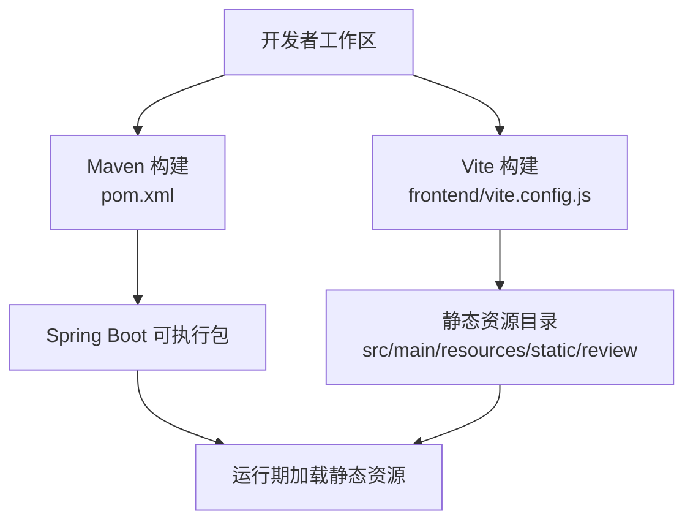
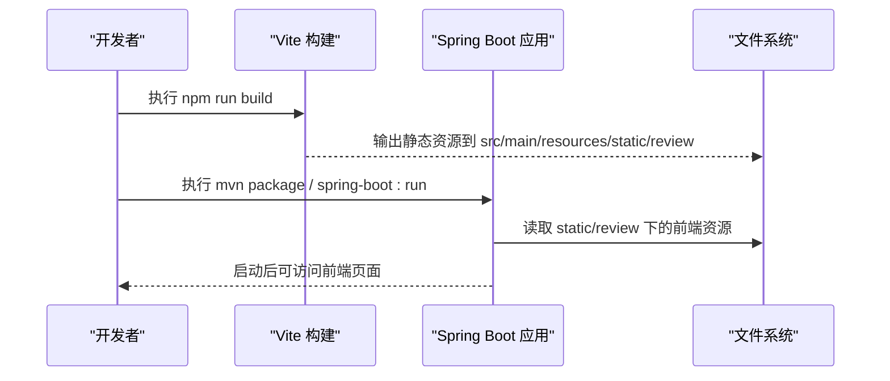
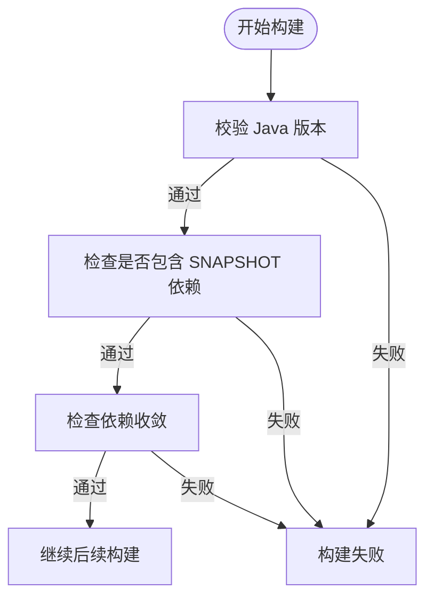
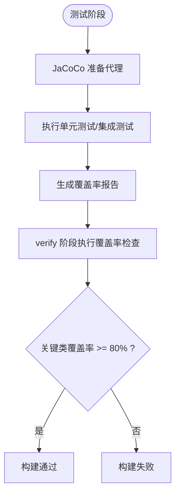
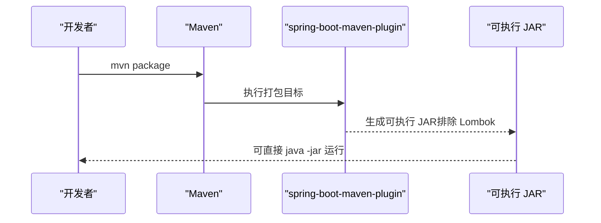
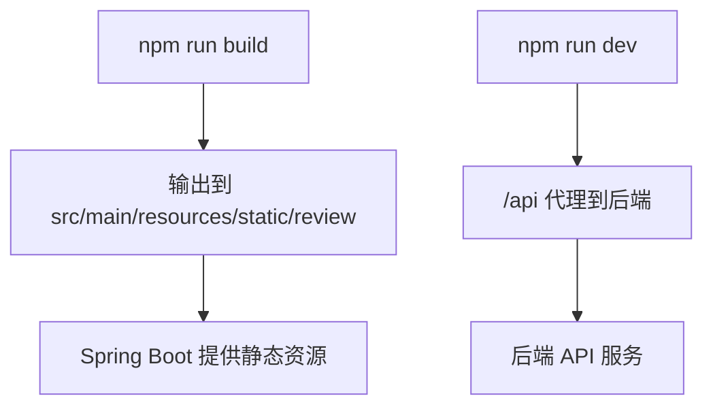
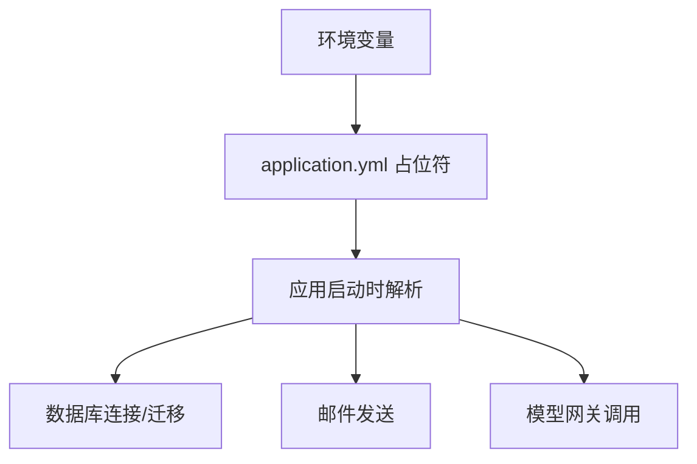
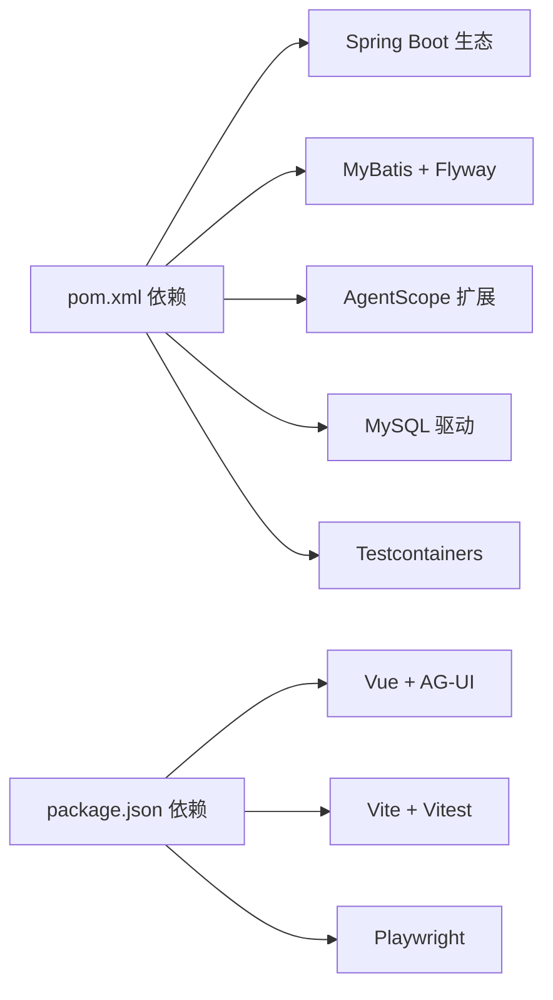

# 工程基线与构建配置

<cite>
**本文引用的文件**
- [pom.xml](file://pom.xml)
- [application.yml](file://src/main/resources/application.yml)
- [vite.config.js](file://frontend/vite.config.js)
- [package.json](file://frontend/package.json)
- [.gitignore](file://.gitignore)
- [AIREVIEW-PLAN-002-工程基线与AgentScope正式版验证.md](file://docs/AIREVIEW-PLAN-002-工程基线与AgentScope正式版验证.md)
</cite>

## 目录
1. [简介](#简介)
2. [项目结构](#项目结构)
3. [核心组件](#核心组件)
4. [架构总览](#架构总览)
5. [详细组件分析](#详细组件分析)
6. [依赖分析](#依赖分析)
7. [性能考虑](#性能考虑)
8. [故障排查指南](#故障排查指南)
9. [结论](#结论)
10. [附录](#附录)

## 简介
本文件聚焦于工程的构建基线：Maven 构建流程、enforcer 规则、JaCoCo 覆盖率门禁、Spring Boot 打包方式，以及前端 Vite 构建与 Spring Boot 静态资源的集成方式。内容基于仓库中的 POM、应用配置、前端构建脚本与工程基线计划文档整理而成，旨在帮助开发者在本地和 CI 环境中稳定复现构建产物并满足质量门禁。

## 项目结构
- 后端采用 Spring Boot 4.0.7 父 POM，Java 版本固定为 21，通过 Maven Enforcer 强制约束构建环境。
- 前端位于 frontend 目录，使用 Vite + Vue 构建，输出到 Spring Boot 的 static/review 目录，作为内置静态资源由 Spring MVC 提供。
- 数据库迁移使用 Flyway，默认关闭自动执行；运行时数据库为 MySQL 5.6+，迁移脚本避免 JSON 列以兼容旧版 MySQL。
- 构建产物与生成目录被 .gitignore 排除，确保仓库仅包含可重复构建的源码与必要资源。

图表来源
- [vite.config.js:7-22](file://frontend/vite.config.js#L7-L22)
- [pom.xml:123-228](file://pom.xml#L123-L228)

章节来源
- [pom.xml:1-122](file://pom.xml#L1-L122)
- [application.yml:1-175](file://src/main/resources/application.yml#L1-L175)
- [vite.config.js:1-28](file://frontend/vite.config.js#L1-L28)
- [package.json:1-25](file://frontend/package.json#L1-L25)
- [.gitignore:1-41](file://.gitignore#L1-L41)

## 核心组件
- Maven Enforcer：锁定 Java 版本区间、禁止 SNAPSHOT 依赖、强制依赖收敛，确保构建基线一致。
- JaCoCo：在测试阶段生成覆盖率报告，并在 verify 阶段对关键类集合执行覆盖率门禁（指令级最低 80%）。
- Spring Boot Maven Plugin：打包可执行 JAR，排除 Lombok 编译期注解处理器产物。
- Vite 前端构建：将前端产物输出至 Spring Boot 静态资源目录，便于统一发布与部署。
- 应用配置：application.yml 集中声明非敏感默认值，敏感信息通过环境变量注入，避免入库入仓。

章节来源
- [pom.xml:125-228](file://pom.xml#L125-L228)
- [application.yml:1-175](file://src/main/resources/application.yml#L1-L175)
- [vite.config.js:7-22](file://frontend/vite.config.js#L7-L22)

## 架构总览
下图展示从源码到可运行应用的构建与运行路径，包括前端构建产物如何进入 Spring Boot 静态资源，以及后端构建与打包过程。

图表来源
- [vite.config.js:18-22](file://frontend/vite.config.js#L18-L22)
- [pom.xml:217-228](file://pom.xml#L217-L228)

## 详细组件分析

### Maven Enforcer 规则
- 强制 Java 版本区间为 [21,22)，防止使用不兼容的 JDK。
- 要求所有依赖为 Release 版本，禁止引入 SNAPSHOT 依赖，提升构建稳定性。
- 启用 dependencyConvergence，确保同一依赖在不同模块中版本收敛一致。

图表来源
- [pom.xml:125-146](file://pom.xml#L125-L146)

章节来源
- [pom.xml:125-146](file://pom.xml#L125-L146)

### JaCoCo 覆盖率门禁
- prepare-agent 在测试前准备覆盖率采集。
- report 在 test 阶段生成覆盖率报告。
- check 在 verify 阶段对一组关键类执行覆盖率门禁，指令覆盖率不低于 80%。

图表来源
- [pom.xml:147-216](file://pom.xml#L147-L216)

章节来源
- [pom.xml:147-216](file://pom.xml#L147-L216)

### Spring Boot 打包
- 使用 spring-boot-maven-plugin 打包可执行 JAR。
- 排除 Lombok 依赖，避免将其打入最终制品。
- 结合 application.yml 的非敏感默认值与环境变量注入，实现安全部署。

图表来源
- [pom.xml:217-228](file://pom.xml#L217-L228)
- [application.yml:1-175](file://src/main/resources/application.yml#L1-L175)

章节来源
- [pom.xml:217-228](file://pom.xml#L217-L228)
- [application.yml:1-175](file://src/main/resources/application.yml#L1-L175)

### 前端构建集成
- Vite 构建输出目录设置为 ../src/main/resources/static/review，使前端资源成为 Spring Boot 静态资源。
- 开发服务器支持将 /api 请求代理到后端服务地址，便于前后端联调。
- package.json 定义了 dev/build/preview/test/test:e2e 等脚本，配合 Vitest 与 Playwright。

图表来源
- [vite.config.js:7-22](file://frontend/vite.config.js#L7-L22)
- [package.json:6-12](file://frontend/package.json#L6-L12)

章节来源
- [vite.config.js:1-28](file://frontend/vite.config.js#L1-L28)
- [package.json:1-25](file://frontend/package.json#L1-L25)

### 应用配置结构与密钥管理
- application.yml 中所有敏感项（如邮件授权码、数据库密码、模型网关密钥）均通过环境变量注入，不在代码或仓库中硬编码。
- 非敏感默认值保留在配置文件中，便于本地快速启动与调试。
- Flyway 默认关闭，避免在生产环境误执行迁移；MySQL 迁移脚本避免 JSON 列以兼容 5.6。

图表来源
- [application.yml:1-175](file://src/main/resources/application.yml#L1-L175)

章节来源
- [application.yml:1-175](file://src/main/resources/application.yml#L1-L175)

## 依赖分析
- 后端依赖集中在 pom.xml，包括 Spring Boot Starter、MyBatis、Actuator、Validation、Mail、AgentScope Harness/Extensions、MySQL 驱动、Flyway、Testcontainers 等。
- 前端依赖集中在 package.json，包括 Vue、Vue Router、AG-UI Core、Vite、Vitest、Playwright。
- 构建工具链通过 Maven Wrapper 管理，保证不同环境使用一致的 Maven 版本。

图表来源
- [pom.xml:33-121](file://pom.xml#L33-L121)
- [package.json:13-23](file://frontend/package.json#L13-L23)

章节来源
- [pom.xml:33-121](file://pom.xml#L33-L121)
- [package.json:13-23](file://frontend/package.json#L13-L23)

## 性能考虑
- 构建阶段：Enforcer 与 JaCoCo 会在 CI 中增加构建时间，但能显著提升质量与一致性。
- 运行阶段：application.yml 中日志滚动策略与 SSE 超时、心跳间隔等参数可根据部署环境调整，避免过大日志与长连接资源占用。
- 前端构建：生产构建关闭 sourcemap，减少产物体积；开发模式开启代理，便于联调。

## 故障排查指南
- 构建失败且提示 Java 版本不符：确认当前 JDK 在 [21,22) 区间内，并使用项目自带的 Maven Wrapper。
- 构建失败且提示 SNAPSHOT 依赖：检查依赖树，移除或替换为 Release 版本。
- 覆盖率门禁失败：定位未覆盖的关键类，补充单测或调整范围；确保测试用例充分覆盖入口控制器与服务层。
- 前端无法访问后端 API：检查开发模式下 VITE_API_TARGET 环境变量或 vite.config.js 中的代理目标是否正确。
- 应用启动时报缺少配置：根据 application.yml 中的占位符设置对应环境变量，尤其是数据库、邮件、模型网关相关项。

章节来源
- [pom.xml:125-228](file://pom.xml#L125-L228)
- [application.yml:1-175](file://src/main/resources/application.yml#L1-L175)
- [vite.config.js:10-16](file://frontend/vite.config.js#L10-L16)

## 结论
本项目通过 Maven Enforcer 锁定构建基线，使用 JaCoCo 实施关键类覆盖率门禁，借助 Spring Boot Maven Plugin 打包可执行应用，并通过 Vite 将前端构建产物集成到 Spring Boot 静态资源目录。配合 application.yml 的环境变量注入机制，实现了安全、可重复、可审计的工程构建与发布流程。建议在 CI 中复用相同的构建命令与门禁规则，确保交付质量一致。

## 附录
- 工程基线与 AgentScope 正式版验证计划记录了依赖锁定、配置契约、兼容性测试与 Docker CI 门禁等要点，可作为构建与验证的权威参考。

章节来源
- [AIREVIEW-PLAN-002-工程基线与AgentScope正式版验证.md:17-28](file://docs/AIREVIEW-PLAN-002-工程基线与AgentScope正式版验证.md#L17-L28)
- [AIREVIEW-PLAN-002-工程基线与AgentScope正式版验证.md:42-46](file://docs/AIREVIEW-PLAN-002-工程基线与AgentScope正式版验证.md#L42-L46)
- [AIREVIEW-PLAN-002-工程基线与AgentScope正式版验证.md:95-101](file://docs/AIREVIEW-PLAN-002-工程基线与AgentScope正式版验证.md#L95-L101)
