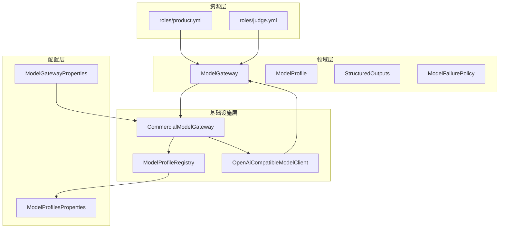
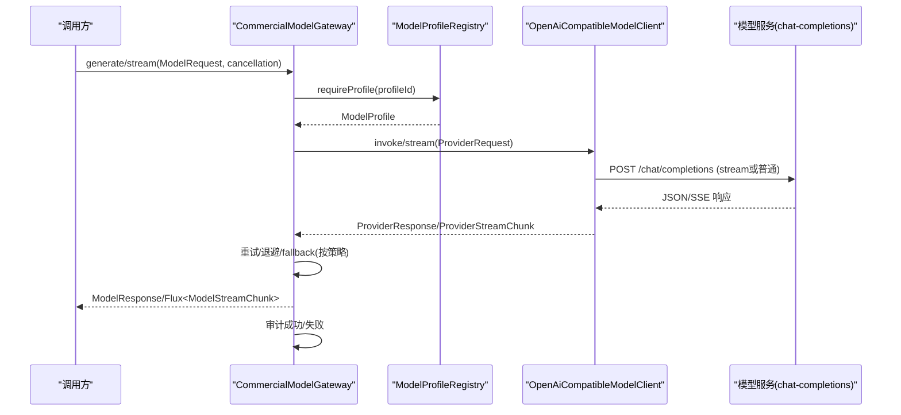
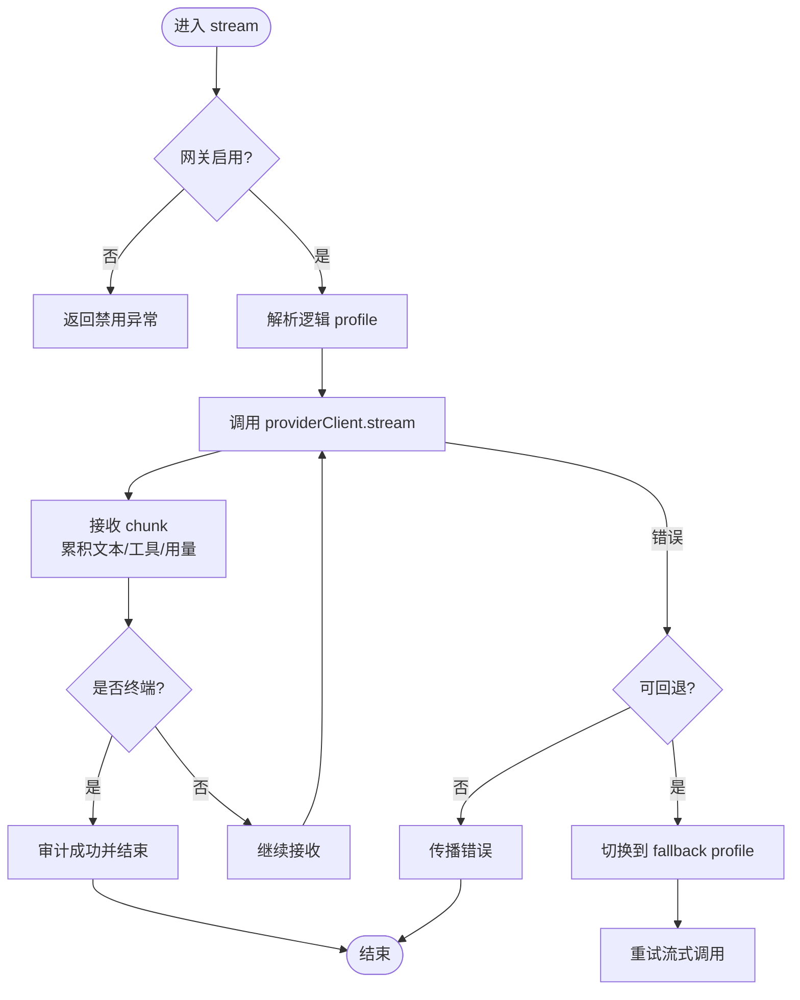
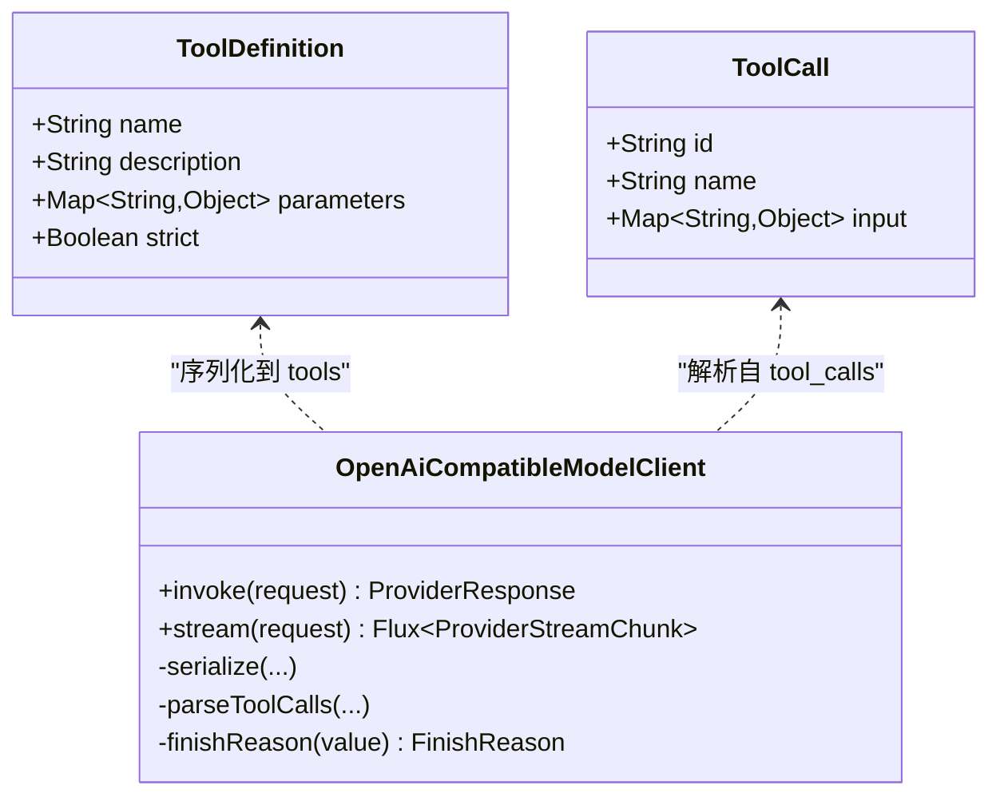
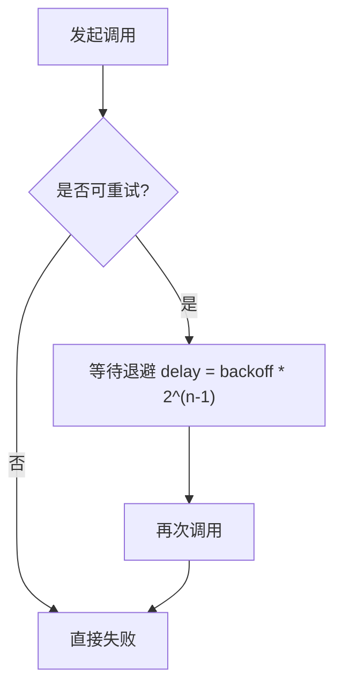
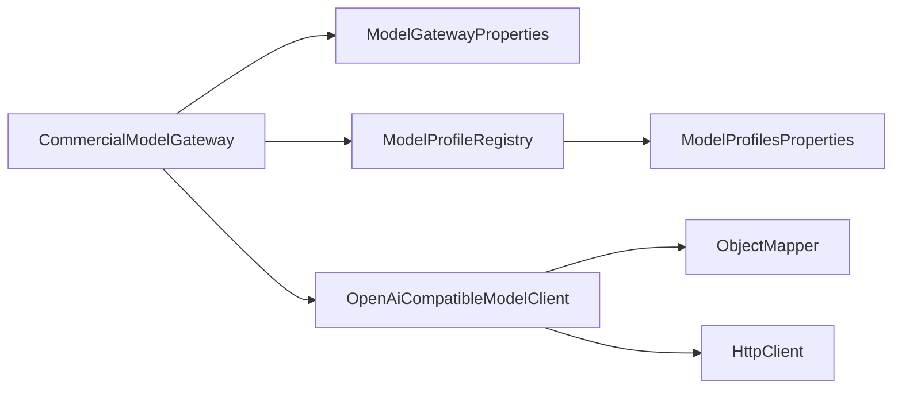
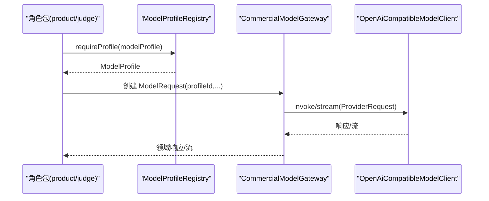

# 模型网关与角色配置

<cite>
**本文引用的文件**
- [ModelGateway.java](file://src/main/java/ai/cc/chongming/review/domain/gateway/ModelGateway.java)
- [ModelProfile.java](file://src/main/java/ai/cc/chongming/review/domain/gateway/ModelProfile.java)
- [ModelFailurePolicy.java](file://src/main/java/ai/cc/chongming/review/domain/gateway/ModelFailurePolicy.java)
- [StructuredOutputs.java](file://src/main/java/ai/cc/chongming/review/domain/gateway/StructuredOutputs.java)
- [CommercialModelGateway.java](file://src/main/java/ai/cc/chongming/review/infrastructure/model/CommercialModelGateway.java)
- [OpenAiCompatibleModelClient.java](file://src/main/java/ai/cc/chongming/review/infrastructure/model/OpenAiCompatibleModelClient.java)
- [ModelProfileRegistry.java](file://src/main/java/ai/cc/chongming/review/infrastructure/model/ModelProfileRegistry.java)
- [ModelProfilesProperties.java](file://src/main/java/ai/cc/chongming/review/config/ModelProfilesProperties.java)
- [ModelGatewayProperties.java](file://src/main/java/ai/cc/chongming/review/config/ModelGatewayProperties.java)
- [product.yml](file://src/main/resources/roles/product.yml)
- [judge.yml](file://src/main/resources/roles/judge.yml)
- [AIREVIEW-PLAN-007-模型网关与角色包.md](file://docs/AIREVIEW-PLAN-007-模型网关与角色包.md)
</cite>

## 目录
1. [简介](#简介)
2. [项目结构](#项目结构)
3. [核心组件](#核心组件)
4. [架构总览](#架构总览)
5. [详细组件分析](#详细组件分析)
6. [依赖关系分析](#依赖关系分析)
7. [性能与重试特性](#性能与重试特性)
8. [故障处理与降级策略](#故障处理与降级策略)
9. [角色 Profile 注册与绑定](#角色-profile-注册与绑定)
10. [常见问题排查](#常见问题排查)
11. [结论](#结论)

## 简介
本文件聚焦 OpenAI 兼容模型网关的调用方式、流式输出、Tool Calls、重试与降级策略，以及角色 profile 的注册与绑定机制。系统通过厂商无关的领域接口抽象模型调用，使用商业模型网关实现重试、超时、取消、审计与 fallback；底层 HTTP 客户端适配 OpenAI-compatible/DashScope-compatible 的 chat-completions 协议，统一解析文本、工具调用、Token 用量与完成原因。角色行为由 YAML 角色包描述，并通过逻辑 profile 引用具体模型参数，避免在业务层硬编码供应商细节。

## 项目结构
围绕模型网关与角色配置的关键代码分布在以下层次：
- 领域层：定义厂商无关的 ModelGateway、ModelProfile、结构化输出契约与失败处置策略。
- 基础设施层：实现 CommercialModelGateway（路由、重试、fallback、审计）和 OpenAiCompatibleModelClient（HTTP 请求、SSE 流、Tool Calls 解析）。
- 配置层：集中管理网关开关、Base URL、API Key、日志开关与逻辑 profile 定义。
- 资源层：以 roles/*.yml 声明角色职责、上下文、允许工具、输出类型与绑定的逻辑 profile。

图表来源
- [CommercialModelGateway.java:32-58](file://src/main/java/ai/cc/chongming/review/infrastructure/model/CommercialModelGateway.java#L32-L58)
- [OpenAiCompatibleModelClient.java:45-92](file://src/main/java/ai/cc/chongming/review/infrastructure/model/OpenAiCompatibleModelClient.java#L45-L92)
- [ModelProfileRegistry.java:21-55](file://src/main/java/ai/cc/chongming/review/infrastructure/model/ModelProfileRegistry.java#L21-L55)
- [ModelGateway.java:23-41](file://src/main/java/ai/cc/chongming/review/domain/gateway/ModelGateway.java#L23-L41)

章节来源
- [ModelGateway.java:23-227](file://src/main/java/ai/cc/chongming/review/domain/gateway/ModelGateway.java#L23-L227)
- [CommercialModelGateway.java:32-360](file://src/main/java/ai/cc/chongming/review/infrastructure/model/CommercialModelGateway.java#L32-L360)
- [OpenAiCompatibleModelClient.java:45-443](file://src/main/java/ai/cc/chongming/review/infrastructure/model/OpenAiCompatibleModelClient.java#L45-L443)
- [ModelProfileRegistry.java:21-99](file://src/main/java/ai/cc/chongming/review/infrastructure/model/ModelProfileRegistry.java#L21-L99)
- [ModelProfilesProperties.java:19-66](file://src/main/java/ai/cc/chongming/review/config/ModelProfilesProperties.java#L19-L66)
- [ModelGatewayProperties.java:14-35](file://src/main/java/ai/cc/chongming/review/config/ModelGatewayProperties.java#L14-L35)
- [product.yml:1-45](file://src/main/resources/roles/product.yml#L1-L45)
- [judge.yml:1-21](file://src/main/resources/roles/judge.yml#L1-L21)

## 核心组件
- ModelGateway：厂商无关的模型调用边界，提供同步 generate 与默认基于同步结果的 stream 兼容路径；定义请求、响应、流式块、工具定义与调用、用法统计、完成原因等不可变记录。
- CommercialModelGateway：应用逻辑 profile 路由、指数退避重试、可配置 fallback、协作取消、审计记录，并将底层 ProviderResponse 归一化为领域 ModelResponse/ModelStreamChunk。
- OpenAiCompatibleModelClient：将领域请求序列化为 OpenAI-compatible/DashScope-compatible 的 chat-completions 请求；支持同步调用与 SSE 流式；解析 Tool Calls、usage、finish_reason；对网络错误、超时、429 等映射为稳定的异常码。
- ModelProfileRegistry：从配置构建不可变的逻辑 profile，校验重复与 fallback 指向，提供 requireProfile 查询。
- ModelProfilesProperties / ModelGatewayProperties：集中配置逻辑 profile 与网关开关、Base URL、API Key、是否记录对话等。
- StructuredOutputs：定义 Plan、RoleAssessment、JudgeDecision 等结构化输出契约，用于后续领域层再校验。
- ModelFailurePolicy：根据角色类型与失败码决定最小安全的工作流处置，如部分完成、人工介入、确定性 Gate 草案等。

章节来源
- [ModelGateway.java:23-227](file://src/main/java/ai/cc/chongming/review/domain/gateway/ModelGateway.java#L23-L227)
- [CommercialModelGateway.java:54-172](file://src/main/java/ai/cc/chongming/review/infrastructure/model/CommercialModelGateway.java#L54-L172)
- [OpenAiCompatibleModelClient.java:63-240](file://src/main/java/ai/cc/chongming/review/infrastructure/model/OpenAiCompatibleModelClient.java#L63-L240)
- [ModelProfileRegistry.java:30-99](file://src/main/java/ai/cc/chongming/review/infrastructure/model/ModelProfileRegistry.java#L30-L99)
- [ModelProfilesProperties.java:19-66](file://src/main/java/ai/cc/chongming/review/config/ModelProfilesProperties.java#L19-L66)
- [ModelGatewayProperties.java:14-35](file://src/main/java/ai/cc/chongming/review/config/ModelGatewayProperties.java#L14-L35)
- [StructuredOutputs.java:15-135](file://src/main/java/ai/cc/chongming/review/domain/gateway/StructuredOutputs.java#L15-L135)
- [ModelFailurePolicy.java:12-54](file://src/main/java/ai/cc/chongming/review/domain/gateway/ModelFailurePolicy.java#L12-L54)

## 架构总览
下图展示一次模型调用的端到端流程，包括同步与流式两条路径、重试与 fallback、审计与归一化。

图表来源
- [CommercialModelGateway.java:54-172](file://src/main/java/ai/cc/chongming/review/infrastructure/model/CommercialModelGateway.java#L54-L172)
- [OpenAiCompatibleModelClient.java:63-240](file://src/main/java/ai/cc/chongming/review/infrastructure/model/OpenAiCompatibleModelClient.java#L63-L240)
- [ModelProfileRegistry.java:43-55](file://src/main/java/ai/cc/chongming/review/infrastructure/model/ModelProfileRegistry.java#L43-L55)

## 详细组件分析

### 同步调用与流式调用
- 同步调用：CommercialModelGateway.generate 将请求交由底层 providerClient.invoke，封装为领域 ModelResponse，包含 responseId、modelName、publicText、thinkingText、usage、finishReason、latency、attempts、toolCalls、traceId。
- 流式调用：CommercialModelGateway.stream 委托 providerClient.stream，逐条接收 ProviderStreamChunk，合并 publicTextDelta、累积 toolCalls 与 usage，并在终端 chunk 时生成最终 ModelResponse 进行审计。若未收到终端 chunk，会抛出无效响应异常。
- 兼容性：ModelGateway 默认 stream 实现将同步结果包装为单条 terminal 流，保证无原生流能力的提供者仍可被上层消费。

图表来源
- [CommercialModelGateway.java:114-172](file://src/main/java/ai/cc/chongming/review/infrastructure/model/CommercialModelGateway.java#L114-L172)
- [CommercialModelGateway.java:174-208](file://src/main/java/ai/cc/chongming/review/infrastructure/model/CommercialModelGateway.java#L174-L208)
- [CommercialModelGateway.java:282-358](file://src/main/java/ai/cc/chongming/review/infrastructure/model/CommercialModelGateway.java#L282-L358)

章节来源
- [ModelGateway.java:23-41](file://src/main/java/ai/cc/chongming/review/domain/gateway/ModelGateway.java#L23-L41)
- [CommercialModelGateway.java:54-172](file://src/main/java/ai/cc/chongming/review/infrastructure/model/CommercialModelGateway.java#L54-L172)
- [CommercialModelGateway.java:282-358](file://src/main/java/ai/cc/chongming/review/infrastructure/model/CommercialModelGateway.java#L282-L358)

### Tool Calls 支持与解析
- 请求侧：OpenAiCompatibleModelClient.serialize 将 ModelGateway.ToolDefinition 转换为 function 类型的 tools 数组，支持 name、description、parameters、strict。
- 响应侧：
  - 同步响应：解析 choices[0].message.tool_calls，校验 id/name 唯一且非空，arguments 必须为 JSON 对象，转为 Map<String,Object>。
  - 流式响应：SSE 中累积 delta.tool_calls，按 index 聚合 id、function.name、arguments 片段，DONE 时组装完整 ToolCall 列表并校验。
- 完成原因：finish_reason 映射到 STOP、LENGTH、TOOL_CALL、CONTENT_FILTER、UNKNOWN。

图表来源
- [ModelGateway.java:205-219](file://src/main/java/ai/cc/chongming/review/domain/gateway/ModelGateway.java#L205-L219)
- [OpenAiCompatibleModelClient.java:99-128](file://src/main/java/ai/cc/chongming/review/infrastructure/model/OpenAiCompatibleModelClient.java#L99-L128)
- [OpenAiCompatibleModelClient.java:258-290](file://src/main/java/ai/cc/chongming/review/infrastructure/model/OpenAiCompatibleModelClient.java#L258-L290)
- [OpenAiCompatibleModelClient.java:378-419](file://src/main/java/ai/cc/chongming/review/infrastructure/model/OpenAiCompatibleModelClient.java#L378-L419)

章节来源
- [OpenAiCompatibleModelClient.java:99-128](file://src/main/java/ai/cc/chongming/review/infrastructure/model/OpenAiCompatibleModelClient.java#L99-L128)
- [OpenAiCompatibleModelClient.java:258-290](file://src/main/java/ai/cc/chongming/review/infrastructure/model/OpenAiCompatibleModelClient.java#L258-L290)
- [OpenAiCompatibleModelClient.java:378-419](file://src/main/java/ai/cc/chongming/review/infrastructure/model/OpenAiCompatibleModelClient.java#L378-L419)

### 重试策略与回退
- 重试范围：仅针对瞬时失败（超时、限流、网络错误、Provider 错误），业务拒绝（4xx）不重试。
- 指数退避：每次重试延迟按 initialBackoff 乘以 2^(completedAttempts-1)，最大重试次数受 ModelProfile.RetryPolicy.maxRetries 限制（最多两次）。
- 流式重试：若已发出任何数据则不再重试；否则按相同策略重试。
- 回退策略：当主 profile 失败且满足 shouldFallback（存在不同 fallbackProfileId 且失败可重试）时，切换至 fallback profile 再尝试一次；切换前后均记录审计。
- 取消与中断：IntakeCancellation 在任何等待或调用点检查，取消即抛取消异常。

图表来源
- [CommercialModelGateway.java:210-247](file://src/main/java/ai/cc/chongming/review/infrastructure/model/CommercialModelGateway.java#L210-L247)
- [CommercialModelGateway.java:249-267](file://src/main/java/ai/cc/chongming/review/infrastructure/model/CommercialModelGateway.java#L249-L267)
- [ModelProfile.java:69-84](file://src/main/java/ai/cc/chongming/review/domain/gateway/ModelProfile.java#L69-L84)

章节来源
- [CommercialModelGateway.java:210-247](file://src/main/java/ai/cc/chongming/review/infrastructure/model/CommercialModelGateway.java#L210-L247)
- [CommercialModelGateway.java:249-267](file://src/main/java/ai/cc/chongming/review/infrastructure/model/CommercialModelGateway.java#L249-L267)
- [ModelProfile.java:69-84](file://src/main/java/ai/cc/chongming/review/domain/gateway/ModelProfile.java#L69-L84)

### 结构化输出与领域校验
- 结构化输出契约：PlanOutput、RoleAssessmentOutput、JudgeDecisionOutput 等 record 约束字段必填、枚举合法、UUID 格式正确。
- 解析失败：Decoder 拒绝未知字段与尾随内容，最多调用一次修复回调；仍失败则返回可审计错误，不在自由文本中猜测业务字段。
- 领域再校验：结构化输出在进入领域协议前仍需经 ReviewProtocolGuard 等校验，确保状态、角色与动作合法性。

章节来源
- [StructuredOutputs.java:15-135](file://src/main/java/ai/cc/chongming/review/domain/gateway/StructuredOutputs.java#L15-L135)
- [AIREVIEW-PLAN-007-模型网关与角色包.md:27-31](file://docs/AIREVIEW-PLAN-007-模型网关与角色包.md#L27-L31)

## 依赖关系分析
- CommercialModelGateway 依赖：
  - ModelGatewayProperties：控制网关开关、Base URL、API Key、是否记录对话。
  - ModelProfileRegistry：解析逻辑 profile，校验重复与 fallback。
  - ModelProviderClient（OpenAiCompatibleModelClient）：实际 HTTP 调用与 SSE 流。
  - ModelCallAuditService：记录成功/失败、profile、attempt、failureCode。
- OpenAiCompatibleModelClient 依赖：
  - ObjectMapper：JSON 序列化/反序列化。
  - HttpClient：发送请求，设置超时、Authorization、Accept 头。
- ModelProfileRegistry 依赖：
  - ModelProfilesProperties：读取 profiles 映射，构造不可变 ModelProfile。
- RolePack YAML 通过 modelProfile 字段引用逻辑 profile，从而间接绑定模型参数。

图表来源
- [CommercialModelGateway.java:37-52](file://src/main/java/ai/cc/chongming/review/infrastructure/model/CommercialModelGateway.java#L37-L52)
- [OpenAiCompatibleModelClient.java:48-61](file://src/main/java/ai/cc/chongming/review/infrastructure/model/OpenAiCompatibleModelClient.java#L48-L61)
- [ModelProfileRegistry.java:28-41](file://src/main/java/ai/cc/chongming/review/infrastructure/model/ModelProfileRegistry.java#L28-L41)

章节来源
- [CommercialModelGateway.java:37-52](file://src/main/java/ai/cc/chongming/review/infrastructure/model/CommercialModelGateway.java#L37-L52)
- [OpenAiCompatibleModelClient.java:48-61](file://src/main/java/ai/cc/chongming/review/infrastructure/model/OpenAiCompatibleModelClient.java#L48-L61)
- [ModelProfileRegistry.java:28-41](file://src/main/java/ai/cc/chongming/review/infrastructure/model/ModelProfileRegistry.java#L28-L41)

## 性能与重试特性
- 超时控制：每个请求/流使用 profile.timeout() 作为超时；流式调用额外通过 timeout() 包裹。
- Token 用量：usage 来自 provider 响应，包含 prompt_tokens、completion_tokens、total_tokens。
- 并发与调度：调用与流式订阅在 boundedElastic 调度器上执行，避免阻塞事件循环。
- 重试与退避：指数退避，最大重试次数受限，避免雪崩；流式已发出数据后不再重试，保障一致性。
- 日志与审计：可配置 logConversation 仅在本地调试开启；审计记录不暴露密钥，保留 traceId 关联。

章节来源
- [OpenAiCompatibleModelClient.java:71-92](file://src/main/java/ai/cc/chongming/review/infrastructure/model/OpenAiCompatibleModelClient.java#L71-L92)
- [OpenAiCompatibleModelClient.java:183-191](file://src/main/java/ai/cc/chongming/review/infrastructure/model/OpenAiCompatibleModelClient.java#L183-L191)
- [CommercialModelGateway.java:210-247](file://src/main/java/ai/cc/chongming/review/infrastructure/model/CommercialModelGateway.java#L210-L247)
- [ModelGatewayProperties.java:14-35](file://src/main/java/ai/cc/chongming/review/config/ModelGatewayProperties.java#L14-L35)

## 故障处理与降级策略
- 异常分类：MODEL_GATEWAY_DISABLED、MODEL_PROFILE_NOT_FOUND、MODEL_CANCELLED、MODEL_CALL_TIMEOUT、MODEL_RATE_LIMITED、MODEL_REQUEST_REJECTED、MODEL_NETWORK_ERROR、MODEL_PROVIDER_ERROR、MODEL_RESPONSE_INVALID。
- 重试判定：仅超时、限流、网络错误、Provider 错误可重试；4xx 拒绝不重试。
- 降级策略：
  - 单个角色失败：根据角色类型决定 PARTIAL_COMPLETION、HUMAN_REQUIRED、DETERMINISTIC_GATE_DRAFT。
  - 全部模型不可用：返回证据与规则结果，生成 HUMAN_REQUIRED_EVIDENCE_ONLY。
  - 回退：主 profile 失败且可重试时，切换至 fallback profile 再尝试一次。
- 流式完整性：要求终端 chunk 与 DONE；禁止 DONE 后继续数据；responseId 不得变化。

章节来源
- [ModelFailurePolicy.java:21-54](file://src/main/java/ai/cc/chongming/review/domain/gateway/ModelFailurePolicy.java#L21-L54)
- [CommercialModelGateway.java:236-247](file://src/main/java/ai/cc/chongming/review/infrastructure/model/CommercialModelGateway.java#L236-L247)
- [OpenAiCompatibleModelClient.java:160-174](file://src/main/java/ai/cc/chongming/review/infrastructure/model/OpenAiCompatibleModelClient.java#L160-L174)
- [OpenAiCompatibleModelClient.java:315-332](file://src/main/java/ai/cc/chongming/review/infrastructure/model/OpenAiCompatibleModelClient.java#L315-L332)

## 角色 Profile 注册与绑定
- 角色包 YAML：
  - product.yml：定义 PRODUCT 角色、激活规则、上下文选择器、检查清单、允许工具、输出类型 ROLE_ASSESSMENT，并绑定逻辑 profile role-reviewer。
  - judge.yml：定义 JUDGE 角色、激活条件、上下文选择器、允许工具、输出类型 JUDGE_DECISION，并绑定逻辑 profile judge。
- 逻辑 profile：
  - ModelProfilesProperties.profiles 定义逻辑 profile 的 provider、modelName、temperature、timeout、maxTokens、retry、fallbackProfile、streamEnabled。
  - ModelProfileRegistry 构建不可变 ModelProfile，校验重复与 fallback 指向，提供 requireProfile。
- 绑定过程：
  - 角色包中的 modelProfile 字段指定逻辑 profile ID。
  - 运行时通过 ModelProfileRegistry.requireProfile(profileId) 获取具体模型参数。
  - CommercialModelGateway 使用该 profile 进行调用、重试与 fallback。

图表来源
- [product.yml:41-45](file://src/main/resources/roles/product.yml#L41-L45)
- [judge.yml:17-21](file://src/main/resources/roles/judge.yml#L17-L21)
- [ModelProfileRegistry.java:43-55](file://src/main/java/ai/cc/chongming/review/infrastructure/model/ModelProfileRegistry.java#L43-L55)
- [CommercialModelGateway.java:61-112](file://src/main/java/ai/cc/chongming/review/infrastructure/model/CommercialModelGateway.java#L61-L112)

章节来源
- [product.yml:1-45](file://src/main/resources/roles/product.yml#L1-L45)
- [judge.yml:1-21](file://src/main/resources/roles/judge.yml#L1-L21)
- [ModelProfilesProperties.java:19-66](file://src/main/java/ai/cc/chongming/review/config/ModelProfilesProperties.java#L19-L66)
- [ModelProfileRegistry.java:30-99](file://src/main/java/ai/cc/chongming/review/infrastructure/model/ModelProfileRegistry.java#L30-L99)

## 常见问题排查
- 网关未启用或未配置：检查 review.model-gateway.enabled、baseUrl、apiKey；未配置时将返回禁用异常。
- 找不到逻辑 profile：确认 roles/*.yml 中的 modelProfile 已在 ModelProfilesProperties.profiles 中定义。
- 流式无终端 chunk：检查 SSE 是否发送 [DONE]，以及是否有非法数据在 DONE 之后。
- Tool Calls 解析失败：检查 tool_calls 的 id/name 是否唯一且非空，arguments 是否为合法 JSON 对象。
- 429 限流：触发重试与退避；若仍失败且可回退，将尝试 fallback profile。
- 取消/中断：检查 IntakeCancellation 是否在长时间调用中被设置；取消会立即抛出取消异常。

章节来源
- [ModelGatewayProperties.java:23-35](file://src/main/java/ai/cc/chongming/review/config/ModelGatewayProperties.java#L23-L35)
- [ModelProfileRegistry.java:49-55](file://src/main/java/ai/cc/chongming/review/infrastructure/model/ModelProfileRegistry.java#L49-L55)
- [OpenAiCompatibleModelClient.java:315-332](file://src/main/java/ai/cc/chongming/review/infrastructure/model/OpenAiCompatibleModelClient.java#L315-L332)
- [OpenAiCompatibleModelClient.java:258-290](file://src/main/java/ai/cc/chongming/review/infrastructure/model/OpenAiCompatibleModelClient.java#L258-L290)
- [CommercialModelGateway.java:236-267](file://src/main/java/ai/cc/chongming/review/infrastructure/model/CommercialModelGateway.java#L236-L267)

## 结论
该模型网关通过领域抽象屏蔽供应商差异，以逻辑 profile 解耦角色与具体模型参数，借助 CommercialModelGateway 实现稳健的重试、超时、取消、审计与 fallback；OpenAiCompatibleModelClient 统一处理 OpenAI-compatible/DashScope-compatible 的请求与 SSE 流，并准确解析 Tool Calls、usage 与 finish_reason。角色包 YAML 明确职责、上下文、工具与输出类型，并通过 modelProfile 绑定逻辑 profile，形成清晰、可测试、可扩展的模型调用体系。
