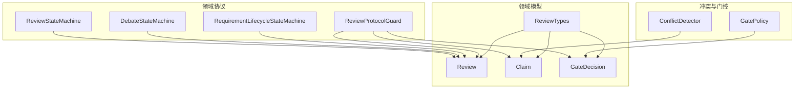
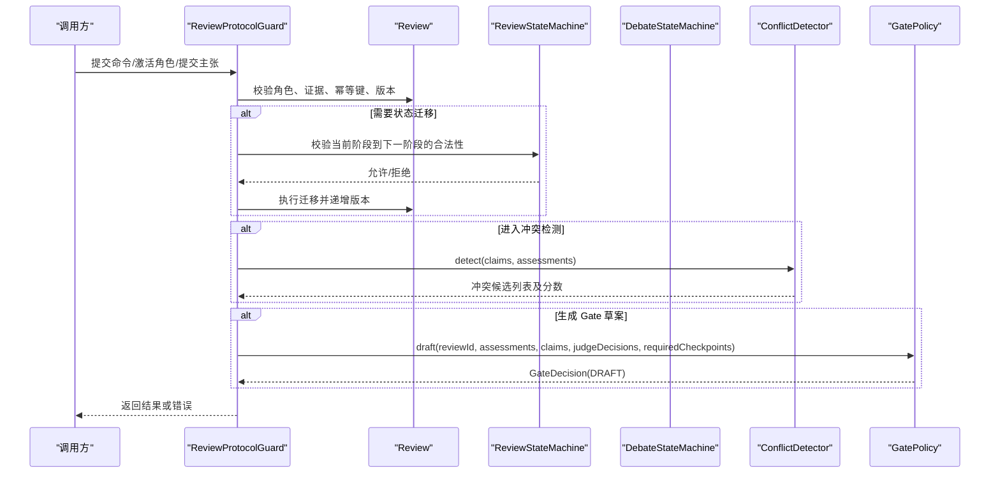
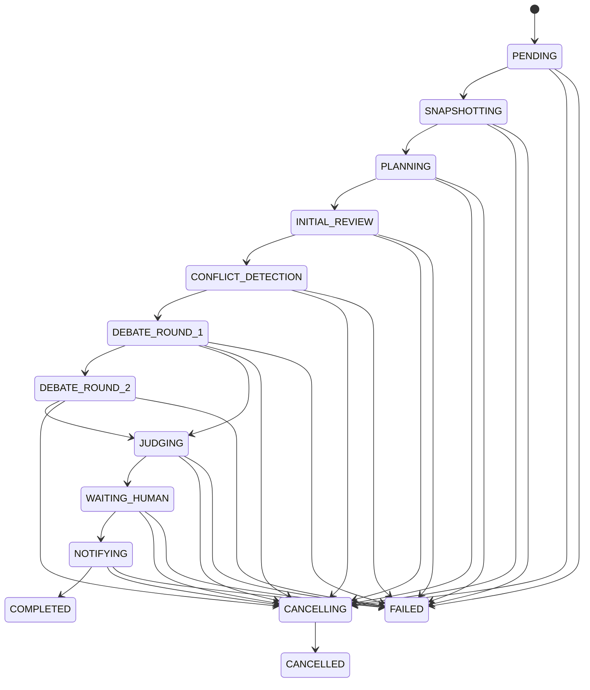
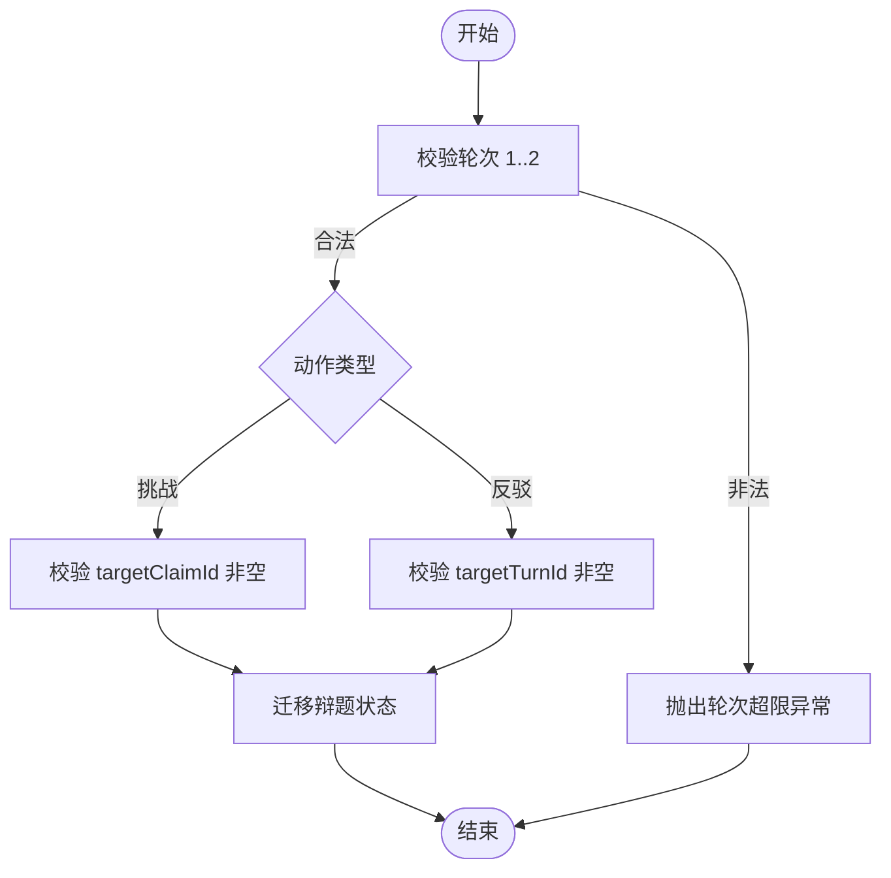
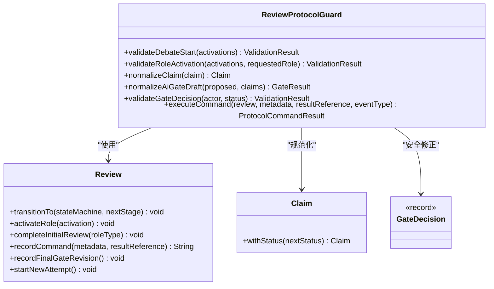
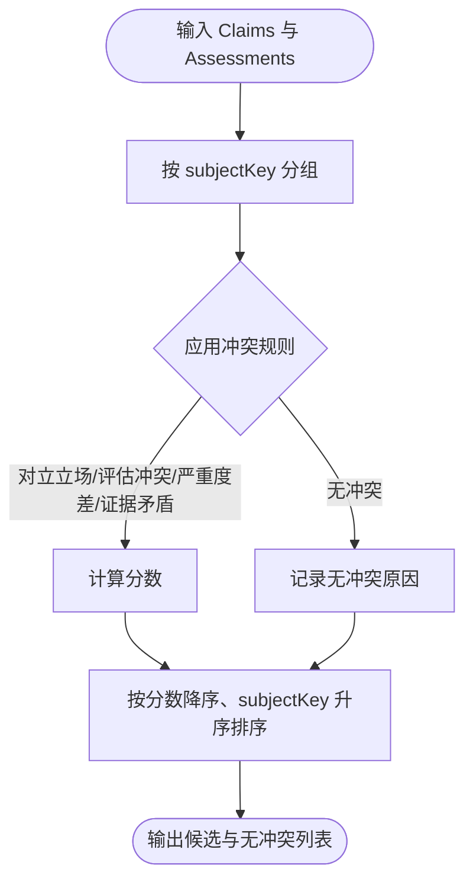
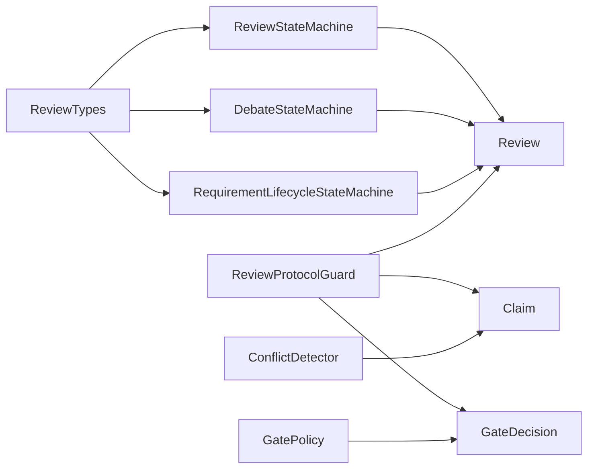

# 评审协议与状态机

<cite>
**本文引用的文件**
- [ReviewStateMachine.java](file://src/main/java/ai/cc/chongming/review/domain/protocol/ReviewStateMachine.java)
- [DebateStateMachine.java](file://src/main/java/ai/cc/chongming/review/domain/protocol/DebateStateMachine.java)
- [RequirementLifecycleStateMachine.java](file://src/main/java/ai/cc/chongming/review/domain/protocol/RequirementLifecycleStateMachine.java)
- [ReviewProtocolGuard.java](file://src/main/java/ai/cc/chongming/review/domain/protocol/ReviewProtocolGuard.java)
- [ReviewTypes.java](file://src/main/java/ai/cc/chongming/review/domain/model/ReviewTypes.java)
- [Review.java](file://src/main/java/ai/cc/chongming/review/domain/model/Review.java)
- [Claim.java](file://src/main/java/ai/cc/chongming/review/domain/model/Claim.java)
- [GateDecision.java](file://src/main/java/ai/cc/chongming/review/domain/model/GateDecision.java)
- [ConflictDetector.java](file://src/main/java/ai/cc/chongming/review/domain/debate/ConflictDetector.java)
- [GatePolicy.java](file://src/main/java/ai/cc/chongming/review/domain/gate/GatePolicy.java)
- [ReviewProtocolGuardTests.java](file://src/test/java/ai/cc/chongming/review/domain/ReviewProtocolGuardTests.java)
- [ConflictDetectorTests.java](file://src/test/java/ai/cc/chongming/review/debate/ConflictDetectorTests.java)
</cite>

## 目录
1. [引言](#引言)
2. [项目结构定位](#项目结构定位)
3. [核心组件总览](#核心组件总览)
4. [架构概览](#架构概览)
5. [详细组件分析](#详细组件分析)
6. [依赖关系分析](#依赖关系分析)
7. [性能与可观测性要点](#性能与可观测性要点)
8. [故障排查指南](#故障排查指南)
9. [结论](#结论)

## 引言
本文件聚焦 Review 聚合根的状态机、协议守卫、类型化领域对象（Claim、DebateTopic、Judge、Gate）以及冲突检测机制。目标是让读者理解：
- Review 生命周期如何被严格约束；
- 辩论回合与辩题状态如何受控推进；
- 角色激活、证据与 Gate 决策的协议边界；
- 冲突如何在进入模型推理前被确定性召回并排序；
- 最终 Gate 草案如何保守地收敛到人类确认或自动通过。

## 项目结构定位
与本文目标直接相关的代码集中在 domain 层：
- protocol：状态机与协议守卫，定义 Review、Debate、Requirement 的生命周期与命令合法性；
- model：类型化领域值对象与聚合根，如 Review、Claim、GateDecision、ReviewTypes；
- debate：冲突检测器，基于 Claim 与 Assessment 结论进行确定性冲突召回；
- gate：Gate 策略，产出保守的 AI Gate 草案，不生成最终决定。

图表来源
- [ReviewStateMachine.java:19-58](file://src/main/java/ai/cc/chongming/review/domain/protocol/ReviewStateMachine.java#L19-L58)
- [DebateStateMachine.java:25-119](file://src/main/java/ai/cc/chongming/review/domain/protocol/DebateStateMachine.java#L25-L119)
- [RequirementLifecycleStateMachine.java:18-51](file://src/main/java/ai/cc/chongming/review/domain/protocol/RequirementLifecycleStateMachine.java#L18-L51)
- [ReviewProtocolGuard.java:18-87](file://src/main/java/ai/cc/chongming/review/domain/protocol/ReviewProtocolGuard.java#L18-L87)
- [Review.java:19-150](file://src/main/java/ai/cc/chongming/review/domain/model/Review.java#L19-L150)
- [ReviewTypes.java:66-377](file://src/main/java/ai/cc/chongming/review/domain/model/ReviewTypes.java#L66-L377)
- [Claim.java:13-62](file://src/main/java/ai/cc/chongming/review/domain/model/Claim.java#L13-L62)
- [GateDecision.java:13-31](file://src/main/java/ai/cc/chongming/review/domain/model/GateDecision.java#L13-L31)
- [ConflictDetector.java:26-203](file://src/main/java/ai/cc/chongming/review/domain/debate/ConflictDetector.java#L26-L203)
- [GatePolicy.java:30-120](file://src/main/java/ai/cc/chongming/review/domain/gate/GatePolicy.java#L30-L120)

章节来源
- [ReviewStateMachine.java:19-58](file://src/main/java/ai/cc/chongming/review/domain/protocol/ReviewStateMachine.java#L19-L58)
- [DebateStateMachine.java:25-119](file://src/main/java/ai/cc/chongming/review/domain/protocol/DebateStateMachine.java#L25-L119)
- [RequirementLifecycleStateMachine.java:18-51](file://src/main/java/ai/cc/chongming/review/domain/protocol/RequirementLifecycleStateMachine.java#L18-L51)
- [ReviewProtocolGuard.java:18-87](file://src/main/java/ai/cc/chongming/review/domain/protocol/ReviewProtocolGuard.java#L18-L87)
- [Review.java:19-150](file://src/main/java/ai/cc/chongming/review/domain/model/Review.java#L19-L150)
- [ReviewTypes.java:66-377](file://src/main/java/ai/cc/chongming/review/domain/model/ReviewTypes.java#L66-L377)
- [Claim.java:13-62](file://src/main/java/ai/cc/chongming/review/domain/model/Claim.java#L13-L62)
- [GateDecision.java:13-31](file://src/main/java/ai/cc/chongming/review/domain/model/GateDecision.java#L13-L31)
- [ConflictDetector.java:26-203](file://src/main/java/ai/cc/chongming/review/domain/debate/ConflictDetector.java#L26-L203)
- [GatePolicy.java:30-120](file://src/main/java/ai/cc/chongming/review/domain/gate/GatePolicy.java#L30-L120)

## 核心组件总览
- ReviewStateMachine：约束 Review 聚合根的固定生命周期与失败/取消逃生通道。
- DebateStateMachine：约束辩题状态迁移、轮次上限、挑战/反驳的目标引用校验，以及第二轮是否仍有开放动作。
- RequirementLifecycleStateMachine：独立于 Review 阶段的需求生命周期迁移。
- ReviewProtocolGuard：集中实现角色激活限制、初始评审完成要求、Claim 规范化、AI Gate 草案安全修正、最终 Gate 必须由人类签署等协议规则。
- Review：聚合根，维护 stage、attemptNo、version、角色激活与命令幂等结果，提供状态迁移与命令记录。
- ReviewTypes：稳定值类型与枚举，包括 ReviewStage、RoleType、AssessmentStatus、Claim*、DebateTurn*、GateResult、Decision* 等。
- Claim：公开、带证据引用的评审断言，支持状态变更。
- GateDecision：可审计的 AI 草案或人类最终 Gate 决定。
- ConflictDetector：在模型参与前，基于 Claim 与 Assessment 结论确定性地召回冲突并按分数排序。
- GatePolicy：基于评估覆盖、Claim 严重度、Judge 结论与配置，输出保守的 AI Gate 草案，不产生最终决定。

章节来源
- [ReviewStateMachine.java:19-58](file://src/main/java/ai/cc/chongming/review/domain/protocol/ReviewStateMachine.java#L19-L58)
- [DebateStateMachine.java:25-119](file://src/main/java/ai/cc/chongming/review/domain/protocol/DebateStateMachine.java#L25-L119)
- [RequirementLifecycleStateMachine.java:18-51](file://src/main/java/ai/cc/chongming/review/domain/protocol/RequirementLifecycleStateMachine.java#L18-L51)
- [ReviewProtocolGuard.java:18-87](file://src/main/java/ai/cc/chongming/review/domain/protocol/ReviewProtocolGuard.java#L18-L87)
- [Review.java:19-150](file://src/main/java/ai/cc/chongming/review/domain/model/Review.java#L19-L150)
- [ReviewTypes.java:66-377](file://src/main/java/ai/cc/chongming/review/domain/model/ReviewTypes.java#L66-L377)
- [Claim.java:13-62](file://src/main/java/ai/cc/chongming/review/domain/model/Claim.java#L13-L62)
- [GateDecision.java:13-31](file://src/main/java/ai/cc/chongming/review/domain/model/GateDecision.java#L13-L31)
- [ConflictDetector.java:26-203](file://src/main/java/ai/cc/chongming/review/domain/debate/ConflictDetector.java#L26-L203)
- [GatePolicy.java:30-120](file://src/main/java/ai/cc/chongming/review/domain/gate/GatePolicy.java#L30-L120)

## 架构概览
下图展示 Review 聚合根与其协议守卫、状态机、冲突检测与 Gate 策略之间的协作关系。

图表来源
- [ReviewProtocolGuard.java:25-87](file://src/main/java/ai/cc/chongming/review/domain/protocol/ReviewProtocolGuard.java#L25-L87)
- [ReviewStateMachine.java:41-53](file://src/main/java/ai/cc/chongming/review/domain/protocol/ReviewStateMachine.java#L41-L53)
- [DebateStateMachine.java:47-79](file://src/main/java/ai/cc/chongming/review/domain/protocol/DebateStateMachine.java#L47-L79)
- [ConflictDetector.java:31-70](file://src/main/java/ai/cc/chongming/review/domain/debate/ConflictDetector.java#L31-L70)
- [GatePolicy.java:60-120](file://src/main/java/ai/cc/chongming/review/domain/gate/GatePolicy.java#L60-L120)
- [Review.java:79-127](file://src/main/java/ai/cc/chongming/review/domain/model/Review.java#L79-L127)

## 详细组件分析

### Review 聚合根与生命周期状态机
- Review 聚合根维护 stage、attemptNo、version、角色激活与命令幂等结果。
- ReviewStateMachine 定义了从 PENDING 到 COMPLETED/CANCELLED/FAILED 的合法迁移，包含 CANCELLING 与 FAILED 逃生路径。
- Review.transitionTo 委托状态机校验并递增 version；startNewAttempt 在终态重置为 PENDING 并清空运行时命名空间。

图表来源
- [ReviewStateMachine.java:23-39](file://src/main/java/ai/cc/chongming/review/domain/protocol/ReviewStateMachine.java#L23-L39)
- [ReviewTypes.java:66-84](file://src/main/java/ai/cc/chongming/review/domain/model/ReviewTypes.java#L66-L84)

章节来源
- [ReviewStateMachine.java:19-58](file://src/main/java/ai/cc/chongming/review/domain/protocol/ReviewStateMachine.java#L19-L58)
- [Review.java:19-150](file://src/main/java/ai/cc/chongming/review/domain/model/Review.java#L19-L150)
- [ReviewTypes.java:66-84](file://src/main/java/ai/cc/chongming/review/domain/model/ReviewTypes.java#L66-L84)

### 辩论状态机与回合控制
- DebateStateMachine 限定辩题状态迁移（OPEN/CHALLENGED/REBUTTED/RESOLVED/ESCALATED），并强制两轮以内。
- validateChallenge/validateRebuttal 要求目标引用非空，确保每步都有明确上下文。
- hasOpenSecondRoundActions 判断是否存在必须继续第二轮的动作：未回答的证据请求、未澄清的立场或未终结的辩题。

图表来源
- [DebateStateMachine.java:47-68](file://src/main/java/ai/cc/chongming/review/domain/protocol/DebateStateMachine.java#L47-L68)
- [DebateStateMachine.java:76-95](file://src/main/java/ai/cc/chongming/review/domain/protocol/DebateStateMachine.java#L76-L95)

章节来源
- [DebateStateMachine.java:25-119](file://src/main/java/ai/cc/chongming/review/domain/protocol/DebateStateMachine.java#L25-L119)

### 需求生命周期状态机
- RequirementLifecycleStateMachine 独立于 Review 阶段，管理需求从草稿到验收的全流程，包括退回重审与开发完成。

章节来源
- [RequirementLifecycleStateMachine.java:18-51](file://src/main/java/ai/cc/chongming/review/domain/protocol/RequirementLifecycleStateMachine.java#L18-L51)

### 协议守卫：角色、证据与 Gate 边界
- 启动辩论前要求所有核心角色完成初始评审；限制 Agent 数量与可选角色数量；禁止重复提交。
- normalizeClaim：高严重度且无证据的主张会被标记为 UNVERIFIED，阻止自动阻断。
- normalizeAiGateDraft：当存在未验证的高严重度主张时，将 AI 的 BLOCK 修正为 HUMAN_REQUIRED。
- validateGateDecision：最终 Gate 必须由人类签署，AI 只能出草案。
- executeCommand：封装命令记录，结合 Review.recordCommand 实现幂等与乐观并发。

图表来源
- [ReviewProtocolGuard.java:25-87](file://src/main/java/ai/cc/chongming/review/domain/protocol/ReviewProtocolGuard.java#L25-L87)
- [Review.java:79-150](file://src/main/java/ai/cc/chongming/review/domain/model/Review.java#L79-L150)
- [Claim.java:13-62](file://src/main/java/ai/cc/chongming/review/domain/model/Claim.java#L13-L62)
- [GateDecision.java:13-31](file://src/main/java/ai/cc/chongming/review/domain/model/GateDecision.java#L13-L31)

章节来源
- [ReviewProtocolGuard.java:18-87](file://src/main/java/ai/cc/chongming/review/domain/protocol/ReviewProtocolGuard.java#L18-L87)
- [ReviewProtocolGuardTests.java:38-120](file://src/test/java/ai/cc/chongming/review/domain/ReviewProtocolGuardTests.java#L38-L120)

### 类型化领域对象：Claim、DebateTopic、Judge、Gate
- Claim：公开、带证据引用的评审断言，含主体键、严重度、立场、状态等；支持不可变更新 withStatus。
- DebateTopic：由 DebateStateMachine 管理其状态迁移，并通过 DebateTurn 记录挑战/反驳/证据请求等回合。
- Judge：以 JudgeDecision 表达针对辩题的裁决结果与接受/拒绝的主张集合。
- Gate：GateDecision 表示 AI 草案或人类最终决定；GatePolicy 仅产出 DRAFT，FINAL 必须由人类签署。

章节来源
- [ReviewTypes.java:116-218](file://src/main/java/ai/cc/chongming/review/domain/model/ReviewTypes.java#L116-L218)
- [Claim.java:13-62](file://src/main/java/ai/cc/chongming/review/domain/model/Claim.java#L13-L62)
- [GateDecision.java:13-31](file://src/main/java/ai/cc/chongming/review/domain/model/GateDecision.java#L13-L31)
- [DebateStateMachine.java:25-119](file://src/main/java/ai/cc/chongming/review/domain/protocol/DebateStateMachine.java#L25-L119)

### 冲突检测机制
- ConflictDetector 对 Claim 与 ReviewAssessment 按 subjectKey 聚合，忽略已撤回主张。
- 冲突规则：对立立场、评估状态冲突（CONFIRMED vs GAP/OPPOSE）、严重度差异过大、证据矛盾。
- 评分：对立或评估冲突得高分，叠加严重度权重与证据矛盾加分；结果按分数降序、subjectKey 升序稳定排序。
- 单一 GAP/UNKNOWN 不构成冲突候选，仅作为 Gate 风险输入。

图表来源
- [ConflictDetector.java:31-119](file://src/main/java/ai/cc/chongming/review/domain/debate/ConflictDetector.java#L31-L119)
- [ConflictDetector.java:127-151](file://src/main/java/ai/cc/chongming/review/domain/debate/ConflictDetector.java#L127-L151)

章节来源
- [ConflictDetector.java:26-203](file://src/main/java/ai/cc/chongming/review/domain/debate/ConflictDetector.java#L26-L203)
- [ConflictDetectorTests.java:21-79](file://src/test/java/ai/cc/chongming/review/debate/ConflictDetectorTests.java#L21-L79)

### Gate 策略：保守草案与人类兜底
- GatePolicy.draft 综合评估覆盖、Claim 严重度与立场、Judge 结论与必需检查点，输出保守的 AI 草案。
- 优先级：必需检查点未覆盖 → 高严重度未验证主张 → 必需 GAP 未跟踪 → 高风险 UNKNOWN → Judge 要求人工 → P0 阻塞 → 退回/条件 → P1 保守处理 → 通过。
- 绝不生成 FINAL 决定；最终 Gate 必须由人类签署。

章节来源
- [GatePolicy.java:30-120](file://src/main/java/ai/cc/chongming/review/domain/gate/GatePolicy.java#L30-L120)
- [ReviewProtocolGuard.java:62-77](file://src/main/java/ai/cc/chongming/review/domain/protocol/ReviewProtocolGuard.java#L62-L77)

## 依赖关系分析
- ReviewStateMachine、DebateStateMachine、RequirementLifecycleStateMachine 均依赖 ReviewTypes 中的枚举，保证状态迁移的一致性。
- Review 聚合根依赖 ReviewStateMachine 进行阶段迁移，依赖 ReviewProtocolGuard 进行命令前置校验。
- ConflictDetector 依赖 Claim 与 ReviewAssessment，用于冲突召回；GatePolicy 依赖 Claim、JudgeDecision、ReviewAssessment 与 RequiredCheckpoint。
- ReviewProtocolGuard 串联角色激活、Claim 规范化与 Gate 安全修正，是协议边界的统一入口。

图表来源
- [ReviewStateMachine.java:19-58](file://src/main/java/ai/cc/chongming/review/domain/protocol/ReviewStateMachine.java#L19-L58)
- [DebateStateMachine.java:25-119](file://src/main/java/ai/cc/chongming/review/domain/protocol/DebateStateMachine.java#L25-L119)
- [RequirementLifecycleStateMachine.java:18-51](file://src/main/java/ai/cc/chongming/review/domain/protocol/RequirementLifecycleStateMachine.java#L18-L51)
- [ReviewProtocolGuard.java:18-87](file://src/main/java/ai/cc/chongming/review/domain/protocol/ReviewProtocolGuard.java#L18-L87)
- [ConflictDetector.java:26-203](file://src/main/java/ai/cc/chongming/review/domain/debate/ConflictDetector.java#L26-L203)
- [GatePolicy.java:30-120](file://src/main/java/ai/cc/chongming/review/domain/gate/GatePolicy.java#L30-L120)
- [ReviewTypes.java:66-377](file://src/main/java/ai/cc/chongming/review/domain/model/ReviewTypes.java#L66-L377)

## 性能与可观测性要点
- 冲突检测按 subjectKey 分组并线性扫描，时间复杂度近似 O(n)，适合批量 Claim/Assessment 输入。
- 评分与排序仅在检测到冲突时发生，避免不必要的开销。
- Review.recordCommand 使用幂等键与期望版本，避免重复执行与并发写冲突。
- GatePolicy 汇总统计评估状态计数，便于可观测性与审计。

[本节为通用指导，无需特定文件来源]

## 故障排查指南
- 非法状态迁移：当 ReviewStateMachine 或 DebateStateMachine 检测到不允许的迁移时抛出领域异常，需检查当前阶段与目标阶段是否符合约定。
- 轮次超限或目标缺失：DebateStateMachine.validateChallenge/validateRebuttal 会校验轮次范围与目标引用，确保每步有明确上下文。
- 角色与 Agent 限制：ReviewProtocolGuard 限制最大 Agent 数与可选角色数，并禁止重复提交；若触发限制，需调整角色激活策略。
- 高严重度主张无证据：normalizeClaim 会将此类主张标记为 UNVERIFIED，并可能将 AI 的 BLOCK 修正为 HUMAN_REQUIRED，需补充证据或转人工。
- 版本冲突：Review.recordCommand 在期望版本不匹配时抛出冲突异常，应重试并携带最新 version。
- 最终 Gate 必须由人类签署：validateGateDecision 拒绝 AI 的最终决定，需走人类审批流程。

章节来源
- [ReviewStateMachine.java:41-53](file://src/main/java/ai/cc/chongming/review/domain/protocol/ReviewStateMachine.java#L41-L53)
- [DebateStateMachine.java:47-68](file://src/main/java/ai/cc/chongming/review/domain/protocol/DebateStateMachine.java#L47-L68)
- [ReviewProtocolGuard.java:25-87](file://src/main/java/ai/cc/chongming/review/domain/protocol/ReviewProtocolGuard.java#L25-L87)
- [Review.java:109-127](file://src/main/java/ai/cc/chongming/review/domain/model/Review.java#L109-L127)
- [ReviewProtocolGuardTests.java:38-120](file://src/test/java/ai/cc/chongming/review/domain/ReviewProtocolGuardTests.java#L38-L120)

## 结论
该评审系统通过严格的状态机与协议守卫，确保 Review 生命周期、辩论回合与 Gate 决策的可预测性与安全性。类型化领域对象使主张、辩题、裁决与门控具备清晰的契约边界；冲突检测在模型介入前即进行确定性召回与排序，降低误判风险；Gate 策略保守输出草案，最终决定交由人类把关。整体设计兼顾了自动化效率与安全合规，适合作为复杂需求评审的可靠基线。
