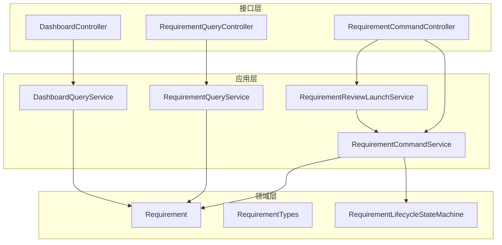
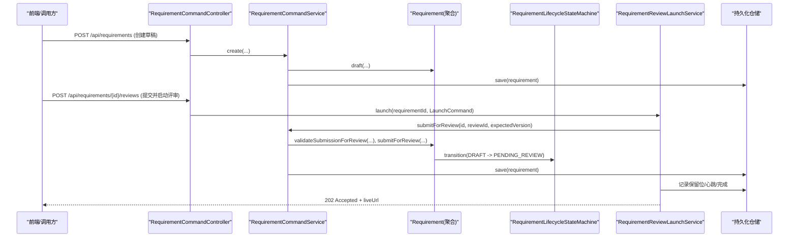
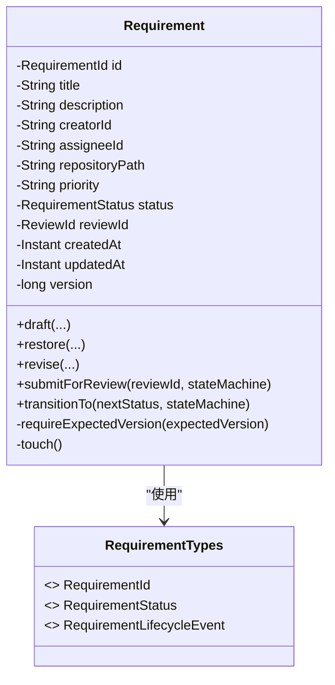
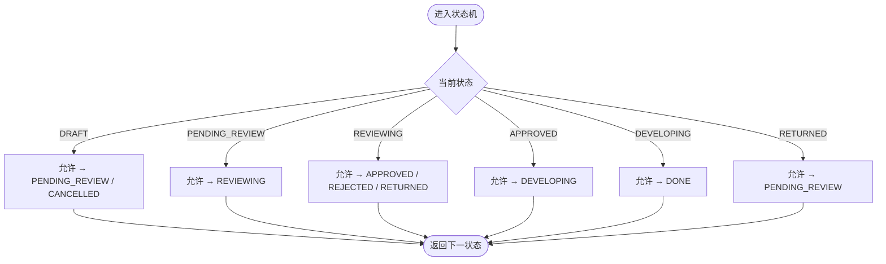
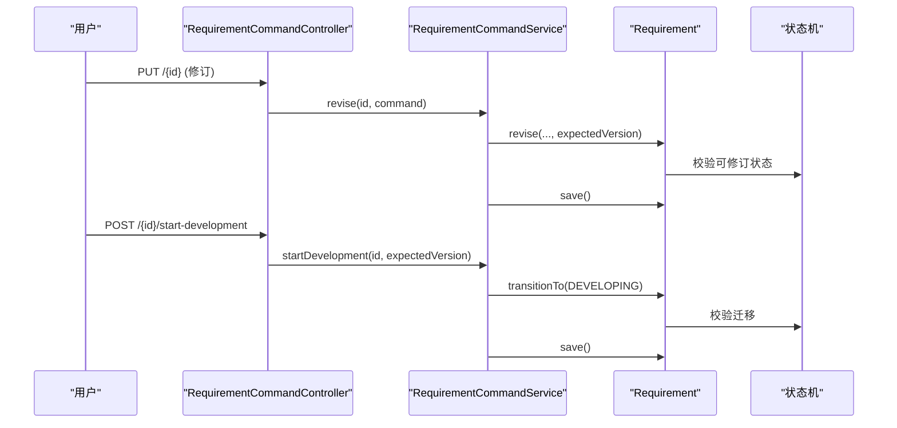
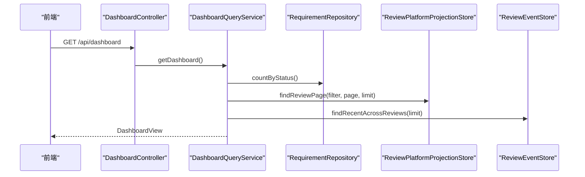
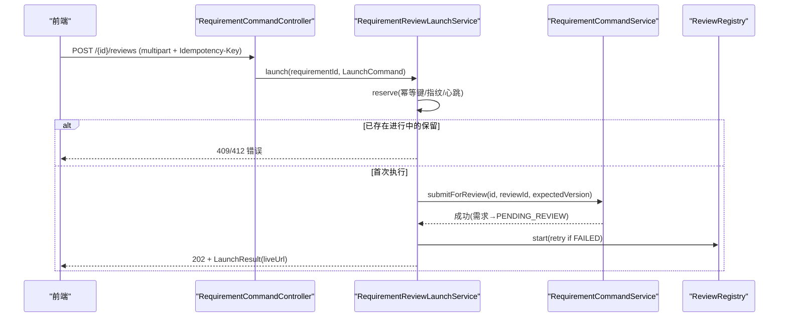
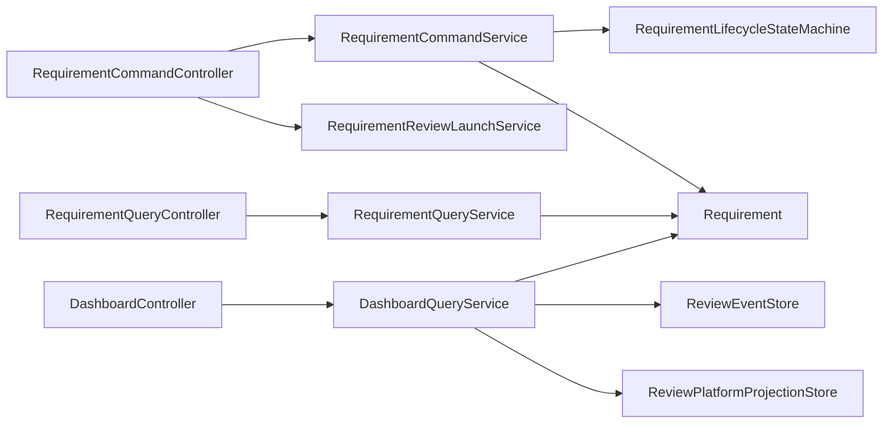

# 需求全生命周期管理

<cite>
**本文引用的文件**
- [Requirement.java](file://src/main/java/ai/cc/chongming/review/domain/model/Requirement.java)
- [RequirementTypes.java](file://src/main/java/ai/cc/chongming/review/domain/model/RequirementTypes.java)
- [RequirementLifecycleStateMachine.java](file://src/main/java/ai/cc/chongming/review/domain/protocol/RequirementLifecycleStateMachine.java)
- [RequirementCommandService.java](file://src/main/java/ai/cc/chongming/review/application/RequirementCommandService.java)
- [RequirementQueryService.java](file://src/main/java/ai/cc/chongming/review/application/RequirementQueryService.java)
- [RequirementReviewLaunchService.java](file://src/main/java/ai/cc/chongming/review/application/RequirementReviewLaunchService.java)
- [RequirementCommandController.java](file://src/main/java/ai/cc/chongming/review/api/RequirementCommandController.java)
- [RequirementQueryController.java](file://src/main/java/ai/cc/chongming/review/api/RequirementQueryController.java)
- [DashboardController.java](file://src/main/java/ai/cc/chongming/review/api/DashboardController.java)
- [DashboardQueryService.java](file://src/main/java/ai/cc/chongming/review/application/DashboardQueryService.java)
- [AIREVIEW-PLAN-021-需求全生命周期管理平台.md](file://docs/AIREVIEW-PLAN-021-需求全生命周期管理平台.md)
</cite>

## 目录
1. [简介](#简介)
2. [项目结构](#项目结构)
3. [核心组件](#核心组件)
4. [架构总览](#架构总览)
5. [详细组件分析](#详细组件分析)
6. [依赖关系分析](#依赖关系分析)
7. [性能考虑](#性能考虑)
8. [故障排查指南](#故障排查指南)
9. [结论](#结论)
10. [附录](#附录)

## 简介
本文件聚焦“需求全生命周期管理”，围绕 Requirement 聚合根、需求生命周期状态机、需求 CRUD 操作、看板投影以及评审启动流程进行系统化说明。目标是帮助读者理解：需求如何从草稿进入评审、如何在评审事件驱动下流转、如何通过 API 完成增删改查与状态推进，以及如何通过 Dashboard 聚合视图观察平台运行态势。

## 项目结构
围绕需求管理的代码分布在领域层、应用层与接口层：
- 领域层：定义 Requirement 聚合、类型枚举与生命周期状态机。
- 应用层：封装需求命令、查询、评审启动编排与看板聚合。
- 接口层：暴露 /api/requirements/** 与 /api/dashboard 等 REST 端点。
- 文档：AIREVIEW-PLAN-021 提供整体实施蓝图与验收约束。

图表来源
- [RequirementCommandController.java:43-155](file://src/main/java/ai/cc/chongming/review/api/RequirementCommandController.java#L43-L155)
- [RequirementQueryController.java:17-41](file://src/main/java/ai/cc/chongming/review/api/RequirementQueryController.java#L17-L41)
- [DashboardController.java:14-27](file://src/main/java/ai/cc/chongming/review/api/DashboardController.java#L14-L27)
- [RequirementCommandService.java:25-176](file://src/main/java/ai/cc/chongming/review/application/RequirementCommandService.java#L25-L176)
- [RequirementQueryService.java:19-100](file://src/main/java/ai/cc/chongming/review/application/RequirementQueryService.java#L19-L100)
- [RequirementReviewLaunchService.java:43-461](file://src/main/java/ai/cc/chongming/review/application/RequirementReviewLaunchService.java#L43-L461)
- [DashboardQueryService.java:21-113](file://src/main/java/ai/cc/chongming/review/application/DashboardQueryService.java#L21-L113)
- [Requirement.java:17-235](file://src/main/java/ai/cc/chongming/review/domain/model/Requirement.java#L17-L235)
- [RequirementTypes.java:11-59](file://src/main/java/ai/cc/chongming/review/domain/model/RequirementTypes.java#L11-L59)
- [RequirementLifecycleStateMachine.java:18-53](file://src/main/java/ai/cc/chongming/review/domain/protocol/RequirementLifecycleStateMachine.java#L18-L53)

章节来源
- [AIREVIEW-PLAN-021-需求全生命周期管理平台.md:122-175](file://docs/AIREVIEW-PLAN-021-需求全生命周期管理平台.md#L122-L175)

## 核心组件
- Requirement 聚合根：承载需求元数据、版本控制、生命周期状态与评审绑定；对外暴露 revise、submitForReview、transitionTo 等方法，并通过内部 version/touch 实现乐观锁。
- RequirementTypes：定义 RequirementId、RequirementStatus（含终态判断）与生命周期事件枚举。
- RequirementLifecycleStateMachine：集中维护需求状态迁移矩阵，非法迁移抛出领域异常。
- RequirementCommandService：封装创建、修订、提交评审、标记评审开始、Gate 决策落地、开发/完成/取消/删除等写操作。
- RequirementQueryService：提供分页列表与详情读模型，统一将领域对象映射为只读视图。
- RequirementReviewLaunchService：幂等受理需求评审，负责输入指纹、保留位、心跳保活、绑定需求与启动/重放评审。
- DashboardQueryService：聚合需求状态计数、活跃评审与近期活动，支撑平台首页。

章节来源
- [Requirement.java:17-235](file://src/main/java/ai/cc/chongming/review/domain/model/Requirement.java#L17-L235)
- [RequirementTypes.java:11-59](file://src/main/java/ai/cc/chongming/review/domain/model/RequirementTypes.java#L11-L59)
- [RequirementLifecycleStateMachine.java:18-53](file://src/main/java/ai/cc/chongming/review/domain/protocol/RequirementLifecycleStateMachine.java#L18-L53)
- [RequirementCommandService.java:25-176](file://src/main/java/ai/cc/chongming/review/application/RequirementCommandService.java#L25-L176)
- [RequirementQueryService.java:19-100](file://src/main/java/ai/cc/chongming/review/application/RequirementQueryService.java#L19-L100)
- [RequirementReviewLaunchService.java:43-461](file://src/main/java/ai/cc/chongming/review/application/RequirementReviewLaunchService.java#L43-L461)
- [DashboardQueryService.java:21-113](file://src/main/java/ai/cc/chongming/review/application/DashboardQueryService.java#L21-L113)

## 架构总览
需求全生命周期由“命令—聚合—持久化”的写路径与“查询服务—读模型”的读路径组成；评审启动作为跨聚合编排，串联需求与评审两个内核。

图表来源
- [RequirementCommandController.java:66-131](file://src/main/java/ai/cc/chongming/review/api/RequirementCommandController.java#L66-L131)
- [RequirementCommandService.java:50-97](file://src/main/java/ai/cc/chongming/review/application/RequirementCommandService.java#L50-L97)
- [Requirement.java:62-190](file://src/main/java/ai/cc/chongming/review/domain/model/Requirement.java#L62-L190)
- [RequirementLifecycleStateMachine.java:22-47](file://src/main/java/ai/cc/chongming/review/domain/protocol/RequirementLifecycleStateMachine.java#L22-L47)
- [RequirementReviewLaunchService.java:109-170](file://src/main/java/ai/cc/chongming/review/application/RequirementReviewLaunchService.java#L109-L170)

## 详细组件分析

### 需求聚合根 Requirement
- 职责：维护需求标题、描述、负责人、仓库路径、优先级、状态、关联评审 ID、时间戳与版本号；提供 revise、submitForReview、transitionTo 等变更方法。
- 一致性：通过 requireExpectedVersion 与 touch() 实现乐观锁与更新时间戳。
- 安全边界：仅允许在合法状态下修订或提交评审；提交前校验目标评审未重复绑定。

图表来源
- [Requirement.java:17-235](file://src/main/java/ai/cc/chongming/review/domain/model/Requirement.java#L17-L235)
- [RequirementTypes.java:11-59](file://src/main/java/ai/cc/chongming/review/domain/model/RequirementTypes.java#L11-L59)

章节来源
- [Requirement.java:62-235](file://src/main/java/ai/cc/chongming/review/domain/model/Requirement.java#L62-L235)
- [RequirementTypes.java:19-59](file://src/main/java/ai/cc/chongming/review/domain/model/RequirementTypes.java#L19-L59)

### 需求生命周期状态机
- 迁移规则：DRAFT→PENDING_REVIEW/CANCELLED；PENDING_REVIEW→REVIEWING；REVIEWING→APPROVED/REJECTED/RETURNED；APPROVED→DEVELOPING；DEVELOPING→DONE；RETURNED→PENDING_REVIEW。
- 行为：transition(current,next) 校验合法性，非法迁移抛出领域异常；canTransition 用于前置检查。

图表来源
- [RequirementLifecycleStateMachine.java:22-47](file://src/main/java/ai/cc/chongming/review/domain/protocol/RequirementLifecycleStateMachine.java#L22-L47)

章节来源
- [RequirementLifecycleStateMachine.java:18-53](file://src/main/java/ai/cc/chongming/review/domain/protocol/RequirementLifecycleStateMachine.java#L18-L53)

### 需求 CRUD 与状态推进
- 创建：POST /api/requirements → 生成草稿（DRAFT）。
- 修订：PUT /api/requirements/{id} → 仅在 DRAFT/RETURNED 可编辑，带 expectedVersion。
- 提交评审：POST /api/requirements/{id}/submit → 绑定评审并进入 PENDING_REVIEW。
- 推进状态：start-development、complete、cancel → 经状态机校验后更新。
- 删除：DELETE /api/requirements/{id} → 移除需求并解绑关联，保留评审历史。

图表来源
- [RequirementCommandController.java:73-147](file://src/main/java/ai/cc/chongming/review/api/RequirementCommandController.java#L73-L147)
- [RequirementCommandService.java:66-144](file://src/main/java/ai/cc/chongming/review/application/RequirementCommandService.java#L66-L144)
- [Requirement.java:162-209](file://src/main/java/ai/cc/chongming/review/domain/model/Requirement.java#L162-L209)
- [RequirementLifecycleStateMachine.java:34-47](file://src/main/java/ai/cc/chongming/review/domain/protocol/RequirementLifecycleStateMachine.java#L34-L47)

章节来源
- [RequirementCommandController.java:66-155](file://src/main/java/ai/cc/chongming/review/api/RequirementCommandController.java#L66-L155)
- [RequirementCommandService.java:50-176](file://src/main/java/ai/cc/chongming/review/application/RequirementCommandService.java#L50-L176)

### 看板投影
- DashboardController 暴露 GET /api/dashboard。
- DashboardQueryService 聚合：
  - 需求状态分布计数（来自需求仓储）。
  - 活跃评审页（来自平台投影存储）。
  - 近期活动（来自评审事件存储）。
- 输出包含待处理需求数、活跃评审总数、活跃评审列表与最近动态。

图表来源
- [DashboardController.java:14-27](file://src/main/java/ai/cc/chongming/review/api/DashboardController.java#L14-L27)
- [DashboardQueryService.java:40-63](file://src/main/java/ai/cc/chongming/review/application/DashboardQueryService.java#L40-L63)

章节来源
- [DashboardController.java:14-27](file://src/main/java/ai/cc/chongming/review/api/DashboardController.java#L14-L27)
- [DashboardQueryService.java:21-113](file://src/main/java/ai/cc/chongming/review/application/DashboardQueryService.java#L21-L113)

### 评审启动流程
- 入口：POST /api/requirements/{id}/reviews（multipart），携带需求文件、仓库路径、分支、提交、提交人、公开任务、变更原因、初始消息、幂等键与期望版本。
- 幂等与并发：
  - 计算请求指纹（SHA-256），写入保留位；冲突或进行中返回相应错误。
  - 心跳保活防止长时间占用。
- 绑定与启动：
  - 若需求未绑定评审，则原子绑定到评审（tryBindPendingReview），并将需求置为 PENDING_REVIEW。
  - 启动评审或重放已有评审，返回 202 Accepted 与 liveUrl。
- 结果：返回 requirementId、reviewId、attemptNo、双方版本、阶段、是否可恢复、是否重放、liveUrl。

图表来源
- [RequirementCommandController.java:94-131](file://src/main/java/ai/cc/chongming/review/api/RequirementCommandController.java#L94-L131)
- [RequirementReviewLaunchService.java:109-243](file://src/main/java/ai/cc/chongming/review/application/RequirementReviewLaunchService.java#L109-L243)
- [RequirementCommandService.java:81-97](file://src/main/java/ai/cc/chongming/review/application/RequirementCommandService.java#L81-L97)

章节来源
- [RequirementCommandController.java:94-131](file://src/main/java/ai/cc/chongming/review/api/RequirementCommandController.java#L94-L131)
- [RequirementReviewLaunchService.java:109-461](file://src/main/java/ai/cc/chongming/review/application/RequirementReviewLaunchService.java#L109-L461)

## 依赖关系分析
- 控制器依赖应用服务：RequirementCommandController → RequirementCommandService / RequirementReviewLaunchService；RequirementQueryController → RequirementQueryService；DashboardController → DashboardQueryService。
- 应用服务依赖领域聚合与状态机：RequirementCommandService 使用 Requirement 与 RequirementLifecycleStateMachine；RequirementQueryService 读取 Requirement 并转换为视图。
- 看板聚合依赖多存储：DashboardQueryService 同时读取需求仓储、平台投影存储与事件存储。

图表来源
- [RequirementCommandController.java:43-155](file://src/main/java/ai/cc/chongming/review/api/RequirementCommandController.java#L43-L155)
- [RequirementQueryController.java:17-41](file://src/main/java/ai/cc/chongming/review/api/RequirementQueryController.java#L17-L41)
- [DashboardController.java:14-27](file://src/main/java/ai/cc/chongming/review/api/DashboardController.java#L14-L27)
- [RequirementCommandService.java:25-176](file://src/main/java/ai/cc/chongming/review/application/RequirementCommandService.java#L25-L176)
- [RequirementQueryService.java:19-100](file://src/main/java/ai/cc/chongming/review/application/RequirementQueryService.java#L19-L100)
- [DashboardQueryService.java:21-113](file://src/main/java/ai/cc/chongming/review/application/DashboardQueryService.java#L21-L113)

章节来源
- [RequirementCommandController.java:43-155](file://src/main/java/ai/cc/chongming/review/api/RequirementCommandController.java#L43-L155)
- [RequirementQueryController.java:17-41](file://src/main/java/ai/cc/chongming/review/api/RequirementQueryController.java#L17-L41)
- [DashboardController.java:14-27](file://src/main/java/ai/cc/chongming/review/api/DashboardController.java#L14-L27)
- [RequirementCommandService.java:25-176](file://src/main/java/ai/cc/chongming/review/application/RequirementCommandService.java#L25-L176)
- [RequirementQueryService.java:19-100](file://src/main/java/ai/cc/chongming/review/application/RequirementQueryService.java#L19-L100)
- [DashboardQueryService.java:21-113](file://src/main/java/ai/cc/chongming/review/application/DashboardQueryService.java#L21-L113)

## 性能考虑
- 乐观锁：Requirement 通过 version 字段减少并发写冲突，避免覆盖更新。
- 幂等与保留位：评审启动通过幂等键与保留位避免重复受理与竞态，心跳机制保障长耗时流程不丢失。
- 看板聚合：Dashboard 将需求状态计数、活跃评审与近期活动分别查询，避免单表大扫描；事件存储按最近时间排序限制数量，降低开销。
- 状态机：集中式迁移矩阵使状态校验 O(1)，便于扩展与维护。

[本节为通用性能建议，不直接分析具体文件]

## 故障排查指南
- 版本冲突：修订/推进状态时 expectedVersion 不匹配会抛出版本冲突异常，需重新获取最新需求版本后再提交。
- 非法状态迁移：状态机拒绝不在迁移矩阵内的转换，应检查当前状态与目标状态是否符合规则。
- 评审绑定冲突：同一需求只能绑定一个活跃评审；若尝试绑定到不同评审将失败。
- 评审启动失败：幂等键冲突、进行中或不可用会导致特定错误码；检查 Idempotency-Key、心跳与评审注册表状态。
- 看板数据为空：确认需求仓储、平台投影存储与事件存储是否可用且已填充数据。

章节来源
- [RequirementCommandService.java:81-176](file://src/main/java/ai/cc/chongming/review/application/RequirementCommandService.java#L81-L176)
- [RequirementReviewLaunchService.java:109-243](file://src/main/java/ai/cc/chongming/review/application/RequirementReviewLaunchService.java#L109-L243)
- [DashboardQueryService.java:40-63](file://src/main/java/ai/cc/chongming/review/application/DashboardQueryService.java#L40-L63)

## 结论
本方案以 Requirement 聚合为核心，结合独立的需求生命周期状态机，实现了需求的创建、修订、提交评审、状态推进与删除；通过评审启动服务完成幂等受理与异步启动；看板聚合提供全局视角。该设计将需求管理与评审内核解耦，既保证评审流程的稳定性，又满足需求全生命周期的可追踪与可运营。

[本节为总结性内容，不直接分析具体文件]

## 附录
- 冻结接口：GET /api/dashboard、/api/requirements/**、GET /api/reviews、GET /api/reports。
- 状态机迁移矩阵与联动规则详见计划文档。

章节来源
- [AIREVIEW-PLAN-021-需求全生命周期管理平台.md:29-29](file://docs/AIREVIEW-PLAN-021-需求全生命周期管理平台.md#L29-L29)
- [AIREVIEW-PLAN-021-需求全生命周期管理平台.md:146-154](file://docs/AIREVIEW-PLAN-021-需求全生命周期管理平台.md#L146-L154)
- [AIREVIEW-PLAN-021-需求全生命周期管理平台.md:219-229](file://docs/AIREVIEW-PLAN-021-需求全生命周期管理平台.md#L219-L229)
