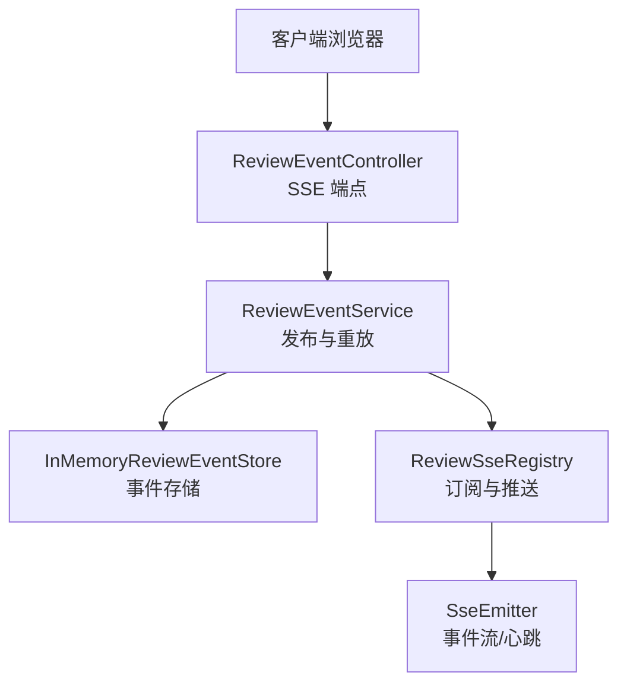
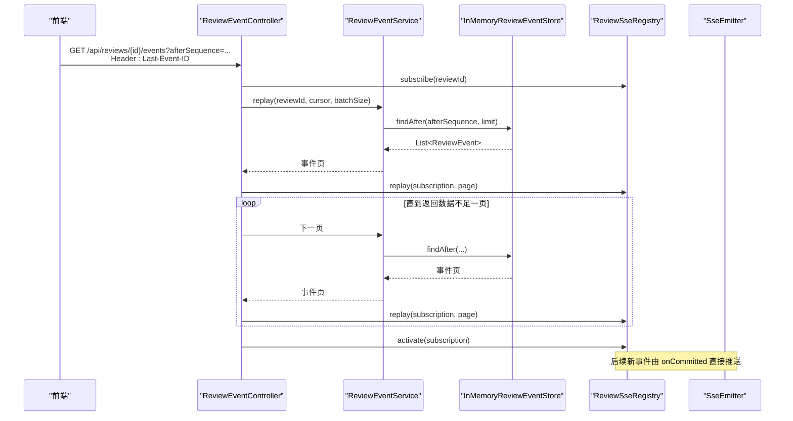
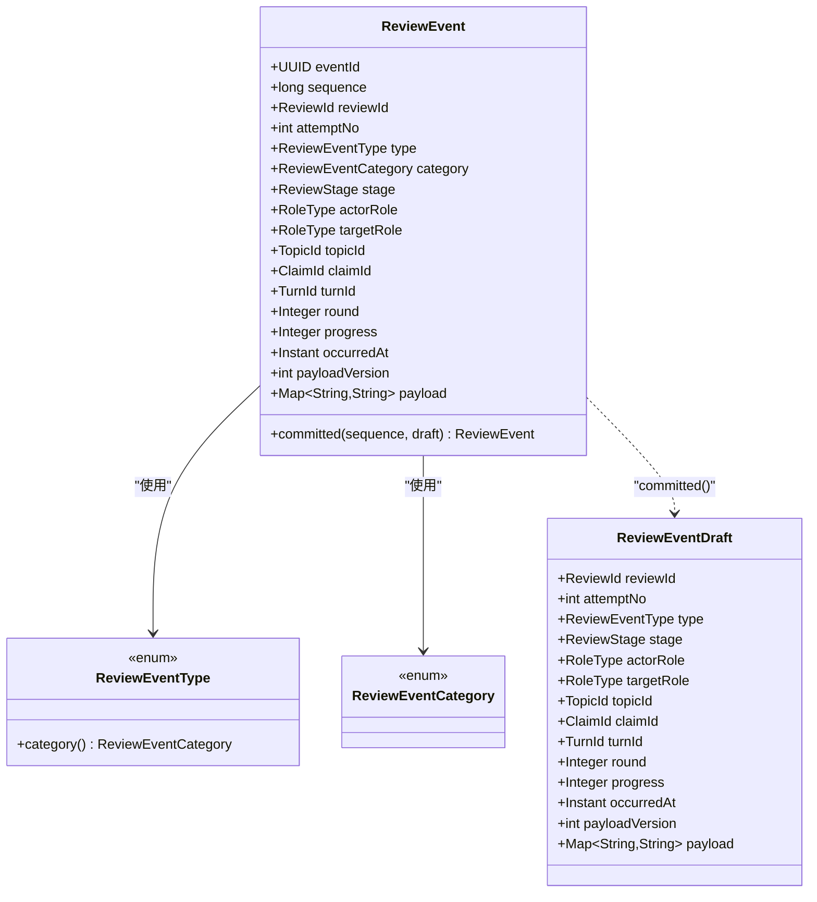
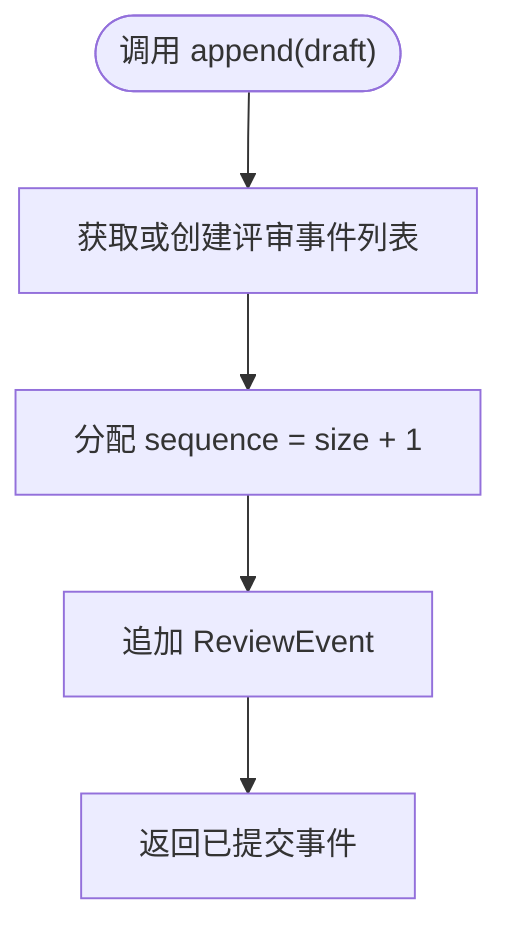
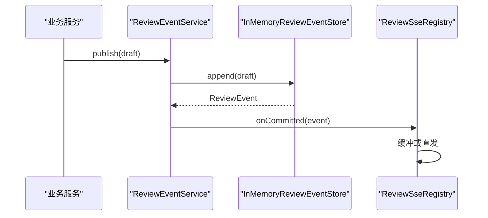
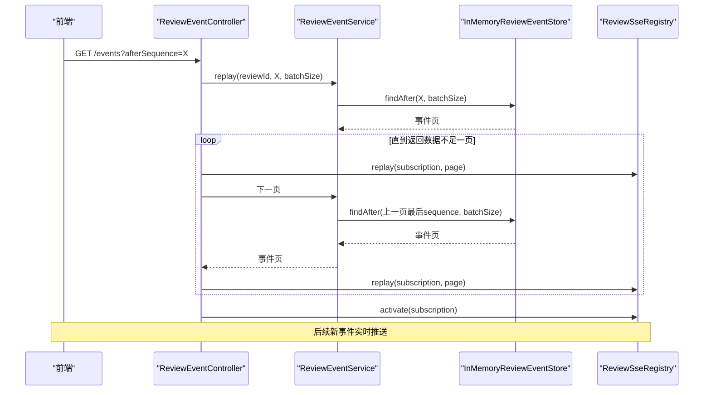
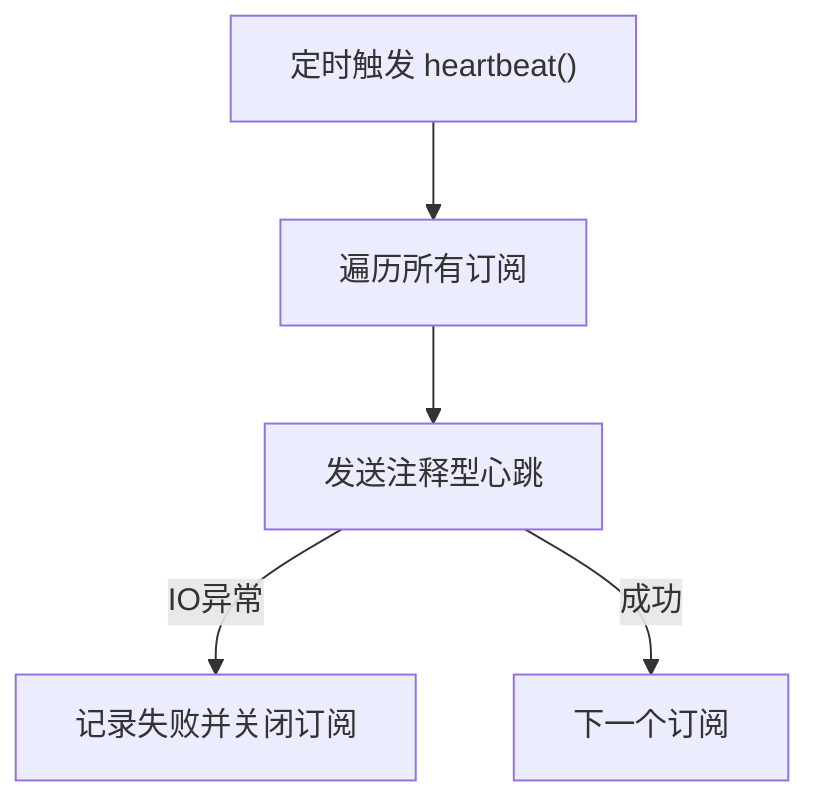
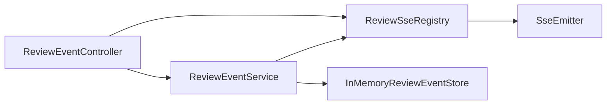

# 领域事件与SSE流

<cite>
**本文引用的文件**
- [ReviewEvent.java](file://src/main/java/ai/cc/chongming/review/domain/event/ReviewEvent.java)
- [ReviewEventType.java](file://src/main/java/ai/cc/chongming/review/domain/event/ReviewEventType.java)
- [ReviewEventCategory.java](file://src/main/java/ai/cc/chongming/review/domain/event/ReviewEventCategory.java)
- [ReviewEventDraft.java](file://src/main/java/ai/cc/chongming/review/domain/event/ReviewEventDraft.java)
- [InMemoryReviewEventStore.java](file://src/main/java/ai/cc/chongming/review/infrastructure/event/InMemoryReviewEventStore.java)
- [ReviewEventController.java](file://src/main/java/ai/cc/chongming/review/api/ReviewEventController.java)
- [ReviewEventService.java](file://src/main/java/ai/cc/chongming/review/application/ReviewEventService.java)
- [ReviewSseRegistry.java](file://src/main/java/ai/cc/chongming/review/application/ReviewSseRegistry.java)
- [ReviewSseProperties.java](file://src/main/java/ai/cc/chongming/review/application/ReviewSseProperties.java)
- [ReviewSseReplayIntegrationTests.java](file://src/test/java/ai/cc/chongming/review/sse/ReviewSseReplayIntegrationTests.java)
</cite>

## 目录
1. [简介](#简介)
2. [项目结构](#项目结构)
3. [核心组件](#核心组件)
4. [架构总览](#架构总览)
5. [详细组件分析](#详细组件分析)
6. [依赖关系分析](#依赖关系分析)
7. [性能考量](#性能考量)
8. [故障排查指南](#故障排查指南)
9. [结论](#结论)
10. [附录](#附录)

## 简介
本文件聚焦于评审领域事件的全局序列、SSE 推送、历史重放、心跳与增量重连机制。系统以不可变、追加型领域事实 ReviewEvent 为核心，通过 ReviewEventService 持久化后通知 SSE 订阅者；SSE 端点支持基于 Last-Event-ID 或 afterSequence 的断线续传与增量重放；心跳用于维持连接活跃并避免误消费业务序列。该设计确保前端在断线、重启或首次接入时都能获得无遗漏、有序的事件流。

## 项目结构
围绕事件与 SSE 的关键代码分布在以下层次：
- 领域层：定义事件模型、类型与类别，以及提交前的草稿校验。
- 应用层：负责先持久化事件，再广播给监听器（SSE 注册表）；提供重放查询能力。
- 基础设施层：进程内事件存储，维护每个评审的全局顺序与并发安全。
- API 层：暴露 /api/reviews/{reviewId}/events 的 SSE 端点，处理历史重放与激活。
- 配置层：SSE 超时、心跳间隔、重放批次大小等参数。

图表来源
- [ReviewEventController.java:25-86](file://src/main/java/ai/cc/chongming/review/api/ReviewEventController.java#L25-L86)
- [ReviewEventService.java:19-49](file://src/main/java/ai/cc/chongming/review/application/ReviewEventService.java#L19-L49)
- [InMemoryReviewEventStore.java:24-158](file://src/main/java/ai/cc/chongming/review/infrastructure/event/InMemoryReviewEventStore.java#L24-L158)
- [ReviewSseRegistry.java:25-267](file://src/main/java/ai/cc/chongming/review/application/ReviewSseRegistry.java#L25-L267)

章节来源
- [ReviewEventController.java:25-86](file://src/main/java/ai/cc/chongming/review/api/ReviewEventController.java#L25-L86)
- [ReviewEventService.java:19-49](file://src/main/java/ai/cc/chongming/review/application/ReviewEventService.java#L19-L49)
- [InMemoryReviewEventStore.java:24-158](file://src/main/java/ai/cc/chongming/review/infrastructure/event/InMemoryReviewEventStore.java#L24-L158)
- [ReviewSseRegistry.java:25-267](file://src/main/java/ai/cc/chongming/review/application/ReviewSseRegistry.java#L25-L267)
- [ReviewSseProperties.java:12-29](file://src/main/java/ai/cc/chongming/review/application/ReviewSseProperties.java#L12-L29)

## 核心组件
- ReviewEvent：不可变领域事实，包含全局递增 sequence、评审标识、尝试次数、阶段、角色、轮次、进度、时间戳与负载版本，保证可回放与幂等。
- ReviewEventDraft：提交前校验的输入对象，约束字段合法性与负载键值非空。
- ReviewEventType/ReviewEventCategory：稳定的业务事件枚举与分类，便于读模型与 SSE 客户端按类过滤。
- InMemoryReviewEventStore：进程内事件存储，按评审维度维护顺序列表，提供 append、findAfter、latest 等能力，保障并发安全与边界校验。
- ReviewEventService：发布流程“先写库、再通知”，并提供 replay 查询接口。
- ReviewSseRegistry：管理 SSE 订阅、历史重放缓冲、激活切换为直发、心跳发送与指标统计。
- ReviewEventController：SSE 端点，解析 Last-Event-ID/afterSequence 游标，分页重放历史并激活订阅。
- ReviewSseProperties：SSE 超时、心跳间隔、重放批次大小等运行时参数。

章节来源
- [ReviewEvent.java:15-82](file://src/main/java/ai/cc/chongming/review/domain/event/ReviewEvent.java#L15-L82)
- [ReviewEventDraft.java:15-53](file://src/main/java/ai/cc/chongming/review/domain/event/ReviewEventDraft.java#L15-L53)
- [ReviewEventType.java:9-60](file://src/main/java/ai/cc/chongming/review/domain/event/ReviewEventType.java#L9-L60)
- [ReviewEventCategory.java:8-19](file://src/main/java/ai/cc/chongming/review/domain/event/ReviewEventCategory.java#L8-L19)
- [InMemoryReviewEventStore.java:30-158](file://src/main/java/ai/cc/chongming/review/infrastructure/event/InMemoryReviewEventStore.java#L30-L158)
- [ReviewEventService.java:19-49](file://src/main/java/ai/cc/chongming/review/application/ReviewEventService.java#L19-L49)
- [ReviewSseRegistry.java:25-267](file://src/main/java/ai/cc/chongming/review/application/ReviewSseRegistry.java#L25-L267)
- [ReviewEventController.java:25-86](file://src/main/java/ai/cc/chongming/review/api/ReviewEventController.java#L25-L86)
- [ReviewSseProperties.java:12-29](file://src/main/java/ai/cc/chongming/review/application/ReviewSseProperties.java#L12-L29)

## 架构总览
下图展示从事件写入到 SSE 推送的完整链路，包括历史重放与激活切换。

图表来源
- [ReviewEventController.java:42-64](file://src/main/java/ai/cc/chongming/review/api/ReviewEventController.java#L42-L64)
- [ReviewEventService.java:35-43](file://src/main/java/ai/cc/chongming/review/application/ReviewEventService.java#L35-L43)
- [InMemoryReviewEventStore.java:41-57](file://src/main/java/ai/cc/chongming/review/infrastructure/event/InMemoryReviewEventStore.java#L41-L57)
- [ReviewSseRegistry.java:43-84](file://src/main/java/ai/cc/chongming/review/application/ReviewSseRegistry.java#L43-L84)

## 详细组件分析

### 领域事件与全局序列
- 全局序列：ReviewEvent.sequence 是评审维度的严格递增序号，由存储层在追加时分配，保证事件顺序一致且可回放。
- 不可变性与校验：ReviewEvent 构造器对必填字段、范围与一致性进行强校验；payloadVersion 用于未来负载演进兼容。
- 草稿模式：ReviewEventDraft 在入队前完成基础校验，避免无效事件进入存储。

图表来源
- [ReviewEvent.java:15-82](file://src/main/java/ai/cc/chongming/review/domain/event/ReviewEvent.java#L15-L82)
- [ReviewEventDraft.java:15-53](file://src/main/java/ai/cc/chongming/review/domain/event/ReviewEventDraft.java#L15-L53)
- [ReviewEventType.java:9-60](file://src/main/java/ai/cc/chongming/review/domain/event/ReviewEventType.java#L9-L60)
- [ReviewEventCategory.java:8-19](file://src/main/java/ai/cc/chongming/review/domain/event/ReviewEventCategory.java#L8-L19)

章节来源
- [ReviewEvent.java:15-82](file://src/main/java/ai/cc/chongming/review/domain/event/ReviewEvent.java#L15-L82)
- [ReviewEventDraft.java:15-53](file://src/main/java/ai/cc/chongming/review/domain/event/ReviewEventDraft.java#L15-L53)
- [ReviewEventType.java:9-60](file://src/main/java/ai/cc/chongming/review/domain/event/ReviewEventType.java#L9-L60)
- [ReviewEventCategory.java:8-19](file://src/main/java/ai/cc/chongming/review/domain/event/ReviewEventCategory.java#L8-L19)

### 事件存储与追加
- 追加语义：append 为每个评审维护独立列表，按 size+1 分配 sequence，线程安全。
- 重放查询：findAfter 支持 afterSequence 与 limit，返回严格大于游标的事件并按 sequence 排序。
- 跨评审聚合：提供最近事件与最新事件聚合能力，便于仪表盘展示。

图表来源
- [InMemoryReviewEventStore.java:30-39](file://src/main/java/ai/cc/chongming/review/infrastructure/event/InMemoryReviewEventStore.java#L30-L39)

章节来源
- [InMemoryReviewEventStore.java:30-158](file://src/main/java/ai/cc/chongming/review/infrastructure/event/InMemoryReviewEventStore.java#L30-L158)

### 发布与监听
- 发布顺序：ReviewEventService.publish 先持久化事件，再依次通知所有监听器（当前为 ReviewSseRegistry）。
- 监听器职责：ReviewSseRegistry.onCommitted 将事件投递到对应评审的所有订阅者；若订阅处于缓冲期则暂存，激活后再统一排序发送。

图表来源
- [ReviewEventService.java:35-39](file://src/main/java/ai/cc/chongming/review/application/ReviewEventService.java#L35-L39)
- [ReviewSseRegistry.java:86-101](file://src/main/java/ai/cc/chongming/review/application/ReviewSseRegistry.java#L86-L101)

章节来源
- [ReviewEventService.java:19-49](file://src/main/java/ai/cc/chongming/review/application/ReviewEventService.java#L19-L49)
- [ReviewSseRegistry.java:86-101](file://src/main/java/ai/cc/chongming/review/application/ReviewSseRegistry.java#L86-L101)

### SSE 端点、历史重放与增量重连
- 端点路径：/api/reviews/{reviewId}/events，返回文本事件流。
- 游标解析：优先使用 afterSequence，其次 Last-Event-ID；两者同时提供时必须一致；游标不得为负。
- 历史重放：按批次循环拉取，直至返回数据不足一页；每批通过 registry.replay 推送到订阅缓冲区。
- 激活切换：当历史重放完成后，registry.activate 清空缓冲并切换到直发模式，确保不丢不漏。
- 增量重连：客户端下次连接携带 Last-Event-ID 或 afterSequence，服务端从游标之后继续重放，实现断线续传。

图表来源
- [ReviewEventController.java:42-76](file://src/main/java/ai/cc/chongming/review/api/ReviewEventController.java#L42-L76)
- [ReviewEventService.java:41-43](file://src/main/java/ai/cc/chongming/review/application/ReviewEventService.java#L41-L43)
- [InMemoryReviewEventStore.java:41-57](file://src/main/java/ai/cc/chongming/review/infrastructure/event/InMemoryReviewEventStore.java#L41-L57)
- [ReviewSseRegistry.java:63-84](file://src/main/java/ai/cc/chongming/review/application/ReviewSseRegistry.java#L63-L84)

章节来源
- [ReviewEventController.java:42-76](file://src/main/java/ai/cc/chongming/review/api/ReviewEventController.java#L42-L76)
- [ReviewEventService.java:41-43](file://src/main/java/ai/cc/chongming/review/application/ReviewEventService.java#L41-L43)
- [InMemoryReviewEventStore.java:41-57](file://src/main/java/ai/cc/chongming/review/infrastructure/event/InMemoryReviewEventStore.java#L41-L57)
- [ReviewSseRegistry.java:63-84](file://src/main/java/ai/cc/chongming/review/application/ReviewSseRegistry.java#L63-L84)

### 心跳与连接保活
- 定时心跳：ReviewSseRegistry 周期性向所有订阅发送注释型心跳，不占用业务事件序列，仅用于保持连接活跃。
- 超时清理：SseEmitter 超时、错误、完成回调会移除订阅，释放资源。
- 指标观测：提供活跃订阅数、成功投递数、失败投递数等轻量指标。

图表来源
- [ReviewSseRegistry.java:103-113](file://src/main/java/ai/cc/chongming/review/application/ReviewSseRegistry.java#L103-L113)
- [ReviewSseRegistry.java:184-194](file://src/main/java/ai/cc/chongming/review/application/ReviewSseRegistry.java#L184-L194)
- [ReviewSseRegistry.java:48-54](file://src/main/java/ai/cc/chongming/review/application/ReviewSseRegistry.java#L48-L54)

章节来源
- [ReviewSseRegistry.java:103-113](file://src/main/java/ai/cc/chongming/review/application/ReviewSseRegistry.java#L103-L113)
- [ReviewSseRegistry.java:184-194](file://src/main/java/ai/cc/chongming/review/application/ReviewSseRegistry.java#L184-L194)
- [ReviewSseRegistry.java:48-54](file://src/main/java/ai/cc/chongming/review/application/ReviewSseRegistry.java#L48-L54)
- [ReviewSseProperties.java:12-29](file://src/main/java/ai/cc/chongming/review/application/ReviewSseProperties.java#L12-L29)

### 事件视图与传输格式
- SSE 事件：每条事件携带 id=sequence、name=事件类型、data=JSON 视图；客户端可用 Last-Event-ID 做增量重连。
- JSON 视图：将强类型 ID 转换为字符串，避免浏览器比较差异导致事件被丢弃；保留 payload 以便扩展。

章节来源
- [ReviewSseRegistry.java:120-161](file://src/main/java/ai/cc/chongming/review/application/ReviewSseRegistry.java#L120-L161)

## 依赖关系分析
- ReviewEventService 依赖 ReviewEventStore 与 ReviewEventListener 列表；当前唯一监听器为 ReviewSseRegistry。
- ReviewEventController 依赖 ReviewEventService 与 ReviewSseRegistry，并通过 ReviewSseProperties 控制重放批次。
- InMemoryReviewEventStore 作为默认实现，提供进程内并发安全的顺序存储。
- ReviewSseRegistry 内部维护按评审分组的订阅映射，并在 onCommitted 中分发事件。

图表来源
- [ReviewEventController.java:25-52](file://src/main/java/ai/cc/chongming/review/api/ReviewEventController.java#L25-L52)
- [ReviewEventService.java:19-39](file://src/main/java/ai/cc/chongming/review/application/ReviewEventService.java#L19-L39)
- [InMemoryReviewEventStore.java:24-39](file://src/main/java/ai/cc/chongming/review/infrastructure/event/InMemoryReviewEventStore.java#L24-L39)
- [ReviewSseRegistry.java:25-55](file://src/main/java/ai/cc/chongming/review/application/ReviewSseRegistry.java#L25-L55)

章节来源
- [ReviewEventController.java:25-52](file://src/main/java/ai/cc/chongming/review/api/ReviewEventController.java#L25-L52)
- [ReviewEventService.java:19-39](file://src/main/java/ai/cc/chongming/review/application/ReviewEventService.java#L19-L39)
- [InMemoryReviewEventStore.java:24-39](file://src/main/java/ai/cc/chongming/review/infrastructure/event/InMemoryReviewEventStore.java#L24-L39)
- [ReviewSseRegistry.java:25-55](file://src/main/java/ai/cc/chongming/review/application/ReviewSseRegistry.java#L25-L55)

## 性能考量
- 重放批次：replayBatchSize 限制单次重放规模，避免一次性加载过多事件造成内存压力；上限为 10000。
- 排序与限流：findAfter 与 replay 均按 sequence 排序并限制数量，保证有序与可控吞吐。
- 并发安全：事件列表访问加锁，避免竞态条件；心跳与投递分别同步保护。
- 连接生命周期：SseEmitter 超时与错误回调自动清理订阅，防止资源泄漏。

章节来源
- [ReviewSseProperties.java:12-29](file://src/main/java/ai/cc/chongming/review/application/ReviewSseProperties.java#L12-L29)
- [InMemoryReviewEventStore.java:41-57](file://src/main/java/ai/cc/chongming/review/infrastructure/event/InMemoryReviewEventStore.java#L41-L57)
- [ReviewSseRegistry.java:63-84](file://src/main/java/ai/cc/chongming/review/application/ReviewSseRegistry.java#L63-L84)
- [ReviewSseRegistry.java:48-54](file://src/main/java/ai/cc/chongming/review/application/ReviewSseRegistry.java#L48-L54)

## 故障排查指南
- 游标冲突：同时提供 Last-Event-ID 与 afterSequence 但不一致会抛出非法参数异常；请确保两者匹配或只提供一个。
- 非法游标：afterSequence 为负或 Last-Event-ID 无法解析为非负整数会报错；检查客户端传递的游标格式。
- 重放窗口越界：findAfter 的 afterSequence 与 limit 必须在允许范围内；调整客户端请求参数。
- 投递失败：SSE 写入 IO 异常会被记录并关闭订阅；检查网络与代理是否中断连接。
- 心跳未生效：确认 review.sse.heartbeat-interval 配置为正数；观察 metrics.failedDeliveries 是否增长。

章节来源
- [ReviewEventController.java:66-84](file://src/main/java/ai/cc/chongming/review/api/ReviewEventController.java#L66-L84)
- [InMemoryReviewEventStore.java:41-45](file://src/main/java/ai/cc/chongming/review/infrastructure/event/InMemoryReviewEventStore.java#L41-L45)
- [ReviewSseRegistry.java:120-136](file://src/main/java/ai/cc/chongming/review/application/ReviewSseRegistry.java#L120-L136)
- [ReviewSseRegistry.java:184-194](file://src/main/java/ai/cc/chongming/review/application/ReviewSseRegistry.java#L184-L194)
- [ReviewSseProperties.java:12-29](file://src/main/java/ai/cc/chongming/review/application/ReviewSseProperties.java#L12-L29)

## 结论
该方案以不可变领域事件与全局序列为基础，结合“先持久化、后推送”的发布模式，实现了可靠的历史重放与增量重连。SSE 心跳在不消耗业务序列的前提下维持连接健康，配合游标机制确保断线后可无缝续传。整体设计兼顾了正确性、可观测性与可扩展性，适合高可靠的评审流程实时可视化场景。

## 附录
- 端到端行为验证：集成测试覆盖历史重放、缓冲事件恰好一次投递、心跳不产生业务序列等关键场景。

章节来源
- [ReviewSseReplayIntegrationTests.java:27-64](file://src/test/java/ai/cc/chongming/review/sse/ReviewSseReplayIntegrationTests.java#L27-L64)
