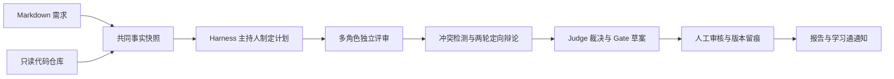

# 重明（Chongming）

> **双睛照见，众议成明。** 让多个专业视角发现需求中的冲突、漏洞与不合理之处，让每一个研发 Gate 都有证据可循。

## 名字的由来

“重明”出自晋代王嘉《拾遗记》中的重明鸟。相传重明鸟“两目重瞳”，双目如炬，能识破伪装、驱逐邪祟。

这与项目的使命天然契合：四个瞳孔象征产品、项目、研发、测试等多重视角；辨伪与守门象征在需求进入研发前，找出被忽略的边界、风险和矛盾。重明不是替某个角色下结论，而是让不同立场在同一事实之上充分交锋，最终把问题照清楚。

## 项目定位

重明是一个**多智能体对抗式需求评审与门禁系统**。系统接收 Markdown 需求文档和只读本地代码仓库，由多个专业 Agent
完成独立评审、交叉质询和证据化辩论，再由 Judge 生成 Gate 建议，交给人工审核后生效。

它关注的不是“Agent 会不会聊天”，而是一个结论能否回答：**谁提出了什么主张、依据哪段代码、被谁质疑、如何回应，以及为什么最终放行或退回。
**

## 核心流程



## 设计原则

- **共同事实，独立视角**：所有角色共享同一需求版本和仓库快照，但拥有不同上下文、检查清单与工具权限。
- **证据约束结论**：代码证据包含快照、文件路径、单行号、片段哈希和证据 ID；伪造或失效引用不能进入正式报告。
- **真实论点驱动辩论**：质询必须指向已发布 Claim，反驳必须回应具体 Turn；辩论最多两轮，未收敛问题升级人工。
- **动态启用角色**：每场固定产品、项目、后端、前端四个核心角色，按需求最多启用架构、测试、安全三个角色，再由 Judge 裁决。
- **AI 建议，人工定案**：AI 只生成 `PASS`、`CONDITIONAL`、`BLOCK` 等 Gate 草案；最终决定、修改与 override 全部版本化审计。
- **Harness 自主编排，协议强约束**：主持人可使用 Plan Mode 拆解任务、调度子 Agent 和恢复会话，但不能绕过状态机与
  `ReviewProtocolGuard`。

## 技术架构

| 层次    | 主要职责                       | 选型                                          |
|-------|----------------------------|---------------------------------------------|
| 评审编排  | Plan Mode、子 Agent、工作区、会话恢复 | AgentScope Java 2.0 Harness                 |
| 业务服务  | 受理、状态机、辩论协议、人工审核、报告        | Java 21、Spring Boot 4                       |
| 数据与状态 | 领域数据、审计事件、Agent 运行态        | MyBatis、MySQL、`agentscope-extensions-mysql` |
| 实时交互  | 计划进度、发言时间线、断线回放            | Spring MVC SSE、静态 ES Modules                |
| 外部集成  | 商业模型切换、最终结果通知              | OpenAI 兼容模型网关、学习通通知 MCP                     |

核心链路保持单体架构，优先保证可运行、可验证和可演示；模型、代码理解工具与通知渠道均通过适配器隔离。

## MVP 边界

首期只接收 `.md` 需求文档，只读分析本地仓库；不自动修改代码，不执行仓库脚本，也不直接阻断真实研发流程。单场最多运行 8 个
Agent，并保留从需求快照、Evidence、Claim、DebateTurn、Judge 到人工 Gate 的完整追溯链。

## 当前状态与路线图

项目目前处于**工程基线与框架验证阶段**：仓库已包含 Spring Boot 骨架、AgentScope 2.0.0 示例、完整技术方案，以及 1 个总体路线图和
14 个可独立开发、独立验证的专项计划。业务能力尚未完成，请勿将规划项视为已上线功能。

六周路线依次交付：框架兼容性验证 → 可信输入与代码证据 → 多 Agent 编排 → 对抗辩论与 Gate → 人工审核与通知 →
评测、故障演练和答辩交付。实施入口见 [`AIREVIEW-PLAN-001-总体实施路线图.md`](docs/AIREVIEW-PLAN-001-总体实施路线图.md)。

## 本地开发

环境要求：JDK 21、可用的 Maven Wrapper，以及兼容 OpenAI API 的模型凭证。当前 `FirstAgent` 示例使用 `DASHSCOPE_API_KEY`
，密钥必须通过环境变量提供。

```powershell
$env:DASHSCOPE_API_KEY = "your-api-key"
.\mvnw.cmd clean verify
.\mvnw.cmd spring-boot:run
```

常用命令：

- `.\mvnw.cmd test`：运行 JUnit 5 测试。
- `.\mvnw.cmd clean verify`：编译、测试并打包。
- `.\mvnw.cmd spring-boot:run`：启动本地 Spring Boot 应用。

## 目录结构

```text
src/main/java/ai/cc/chongming/   Java 生产代码
src/main/resources/              应用配置与静态资源
src/test/java/                   单元与集成测试
docs/需求文档/                    产品方案与需求说明
docs/技术方案/                    架构与技术决策
docs/AIREVIEW-PLAN-*.md          分阶段实施与验证计划
.agentscope/workspace/           本地 Agent 工作区（不提交）
.learnings/                      错误、需求与经验记录
```

## 开发与贡献

每个专项计划建议对应一个 `codex/aireview-plan-xxx` 分支或 PR。Java 代码使用四空格缩进，新增类型 Javadoc 统一标注
`@author zyj`；数据库访问优先批量加载，避免在循环中逐条查询。新增行为需要配套测试，完成后更新对应计划状态、验证证据与
`.learnings/` 记录。

更多约束见 [`AGENTS.md`](AGENTS.md)，完整架构见 [
`AI需求评审Agent_AgentScope2技术方案.md`](docs/技术方案/AI需求评审Agent_AgentScope2技术方案.md)。
