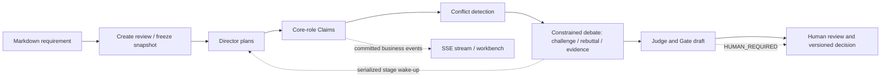

# Chongming

[简体中文](README.zh-CN.md)

> **See through ambiguity. Build consensus with evidence.** Chongming is a protocol-driven, multi-agent requirements-review workbench—not an untraceable group chat.

Chongming accepts a Markdown requirement and a controlled local-repository reference. Product, project, frontend, and backend roles independently submit Claims; conflicts enter constrained debate; a Judge produces a Gate draft; a human makes the final decision.

## Origin of the name

The name comes from the Chongming bird (重明鸟) in *Shi Yi Ji* (*Records of Gleaned Relics*) by Jin-dynasty writer Wang Jia. Tradition describes the bird as having double pupils in both eyes, with a gaze bright enough to see through disguises and drive away evil. The text also calls it **Shuangjing** (双睛, “double-pupilled”), describing it as driving away beasts and harmful evils; its image at a doorway signifies keeping out what should not enter.

That is a project metaphor, not a claim about mythology as system design:

| Chongming image | Meaning in this project |
|---|---|
| Double pupils | The same requirement is examined through multiple independent professional lenses, rather than by a single model answer |
| Seeing through disguise | Claims must be challenged by evidence, counterarguments, and protocol checks; plausible wording is not enough |
| Keeping harm from the doorway | A Gate sits before implementation: unresolved risk is surfaced for human review instead of silently passing downstream |
| A bird, not a judge | Chongming illuminates disagreement. It does not replace the accountable human who makes the final Gate decision |

This is why the project motto is **“See through ambiguity. Build consensus with evidence.”** Four core roles—product, project, frontend, and backend—form the initial set of perspectives. Optional architecture, test, and security roles can be activated when the review needs them. Their task is not to manufacture agreement; it is to make the disagreement, evidence, and decision path visible.

The source text is available in [*Shi Yi Ji*: “the Chongming bird”](https://www.shidianguji.com/mid-page/7595700568979554313). The mapping above is Chongming’s product interpretation.

## Why it is not a multi-agent chat demo

| Typical agent demo | Chongming constraint |
|---|---|
| A conclusion appears when the chat ends | Claims, challenges, rebuttals, judgements, and Gates are typed domain objects |
| Agents choose their own identity and permissions | The server rebinds review, attempt, role, version, and idempotency keys |
| Model output changes the workflow directly | `ReviewProtocolGuard` validates the state, role, and action before a command is committed |
| Only the final answer is visible | Business events have a global sequence and can be replayed through SSE |
| AI approves a requirement | AI produces a draft only; `HUMAN_REQUIRED` waits for a versioned human decision |

The project draws from two production-oriented open-source directions: AgentScope Java's controlled tool use, observability, and runtime intervention; and LangGraph's durable state and human-in-the-loop workflow model. Chongming narrows those ideas into a review protocol for software delivery.

## Current capability matrix

| Capability | Status | Notes |
|---|---|---|
| Markdown intake and review workbench | Ready for local integration | Create a review with `POST /api/reviews`; UI entry is `/review/` |
| State machine, role authorization, idempotent commands | Implemented | Invalid stages, unauthorized roles, and replayed commands are rejected or safely replayed server-side |
| OpenAI-compatible model gateway | Implemented | Per-role model profiles, timeouts/backoff, and Tool Calls; a real model ID is required |
| Local repository reads | Connected to role Harness | Roles can list, search, and read bounded lines from a server-frozen, allow-listed repository snapshot; evidence submission is still pending |
| Initial review | Connected to runtime | Four core roles submit Claims, then the flow reaches conflict detection |
| Debate, Judge, and Gate draft | Connected to runtime | Director, roles, and Judge use restricted tools; one attempt currently supports one active debate topic |
| Domain events and SSE | Implemented | Sequenced events, historical replay, heartbeat, and incremental reconnect are supported |
| Human review, reports, notifications | Core flow available | External notification MCP and production persistence still need real-contract integration |
| MySQL command writes and multi-instance recovery | Not complete | The review aggregate and runtime dispatcher still have in-process boundaries |
| Security audit, evaluation, fault injection | Not complete | These are release gates, not substitutes for a local demo |

## Review flow



The runtime does not rely on a model voluntarily following the process. A model can only select an exposed Tool Schema; every tool call is validated server-side before it changes domain state. `ReviewWorkflowDispatcher` listens only to committed business events and serializes the next Agent wake-up within a review, preventing concurrent execution of the same Director session.

## Architecture

| Layer | Responsibility | Current implementation |
|---|---|---|
| Interaction | Workbench, intake, query APIs, SSE | Vue 3/Vite static assets + Spring MVC |
| Domain | Review state machine, Guard, Claim, Debate, Judge, Gate | Java 21, Spring Boot, typed commands |
| Agent runtime | Director/role/Judge Harness, restricted tools, runtime dispatch | AgentScope Java Harness + bound runtime context |
| Model adapter | OpenAI-compatible calls, streaming, Tool Calls, retry | Model Gateway adapter |
| Events and storage | Sequenced events, SSE replay, optional MyBatis event store | In-memory by default; complete MySQL write model is pending |

## Quick start

### Prerequisites

- JDK 21
- A working Maven Wrapper
- MySQL 5.6+ (the migrations do not require JSON columns)
- A model endpoint compatible with OpenAI Chat Completions and Tool Calling

### Local configuration

Configure your workstation in `src/main/resources/application-local.yml`. Use it locally only and never commit secrets. The minimal structure is:

```yaml
review:
  persistence:
    enabled: true
    jdbc-url: jdbc:mysql://127.0.0.1:3306/chongming?characterEncoding=UTF-8
    username: your_user
    password: your_password
  model-gateway:
    enabled: true
    base-url: https://your-openai-compatible-endpoint/v1
    model-name: your_actual_model_name
    api-key: your_api_key
    log-conversation: true # local diagnosis only; turn it off afterwards
repositories:
  allowed:
    - id: your-repository-id
      root: E:\\your\\local\\repository
```

Do not leave `model-name` as a `chongming-*-placeholder`; the provider will return HTTP 404. `log-conversation` is for a controlled local debugging session only.

If a local configuration file was committed or shared, remove its credentials and rotate the database and model-gateway secrets immediately. Documentation must never become a vehicle for copying live credentials.

### Build and run

```powershell
.\mvnw.cmd test
.\mvnw.cmd spring-boot:run
```

Open [http://localhost:8080/review/](http://localhost:8080/review/). The workbench entry is `/review/`, not the root path.

Frontend sources are in `frontend/`. After frontend changes, rebuild and commit the matching assets under `src/main/resources/static/review/`:

```powershell
Set-Location frontend
npm test
npm run build
```

## Debugging a review

1. Create a review in the workbench, upload a `.md` file, and choose a configured repository ID.
2. Use `main` or the target branch. Commit is optional; when supplied, it must be a 40-character SHA.
3. Observe the workbench SSE state and server logs. For model-gateway 401/404 errors, check the API key, `base-url`, and actual model name first.
4. When a review stalls, query its state and SSE events before changing any database record directly.

Useful endpoints:

- `GET /api/reviews/{reviewId}` — review aggregate state.
- `GET /api/reviews/{reviewId}/plans` — plan snapshot.
- `GET /api/reviews/{reviewId}/debates` — debate state and turns.
- `GET /api/reviews/{reviewId}/events` — SSE event stream.
- `POST /api/reviews/{reviewId}/cancel` and `/retry` — lifecycle commands.

## Production gaps

The current version is suitable for local integration, demonstrations, and protocol validation. It is **not yet a multi-instance production service**. Before release, the following are required:

- Commit Claim, Debate, Judge, Gate, and domain events in one MySQL transaction.
- Implement database leases, startup scanning, resumable Agent work, and failure-to-human escalation.
- Batch-orchestrate multiple conflicting topics instead of the current single-active-topic limitation.
- Connect real read-only repository snapshot/evidence scopes and complete model smoke tests and authorization audit.
- Complete MySQL replay load tests, security audit, fault injection, and evaluation baselines.

## Documentation

- [Master implementation roadmap](docs/AIREVIEW-PLAN-001-总体实施路线图.md)
- [Harness and role orchestration](docs/AIREVIEW-PLAN-008-Harness主持人与角色编排.md)
- [Debate, Judge, and Gate](docs/AIREVIEW-PLAN-009-对抗辩论Judge与Gate.md)
- [Domain events, SSE, and recovery](docs/AIREVIEW-PLAN-010-领域事件SSE与恢复.md)
- [Human review, reports, and notification](docs/AIREVIEW-PLAN-011-人工审核报告与通知.md)
- [Development rules](AGENTS.md)

## Open-source benchmark

| Project | What we adopt | Chongming application |
|---|---|---|
| [AgentScope Java](https://github.com/agentscope-ai/agentscope-java) | Controlled tool calling, runtime intervention, observability, multi-agent collaboration | Harness hosts roles while the review protocol and whitelist narrow the authority boundary |
| [LangGraph](https://github.com/langchain-ai/langgraph) | Durable execution, human-in-the-loop, state visibility | Human Gates and event replay are implemented; durable recovery remains a release gate |

Using an agent framework is not evidence of production readiness. The next benchmark milestone is durable execution, auditability, and evaluation—not adding more roles.

## Repository layout

```text
src/main/java/ai/cc/chongming/   Java production code
src/main/resources/              Application configuration and embedded workbench assets
src/test/java/                   Unit and integration tests
frontend/                        Vue 3/Vite source and frontend tests
docs/                            Technical design, integration contracts, and phased plans
.agentscope/workspace/           Local Agent workspace (not committed)
.learnings/                      Errors, requests, and reusable learnings
```

## Contributing

Every implementation change should update its matching `AIREVIEW-PLAN-xxx`, test evidence, and `.learnings/` entry. Run tests appropriate to the change before submitting; frontend changes must also rebuild the embedded static assets. See [AGENTS.md](AGENTS.md) for the detailed rules.
