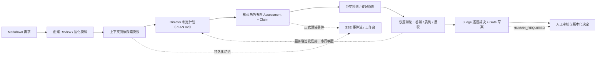

# 重明（Chongming）

[English](README.md)

> **双睛照见，众议成明。** 以协议、证据和人工 Gate 约束多 Agent 需求评审，而不把它做成一次不可追溯的群聊。

重明是一个面向研发需求评审的多智能体工作台。它接收 Markdown 需求与受控的本地仓库标识，让产品、项目、前端、后端等角色独立提出 Claim；冲突进入受限辩论，Judge 只给出 Gate 草案，最终决定始终由人完成。

## 名称来源与项目寓意

“重明”出自晋代王嘉《拾遗记》中的重明鸟。相传重明鸟“两目重瞳”，双目如炬，能识破伪装、驱逐邪祟；书中又称其为“双睛”，记有“**双睛在目**”、搏逐猛兽、使妖灾群恶不能为害的传说。民间在门户置其形象，也寄托了阻却不应进入之物的意涵。

项目借用的是这种意象，而不是把神话直接当作技术结论：

| 重明鸟意象 | 在本项目中的含义 |
|---|---|
| 双睛、重瞳 | 同一份需求由多个相互独立的专业视角审视，而不是接受单个模型的一次回答 |
| 识破伪装 | Claim 必须接受证据、反驳与协议校验；措辞看似合理不等于可以放行 |
| 守在门户之前 | Gate 位于研发实施之前，把未收敛的风险交给人工处理，而不是静默放入下游 |
| 鸟只照见，不替人裁决 | 重明负责照亮分歧；最终 Gate 仍由有责任主体的人作出 |

因此，项目的口号是“**双睛照见，众议成明**”。产品、项目、前端、后端四个核心角色构成首轮视角；架构、测试、安全、性能等按需角色可在必要时加入。它们的目标不是制造表面共识，而是让分歧、证据和决策路径清晰可见。

原文可见《[拾遗记·重明鸟](https://www.shidianguji.com/mid-page/7595700568979554313)》；上表是重明项目对该意象的产品化解释。

## 为什么不是「多 Agent 群聊」

| 常见 Agent Demo | 重明的约束 |
|---|---|
| 对话结束即得到结论 | Claim、Challenge、Rebuttal、Judgement 与 Gate 均为强类型领域对象 |
| Agent 自己选择权限与身份 | 服务端重新绑定 review、attempt、role、版本号和幂等键 |
| 模型输出直接改变流程 | `ReviewProtocolGuard` 校验状态机、角色和动作后才提交命令 |
| 只看最终回答 | 业务事件带全局 sequence，可通过 SSE 回放评审过程 |
| AI 直接放行需求 | AI 仅生成草案；`HUMAN_REQUIRED` 进入人工等待态，人工决定版本化留痕 |

这套方向借鉴了开源 Agent 工程的两项成熟实践：AgentScope Java 的受控工具调用、可观测与运行时中断能力，以及 LangGraph 的持久状态、人工介入和可恢复工作流理念。重明不复制它们的通用编排层，而是把这些原则收敛为“研发评审协议”。

## 当前能力

| 能力 | 当前状态 | 说明 |
|---|---|---|
| Markdown 受理与评审工作台 | 已可本地联调 | `POST /api/reviews` 创建评审，工作台入口 `/review/`（登录态保护） |
| 登录认证 | 已实现 | 用户名密码 + JWT；工作台内置预置 `admin` 账号（PLAN-025） |
| 需求全生命周期平台 | 已实现 | Dashboard、需求 CRUD/生命周期、评审/报告列表，分别由 `/api/dashboard`、`/api/requirements/**`、`/api/reviews`、`/api/reports` 提供 |
| 状态机、角色权限与幂等命令 | 已实现 | 非法阶段、越权角色和重复命令由服务端拒绝或安全重放 |
| OpenAI 兼容模型网关 | 已实现 | 支持角色模型配置、超时/退避与 Tool Call；运行时模型经环境变量配置；默认不启用推理/思考模式，供应商隐藏推理永不上公开流 |
| 本地仓库读取 | 已接入 Role Harness | 角色只获得其快照授权范围内的不透明 `fileRef`；越权路径既不暴露，也不扣减读取预算 |
| 上下文侦察（Context Scout） | 已接入运行时 | 快照先行的对话式工具流，持久化结论契约（摘要、模块根、入口点、约束、风险、证据路径、角色范围）；预算耗尽或模型失败时优雅降级 |
| 首轮评审 | 已接入运行时 | 核心角色提交五态 Assessment 与 Claim；平衡初审义务要求每个角色在成立处提交 SUPPORT 主张；必填检查点强制 |
| 需求答辩与派发协议 | 已接入运行时 | DEFENSE/CHALLENGE/REBUTTAL 定向信封；服务端校验角色、阶段、议题轮次与幂等；TTL + 去重；答辩人（PRODUCT 或就近激活角色）以 SUPPORT 主张回应质疑 |
| 质询/答辩确定性派发 | 已实现（PLAN-046） | 立场对立议题开题、答辩 SUPPORT 落库时服务端自动派发 CHALLENGE；每次质询提交后自动签发 REBUTTAL 信封；协调者只负责推进与收敛 |
| 辩论、Judge 与 Gate 草案 | 已接入运行时 | 议题级轮次（单一 DEBATE 阶段、每议题至多两轮）；全部议题终态后进裁决；Judge 逐题裁决并起草 Gate |
| 计划修订闭环 | 已实现（PLAN-036） | 协调者写 `plans/PLAN.md`；服务端将每次内容变化提升为 `PLAN_REVISED` 事件、运行通知与修订卡 |
| 领域事件与 SSE | 已实现 | 支持事件序号、历史回放、心跳及断线后的增量订阅 |
| 人工审核、报告与通知 | 核心链路可用 | 通知支持邮件目的地（PLAN-030）；外部 MCP 与生产契约仍需真实联调 |
| MySQL 持久化 | 已实现 | 迁移至 V29，覆盖用户、需求生命周期、评审聚合/事件、议题/回合/裁决、派发命令与议题中文标题 |
| 多实例恢复 | 未完成 | 运行时租约与启动扫描恢复仍为差距（CM-REQ-2026-001 跟踪）；聚合与调度器仍含进程内边界 |
| 安全审计、评测与故障演练 | 未完成 | 属于生产发布门禁，不应以本地 Demo 结果替代 |
| 回归基线 | 已验证 | 后端 `./mvnw.cmd test` → 783 项测试、0 失败/错误、30 项环境性跳过；前端 `vitest` → 159 通过 |

## 评审链路



运行时不依赖模型“自觉遵守流程”：模型只选择已下发的 Tool Schema；每个工具调用都会在服务端验证后再写入领域状态。`ReviewWorkflowDispatcher` 只监听已提交的正式事件，并在单个 review 内串行唤醒下一位 Agent，避免同一 Director 会话并发执行。

## 机制要点

评审协议已经历 PLAN-023 → PLAN-054 的演进。基础状态机之外的关键机制：

- **上下文侦察契约。** 快照固化后，专职 Scout 代理在有界读取预算内探索仓库，并持久化结论契约——摘要、模块根、入口点、约束、风险、证据路径与角色范围。预算耗尽或模型失败时，Scout 优雅降级、评审继续。
- **计划修订闭环。** 协调者在计划模式下把公开计划写入 `plans/PLAN.md`。服务端监听该文档，将每次内容变化提升为一条 `PLAN_REVISED` 事件，刷新工作台计划卡与运行流。启动时会创建一份模板初始计划但不展示；只有真实修订才渲染为卡片。
- **需求答辩拓扑。** 只有反对意见的议题仍有隐含答辩人——需求本身。协调者向产品角色（或就近激活角色）派发 DEFENSE，后者必须以 SUPPORT 主张逐条回应异议。方向固定：质疑方质询，答辩人作答。
- **质询/答辩确定性派发。** 质询不再依赖模型自觉。立场对立议题开题时，服务端自动向每个持有 OPPOSE 主张的角色派发 CHALLENGE；答辩 SUPPORT 落库时，服务端自动向质疑方派发 CHALLENGE；每次质询提交后，服务端向被质询方签发 REBUTTAL 信封。协调者只负责轮次推进与收敛。
- **议题级辩论生命周期。** 轮次按议题而非全局。每个议题在单一 DEBATE 阶段内独立推进至多两轮；`begin_second_round(topicId)` 只为单个议题开启第二轮；全部议题终态后才进入裁决。
- **工作台形态。** UI 采用简约去气泡设计：流式智能体回答、工具调用折叠成组（含单工具）、议题切换 Tab、Claim 全文弹框，以及整屏布局下各阶段定高内滚、无页面级滚动条。

## 架构

| 层次 | 责任 | 当前实现 |
|---|---|---|
| 交互层 | 工作台、受理、查询、SSE | Vue 3/Vite 静态资源 + Spring MVC |
| 领域层 | Review 状态机、Guard、Claim、Debate、Judge、Gate | Java 21、Spring Boot、强类型命令 |
| Agent 运行时 | Director/Scout/角色/Judge Harness、受限工具、运行态调度 | AgentScope Java Harness + 运行时上下文绑定 |
| 模型适配层 | OpenAI 兼容请求、流式消息、Tool Call、重试 | Model Gateway Adapter |
| 事件与存储 | sequence 事件、SSE 回放、MyBatis event store | MySQL 写模型已落地（迁移 V1–V29）；本地演示保留内存回退 |

## 快速开始

### 前置条件

- JDK 21
- Maven Wrapper 可用
- MySQL 5.6+（本项目迁移不使用 JSON 列）
- 一个支持 OpenAI Chat Completions 与 Tool Calling 的模型兼容接口

### 本地配置

使用 `src/main/resources/application-local.yml` 填写本机配置；该文件只能用于本地，禁止提交密钥。最小结构如下：

```yaml
review:
  persistence:
    enabled: true
    jdbc-url: jdbc:mysql://127.0.0.1:3306/chongming?characterEncoding=UTF-8
    username: your_user
    password: your_password
  model-gateway:
    enabled: true
    base-url: https://your-openai-compatible-endpoint/v1
    model-name: your_actual_model_name
    api-key: your_api_key
    log-conversation: true # 仅限本地排障，完成后关闭
repositories:
  allowed:
    - id: your-repository-id
      root: E:\\your\\local\\repository
```

`model-name` 不能保留默认的 `chongming-*-placeholder`，否则模型服务会返回 404。启用 `log-conversation` 会记录脱敏前后运行细节，仅应在受控本地调试时短暂开启。

如果本地配置文件曾进入版本控制或被共享，请立即移除其中的凭据并轮换数据库、模型网关密钥；README 不应成为复制真实密钥的载体。

### 构建与启动

```powershell
.\mvnw.cmd test
.\mvnw.cmd spring-boot:run
```

浏览器打开 [http://localhost:8080/review/](http://localhost:8080/review/)。工作台为登录态保护（PLAN-025）：使用预置 `admin` 账号登录（初始密码 `Admin@123`，首次登录请修改），或注册新用户。默认进入需求 Dashboard；旧的直接创建评审表单仍保留在 `/review/#/create`。

前端源码位于 `frontend/`。修改前端后需要重新构建并提交同步后的 `src/main/resources/static/review/` 产物：

```powershell
Set-Location frontend
npm test
npm run build
```

## 调试一场评审

1. 在工作台创建评审，上传 `.md`，选择已配置的仓库标识。
2. 使用 `main` 或目标分支；Commit 可为空，填写时必须是 40 位 SHA。
3. 启动后观察工作台 SSE 状态和服务端日志。模型网关 401/404 首先检查 API Key、`base-url` 和实际模型名。
4. 评审卡在某阶段时，先查询 `GET /api/reviews/{reviewId}` 与 SSE 事件，不要直接修改数据库状态。

调试接口包括：

- `GET /api/reviews/{reviewId}`：评审聚合状态。
- `GET /api/reviews/{reviewId}/plans`：计划快照。
- `GET /api/reviews/{reviewId}/debates`：辩论状态与回合。
- `GET /api/reviews/{reviewId}/claims`：已持久化的 Claim。
- `GET /api/reviews/{reviewId}/events`：SSE 事件流。
- `POST /api/reviews/{reviewId}/cancel`、`/retry`：生命周期命令。

## 生产化差距

当前版本适合本地联调、演示和协议验证，**不适合作为多实例生产服务**。MySQL 命令持久化与评审/事件写模型已落地（迁移至 V29），但发布前仍须完成：

- 实现跨实例数据库 lease、启动扫描、可恢复 Agent 任务与失败转人工（CM-REQ-2026-001 跟踪）。
- 接入仓库快照/证据工具的真实只读 scope，并完成模型冒烟与权限审计。
- 完成真实 MySQL 回放压测、安全审计、故障注入与评测基线。

## 项目文档

- [总体实施路线图](docs/AIREVIEW-PLAN-001-总体实施路线图.md)
- [Harness 与角色编排](docs/AIREVIEW-PLAN-008-Harness主持人与角色编排.md)
- [辩论、Judge 与 Gate](docs/AIREVIEW-PLAN-009-对抗辩论Judge与Gate.md)
- [领域事件、SSE 与恢复](docs/AIREVIEW-PLAN-010-领域事件SSE与恢复.md)
- [人工审核、报告与通知](docs/AIREVIEW-PLAN-011-人工审核报告与通知.md)
- [需求全生命周期平台](docs/AIREVIEW-PLAN-021-需求全生命周期管理平台.md)
- [需求答辩人、平衡初审与冲突扩展](docs/AIREVIEW-PLAN-033-需求答辩人与平衡初审机制.md)
- [协调者计划修订闭环](docs/AIREVIEW-PLAN-036-协调者计划修订闭环.md)
- [辩题中文标题](docs/AIREVIEW-PLAN-044-辩题中文标题.md)
- [质询确定性派发](docs/AIREVIEW-PLAN-046-质询确定性自动派发.md)
- [议题级辩论生命周期](docs/AIREVIEW-PLAN-047-议题级辩论生命周期.md)
- [需求平台验证记录](docs/验证记录/RequirementPlatformReport.md)
- [开发约束](AGENTS.md)

## 开源对标

| 项目 | 借鉴点 | 重明的落点 |
|---|---|---|
| [AgentScope Java](https://github.com/agentscope-ai/agentscope-java) | 受控工具调用、运行时中断、可观测与多 Agent 协作 | 使用 Harness 承载角色，但由 Review 协议和白名单收紧工具边界 |
| [LangGraph](https://github.com/langchain-ai/langgraph) | 持久执行、人工介入、状态可视化 | 以人工 Gate 和事件回放实现审阅；持久恢复仍是待完成门槛 |

项目不会把“接入了 Agent 框架”当成生产就绪证明。对标开源项目的下一步，是补齐 durable execution、审计和评测，而不是继续堆叠角色数量。

## 目录结构

```text
src/main/java/ai/cc/chongming/   Java 生产代码
src/main/resources/              应用配置与内嵌工作台静态资源
src/test/java/                   单元与集成测试
frontend/                        Vue 3/Vite 源码与前端测试
docs/                            技术方案、集成契约和分阶段计划
.agentscope/workspace/           本地 Agent 工作区（不提交）
.learnings/                      错误、需求与经验记录
```

## 贡献

每项实现应同步更新对应 `AIREVIEW-PLAN-xxx`、测试证据和 `.learnings/`。提交前至少运行与改动范围匹配的测试；前端改动还须重建并同步静态资源。详细规则见 [AGENTS.md](AGENTS.md)。
