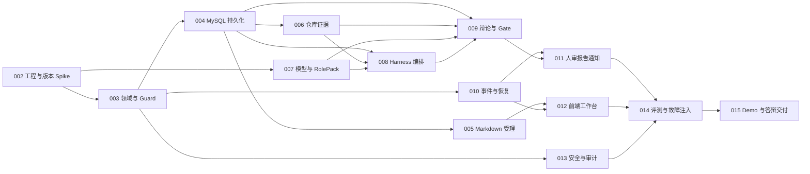

# AI 需求评审 Agent 总体实施路线图

> **状态**: 🚧 进行中
> **创建日期**: 2026-07-14
> **目标**: 将技术方案拆分为可独立开发、独立验证、可并行交付的计划单元。
> **上位方案**: `docs/技术方案/AI需求评审Agent_AgentScope2技术方案.md`

## 0. 背景与执行规则

当前仓库已完成 Spring Boot 与 AgentScope 2.0.0 兼容性工程基线，包含配置契约、Adapter/Fake 和 Harness 合约测试；尚未形成评审领域代码。项目采用单体模块，但能力横跨 AgentScope
Harness、
MySQL、MyBatis、SSE、Vue 3/Vite 前端（静态产物部署）、模型网关和通知 MCP，因此计划统一放在项目根 `docs/` 下。

执行约束：

- 每个专项计划是一个最小交付单元，建议对应一个分支或 PR；分支名使用 `codex/aireview-plan-xxx`。
- 开始专项前确认其前置计划已达到退出标准；允许使用已冻结接口 Mock 并行开发。
- 新建或修改 Java 类必须包含 `[AIREVIEW-PLAN-XXX#段号]` 来源标记和 `@author wangli`。
- 每个功能遵循测试先行：先提交失败测试，再实现，再重构；单元与集成覆盖率目标不低于 80%。
- 每完成一段，同步更新计划段状态、文件清单、变更记录和实际偏差。
- Java 编辑、构建、测试和问题检查优先使用 IDEA MCP；禁止在循环中逐条查询数据库。

- 文档出现冲突时，MVP 角色范围以《AI需求评审Agent_团队赛道项目方案V2》为准；评审状态机及其余架构、技术与交付决策以《AI需求评审Agent_AgentScope2技术方案》为准，并在同次变更中同步修正相关专项计划。

## 1. 分段方案与计划地图

| 计划       | 交付能力                         | 前置                   | 可并行组 | 独立退出证据                         |
|----------|------------------------------|----------------------|------|--------------------------------|
| PLAN-002 | 工程基线与 AgentScope 2.0.0 Spike | 无                    | A    | 正式依赖可解析，兼容矩阵与测试通过              |
| PLAN-003 | 领域契约、状态机与 ProtocolGuard      | PLAN-002 的 Java 基线   | A    | 纯领域测试覆盖合法/非法迁移                 |
| PLAN-004 | MySQL 双层持久化                  | PLAN-002、003         | B    | Testcontainers 完成迁移、CRUD、恢复测试  |
| PLAN-005 | Markdown 受理与需求快照             | PLAN-003、004         | B    | `.md` 上传、哈希、幂等与非法输入测试通过        |
| PLAN-006 | 仓库快照、EvidenceLedger 与只读工具    | PLAN-003、004         | B    | 路径越界被拒绝，证据可回跳并校验哈希             |
| PLAN-007 | 模型网关、结构化输出与 RolePack         | PLAN-002、003         | B    | MockModel 合约、超时重试和失败降级通过       |
| PLAN-008 | ReviewDirectorHarness 与角色编排  | PLAN-004、006、007     | C    | Plan、spawn/send、会话恢复和动态角色测试通过  |
| PLAN-009 | Claim、冲突检测、辩论、Judge 与 Gate   | PLAN-003、004、006、007 | C    | 两轮真实质询链可追溯并受 Guard 约束          |
| PLAN-010 | 领域事件、SSE、取消与恢复               | PLAN-003、004         | B    | sequence 回放、断线续传、重试 attempt 通过 |
| PLAN-011 | 人工审核、报告与学习通通知                | PLAN-009、010         | D    | 草稿 CRUD、版本化决定、Outbox 幂等通过      |
| PLAN-012 | 前端辩论工作台                      | PLAN-005、010 接口冻结    | C/D  | 可回放辩论、证据、计划和人工审核操作             |
| PLAN-013 | 安全、权限、审计与可观测性                | PLAN-002、003，贯穿实施    | A-D  | 越权、注入、密钥、指标和日志检查通过             |
| PLAN-014 | 评测基线、故障注入与质量门禁               | PLAN-005 至 013       | E    | 6 组数据集、单/多 Agent 对比、恢复演练       |
| PLAN-015 | Demo、答辩与 AI 开发证据交付           | PLAN-011 至 014       | F    | 一键演示、故障预案、视频与证据包完成             |

## 2. 依赖关系

## 3. 实施顺序与两人并行执行建议

### 3.1 第 1 周：解除框架风险

- 开发者 A：PLAN-002；完成后进入 PLAN-003。
- 开发者 B：基于冻结 DTO 草拟 PLAN-010 事件契约和 PLAN-012 前端线框，不写依赖未确认的 AgentScope 实现。
- 周门禁 G0：AgentScope 2.0.0、`agentscope-extensions-mysql`、Model 扩展均能解析；核心 API 行为有自动化结论。

### 3.2 第 2 周：可信输入与事实层

- 开发者 A：PLAN-004、005。
- 开发者 B：PLAN-006、007。
- 周门禁 G1：一份 Markdown + 一个只读仓库可生成带哈希的 EvidenceBlock；MySQL 重启后可恢复。

### 3.3 第 3 周：多 Agent 编排

- 开发者 A：PLAN-008。
- 开发者 B：PLAN-010，并为 PLAN-009 先写领域测试。
- 周门禁 G2：四个核心角色能独立立论，父子会话、计划和事件来源可验证。

### 3.4 第 4 周：真实辩论闭环

- 开发者 A：PLAN-009 的 DebateTools、Judge、Gate。
- 开发者 B：PLAN-012 的事件时间线和 Evidence 卡片。
- 周门禁 G3：至少两个相反 Claim 完成质询、反驳、立场变化、裁决和反向追溯。

### 3.5 第 5 周：人工闭环和安全收口

- 开发者 A：PLAN-011。
- 开发者 B：PLAN-012 人工审核界面、PLAN-013 安全验证。
- 周门禁 G4：人工决定版本化提交并触发一次幂等通知；SSE 断线恢复成功。

### 3.6 第 6 周：评测和交付

- 两人共同执行 PLAN-014、015；一人操作 Demo，一人按故障脚本注入并记录恢复证据。
- 最终门禁 G5：评测、视频、演示脚本、架构图、Codex 证据链和回滚预案齐全。

## 4. 全局 Definition of Done

每个专项计划只有同时满足以下条件才能标记完成：

1. 计划中所有必做段为 ✅，文件清单与实际一致。
2. 代码含正确计划引用和 `@author wangli`。
3. IDEA 构建 `isSuccess=true`，文件 problems 无 ERROR。
4. 新增测试先失败后通过；单元、Web、MySQL 集成或合约测试与风险匹配。
5. 无明文密钥，无目录逃逸，无绕过 ProtocolGuard 的业务写入。
6. `git diff` 已人工审阅，配置、SQL、API 和事件变更有文档。
7. 产生可归档验证证据：测试报告、关键响应、事件样本或截图。
8. `.learnings/LEARNINGS.md` 记录偏差、框架陷阱或可复用做法。

## 5. 计划文件清单

### 5.1 新建

| 文件                                               | 计划段  | 状态 |
|--------------------------------------------------|------|----|
| `docs/AIREVIEW-PLAN-001-总体实施路线图.md`              | #0-7 | ✅  |
| `docs/AIREVIEW-PLAN-002-工程基线与AgentScope正式版验证.md` | #1   | ⏳  |
| `docs/AIREVIEW-PLAN-003-领域契约状态机与协议守卫.md`         | #1   | ⏳  |
| `docs/AIREVIEW-PLAN-004-MySQL持久化与数据迁移.md`        | #1   | ⏳  |
| `docs/AIREVIEW-PLAN-005-Markdown受理与需求快照.md`      | #1   | ⏳  |
| `docs/AIREVIEW-PLAN-006-仓库快照与证据账本.md`            | #1   | ⏳  |
| `docs/AIREVIEW-PLAN-007-模型网关与角色包.md`             | #1   | ⏳  |
| `docs/AIREVIEW-PLAN-008-Harness主持人与角色编排.md`      | #1   | ⏳  |
| `docs/AIREVIEW-PLAN-009-对抗辩论Judge与Gate.md`       | #1   | ✅  |
| `docs/AIREVIEW-PLAN-010-领域事件SSE与恢复.md`           | #1   | ⏳  |
| `docs/AIREVIEW-PLAN-011-人工审核报告与通知.md`            | #1   | ⏳  |
| `docs/AIREVIEW-PLAN-012-前端辩论工作台.md`              | #1   | ⏳  |
| `docs/AIREVIEW-PLAN-013-安全审计与可观测性.md`            | #1   | ⏳  |
| `docs/AIREVIEW-PLAN-014-评测故障注入与质量门禁.md`          | #1   | ⏳  |
| `docs/AIREVIEW-PLAN-015-Demo答辩与交付证据.md`          | #1   | ⏳  |

### 5.2 修改

当前只拆分计划，不修改业务代码。各专项实施时按其文件清单更新。

## 6. 风险与应对

| 风险                        | 触发信号         | 应对                                 |
|---------------------------|--------------|------------------------------------|
| AgentScope 正式版行为与本地源码不同   | Spike 合约测试失败 | 停止依赖链，通过 Adapter 兼容，不切 SNAPSHOT    |
| 两人同时修改核心 DTO              | 合并冲突或字段漂移    | PLAN-003 先冻结契约；后续只通过版本化变更更新        |
| 前端等待后端                    | API 未实现      | 使用 PLAN-010 固定事件样本和 Mock JSON 并行开发 |
| 模型不稳定导致测试漂移               | 同场景多次结论不同    | 合约测试使用 MockModel；真实模型仅做评测和冒烟       |
| MySQL 与 AgentScope 状态职责混乱 | 业务查询依赖运行态表   | 双层表前缀、Repository 边界和恢复测试强制隔离       |
| 计划过细但无人维护                 | 代码进度与状态不一致   | 每次 PR 把计划更新作为合并门禁                  |

## 7. 变更记录

| 日期         | 变更                                       |
|------------|------------------------------------------|
| 2026-07-14 | 首次创建，拆分 14 个专项计划，定义依赖 DAG、两人并行路线和全局验收门禁。 |
| 2026-07-15 | 明确文档优先级：MVP 角色以需求文档为准，其余决策以技术方案为准。 |
