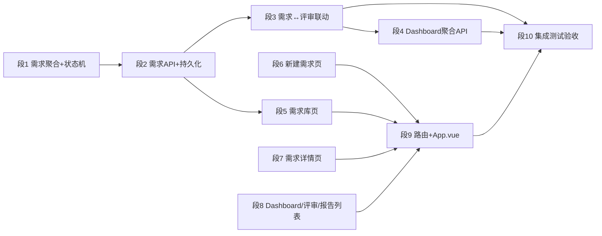

# 需求全生命周期管理平台建设（REQLIFE）

> **状态**: ⏳ 待实施
> **创建日期**: 2026-07-31
> **目标**: 将重明从"单一评审工作台"扩展为"需求全生命周期管理平台"——需求从新建、待评审、评审中、Gate 决策到开发完成全程可管理、可追踪，评审作为内核嵌入需求流转。
> **前置**: 评审内核 `AIREVIEW-PLAN-001~020` 已完成（状态机、领域事件、辩论、Judge/Gate、人工审核、SSE、Live 运行流均已落地）
> **设计原型**: `docs/ui-patterns-demo/platform.html`（编辑器风格，8 页面全链路）

---

## 0. 背景与差距分析

### 0.1 现状

重明当前是一个**评审工具**而非**需求管理平台**：

| 能力 | 现状 | 说明 |
|------|------|------|
| 需求受理 | `POST /api/reviews` 一步创建评审 | 需求以 Markdown 快照形式嵌入 `review_request`，无独立"需求"实体 |
| 生命周期 | `ReviewStage` 状态机（PENDING→…→COMPLETED） | 覆盖**单次评审**流程，不覆盖需求跨阶段流转 |
| 用户 | `submitter_id` 字符串 + 人工审核人 | 有 `ReviewerIdentityProvider`（`Permission{REVIEW,OVERRIDE}`），无需求负责人/创建人字段 |
| 持久化 | `review.persistence.enabled=false` 默认关闭 | 默认全 in-memory；local profile 启用 MyBatis+Flyway。新需求存储需**双实现** |
| 前端 | 5 个路由：create / workbench / live / scout / report | 无 Dashboard、无需求库、无需求详情 |
| 数据聚合 | 无 | 无 `GET /api/reviews` 列表、无按状态统计、无跨评审查询 |

### 0.2 与原型（platform.html）的差距

| 原型页面 | 对应能力 | 现状差距 |
|---------|---------|---------|
| 工作台 Dashboard | KPI 统计 + 待处理评审 + 最近动态 | **完全没有**，需新增聚合 API + 页面 |
| 需求库 | 状态筛选 + 搜索 + 表格 | **完全没有**，需新增需求实体 + 列表 API + 页面 |
| 新建需求 | 需求表单 + 上传 .md + 一键启动评审 | 现有创建表单是"评审参数表单"，需改为"需求表单" |
| 需求详情 | 生命周期进度条 + 文档 + Scout 发现 + 角色 + Gate | **完全没有**，需新增详情 API + 页面 |
| 评审列表 | 评审进度卡片 | 需新增按需求聚合的评审查询 API + 页面 |
| 评审工作台 | 庭审式辩论 | **已有**（工作台 + Live），保留 |
| 评审报告 | KPI + Claim 表 + 收敛 + Gate | **已有**报告页，保留并联动需求状态 |

### 0.3 设计决策

1. **需求（requirement）作为新聚合**，`review_request` 通过 `requirement_id` 关联到需求；现有评审流程不动，仅新增关联。
2. **需求生命周期状态**独立于评审状态：`DRAFT → PENDING_REVIEW → REVIEWING → APPROVED / REJECTED / RETURNED → DEVELOPING → DONE`，由评审事件驱动自动流转 + 人工手动修正。
3. **用户体系先做最简版**：新增 `assignee_id`、`creator_id` 字段，不做完整认证（沿用现有 submitter 字符串），为后续鉴权留扩展点。
4. **前端新增页面复用现有组件**：工作台/Live 组件原样保留，新增需求库/详情/Dashboard 页面；样式对齐 `platform.html` 的编辑器风格。
5. **兼容优先**：所有新增 API 新增路径（`/api/requirements/**`），不修改现有 `/api/reviews/**` 契约；数据库用 Flyway 新迁移 `V11+` 追加表/列，不做破坏性变更。

---

## 1. 分段方案

### 段 1：需求聚合与生命周期（后端领域层）

**目标**：新增 `Requirement` 领域聚合 + `RequirementLifecycleStateMachine`，提供生命周期校验。

**涉及文件（新建）**：
- `review/domain/model/Requirement.java` — 需求聚合（id、标题、描述、status、creatorId、assigneeId、reviewId、createdAt、updatedAt、version）
- `review/domain/model/RequirementTypes.java` — `RequirementId`、`RequirementStatus` 枚举（DRAFT/PENDING_REVIEW/REVIEWING/APPROVED/REJECTED/RETURNED/DEVELOPING/DONE）、`RequirementLifecycleEvent` 枚举（CREATED/SUBMITTED/REVIEW_STARTED/APPROVED/REJECTED/RETURNED/DEVELOPING_STARTED/DONE）
- `review/domain/protocol/RequirementLifecycleStateMachine.java` — 状态迁移校验（非法迁移抛 `ReviewDomainException`）
- `review/domain/exception/RequirementErrorCode.java` — 新增错误码

**关键实现细节**：

```java
// RequirementStatus 迁移矩阵（允许的迁移）
DRAFT          → PENDING_REVIEW, CANCELLED
PENDING_REVIEW → REVIEWING
REVIEWING      → APPROVED, REJECTED, RETURNED
APPROVED       → DEVELOPING
DEVELOPING     → DONE
RETURNED       → PENDING_REVIEW（修订后重新提交）
```

- 需求创建时 `status=DRAFT`，`reviewId` 初始为空；提交评审时置 `PENDING_REVIEW` 并绑定 reviewId。
- 复用现有 `Review` 聚合的版本控制风格（`version` 乐观锁）。

---

### 段 2：需求管理 API（后端接口层 + 持久化）

**目标**：需求 CRUD + 列表 + 状态流转命令；Flyway V11 迁移新增 `requirement` 表；`review_request` 增加 `requirement_id` 列。

**涉及文件（新建）**：
- `review/domain/repository/RequirementRepository.java` — 仓储接口（save / findById / findByStatus / findByAssignee / findByReviewId / search）
- `review/application/RequirementCommandService.java` — 创建、提交评审、更新状态命令
- `review/application/RequirementQueryService.java` — 列表/详情查询（含分页）
- `review/api/RequirementCommandController.java` — `POST /api/requirements`
- `review/api/RequirementQueryController.java` — `GET /api/requirements`（分页+筛选）、`GET /api/requirements/{id}`
- `review/infrastructure/persistence/MyBatisRequirementRepository.java` — MyBatis 实现（`@ConditionalOnProperty(review.persistence.enabled=true)`）
- `review/infrastructure/persistence/mapper/RequirementMapper.java`
- `review/infrastructure/review/InMemoryRequirementRepository.java` — in-memory 实现（默认生效，与现有 `InMemory*` 仓库同模式）
- `resources/db/migration/V11__create_requirement_and_link_review.sql` — 新表 + `review_request.requirement_id` 列（可空，兼容已有评审）

**关键实现细节**：

```sql
-- V11__create_requirement_and_link_review.sql
CREATE TABLE requirement (
    requirement_id CHAR(36) NOT NULL,
    title VARCHAR(255) NOT NULL,
    description_md MEDIUMTEXT NULL,
    requirement_status VARCHAR(32) NOT NULL,
    creator_id VARCHAR(128) NOT NULL,
    assignee_id VARCHAR(128) NULL,
    repository_path VARCHAR(1024) NULL,
    priority VARCHAR(8) NULL,               -- P0/P1/P2/P3
    review_id CHAR(36) NULL,                -- 关联最近的评审
    version BIGINT NOT NULL DEFAULT 0,
    created_at DATETIME(3) NOT NULL DEFAULT CURRENT_TIMESTAMP(3),
    updated_at DATETIME(3) NOT NULL DEFAULT CURRENT_TIMESTAMP(3) ON UPDATE CURRENT_TIMESTAMP(3),
    PRIMARY KEY (requirement_id),
    KEY idx_requirement_status (requirement_status),
    KEY idx_requirement_assignee (assignee_id),
    CONSTRAINT fk_requirement_review FOREIGN KEY (review_id) REFERENCES review_request (review_id)
) ENGINE=InnoDB DEFAULT CHARSET=utf8mb4 COLLATE=utf8mb4_unicode_ci;

ALTER TABLE review_request ADD COLUMN requirement_id CHAR(36) NULL;
```

- 列表 API 支持 `?status=REVIEWING&assignee=张工&page=1&size=20&keyword=增量`。
- 仓储接口 + 双实现（InMemory / MyBatis）对齐现有 `ReviewRegistry`、`InMemoryReviewRegistry` 模式；两个实现共享同一接口，由 Spring profile 决定装配。
- 创建人/负责人沿用现有自由字符串标识（`ReviewerIdentityProvider.currentReviewer().reviewerId()`），不引入完整账号体系。

---

### 段 3：需求 ↔ 评审联动（生命周期自动流转）

**目标**：评审事件驱动需求状态自动流转；评审完成时回写需求。

**涉及文件（新建/修改）**：
- `review/application/RequirementLifecycleService.java`（新建）— 监听评审状态变化
- `review/application/ReviewEventListener.java`（修改）— 在 `REVIEW_STARTED` / Gate 决策事件后调用需求流转
- `review/infrastructure/event/InMemoryReviewRegistry.java` / MyBatis 事件存储（修改）— 必要时透传 requirementId

**关键实现细节**：

| 评审事件 | 需求状态流转 |
|---------|-------------|
| 评审创建（intake） | `PENDING_REVIEW → REVIEWING`（绑 reviewId） |
| Gate: PASS / CONDITIONAL | `REVIEWING → APPROVED` |
| Gate: BLOCK | `REVIEWING → REJECTED` |
| Gate: RETURN | `REVIEWING → RETURNED`（待修订后重新提交） |
| 需求手动操作"开始开发" | `APPROVED → DEVELOPING` |
| 需求手动操作"完成" | `DEVELOPING → DONE` |

- 联动通过**事件监听**而非在 Controller 里硬编码，保持评审内核解耦。
- 手动流转（开始开发/完成）走需求命令 API，同样经状态机校验。

---

### 段 4：Dashboard 聚合与统计 API

**目标**：提供平台首页所需聚合数据。

**涉及文件（新建）**：
- `review/application/DashboardQueryService.java`
- `review/api/DashboardController.java` — `GET /api/dashboard`

**关键实现细节**：

```java
public record DashboardSnapshot(
    Map<String, Long> requirementCountByStatus,   // 全部/评审中/已通过/已驳回...
    List<ActiveReviewView> pendingReviews,          // 最近待处理评审
    List<ActivityView> recentActivities) {}         // 最近动态（需求/评审事件摘要）
```

- `pendingReviews` 取 `stage ∈ {INITIAL_REVIEW..WAITING_HUMAN}` 的最新 N 条，附共识度（从 debate 查询）。
- `recentActivities` 从事件存储聚合最近事件（跨需求+评审）。

---

### 段 5：前端 — 需求库页面

**目标**：需求列表（状态筛选 + 搜索 + 分页表格），对齐 `platform.html` 编辑器风格。

**涉及文件（新建）**：
- `frontend/src/api/requirement-api.js` — 需求 REST 客户端
- `frontend/src/views/RequirementListView.vue`
- `frontend/src/router/index.js`（修改）— 新增 `/requirements` 路由

**关键实现细节**：
- 顶部筛选 chip（全部/草稿/待评审/评审中/已通过/已驳回/开发中），点击切换 `GET /api/requirements?status=...`。
- 表格列：编号 / 名称 / 状态 tag / 优先级 badge / 负责人 / 更新时间。
- 行点击跳转 `/requirements/{id}`。
- 右侧"新建需求"按钮。

---

### 段 6：前端 — 新建需求页面

**目标**：需求表单（名称 / 上传 .md / 仓库 / 分支 / 优先级 / 负责人 / 描述），支持"保存草稿"和"提交并启动评审"。

**涉及文件（新建）**：
- `frontend/src/views/RequirementCreateView.vue`
- `frontend/src/router/index.js`（修改）— 新增 `/requirements/new`

**关键实现细节**：
- "保存草稿" → `POST /api/requirements`（status=DRAFT）。
- "提交并启动评审" → 先 `POST /api/requirements`，再调用现有 `reviewApi.createReview` + `startReview`（复用 `ReviewCreateView` 逻辑），成功后跳转工作台。
- 复用现有 `ReviewCreateView` 的上传/校验逻辑，剥离为可复用表单。

---

### 段 7：前端 — 需求详情页面

**目标**：需求详情（生命周期进度条 + 需求文档 + Scout 发现 + 参与角色 + Gate 状态 + 评审记录）。

**涉及文件（新建）**：
- `frontend/src/views/RequirementDetailView.vue`
- `frontend/src/router/index.js`（修改）— 新增 `/requirements/:id`
- 复用组件：`DebateTimeline`、`EvidenceDrawer`、`HumanReviewPanel`（如需要）

**关键实现细节**：
- 生命周期进度条：`DRAFT → PENDING_REVIEW → REVIEWING → GATE → DEVELOPING → DONE`，当前状态高亮。
- 右侧栏：Scout 发现（复用现有 scout API）、参与角色（从 review 查询）、Gate 状态（从 `getHumanGateVersions`）。
- "进入评审"按钮跳转 `/reviews/{reviewId}`。
- 从需求详情可触发"开始开发/完成"手动流转（调需求命令 API）。

---

### 段 8：前端 — Dashboard / 评审列表 / 报告列表

**目标**：平台首页 + 评审列表 + 报告列表三页。

**涉及文件（新建）**：
- `frontend/src/views/DashboardView.vue`
- `frontend/src/views/ReviewListView.vue`
- `frontend/src/views/ReportListView.vue`
- `frontend/src/api/dashboard-api.js`
- `review/application/ReviewListQueryService.java` — 跨评审列表/聚合查询
- `review/api/ReviewListController.java` — `GET /api/reviews`（列表，分页+状态筛选）
- `frontend/src/api/review-list-api.js`（或并入现有 review-api）
- `frontend/src/router/index.js`（修改）— 新增 `/`（Dashboard）、`/reviews`、`/reports`

**关键实现细节**：
- **评审列表 API**：现有 `GET /api/reviews/{reviewId}` 只查单个评审，**无列表端点**。新增 `GET /api/reviews?stage=&status=&page=&size=`，由 `ReviewListQueryService` 聚合：
  - 状态分布：从 `review_event` 最新事件按 `stage` 分组统计（跨评审扫描 `GROUP BY stage`）。
  - 活跃评审：`stage ∈ {INITIAL_REVIEW..WAITING_HUMAN}` 的最近 N 条，附共识度（复用 `ReviewDebateStore` 批量查）。
  - 进度：`progress` 字段已由事件携带（PLANNING=20 … COMPLETED=100）。
- Dashboard：KPI 卡片（需求总数/评审中/已通过/已驳回）+ 待处理评审列表 + 最近动态，数据来自 `GET /api/dashboard`。
- 评审列表：进度卡片复用 `platform.html` 的 rv-card 样式。
- 报告列表：`GET /api/reviews?hasReport=true` 或新增 `GET /api/reports`；点击跳转现有报告页。
- **双存储适配**：`ReviewPersistenceMapper` 现有查询全部按单 `review_id` 限定，段 8 需新增跨评审 SQL（`findReviewSummaries` / `countByStage`，`@ConditionalOnProperty` 持久化启用时）；默认 in-memory 事件存储同样提供跨评审扫描。

---

### 段 9：路由改造 + 创建流程整合 + 静态资源构建

**目标**：App.vue 增加全局侧边导航；入口路由改为 Dashboard；构建嵌入静态资源。

**涉及文件（修改）**：
- `frontend/src/App.vue` — 新增侧边导航（工作台/需求库/新建需求/评审列表/评审报告）+ 顶栏
- `frontend/src/router/index.js` — 默认路由 `/` 改为 Dashboard
- `src/main/resources/static/review/` — `npm run build` 后提交产物

**关键实现细节**：
- 现有 `/review/` 入口保留，新增页面沿用同一 hash 路由体系。
- 构建后需验证 `.\mvnw spring-boot:run` 下 `/review/` 正常。

---

### 段 10：集成测试与验收

**目标**：端到端验证"新建需求 → 提交评审 → 评审闭环 → 需求状态流转 → Dashboard 汇总"。

**涉及文件（新建/修改）**：
- `src/test/java/.../RequirementLifecycleIT.java` — Testcontainers MySQL 集成测试
- `src/test/java/.../RequirementCommandServiceTest.java` — 单元测试
- `src/test/java/.../RequirementApiControllerTest.java` — MockMvc 测试
- `frontend/src/.../requirement-*.test.js` — 前端组件测试
- `docs/验证记录/RequirementPlatformReport.md` — 验证记录

**验收清单**：
1. `POST /api/requirements` 创建草稿成功。
2. 提交评审后需求 `PENDING_REVIEW → REVIEWING` 自动流转。
3. Gate 决策后需求状态正确更新（PASS→APPROVED / BLOCK→REJECTED / RETURN→RETURNED）。
4. `GET /api/requirements` 分页+筛选+搜索正确。
5. `GET /api/dashboard` 返回聚合统计。
6. 前端 8 个页面全链路可点击，评审工作台/Live 无回归。
7. 单元+集成覆盖率 ≥ 80%（新增代码）。
8. 无明文密钥、无破坏性数据库变更、现有 `/api/reviews/**` 契约不变。

---

## 2. 文件清单

### 2.1 新建

| 文件 | 计划段 | 状态 |
|------|--------|------|
| `src/main/java/ai/cc/chongming/review/domain/model/Requirement.java` | #1 | ⏳ |
| `src/main/java/ai/cc/chongming/review/domain/model/RequirementTypes.java` | #1 | ⏳ |
| `src/main/java/ai/cc/chongming/review/domain/protocol/RequirementLifecycleStateMachine.java` | #1 | ⏳ |
| `src/main/java/ai/cc/chongming/review/domain/exception/RequirementErrorCode.java` | #1 | ⏳ |
| `src/main/java/ai/cc/chongming/review/domain/repository/RequirementRepository.java` | #2 | ⏳ |
| `src/main/java/ai/cc/chongming/review/application/RequirementCommandService.java` | #2 | ⏳ |
| `src/main/java/ai/cc/chongming/review/application/RequirementQueryService.java` | #2 | ⏳ |
| `src/main/java/ai/cc/chongming/review/api/RequirementCommandController.java` | #2 | ⏳ |
| `src/main/java/ai/cc/chongming/review/api/RequirementQueryController.java` | #2 | ⏳ |
| `src/main/java/ai/cc/chongming/review/infrastructure/persistence/MyBatisRequirementRepository.java` | #2 | ⏳ |
| `src/main/java/ai/cc/chongming/review/infrastructure/persistence/mapper/RequirementMapper.java` | #2 | ⏳ |
| `src/main/java/ai/cc/chongming/review/infrastructure/review/InMemoryRequirementRepository.java` | #2 | ⏳ |
| `src/main/resources/db/migration/V11__create_requirement_and_link_review.sql` | #2 | ⏳ |
| `src/main/java/ai/cc/chongming/review/application/RequirementLifecycleService.java` | #3 | ⏳ |
| `src/main/java/ai/cc/chongming/review/application/DashboardQueryService.java` | #4 | ⏳ |
| `src/main/java/ai/cc/chongming/review/api/DashboardController.java` | #4 | ⏳ |
| `frontend/src/api/requirement-api.js` | #5 | ⏳ |
| `frontend/src/views/RequirementListView.vue` | #5 | ⏳ |
| `frontend/src/views/RequirementCreateView.vue` | #6 | ⏳ |
| `frontend/src/views/RequirementDetailView.vue` | #7 | ⏳ |
| `frontend/src/views/DashboardView.vue` | #8 | ⏳ |
| `frontend/src/views/ReviewListView.vue` | #8 | ⏳ |
| `frontend/src/views/ReportListView.vue` | #8 | ⏳ |
| `frontend/src/api/dashboard-api.js` | #8 | ⏳ |
| `src/main/java/ai/cc/chongming/review/application/ReviewListQueryService.java` | #8 | ⏳ |
| `src/main/java/ai/cc/chongming/review/api/ReviewListController.java` | #8 | ⏳ |
| `frontend/src/api/review-list-api.js` | #8 | ⏳ |
| 测试文件（Requirement 系列单测/集成/MockMvc） | #10 | ⏳ |
| `docs/验证记录/RequirementPlatformReport.md` | #10 | ⏳ |

### 2.2 修改

| 文件 | 计划段 | 状态 |
|------|--------|------|
| `src/main/java/ai/cc/chongming/review/application/ReviewEventListener.java` | #3 | ⏳ |
| `src/main/java/ai/cc/chongming/review/application/ReviewIntakeService.java` | #3 | ⏳ |
| `frontend/src/router/index.js` | #5/#6/#7/#8/#9 | ⏳ |
| `frontend/src/App.vue` | #9 | ⏳ |
| `src/main/resources/static/review/`（构建产物） | #9 | ⏳ |
| `README.md` | #10 收尾 | ⏳ |

---

## 3. 实施顺序



依赖关系：
1. **段 1 → 段 2 → 段 3 → 段 4**（后端串行，领域模型先行）
2. **段 2 完成后** → 段 5、6、7、8 可并行开发前端（基于冻结 API）
3. **段 9** 依赖段 5-8 完成
4. **段 10** 依赖段 3、4、9

建议实施节奏：
- **第 1 步**：段 1 + 段 2（后端核心，含 V11 迁移 + 测试）
- **第 2 步**：段 3（联动）+ 段 4（Dashboard API）
- **第 3 步**：段 5、6、7、8（前端四页，可并行）
- **第 4 步**：段 9（路由/App/构建）
- **第 5 步**：段 10（集成验收 + 文档收尾）

---

## 4. 风险与应对

| 风险 | 触发信号 | 应对 |
|------|---------|------|
| 需求聚合与评审聚合职责混淆 | 出现双重状态机竞争 | 评审状态机只管理单次评审，需求状态机只管理跨评审生命周期；联动走事件监听 |
| 现有评审数据无 requirement_id | 历史 review_request 关联为空 | V11 列为可空；需求详情对无关联评审显示"无评审记录" |
| 前端页面多导致工作量大 | 一次实现 8 页 | 复用现有组件（工作台/Live/报告），新页面基于 `platform.html` 样式快速落地 |
| 事件联动产生循环依赖 | 需求更新事件又触发评审 | 只监听评审→需求单向流转；需求手动流转不反向触评审 |
| 状态机遗漏迁移路径 | 非法迁移抛异常 | 先写全迁移矩阵的领域测试（RED）再实现 |
| 与现有评审契约冲突 | 接口签名变更 | 新增 `/api/requirements/**`，不改 `/api/reviews/**`；CI 验证现有测试不回归 |
| 双存储实现（InMemory/MyBatis）行为漂移 | 两实现查询结果不一致 | 仓储接口冻结契约，两个实现共用同一套契约测试；in-memory 用 `ConcurrentHashMap` + 流式筛选对齐 SQL 语义 |

---

## 5. 全局 Definition of Done（沿用 AIREVIEW 规则）

1. 计划中所有必做段为 ✅，文件清单与实际一致。
2. 代码含 `[AIREVIEW-PLAN-021#段号]` 引用和 `@author zyj`。
3. IDEA 构建 `isSuccess=true`，文件 problems 无 ERROR。
4. 新增测试先失败后通过；单元、Web、MySQL 集成测试与风险匹配，覆盖率 ≥ 80%。
5. 无明文密钥、无目录逃逸、无绕过协议守卫的业务写入。
6. `git diff` 人工审阅，配置、SQL、API 变更有文档。
7. 产生可归档验证证据：测试报告、关键响应、截图。
8. `.learnings/LEARNINGS.md` 记录偏差、陷阱或可复用做法。

---

## 6. 变更记录

| 日期 | 变更 |
|------|------|
| 2026-07-31 | 首次创建：基于 `platform.html` 原型与当前项目实现做差距分析，拆分 10 个计划段。 |
| 2026-07-31 | 探索 Agent 核对实现后补充：持久化默认关闭 → 需求存储需 InMemory/MyBatis 双实现；`ReviewerIdentityProvider` 身份模型可复用；`GET /api/reviews` 列表端点全缺 → 段 8 新增 `ReviewListQueryService` + `ReviewListController` + 跨评审 SQL。 |
