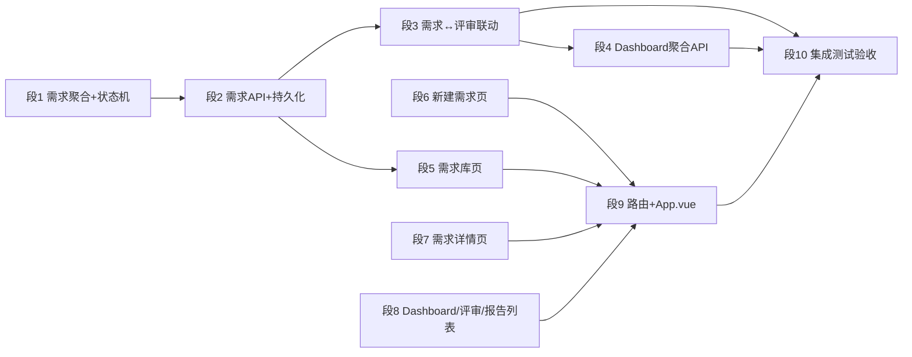

| 2026-08-05 | 工作台按 `platform.html` 对齐：`DashboardView` 改为 KPI 卡片（需求总数/评审中/已通过/已驳回，对接 `getDashboard` 投影）+ 待处理评审（可点击进 `/live`）+ 最近动态双卡片布局；`review.css` 新增 dashboard 样式（kpi/feed/card/tag）。修复 `package.json` 的 `test` 脚本 `--exclude tests/**` 在 shell 下被通配展开导致多个 e2e 文件时误跑 e2e 的问题（加引号）。前端单测 20/20、build 通过，static/review 同步新产物；新增 `tests/platform-shell.e2e.js` 壳冒烟用例（mock API，无需后端，需本机浏览器环境运行）。 |# 需求全生命周期管理平台建设（REQLIFE）

| 2026-08-05 | 门户壳微调：主内容区 `.platform-page` 居中并放宽到 1280px（修复宽屏下内容靠左留白）；侧边栏新增折叠按钮（`App.vue` + `.sidebar-collapsed`，折叠后收窄为 64px 图标列，隐藏分组标题/标签/徽章/用户区；移动端自动禁用折叠）。前端单测 20/20、build 通过，static/review 同步新产物。 |

| 2026-08-05 | 需求库按 `platform.html` 对齐：`RequirementListView` 改为胶囊状态过滤（全部/草稿/待评审/评审中/已通过/已驳回/开发中，计数来自 `getDashboard.requirementStatusCounts`）+ 右侧搜索框（回车触发）+ platform 风格表格（编号/需求名称/状态 tag/优先级 badge/负责人 assigneeId/更新时间/删除操作，保留真实分页与删除）。`review.css` 新增 req-filter/req-search/tag 变体/优先级 badge 样式。前端单测 20/20、build 通过，static/review 同步新产物（index-CtZlHlAU.js）。 |> **状态**: 🚧 **主体代码、覆盖率门禁和主要实库验收已收口，尚未达到发布/验收完成**。测试库 MySQL 5.6 已执行 Flyway V1-V13、H1/H2/H3 与 M2 的运行时验证；浏览器已覆盖草稿、列表、概览和报告空态。真实 Gate→开发→完成及报告持久化仍依赖一次获授权的模型网关评审。

| 2026-08-05 | 侧边栏折叠按钮移至顶部栏最左侧（汉堡按钮 ☰，折叠/展开 232px↔64px 图标列），替代原先 Logo 区按钮，位置更显眼且折叠态稳定可见；前端单测 20/20、build 通过，static/review 同步新产物（index-Bn-VW6iQ.js）。 |> **创建日期**: 2026-07-31

| 2026-08-05 | 侧边栏移除“新建需求”菜单项（需求库右上角已有新建入口）；新建需求页按 `platform.html` 对齐：卡片式表单 + 点击上传区（显示文件名/大小）+ 两列字段（仓库/分支、优先级/负责人）+需求描述/备注，评审启动高级字段（提交人/公开计划/计划原因/启动说明）收进“评审启动设置”折叠区，保留保存草稿与提交并启动评审两个动作。前端单测 20/20、build 通过，static/review 同步新产物（index-B4secusi.js）。 |> **目标**: 将重明从"单一评审工作台"扩展为"需求全生命周期管理平台"——需求从新建、待评审、评审中、Gate 决策到开发完成全程可管理、可追踪，评审作为内核嵌入需求流转。

| 2026-08-05 | 修复工作台/需求库/新建需求等页面在宽屏下的宽度：`.platform-page` 去掉 max-width 改为全宽流体布局，`.platform-main` 侧边 padding 固定为 28px（替代随屏宽变化的 clamp），新建需求表单放宽到 840px；右侧不再大面积留白。前端单测 20/20、build 通过，static/review 同步新产物（index-Ciqbb4Tv.js）。 |> **前置**: 评审内核 `AIREVIEW-PLAN-001~020` 已完成（状态机、领域事件、辩论、Judge/Gate、人工审核、SSE、Live 运行流均已落地）

| 2026-08-05 | 新建需求页右侧留白修正：`.create-wrap` 由 840px 居中改为全宽靠左（与其他页面统一），单行输入/下拉最大宽度 760px 防止过度拉伸，textarea 保持全宽；右侧不再大面积留白。前端单测 20/20、build 通过，static/review 同步新产物（index-BQKGZz8J.js）。 |> **设计原型**: `docs/ui-patterns-demo/platform.html`（编辑器风格，8 页面全链路）

| 2026-08-05 | 新建需求表单容器改为 960px 居中（介于 840 偏窄与全宽偏宽之间），单行输入 max-width 760px 保留；前端单测 20/20、build 通过，static/review 同步新产物（index-D6mtqLrw.js）。 |

| 2026-08-05 | 评审列表与评审报告页按 `platform.html` 对齐：`ReviewListView` 改为评审卡片列表（短 ID 标题 + 阶段中文标签 + 最后事实/尝试 + 进度条按阶段配色 + 报告状态，保留阶段/报告过滤与分页）；`ReportListView` 改为报告卡片列表（版本标题 + Gate 版本 + 时间，保留分页）。`review.css` 新增 rv-card 系列样式。前端单测 20/20、build 通过，static/review 同步新产物（index-sfAiidf8.js）。 |## 实施快照（2026-08-04）

| 分段 | 状态 | 已交付 / 待验收 |
|------|------|----------------|
| #1 需求聚合与状态机 | ✅ | `Requirement`、完整迁移矩阵、版本校验、退回后可绑定新评审。 |
| #2 需求 API 与双存储 | ✅ | CRUD/列表/手动流转、InMemory/MyBatis、V11、`review_request.requirement_id` 反向关联与原子绑定保护已落地。 |
| #3 需求与评审联动 | ✅ | `PLAN_CREATED` 驱动进入评审，`HUMAN_GATE_FINALIZED` 映射 PASS/BLOCK/RETURN；单向事件监听。 |
| #4 Dashboard | ✅ | 跨评审最新事件、近期活动与需求状态统计 API。 |
| #5-9 前端平台与构建 | ✅ | Dashboard、需求列表/创建/详情、评审/报告列表、全局侧栏、静态包已落地；评审跨库读模型完成真实分页，报告投影完成持久化实现。 |
| #10 验收 | 🟡 | 测试库 MySQL 5.6 已执行 Flyway V1-V13；历史 `review_event.progress=NULL` 已兼容；H1 跨进程重放、H2 实库分页、H3 并发绑定回滚和 M2 的 1,000 条临时事件 `EXPLAIN` 均已留证。浏览器已验证保存草稿、评审列表翻页、概览和报告空态。报告生成、`hasReport=true` 正例及真实 Gate→开发→完成仍待获授权的模型网关调用。 |

**冻结接口**：`GET /api/dashboard`、`/api/requirements/**`、`GET /api/reviews`、`GET /api/reports`。旧的按 ID 评审接口和 `/review/` Hash 路由保持兼容。

---

## 实施交接清单（2026-08-01，后续工作以本节为准）

以下结论来自本轮实现、失败先行测试和复审。**所有代码收口项均已关闭**；本节保留其验收语义和外部环境缺口，以免下一位执行者将“代码测试通过”误写为“功能验收完成”。

| 编号 | 优先级 | 当前事实 | 已完成的代码处理 | 仍需的验收证据 |
|------|--------|----------|------------------|----------------|
| REQLIFE-H1 | 部分实库完成 | 评审受理按输入幂等；相同输入会返回同一 `reviewId`。 | 输入幂等键改为持久化 SHA-256 键；重启后从 `review_request` 重建受理结果和工作区快照。测试库实测首提与进程重启后的重放返回相同 review/attempt，第二次 `reused=true`。 | 已启动/终态/已绑定评审的完整 4xx 矩阵仍待作为后续命令验收的一部分补齐。 |
| REQLIFE-H2 | 部分实库完成 | `/api/reviews` 不再从固定 500 条窗口过滤分页。 | 新增平台读模型端口；内存实现返回真实 total，MyBatis 将最新事件、stage、hasReport、COUNT、LIMIT/OFFSET 下推到数据库；历史事件缺少 `progress` 时返回 0。 | 测试库实测无筛选、`stage=PENDING` 的第 1/2 页无重复；`hasReport=true` 响应形状正常但尚无真实报告正例。 |
| REQLIFE-M1 | 代码完成 | `review_report` 已有足够的版本化表结构，但此前无持久化仓储。 | 新增 MyBatis 报告仓储与跨评审读取，保持报告正文、Markdown、哈希、Gate/报告版本；单测以同一 Mapper 实例模拟应用重启后仍可读取。 | 用本地 MySQL 生成报告、重启进程后验证报告详情、`GET /api/reports`、`GET /api/reviews?hasReport=true`。 |
| REQLIFE-M2 | 实库完成 | Dashboard 的跨评审近期事件按 `occurred_at DESC, review_id DESC, event_sequence DESC` 排序。 | V13 新增复合索引 `review_event(occurred_at, review_id, event_sequence)`，替代不足以覆盖完整排序的 V12 单列索引。 | 测试库 MySQL 5.6 成功执行 V13；1,000 条会话临时事件的 `EXPLAIN` 使用 `idx_review_event_recent_activity`，`Extra=Using index`，无 filesort。 |
| REQLIFE-H3 | 实库完成 | 同一需求并发提交给两个不同的 `PENDING` 评审时，内存实现不得留下第二条反向关联。 | `RequirementCommandService.submitForReview` 已在同一个 `Requirement` 聚合锁内完成版本校验、目标评审核验、`tryBindPendingReview`、状态迁移和保存；持久化实现保留事务回滚语义。双线程回归证明恰好一个成功、失败评审可再次绑定另一草稿需求。 | 测试库并发提交得到一条 `200` 和一条 `409 VERSION_CONFLICT`；失败评审随后成功绑定另一草稿需求，证明无残留 `requirement_id`。 |
| REQLIFE-H4 | 已解决 | `/api/reviews` 投影只需要报告版本与是否存在报告。 | 平台投影的 `latestReport` 已改为报告元数据；MyBatis 列表 SQL 仅选择 ID、版本、Gate、哈希和时间，报告详情 API 保持完整正文读取。Mapper 契约测试断言 SQL 不含 `report_content` 和 `markdown_content`。 | 在实际 MySQL 下以大正文报告验证列表的响应形状、分页和详情读取。 |
| REQLIFE-M3 | 已解决 | 报告元数据分页必须与 MyBatis 的 `created_at DESC, review_id DESC` 契约一致。 | 内存两处跨评审排序均追加 `reviewId DESC`；同时间、两页、`size=1` 回归已通过。 | 在实际 MySQL 下以同时间报告验证两页无重复、无遗漏。 |
| REQLIFE-V2 | 已解决 | 全项目 JaCoCo 仍为 68.00% 指令、50.19% 分支，不能作为本计划新增代码的质量结论；现已将带 `AIREVIEW-PLAN-021` 标记源文件中的 32 个可执行生产类（含嵌套类）固定为独立范围。 | 覆盖率 `check` 已进入默认 Maven `verify` 生命周期；2026-08-04 的 `clean verify` 运行 256 项，0 failure、0 error、6 项 Docker/Testcontainers 跳过，且范围内指令覆盖率 84.67%，门禁 ≥80% 通过。报告 Mapper 替身亦已按每评审最大 `reportVersion` 和 SQL 同时间排序契约测试；MyBatis 需求仓储、平台投影和报告仓储均覆盖成功与失败路径。 | 外部验收及后续变更直接运行默认 `mvn verify`；不得将全项目 68.00% 或 Docker 跳过混同为 PLAN-021 覆盖率。 |
| REQLIFE-V1 | 部分验收 | 当前工作树已完成既有回归与覆盖率门禁，且已补入测试库和浏览器运行时证据。 | 测试断言、V13 迁移、验证记录均已更新；浏览器实测保存草稿、评审列表翻页、概览和报告空态。 | 仍须在一次真实模型评审后验证 Gate→开发→完成、报告持久化和报告筛选正例；无证据不得写“验收完成”。 |

### 接续控制卡（按此顺序执行，不跳步）

| 顺序 | 工作项 | 修改边界 | 完成判据 | 禁止事项 |
|------|--------|----------|----------|----------|
| 0 | 建立干净基线 | ✅ 已完成。 | 保留 `.claude/` 与无关改动；H3/H4/M3 已复审关闭。 | 不启动服务、不删除运行时数据。 |
| 1 | 修复 H3 绑定事务 | ✅ 已完成。 | 竞争的两个评审只有一个绑定；失败路径不遗留内存反向关联。 | 不以 `forceNewAttempt` 或重试覆盖来规避竞争。 |
| 2 | 修复 H4 元数据投影 | ✅ 已完成。 | `/api/reviews` 只获取报告元数据；报告详情继续获取正文。 | 不删除报告正文存储；不把每条评审的报告读取改成数据库 N+1 查询。 |
| 3 | 修复 M3 稳定排序 | ✅ 已完成。 | 同时间分页与 SQL 的 `created_at DESC, review_id DESC` 契约一致。 | 不依赖 `ConcurrentHashMap` 迭代顺序。 |
| 4 | 当前工作树回归 | ✅ 已完成。 | 2026-08-04 默认 `mvn clean verify` 运行 256 项，0 failure、0 error、6 项 Docker/Testcontainers 跳过；前端 15 项测试通过；最终复审无 HIGH/MEDIUM。 | Docker 不可用时不得把 Testcontainers 跳过写成通过。 |
| 5 | 覆盖率门槛 | ✅ 已完成。 | 默认 `verify` 中的 JaCoCo `check` 固定 32 个带 PLAN-021 标记源文件的可执行生产类（含嵌套类）；实测指令覆盖率 84.67%，≥80% 门禁通过。 | 不降低阈值、不删除未覆盖代码，不将 Docker 跳过计为覆盖。 |
| 6 | MySQL 5.6 与性能 | ✅ V1-V13 已在 `application-local.yml` 的测试库执行，且已保留 `EXPLAIN` 证据。 | H1 重启重放、H2 分页、H3 并发回滚、M2 索引均已验证；M1/H4/M3 的真实报告正例仍待模型生成。 | 不用默认 InMemory 结果替代实库证据。 |
| 7 | 浏览器闭环 | 🟡 `/review/#/dashboard` 与平台路由已启动验证。 | 已保存 DRAFT、验证评审列表第 1/2 页、Dashboard 投影和报告空态；Gate→开发→完成及报告页面正例待真实模型评审后执行。 | 不通过直接改库伪造 UI 闭环；不把模型网关关闭写成页面验收失败。 |

### 交接命令

代码与主要实库证据已收口；后续仅需在获授权的模型网关评审后完成以下正例验证：

```powershell
$env:JAVA_HOME = 'C:\Dev\Java\jdk-21.0.10'
.\mvnw.cmd -Dtest=RequirementCommandServiceTests,ReviewListQueryServiceTests,DashboardQueryServiceTests,MyBatisReviewReportStoreTests test
.\mvnw.cmd clean verify
cd frontend
npm test
```

### 完成状态的唯一转换条件

PLAN-021 代码收口、覆盖率 ≥80%、测试库 MySQL 5.6/`EXPLAIN` 和浏览器基础路径均已具备证据；仅当真实模型评审产出 Gate 与报告，并完成 Gate→开发→完成和报告筛选正例后，才可将本计划顶部及段 10 改为 `✅ 完成`。任何一项缺失都保持 `🚧`。

### 不变约束

- 不修改既有 `/api/reviews/{reviewId}/**` 契约，不把需求平台的需求 ID 冒充 review ID。
- 不通过 `forceNewAttempt` 绕过输入幂等：它是同一评审根的重试机制，不是新需求的复用开关。
- MySQL 5.6 继续只使用 `TEXT`/`MEDIUMTEXT`/`LONGTEXT`，后续迁移不得引入 JSON 列或 5.6.4 之后才支持的时间精度写法。
- 在持久化与内存两种配置下保持相同的绑定失败语义和分页响应形状。

### 2026-08-04 模型网关实测补充（未达到发布验收）

本轮按授权启用 `local` 配置中的模型网关，未使用 Docker，所有写入均通过本地 HTTP API 创建的隔离测试数据完成。真实调用验证了 Context Scout、四个核心角色和 Director；其中一条隔离评审的四个角色均实际调用 `complete_initial_review`，进入 `CONFLICT_DETECTION`，Director 实际调用 `list_persisted_claims` 并读取 18 条持久化 Claim。

实测还关闭了以下运行时缺口：Director 不再在核心角色注册前阻塞启动；角色和 Judge 获得只读的持久化辩题/Claim/turn 标识查询；无冲突 Claim 可经受服务端校验后跳过辩论进入 JUDGING；所有 AI Gate 草案均进入人工确认；角色与 Director 在正常文本结束而未提交阶段工具时均有受限收尾器，且收尾失败会显式失败，不会静默停滞。

最终一次外部调用在首个角色阶段被网关返回的非 JSON 响应拒绝，服务按预期记录 `ModelGatewayException` 并将评审置为 `FAILED`。因此，真实 Gate 正例、报告持久化正例、`hasReport=true` 正例、人工 PASS 后的 `APPROVED → DEVELOPING → DONE` 以及对应浏览器正例仍未验证；本计划继续保持未完成状态，不能以单元测试或直接改库替代。

---

## 0. 背景与差距分析

### 0.1 现状

重明当前是一个**评审工具**而非**需求管理平台**：

| 能力 | 现状 | 说明 |
|------|------|------|
| 需求受理 | `POST /api/reviews` 一步创建评审 | 需求以 Markdown 快照形式嵌入 `review_request`，无独立"需求"实体 |
| 生命周期 | `ReviewStage` 状态机（PENDING→…→COMPLETED） | 覆盖**单次评审**流程，不覆盖需求跨阶段流转 |
| 用户 | `submitter_id` 字符串 + 人工审核人 | 有 `ReviewerIdentityProvider`（`Permission{REVIEW,OVERRIDE}`），无需求负责人/创建人字段 |
| 持久化 | `review.persistence.enabled=false` 默认关闭 | 默认全 in-memory；local profile 启用 MyBatis+Flyway。新需求存储需**双实现** |
| 前端 | 5 个路由：create / workbench / live / scout / report | 无 Dashboard、无需求库、无需求详情 |
| 数据聚合 | 无 | 无 `GET /api/reviews` 列表、无按状态统计、无跨评审查询 |

### 0.2 与原型（platform.html）的差距

| 原型页面 | 对应能力 | 现状差距 |
|---------|---------|---------|
| 工作台 Dashboard | KPI 统计 + 待处理评审 + 最近动态 | **完全没有**，需新增聚合 API + 页面 |
| 需求库 | 状态筛选 + 搜索 + 表格 | **完全没有**，需新增需求实体 + 列表 API + 页面 |
| 新建需求 | 需求表单 + 上传 .md + 一键启动评审 | 现有创建表单是"评审参数表单"，需改为"需求表单" |
| 需求详情 | 生命周期进度条 + 文档 + Scout 发现 + 角色 + Gate | **完全没有**，需新增详情 API + 页面 |
| 评审列表 | 评审进度卡片 | 需新增按需求聚合的评审查询 API + 页面 |
| 评审工作台 | 庭审式辩论 | **已有**（工作台 + Live），保留 |
| 评审报告 | KPI + Claim 表 + 收敛 + Gate | **已有**报告页，保留并联动需求状态 |

### 0.3 设计决策

1. **需求（requirement）作为新聚合**，`review_request` 通过 `requirement_id` 关联到需求；现有评审流程不动，仅新增关联。
2. **需求生命周期状态**独立于评审状态：`DRAFT → PENDING_REVIEW → REVIEWING → APPROVED / REJECTED / RETURNED → DEVELOPING → DONE`，由评审事件驱动自动流转 + 人工手动修正。
3. **用户体系先做最简版**：新增 `assignee_id`、`creator_id` 字段，不做完整认证（沿用现有 submitter 字符串），为后续鉴权留扩展点。
4. **前端新增页面复用现有组件**：工作台/Live 组件原样保留，新增需求库/详情/Dashboard 页面；样式对齐 `platform.html` 的编辑器风格。
5. **兼容优先**：所有新增 API 新增路径（`/api/requirements/**`），不修改现有 `/api/reviews/**` 契约；数据库用 Flyway 新迁移 `V11+` 追加表/列，不做破坏性变更。

---

## 1. 分段方案

### 段 1：需求聚合与生命周期（后端领域层）

**目标**：新增 `Requirement` 领域聚合 + `RequirementLifecycleStateMachine`，提供生命周期校验。

**涉及文件（新建）**：
- `review/domain/model/Requirement.java` — 需求聚合（id、标题、描述、status、creatorId、assigneeId、reviewId、createdAt、updatedAt、version）
- `review/domain/model/RequirementTypes.java` — `RequirementId`、`RequirementStatus` 枚举（DRAFT/PENDING_REVIEW/REVIEWING/APPROVED/REJECTED/RETURNED/DEVELOPING/DONE）、`RequirementLifecycleEvent` 枚举（CREATED/SUBMITTED/REVIEW_STARTED/APPROVED/REJECTED/RETURNED/DEVELOPING_STARTED/DONE）
- `review/domain/protocol/RequirementLifecycleStateMachine.java` — 状态迁移校验（非法迁移抛 `ReviewDomainException`）
- `review/domain/exception/RequirementErrorCode.java` — 新增错误码

**关键实现细节**：

```java
// RequirementStatus 迁移矩阵（允许的迁移）
DRAFT          → PENDING_REVIEW, CANCELLED
PENDING_REVIEW → REVIEWING
REVIEWING      → APPROVED, REJECTED, RETURNED
APPROVED       → DEVELOPING
DEVELOPING     → DONE
RETURNED       → PENDING_REVIEW（修订后重新提交）
```

- 需求创建时 `status=DRAFT`，`reviewId` 初始为空；提交评审时置 `PENDING_REVIEW` 并绑定 reviewId。
- 复用现有 `Review` 聚合的版本控制风格（`version` 乐观锁）。

---

### 段 2：需求管理 API（后端接口层 + 持久化）

**目标**：需求 CRUD + 列表 + 状态流转命令；Flyway V11 迁移新增 `requirement` 表；`review_request` 增加 `requirement_id` 列。

**涉及文件（新建）**：
- `review/domain/repository/RequirementRepository.java` — 仓储接口（save / findById / findByStatus / findByAssignee / findByReviewId / search）
- `review/application/RequirementCommandService.java` — 创建、提交评审、更新状态命令
- `review/application/RequirementQueryService.java` — 列表/详情查询（含分页）
- `review/api/RequirementCommandController.java` — `POST /api/requirements`
- `review/api/RequirementQueryController.java` — `GET /api/requirements`（分页+筛选）、`GET /api/requirements/{id}`
- `review/infrastructure/persistence/MyBatisRequirementRepository.java` — MyBatis 实现（`@ConditionalOnProperty(review.persistence.enabled=true)`）
- `review/infrastructure/persistence/mapper/RequirementMapper.java`
- `review/infrastructure/review/InMemoryRequirementRepository.java` — in-memory 实现（默认生效，与现有 `InMemory*` 仓库同模式）
- `resources/db/migration/V11__create_requirement_and_link_review.sql` — 新表 + `review_request.requirement_id` 列（可空，兼容已有评审）

**关键实现细节**：

```sql
-- V11__create_requirement_and_link_review.sql
CREATE TABLE requirement (
    requirement_id CHAR(36) NOT NULL,
    title VARCHAR(255) NOT NULL,
    description_md MEDIUMTEXT NULL,
    requirement_status VARCHAR(32) NOT NULL,
    creator_id VARCHAR(128) NOT NULL,
    assignee_id VARCHAR(128) NULL,
    repository_path VARCHAR(1024) NULL,
    priority VARCHAR(8) NULL,               -- P0/P1/P2/P3
    review_id CHAR(36) NULL,                -- 关联最近的评审
    version BIGINT NOT NULL DEFAULT 0,
    created_at DATETIME NOT NULL DEFAULT CURRENT_TIMESTAMP,
    updated_at DATETIME NOT NULL DEFAULT CURRENT_TIMESTAMP ON UPDATE CURRENT_TIMESTAMP,
    PRIMARY KEY (requirement_id),
    KEY idx_requirement_status (requirement_status),
    KEY idx_requirement_assignee (assignee_id),
    CONSTRAINT fk_requirement_review FOREIGN KEY (review_id) REFERENCES review_request (review_id)
) ENGINE=InnoDB DEFAULT CHARSET=utf8mb4 COLLATE=utf8mb4_unicode_ci;

ALTER TABLE review_request ADD COLUMN requirement_id CHAR(36) NULL;
```

- 列表 API 支持 `?status=REVIEWING&assignee=张工&page=1&size=20&keyword=增量`。
- 仓储接口 + 双实现（InMemory / MyBatis）对齐现有 `ReviewRegistry`、`InMemoryReviewRegistry` 模式；两个实现共享同一接口，由 Spring profile 决定装配。
- 创建人/负责人沿用现有自由字符串标识（`ReviewerIdentityProvider.currentReviewer().reviewerId()`），不引入完整账号体系。

---

### 段 3：需求 ↔ 评审联动（生命周期自动流转）

**目标**：评审事件驱动需求状态自动流转；评审完成时回写需求。

**涉及文件（新建/修改）**：
- `review/application/RequirementLifecycleService.java`（新建）— 监听评审状态变化
- `review/application/ReviewEventListener.java`（修改）— 在 `REVIEW_STARTED` / Gate 决策事件后调用需求流转
- `review/infrastructure/event/InMemoryReviewRegistry.java` / MyBatis 事件存储（修改）— 必要时透传 requirementId

**关键实现细节**：

| 评审事件 | 需求状态流转 |
|---------|-------------|
| `PLAN_CREATED`（Director 已提交首版公开计划） | `PENDING_REVIEW → REVIEWING`（此前已绑定 reviewId） |
| Gate: PASS / CONDITIONAL | `REVIEWING → APPROVED` |
| Gate: BLOCK | `REVIEWING → REJECTED` |
| Gate: RETURN | `REVIEWING → RETURNED`（待修订后重新提交） |
| 需求手动操作"开始开发" | `APPROVED → DEVELOPING` |
| 需求手动操作"完成" | `DEVELOPING → DONE` |

- 联动通过**事件监听**而非在 Controller 里硬编码，保持评审内核解耦。
- 手动流转（开始开发/完成）走需求命令 API，同样经状态机校验。

---

### 段 4：Dashboard 聚合与统计 API

**目标**：提供平台首页所需聚合数据。

**涉及文件（新建）**：
- `review/application/DashboardQueryService.java`
- `review/api/DashboardController.java` — `GET /api/dashboard`

**关键实现细节**：

```java
public record DashboardSnapshot(
    Map<String, Long> requirementCountByStatus,   // 全部/评审中/已通过/已驳回...
    List<ActiveReviewView> pendingReviews,          // 最近待处理评审
    List<ActivityView> recentActivities) {}         // 最近动态（需求/评审事件摘要）
```

- `pendingReviews` 取 `stage ∈ {INITIAL_REVIEW..WAITING_HUMAN}` 的最新 N 条，附共识度（从 debate 查询）。
- `recentActivities` 从事件存储聚合最近事件（跨需求+评审）。

---

### 段 5：前端 — 需求库页面

**目标**：需求列表（状态筛选 + 搜索 + 分页表格），对齐 `platform.html` 编辑器风格。

**涉及文件（新建）**：
- `frontend/src/api/requirement-api.js` — 需求 REST 客户端
- `frontend/src/views/RequirementListView.vue`
- `frontend/src/router/index.js`（修改）— 新增 `/requirements` 路由

**关键实现细节**：
- 顶部筛选 chip（全部/草稿/待评审/评审中/已通过/已驳回/开发中），点击切换 `GET /api/requirements?status=...`。
- 表格列：编号 / 名称 / 状态 tag / 优先级 badge / 负责人 / 更新时间。
- 行点击跳转 `/requirements/{id}`。
- 右侧"新建需求"按钮。

---

### 段 6：前端 — 新建需求页面

**目标**：需求表单（名称 / 上传 .md / 仓库 / 分支 / 优先级 / 负责人 / 描述），支持"保存草稿"和"提交并启动评审"。

**涉及文件（新建）**：
- `frontend/src/views/RequirementCreateView.vue`
- `frontend/src/router/index.js`（修改）— 新增 `/requirements/create`

**关键实现细节**：
- "保存草稿" → `POST /api/requirements`（status=DRAFT）。
- "提交并启动评审" → 先 `POST /api/requirements`，再调用现有 `reviewApi.createReview` + `startReview`（复用 `ReviewCreateView` 逻辑），成功后跳转工作台。
- 复用现有 `ReviewCreateView` 的上传/校验逻辑，剥离为可复用表单。

---

### 段 7：前端 — 需求详情页面

**目标**：需求详情（生命周期进度条 + 需求文档 + Scout 发现 + 参与角色 + Gate 状态 + 评审记录）。

**涉及文件（新建）**：
- `frontend/src/views/RequirementDetailView.vue`
- `frontend/src/router/index.js`（修改）— 新增 `/requirements/:id`
- 复用组件：`DebateTimeline`、`EvidenceDrawer`、`HumanReviewPanel`（如需要）

**关键实现细节**：
- 生命周期进度条：`DRAFT → PENDING_REVIEW → REVIEWING → GATE → DEVELOPING → DONE`，当前状态高亮。
- 右侧栏：Scout 发现（复用现有 scout API）、参与角色（从 review 查询）、Gate 状态（从 `getHumanGateVersions`）。
- "进入评审"按钮跳转 `/reviews/{reviewId}`。
- 从需求详情可触发"开始开发/完成"手动流转（调需求命令 API）。

---

### 段 8：前端 — Dashboard / 评审列表 / 报告列表

**目标**：平台首页 + 评审列表 + 报告列表三页。

**涉及文件（新建）**：
- `frontend/src/views/DashboardView.vue`
- `frontend/src/views/ReviewListView.vue`
- `frontend/src/views/ReportListView.vue`
- `frontend/src/api/dashboard-api.js`
- `review/application/ReviewListQueryService.java` — 跨评审列表/聚合查询
- `review/api/ReviewListController.java` — `GET /api/reviews`（列表，分页+状态筛选）
- `frontend/src/api/review-list-api.js`（或并入现有 review-api）
- `frontend/src/router/index.js`（修改）— 新增 `/`（Dashboard）、`/reviews`、`/reports`

**关键实现细节**：
- **评审列表 API**：现有 `GET /api/reviews/{reviewId}` 只查单个评审，**无列表端点**。新增 `GET /api/reviews?stage=&status=&page=&size=`，由 `ReviewListQueryService` 聚合：
  - 状态分布：从 `review_event` 最新事件按 `stage` 分组统计（跨评审扫描 `GROUP BY stage`）。
  - 活跃评审：`stage ∈ {INITIAL_REVIEW..WAITING_HUMAN}` 的最近 N 条，附共识度（复用 `ReviewDebateStore` 批量查）。
  - 进度：`progress` 字段已由事件携带（PLANNING=20 … COMPLETED=100）。
- Dashboard：KPI 卡片（需求总数/评审中/已通过/已驳回）+ 待处理评审列表 + 最近动态，数据来自 `GET /api/dashboard`。
- 评审列表：进度卡片复用 `platform.html` 的 rv-card 样式。
- 报告列表：`GET /api/reviews?hasReport=true` 或新增 `GET /api/reports`；点击跳转现有报告页。
- **双存储适配**：`ReviewPersistenceMapper` 现有查询全部按单 `review_id` 限定，段 8 需新增跨评审 SQL（`findReviewSummaries` / `countByStage`，`@ConditionalOnProperty` 持久化启用时）；默认 in-memory 事件存储同样提供跨评审扫描。

---

### 段 9：路由改造 + 创建流程整合 + 静态资源构建

**目标**：App.vue 增加全局侧边导航；入口路由改为 Dashboard；构建嵌入静态资源。

**涉及文件（修改）**：
- `frontend/src/App.vue` — 新增侧边导航（工作台/需求库/新建需求/评审列表/评审报告）+ 顶栏
- `frontend/src/router/index.js` — 默认路由 `/` 改为 Dashboard
- `src/main/resources/static/review/` — `npm run build` 后提交产物

**关键实现细节**：
- 现有 `/review/` 入口保留，新增页面沿用同一 hash 路由体系。
- 构建后需验证 `.\mvnw spring-boot:run` 下 `/review/` 正常。

---

### 段 10：集成测试与验收

**目标**：端到端验证"新建需求 → 提交评审 → 评审闭环 → 需求状态流转 → Dashboard 汇总"。

**涉及文件（新建/修改）**：
- `src/test/java/.../RequirementLifecycleIT.java` — Testcontainers MySQL 集成测试
- `src/test/java/.../RequirementCommandServiceTest.java` — 单元测试
- `src/test/java/.../RequirementApiControllerTest.java` — MockMvc 测试
- `frontend/src/.../requirement-*.test.js` — 前端组件测试
- `docs/验证记录/RequirementPlatformReport.md` — 验证记录

**验收清单**：
1. `POST /api/requirements` 创建草稿成功。
2. 提交评审后需求 `PENDING_REVIEW → REVIEWING` 自动流转。
3. Gate 决策后需求状态正确更新（PASS→APPROVED / BLOCK→REJECTED / RETURN→RETURNED）。
4. `GET /api/requirements` 分页+筛选+搜索正确。
5. `GET /api/dashboard` 返回聚合统计。
6. 前端 8 个页面全链路可点击，评审工作台/Live 无回归。
7. 单元+集成覆盖率 ≥ 80%（新增代码）。
8. 无明文密钥、无破坏性数据库变更、现有 `/api/reviews/**` 契约不变。

---

## 2. 文件清单

### 2.1 实际实现（2026-08-01）

| 范畴 | 实际文件 / 变更 | 状态 |
|------|-----------------|------|
| 领域与协议 | `Requirement`、`RequirementTypes`、`RequirementLifecycleStateMachine`、需求错误类型 | ✅ |
| 需求存储与 API | `RequirementRepository`、命令/查询服务、控制器、异常处理、InMemory/MyBatis 仓储、Mapper、V11 | ✅ |
| 评审关联 | `ReviewRequirementLinkStore` 双实现、`ReviewPersistenceMapper` 条件绑定、`RequirementLifecycleService` | ✅ H1/H3 原子绑定、复用保护、前端草稿保留与并发回归已完成；MySQL 运行时证据待补。 |
| 平台读模型 | `ReviewPlatformProjectionStore` 双实现、`MyBatisReviewReportStore`、`DashboardQueryService`、`ReviewListQueryService` 和两个控制器 | ✅ H2/M1/M2/H4/M3 已完成真实分页、元数据投影、报告持久化、排序索引和稳定排序；实际 MySQL 执行/性能证据待补。 |
| 前端平台 | `DashboardView`、`RequirementList/Create/DetailView`、`ReviewListView`、`ReportListView`、统一 `review-api.js`、路由/侧栏/样式 | ✅ 页面与静态包已生成，创建流程已处理重复快照的草稿保留。 |
| 构建产物 | `src/main/resources/static/review/` | ✅ |
| 测试与证据 | Requirement 领域/服务/API/仓储/联动测试、Dashboard/评审列表测试、MySQL 5.6 迁移断言、`docs/验证记录/RequirementPlatformReport.md` | 🟡 `mvn clean verify` 已运行 256 项且全部通过（6 项 Docker/Testcontainers 跳过），PLAN-021 32 个可执行生产类达到 84.67% 指令覆盖率；前端 15 项已通过。测试库 MySQL、`EXPLAIN` 和浏览器基础证据已补；仅真实 Gate、报告和完整生命周期闭环待补。 |

### 2.2 原始新建清单（设计基线，实施结果以上表为准）

| 文件 | 计划段 | 状态 |
|------|--------|------|
| `src/main/java/ai/cc/chongming/review/domain/model/Requirement.java` | #1 | ⏳ |
| `src/main/java/ai/cc/chongming/review/domain/model/RequirementTypes.java` | #1 | ⏳ |
| `src/main/java/ai/cc/chongming/review/domain/protocol/RequirementLifecycleStateMachine.java` | #1 | ⏳ |
| `src/main/java/ai/cc/chongming/review/domain/exception/RequirementErrorCode.java` | #1 | ⏳ |
| `src/main/java/ai/cc/chongming/review/domain/repository/RequirementRepository.java` | #2 | ⏳ |
| `src/main/java/ai/cc/chongming/review/application/RequirementCommandService.java` | #2 | ⏳ |
| `src/main/java/ai/cc/chongming/review/application/RequirementQueryService.java` | #2 | ⏳ |
| `src/main/java/ai/cc/chongming/review/api/RequirementCommandController.java` | #2 | ⏳ |
| `src/main/java/ai/cc/chongming/review/api/RequirementQueryController.java` | #2 | ⏳ |
| `src/main/java/ai/cc/chongming/review/infrastructure/persistence/MyBatisRequirementRepository.java` | #2 | ⏳ |
| `src/main/java/ai/cc/chongming/review/infrastructure/persistence/mapper/RequirementMapper.java` | #2 | ⏳ |
| `src/main/java/ai/cc/chongming/review/infrastructure/review/InMemoryRequirementRepository.java` | #2 | ⏳ |
| `src/main/resources/db/migration/V11__create_requirement_and_link_review.sql` | #2 | ⏳ |
| `src/main/java/ai/cc/chongming/review/application/RequirementLifecycleService.java` | #3 | ⏳ |
| `src/main/java/ai/cc/chongming/review/application/DashboardQueryService.java` | #4 | ⏳ |
| `src/main/java/ai/cc/chongming/review/api/DashboardController.java` | #4 | ⏳ |
| `frontend/src/api/requirement-api.js` | #5 | ⏳ |
| `frontend/src/views/RequirementListView.vue` | #5 | ⏳ |
| `frontend/src/views/RequirementCreateView.vue` | #6 | ⏳ |
| `frontend/src/views/RequirementDetailView.vue` | #7 | ⏳ |
| `frontend/src/views/DashboardView.vue` | #8 | ⏳ |
| `frontend/src/views/ReviewListView.vue` | #8 | ⏳ |
| `frontend/src/views/ReportListView.vue` | #8 | ⏳ |
| `frontend/src/api/dashboard-api.js` | #8 | ⏳ |
| `src/main/java/ai/cc/chongming/review/application/ReviewListQueryService.java` | #8 | ⏳ |
| `src/main/java/ai/cc/chongming/review/api/ReviewListController.java` | #8 | ⏳ |
| `frontend/src/api/review-list-api.js` | #8 | ⏳ |
| 测试文件（Requirement 系列单测/集成/MockMvc） | #10 | ⏳ |
| `docs/验证记录/RequirementPlatformReport.md` | #10 | ⏳ |

### 2.3 原始修改清单（设计基线，实施结果以上表为准）

| 文件 | 计划段 | 状态 |
|------|--------|------|
| `src/main/java/ai/cc/chongming/review/application/ReviewEventListener.java` | #3 | ⏳ |
| `src/main/java/ai/cc/chongming/review/application/ReviewIntakeService.java` | #3 | ⏳ |
| `frontend/src/router/index.js` | #5/#6/#7/#8/#9 | ⏳ |
| `frontend/src/App.vue` | #9 | ⏳ |
| `src/main/resources/static/review/`（构建产物） | #9 | ⏳ |
| `README.md` | #10 收尾 | ⏳ |

---

## 3. 实施顺序



依赖关系：
1. **段 1 → 段 2 → 段 3 → 段 4**（后端串行，领域模型先行）
2. **段 2 完成后** → 段 5、6、7、8 可并行开发前端（基于冻结 API）
3. **段 9** 依赖段 5-8 完成
4. **段 10** 依赖段 3、4、9

建议实施节奏：
- **第 1 步**：段 1 + 段 2（后端核心，含 V11 迁移 + 测试）
- **第 2 步**：段 3（联动）+ 段 4（Dashboard API）
- **第 3 步**：段 5、6、7、8（前端四页，可并行）
- **第 4 步**：段 9（路由/App/构建）
- **第 5 步**：段 10（集成验收 + 文档收尾）

---

## 4. 风险与应对

| 风险 | 触发信号 | 应对 |
|------|---------|------|
| 需求聚合与评审聚合职责混淆 | 出现双重状态机竞争 | 评审状态机只管理单次评审，需求状态机只管理跨评审生命周期；联动走事件监听 |
| 现有评审数据无 requirement_id | 历史 review_request 关联为空 | V11 列为可空；需求详情对无关联评审显示"无评审记录" |
| 前端页面多导致工作量大 | 一次实现 8 页 | 复用现有组件（工作台/Live/报告），新页面基于 `platform.html` 样式快速落地 |
| 事件联动产生循环依赖 | 需求更新事件又触发评审 | 只监听评审→需求单向流转；需求手动流转不反向触评审 |
| 状态机遗漏迁移路径 | 非法迁移抛异常 | 先写全迁移矩阵的领域测试（RED）再实现 |
| 与现有评审契约冲突 | 接口签名变更 | 新增 `/api/requirements/**`，不改 `/api/reviews/**`；CI 验证现有测试不回归 |
| 双存储实现（InMemory/MyBatis）行为漂移 | 两实现查询结果不一致 | 仓储接口冻结契约，两个实现共用同一套契约测试；in-memory 用 `ConcurrentHashMap` + 流式筛选对齐 SQL 语义 |

---

## 5. 全局 Definition of Done（沿用 AIREVIEW 规则）

1. 计划中所有必做段为 ✅，文件清单与实际一致。
2. 代码含 `[AIREVIEW-PLAN-021#段号]` 引用和 `@author zyj`。
3. IDEA 构建 `isSuccess=true`，文件 problems 无 ERROR。
4. 新增测试先失败后通过；单元、Web、MySQL 集成测试与风险匹配，覆盖率 ≥ 80%。
5. 无明文密钥、无目录逃逸、无绕过协议守卫的业务写入。
6. `git diff` 人工审阅，配置、SQL、API 变更有文档。
7. 产生可归档验证证据：测试报告、关键响应、截图。
8. `.learnings/LEARNINGS.md` 记录偏差、陷阱或可复用做法。

---

## 6. 变更记录

| 日期 | 变更 |
|------|------|
| 2026-07-31 | 首次创建：基于 `platform.html` 原型与当前项目实现做差距分析，拆分 10 个计划段。 |
| 2026-07-31 | 探索 Agent 核对实现后补充：持久化默认关闭 → 需求存储需 InMemory/MyBatis 双实现；`ReviewerIdentityProvider` 身份模型可复用；`GET /api/reviews` 列表端点全缺 → 段 8 新增 `ReviewListQueryService` + `ReviewListController` + 跨评审 SQL。 |
| 2026-08-01 | 完成段 1-9 代码实现与段 10 测试/文档基线：需求聚合、反向关联、事件驱动状态回写、跨评审投影、编辑器风格平台页面及静态构建均已落地。运行时验收保留为显式待办，原因和命令见 `docs/验证记录/RequirementPlatformReport.md`。 |
| 2026-08-01 | 代码审查后校正完成声明：补入 REQLIFE-H1/H2、M1/M2、V1 交接清单，明确评审幂等不是新需求复用机制，且当前跨评审列表/报告投影尚未满足真实分页与持久化验收。 |
| 2026-08-01 | 完成 REQLIFE-H1/H2/M1/M2 代码收口：原子需求—评审绑定、跨评审数据库分页、持久化报告投影与 V12 事件索引已落地；Java 全量 225 项与前端 15 项回归通过。因 Docker 不可用，MySQL 5.6 执行与浏览器闭环仍保留为 V1 验收项。 |
| 2026-08-01 | 交接复核发现 H3（同需求双评审竞争残留关联）、H4（平台列表读取报告正文）和 M3（内存同时间分页不稳定）。计划改为以接续控制卡驱动：先修代码与重跑当前工作树回归，再做 MySQL、性能和浏览器验收；此前 225 项仅保留为历史基线。 |
| 2026-08-01 | H3/H4/M3 已以失败先行测试收口并复审通过：需求聚合锁覆盖绑定和保存、列表投影只取报告元数据、内存排序对齐 SQL。IDEA Rebuild 成功，Maven 全量 241 项通过/8 项 Docker 跳过，前端 15 项与构建通过；外部运行时验收仍未执行。 |
| 2026-08-04 | 使用 `application-local.yml` 的测试库完成运行时验证（不使用 Docker）：Flyway 迁移至 V13；修复历史 `progress=NULL` 投影和跨进程输入幂等；H1 重启重放、H2 分页、H3 并发回滚、M2 1,000 条临时事件 `EXPLAIN` 及浏览器基础路径均已留证。`mvn clean verify` 运行 256 项，0 failure、0 error、6 项 Docker/Testcontainers 跳过；前端 15 项通过。真实 Gate、报告持久化和 Gate→开发→完成仍待获授权的模型网关调用。 |
| 2026-08-01 | 运行时入口检查：`http://127.0.0.1:8080/review/` 返回 `ERR_CONNECTION_REFUSED`，未启动或重启服务；将其记录为浏览器验收的环境前置条件。 |
| 2026-08-01 | 验收审计发现 JaCoCo 全项目指令覆盖率为 68.00%、分支覆盖率为 50.19%，且未固化 PLAN-021 新增生产类的独立统计。新增 REQLIFE-V2 覆盖率门禁，必须在外部环境验收前闭环。 |
| 2026-08-04 | 补齐需求可维护性（#2/#6/#7）：新增带版本校验的 `DELETE /api/requirements/{requirementId}`，任意生命周期状态均可从列表或详情删除；删除仅移除需求并解除需求—评审关联，评审历史保留。详情页补充 DRAFT/RETURNED 编辑入口。创建页收到 Markdown 快照 `reused=true` 时自动删除本次临时需求并链接既有评审，清理失败时保留入口供人工处理。服务、HTTP、MyBatis、API 客户端和浏览器路径已覆盖；真实模型网关验收状态不因此改变。 |

| 2026-08-05 | 将 `docs/ui-patterns-demo/platform.html` 的门户壳落地到真实前端：`App.vue` 升级为 platform.html 风格的浅色门户壳（Logo/分组导航：概览·需求管理·评审·报告/计数徽章对接 `getDashboard`/用户区/顶部面包屑），中间 `RouterView` 渲染现有 8 个真实页面，保留各页自带标题栏与全部现有联动（需求过滤、工作台阶段/轮次、人工决策等）。`review.css` 门户壳样式同步替换为浅色编辑器风格，前端单测 20/20、`npm run build` 通过，`static/review` 同步新产物；新增 `tests/platform-shell.e2e.js` 壳冒烟用例（mock API，无需后端）。 |
| 2026-08-06 | 门户壳体验收口与页面对齐：工作台 KPI 卡对齐 platform.html 概览（需求总数/评审中/已通过/已驳回）；顶部栏左侧新增 ☰ 侧边栏折叠按钮；移除"新建需求"侧边栏菜单（需求库右上角保留入口）；新建需求页改为卡片表单（960px 居中，含上传区/双列字段/折叠评审设置）；评审列表、报告列表改为 platform 风格卡片（阶段/报告筛选 + 分页 + 进度条）；报告详情页（ReviewReportView）按 `pg-review-report` 重构——评审概览 4 KPI（Claim/冲突/辩论轮次/共识度）、Claim 清单表（角色/严重度/立场/内容/辩论后）、立场收敛（按辩论主题的轮次轨道）、最终 Gate 框（结果标签+决策者+条件清单），并保留版本化公开输出（版本切换/JSON·Markdown 原文/生成新版本）。前端单测 20/20、`npm run build` 通过，`static/review` 产物更新为 `index-CL7L5l6T.js`。 |

| 2026-08-06 | 需求详情页（RequirementDetailView）按 `pg-req-detail` 重构：顶部标题 + meta（短 ID/状态 tag/优先级 badge/负责人/仓库/更新时间）；生命周期轨道（草稿→待评审→评审中→Gate 决策→开发→完成，done/active/pending 三态胶囊）；左右分栏——左侧需求文档与评审记录（可进入工作台，含尝试号/阶段 tag/进度/参与角色/共识度），右侧 Scout 发现（publicSummary + 状态 tag）、参与角色（支持/反对 Claim 数或初审状态）、Gate 决策（gate-box 结果标签 + 决策者/理由，空态可前往工作台）、操作卡（编辑/删除/开始开发/标记完成/取消草稿，编辑表单保留）。前端单测 20/20、`npm run build` 通过，`static/review` 产物更新为 `index-FXveMSmD.js`。 |

| 2026-08-06 | 评审工作台（ReviewWorkbenchView）对齐 `pg-review-wb`：在真实工作台顶部新增平台风格的评审流程阶段条（Scout → Director → 独立审查 → 冲突检测 → 多轮辩论 → Judge → 人工决策，done/on/pend 三态胶囊 + 连接线，由评审 stage 实时驱动；辩论步显示 R1/R2 进行中），下方保留原有实时面板（计划/生命周期/辩论时间线/圆桌/对话/人工评审/通知）与抽屉，不改变任何联动与 SSE 订阅。前端单测 20/20、`npm run build` 通过，`static/review` 产物更新为 `index-2ByolpQg.js`。至此侧边栏 4 个主菜单页（工作台/需求库/评审列表/评审报告）及需求详情、报告详情、评审工作台子页面均已按 platform.html 对齐。 |
