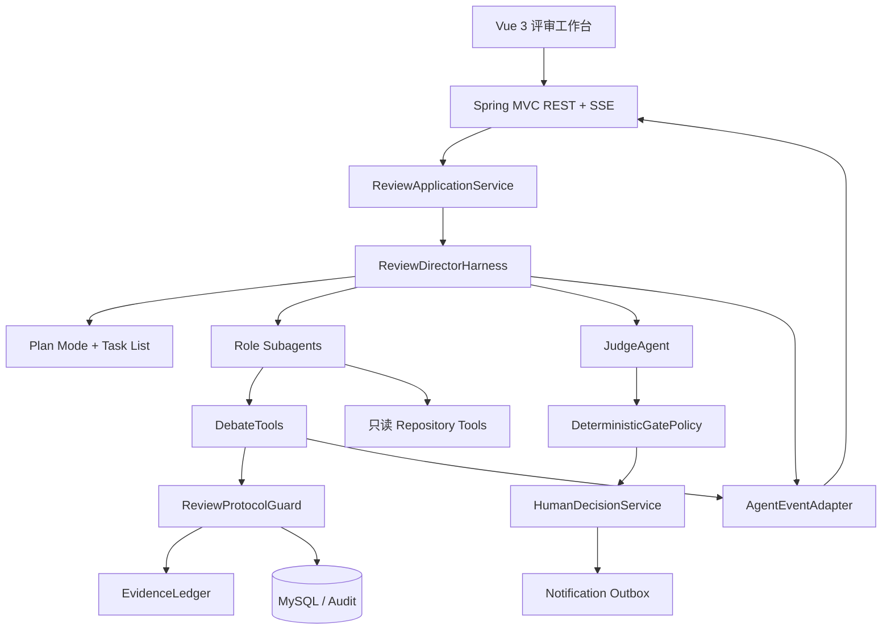

# 多智能体对抗式需求评审与门禁系统技术方案

> 基于 AgentScope Java 2.0 正式版、Spring Boot 4、MyBatis、`agentscope-extensions-mysql` 的两人 AI-native 团队 MVP 方案  
> 需求来源：`docs\需求文档\AI需求评审Agent_团队赛道项目方案V2.md:1`

## 1. 结论

本项目采用 **ReviewDirectorHarness（上帝主持人）+ 角色子 Agent + ReviewProtocolGuard + MySQL/Audit**。AgentScope Harness
是智能编排核心，负责理解需求、扫描代码、制定与调整计划、动态激活角色、组织辩论和汇总结论；Spring Boot
是可信治理底座，负责业务状态、协议约束、证据校验、事务、审计、Gate 和人工决策。

主持人拥有“怎么完成评审”的自主权，但没有绕过业务规则的主权。四个核心角色、单场最多 8 个 Agent、单争议最多两轮、证据有效性、预算、Gate
规则和人工最终决定都由确定性代码强制执行。

MVP 跑通以下闭环：

`需求输入 → Plan Mode 调查与计划 → 代码/需求证据检索 → 核心角色独立立论 → 动态角色激活 → 真实论点驱动质询 → 反驳/让步/立场变化 → Judge 裁决 → Gate 草案 → 人工决定 → 通知`

## 2. 能力边界

### 2.1 用户可见能力

- 上传 UTF-8 Markdown（`.md`）需求文档，提交本地仓库路径及可选 Git branch/commit。
- 实时查看主持人计划、角色激活原因、Agent 发言、质询、反驳、让步和裁决。
- 每条有效发言可追溯到 Claim、DebateTopic、EvidenceBlock、Agent、轮次和时间。
- 代码证据可回跳到绝对路径和单行号，并校验仓库快照哈希。
- 查看 AI Gate 建议，人工执行通过、有条件通过、阻断、退回或 override。
- 最终决策、操作者、模型版本、Prompt 版本、证据、通知结果均可追溯。

### 2.2 固定约束

- 单场最多 4 个核心角色、3 个按需角色和 1 个 Judge，共 8 个 Agent。
- 产品、项目、前端、后端四个核心角色必须完成首轮独立评审。
- 每个争议点最多两轮质询；超时、证据不足或仍无共识时转人工。
- 每次有效质询必须指向真实 `targetClaimId`，有效回应必须指向对应质询的 `targetTurnId`。
- 无有效 EvidenceBlock 的 P0/P1 Claim 只能标记为待核实，不能自动阻断。
- AI 只能给出 Gate 草案，不能形成最终生效状态。
- 本地仓库只读；不执行被评审仓库中的脚本、构建或测试。
- 审计和辩论事件只追加，不覆盖历史记录。
- MVP 数据持久化保存，不配置自动过期或定时清理策略。

### 2.3 自主性边界

主持人可以自主决定：

- 调查代码和需求的顺序；
- 哪些按需角色需要激活；
- 哪两个真实论点需要进入辩论；
- 质询对象、补证任务和下一轮计划；
- 何时建议 Judge 介入或提前结束已收敛辩题。

主持人不能自主改变：

- 强制角色、Agent 数量、辩论轮次和预算上限；
- EvidenceBlock 校验规则；
- GatePolicy 和人工审核要求；
- 仓库只读、目录白名单和敏感文件规则；
- 已落库的事实、历史事件和人工决定。

## 3. AgentScope 2.0 采用方式

### 3.1 已核实的本地源码能力

- Harness 集成 filesystem、sandbox、subagent、skill、Plan Mode 和 MCP 编排：
  `<agentscope-java>/agentscope-harness\src\main\java\io\agentscope\harness\agent\HarnessAgent.java:129`。
- `HarnessAgent.Builder` 原生支持 Plan Mode：
  `<agentscope-java>/agentscope-harness\src\main\java\io\agentscope\harness\agent\HarnessAgent.java:1794`。
- Harness 可启用任务清单：
  `<agentscope-java>/agentscope-harness\src\main\java\io\agentscope\harness\agent\HarnessAgent.java:1430`。
- Harness 可注册自定义子 Agent 工厂：
  `<agentscope-java>/agentscope-harness\src\main\java\io\agentscope\harness\agent\HarnessAgent.java:1633`。
- 子 Agent 支持持久会话，适合多轮辩论保持角色上下文：
  `<agentscope-java>/agentscope-harness\src\main\java\io\agentscope\harness\agent\subagent\SubagentDeclaration.java:463`。
- `agent_spawn` 支持同步或后台创建子 Agent：
  `<agentscope-java>/agentscope-harness\src\main\java\io\agentscope\harness\agent\tool\AgentSpawnTool.java:66`。
- `agent_send` 可向已创建的子 Agent 追加质询：
  `<agentscope-java>/agentscope-harness\src\main\java\io\agentscope\harness\agent\tool\AgentSpawnTool.java:67`。
- Harness 支持带 `RuntimeContext` 的 `streamEvents()`：
  `<agentscope-java>/agentscope-harness\src\main\java\io\agentscope\harness\agent\HarnessAgent.java:750`。
- 当前本地源码会转发同步 `agent_spawn/agent_send` 的子 Agent 事件：
  `<agentscope-java>/agentscope-harness\src\main\java\io\agentscope\harness\agent\HarnessAgent.java:761`。
- 当前本地源码在父 Agent 处于 Plan Mode 时检测该状态：
  `<agentscope-java>/agentscope-harness\src\main\java\io\agentscope\harness\agent\tool\AgentSpawnTool.java:299`
  ，并让 Harness 子 Agent 进入 Plan Mode：
  `<agentscope-java>/agentscope-harness\src\main\java\io\agentscope\harness\agent\tool\AgentSpawnTool.java:301`。
- `ReActAgent` 提供结构化输出能力：
  `<agentscope-java>/agentscope-core\src\main\java\io\agentscope\core\ReActAgent.java:634`。
- Agent 状态可按 `userId + sessionId` 保存与恢复：
  `<agentscope-java>/docs\v2\zh\docs\building-blocks\agent.md:444`。
- 工具权限可暂停并产生人工确认事件：`<agentscope-java>/docs\v2\zh\docs\building-blocks\permission-system.md:347`。

### 3.2 文档与源码差异

当前在线文档、本地 `plan-mode.md`、本地 `subagent.md` 和本地 `2.0.1-SNAPSHOT` 源码对“子 Agent 是否继承 Plan Mode”“
`streamEvents()` 是否转发子事件”存在口径差异。本地源码只用于理解实现，不作为项目依赖；运行行为以 AgentScope `2.0.0`
正式制品和自动化兼容测试为准。

即使锁定版本已实现父子 Plan 传播，所有子 Agent 仍需显式配置只读工具白名单、工作区根目录和 Permission 规则，在文件工具层再次禁止写入和目录逃逸。

### 3.3 版本策略

项目统一锁定 AgentScope 正式版 `2.0.0`：`pom.xml:31`。不使用本地 `2.0.1-SNAPSHOT`、浮动版本或内部修复制品。
第 1 周必须完成正式版兼容性 Spike，验证以下能力在 `2.0.0` 中的实际行为：

- Plan Mode 与计划文件；
- `agent_spawn`、`agent_send` 和 `persistSession`；
- 同步子 Agent 事件来源和顺序；
- 父 Plan 状态向子 Harness 的传播；
- 状态恢复、权限、任务取消和 MCP 注册。

若正式版行为与本地源码或在线文档不同，优先通过 `AgentRuntimeAdapter` 和项目业务层兼容，不切换到内部制品；同时保存兼容性测试结果，作为后续升级依据。

### 3.4 组件职责

- **ReviewDirectorHarness**：上帝主持人；调查、计划、动态路由、质询、补证、收敛和汇总。
- **Role Subagents**：产品、项目、前端、后端及按需专家；独立推理，通过强类型工具提交公开论点。
- **JudgeAgent**：只裁决已有 Claim、Evidence 和 DebateTurn，不重新编造事实。
- **ReviewProtocolGuard**：强制角色、轮次、状态迁移、证据、预算、幂等和 Gate 边界。
- **ReviewApplicationService**：受理、快照、异步执行、事务、恢复、人工审核和通知。
- **AgentRuntimeAdapter**：隔离 AgentScope 版本差异，对业务层暴露 `start()`、`streamEvents()`、`send()`、`cancel()` 和恢复能力。
- **AgentScope MySQL Store**：使用 `agentscope-extensions-mysql` 持久化 AgentState、workspace KV、sandbox snapshot 和分布式锁。
- **MyBatis Business Store**：持久化评审、Claim、Evidence、DebateTurn、Gate 和审计事件，是最终业务真相源。

## 4. Plan Mode 强计划驱动

### 4.1 两级计划

1. **评审总计划**：冻结需求、仓库调查范围、核心角色、候选角色、证据目标、预算和预计争议点。
2. **动态阶段计划**：每轮结束后根据新增 Claim、证据缺口和争议更新下一轮质询、补证和角色激活。

Plan Mode 固化“只读调查 → 写计划 → 人/策略确认 → 执行”。退出 Plan Mode 后使用任务清单推进计划。计划可以调整，但每次修改必须保存
`planVersion、changeReason、changedBy、createdAt` 并产生 `PLAN_REVISED` 事件。

### 4.2 Plan Mode 不能替代状态机

Plan Mode 主要约束工具和保存计划文件，不能独立保证四个核心角色、最多 8 个 Agent、最多两轮辩论、Gate 或人工审批。因此所有关键动作仍必须经过
ReviewProtocolGuard。

## 5. 总体架构



首期保持单 Maven 模块，按包隔离：

```text
ai.cc.chongming.review
├── api                     # REST、SSE、DTO
├── application             # 用例、异步任务、事务、恢复
├── domain                  # Review、Claim、Debate、Gate、状态机
├── agent
│   ├── harness             # ReviewDirectorHarnessFactory、Adapter
│   ├── role                # RolePack、SubagentDeclaration
│   ├── prompt              # 主持人/角色/Judge Prompt
│   └── event               # AgentScope Event → ReviewEvent
├── debate                  # DebateTools、ConflictDetector、ProtocolGuard
├── evidence                # 快照、检索、EvidenceLedger、校验
├── infrastructure
│   ├── model               # 千问/DeepSeek
│   ├── repository          # 本地仓库与未来 MCP
│   ├── persistence         # MyBatis Mapper
│   └── notification        # 学习通 MCP / Mock
└── config
```

上述 `agent` 是逻辑分组；AgentScope 的 Adapter、Harness、工具和事件适配实现统一放在
`infrastructure/agentscope/`，与专项计划中的文件清单保持一致，不额外创建平行的 `agent/` 源码根。

## 6. 上下文与工作区设计

### 6.1 共享事实，隔离推理

所有角色共享需求快照、仓库快照、EvidenceBlock、已公开 Claim、DebateTopic 和
DebateTurn，但不共享完整隐藏推理、私有记忆和未提交草稿。这样既能互相反驳，又能避免从众、上下文污染和 Token 膨胀。

首轮角色只获取自己的 RoleContext，不读取其他角色 Claim。进入辩论后，通过 `load_debate_context(topicId)` 只加载目标
Claim、相关证据和已公开回合。

### 6.2 工作区结构

```text
reviews/{reviewId}/
├── input/requirement.md
├── snapshot/manifest.json
└── attempts/{attempt}/
    ├── plans/PLAN.md
    ├── plans/history/plan-{version}.md
    ├── evidence/evidence.jsonl
    ├── claims/{roleCode}.jsonl
    ├── debates/{topicId}/round-{round}.jsonl
    └── reports/draft.md
```

需求和快照在同一 `reviewId` 下复用；计划、证据、主张、辩论和报告必须按 `attempt` 隔离，重试不得覆盖历史产物。
workspace 用于协作和演示，MySQL 用于状态恢复、唯一性、事务和审计。Agent 不得直接修改业务表，只能调用受控工具。

### 6.3 RolePack

```text
RolePack
- roleCode
- description
- activationRules
- promptTemplateVersion
- contextSelectors
- checklist
- allowedToolGroups
- outputContract
- modelProfile
- timeout
- maxIterations
- persistSession
```

核心角色固定声明；按需角色由主持人提出激活请求，ProtocolGuard 校验数量和规则后执行。角色使用稳定 `label`，使后续
`agent_send` 能继续同一会话。

## 7. 多 Agent 辩论技术实现

### 7.1 辩论不是并列报告

有效辩论必须形成：

`提出 Claim → 指向 Claim 的 Challenge → 指向 Challenge 的 Rebuttal → 保持/让步/改变立场 → Judge 裁决`

没有调用 DebateTools 落库的自由文本只作为展示文本，不计入正式辩论和 Gate。

### 7.2 核心数据契约

```text
Claim
- claimId, reviewId, roleCode, subjectKey
- category, severity, stance, statement
- evidenceIds[], impact, proposedAction, confidence
- status, createdAt

DebateTopic
- topicId, reviewId, subjectKey, claimIds[]
- openReason, currentRound, status
- resolution, createdAt, closedAt

DebateTurn
- turnId, topicId, round, actorRole, targetRole
- turnType: CHALLENGE | REBUTTAL | CONCESSION | POSITION_CHANGE | JUDGEMENT
- targetClaimId, targetTurnId, content, evidenceIds[]
- stanceBefore, stanceAfter, createdAt
```

所有 ID 由服务端生成。模型提交的 evidenceId、claimId、turnId 必须在本次 review 中真实存在。

### 7.3 强类型 DebateTools

```java
/**
 * 辩论领域工具契约。
 *
 * @author zyj
 */
public interface DebateTools {
    ClaimResult submitClaim(SubmitClaimCommand command);

    DebateTopicResult openDebateTopic(OpenDebateTopicCommand command);

    DebateTurnResult submitChallenge(SubmitChallengeCommand command);

    DebateTurnResult submitRebuttal(SubmitRebuttalCommand command);

    PositionResult changePosition(ChangePositionCommand command);

    EvidenceRequestResult requestAdditionalEvidence(EvidenceRequestCommand command);

    JudgementResult submitJudgement(SubmitJudgementCommand command);
}
```

工具执行顺序为：Bean Validation → 身份/阶段校验 → 引用完整性校验 → Evidence 校验 → ProtocolGuard → 单事务写入 → 写
`review_event` → 返回工具结果。不得通过解析 Agent 最终自由文本来补写 Claim 或 DebateTurn。

### 7.4 冲突检测

首轮结束后批量加载本次 Claim 和 Evidence，避免循环查库。ConflictDetector 先使用规则产生候选争议：

- 相同 `subjectKey` 下出现相反 stance；
- 严重度相差两个等级以上；
- 一个角色要求删除，另一个角色认为是核心验收项；
- 两个实施方案互斥；
- 高风险 Claim 无证据或证据互相矛盾；
- 不同角色引用同一代码位置得出相反结论。

主持人可发现规则未覆盖的语义冲突，但只能通过 `openDebateTopic(claimIds, reason)` 提交。Guard 至少验证两个真实 Claim
和明确冲突理由后才创建辩题。

### 7.5 辩论执行序列

1. 主持人使用 `agent_spawn` 激活核心角色；独立任务可后台并行执行。
2. 子 Agent 调用 `submitClaim`，服务端验证并落库。
3. ConflictDetector 和主持人生成 DebateTopic。
4. 主持人使用同步 `agent_send(label, challengeContext)` 指定质询者。
5. 质询者调用 `submitChallenge(targetClaimId, evidenceIds)`。
6. 主持人将已验证 Challenge 发送给被质询角色。
7. 被质询角色调用 `submitRebuttal`，必要时调用 `requestAdditionalEvidence` 补证或 `changePosition` 调整立场。
8. 已收敛则提前关闭；未收敛且未超限则进入第二轮。
9. 两轮仍未解决、核心证据不足或 P0/P1 冲突仍存在时标记 `ESCALATED`。
10. Judge 读取不可变辩论记录，提交裁决草案；GatePolicy 和人工审核完成最终决定。

初始独立评审可以使用 `timeout_seconds=0` 提高并行度；真正的质询回合使用同步调用，以便实时转发角色事件。后台任务至少发布
`ROLE_STARTED、ROLE_COMPLETED、ROLE_FAILED` 业务事件，不依赖 Token 级转发。

### 7.6 双层状态机

评审状态：

`PENDING → SNAPSHOTTING → PLANNING → INITIAL_REVIEW → CONFLICT_DETECTION → DEBATE_ROUND_1 → DEBATE_ROUND_2 → JUDGING → WAITING_HUMAN → NOTIFYING → COMPLETED`

辩题状态：

`OPEN → CHALLENGED → REBUTTED → RESOLVED | ESCALATED`

任意执行态可进入 `FAILED`；取消经过 `CANCELLING → CANCELLED`。重试创建新的 `attemptNo`，不得覆盖旧 AgentRun、辩论回合或事件。

Gate 契约分为两类：AI 草案使用 `AI_PASS | CONDITIONAL | BLOCK | RETURN | HUMAN_REQUIRED`；人工最终决定使用
`PASS | CONDITIONAL | BLOCK | RETURN | OVERRIDE`。`HUMAN_REQUIRED` 不是 ReviewStage，产生同名事件并转入
`WAITING_HUMAN`。

每个动作使用幂等键：

`reviewId:topicId:round:actorRole:turnType`

状态更新使用乐观锁。模型调用期间不持有数据库长事务，每个有效业务动作单独事务提交。

### 7.7 主持人协议

主持人 System Prompt 固化以下规则，并由 Guard 二次执行：

- 首轮必须保持角色独立，不能提前互相展示结论；
- 只围绕真实 Claim 和 Evidence 发起辩论；
- 每次质询只解决一个明确冲突；
- 鼓励角色明确保持、部分接受、完全接受或改变立场；
- 不以“大家一致”作为唯一目标，证据充分的未共识可以升级人工；
- 不展示或持久化模型隐藏思维链，只保存公开论点和工具动作。

## 8. 证据链设计

### 8.1 只读工具集

- `search_code(query, includeGlobs, limit)`
- `read_snippet(relativePath, lineNumber, contextLines)`
- `list_files(glob, limit)`
- `find_symbol(symbol, fileTypes, limit)`
- `get_requirement_section(sectionId)`
- `load_debate_context(topicId)`

不注册 Shell、写文件、Git checkout 或任意路径读取工具。工具执行前必须：

1. 路径规范化并确认仍位于 snapshotRoot；
2. 拒绝符号链接和 Windows junction 越界；
3. 过滤 `.env`、密钥、证书、`.git`、`target`、二进制和超大文件；
4. 限制结果数、片段行数和累计上下文预算。

### 8.2 EvidenceBlock

```text
evidenceId, reviewId, sourceType, repoRevision,
sourceAbsolutePath, snapshotRelativePath, lineNumber,
excerpt, excerptHash, fileHash, createdAt
```

`excerptHash = SHA-256(repoRevision + relativePath + lineNumber + normalizedExcerpt)`
。落库前、进入辩论前和生成报告前分别校验。源仓库变化时仍展示快照片段，并提示工作区漂移。

## 9. 模型网关与失败处理

- 模型统一接入公司商业合作模型服务；具体模型 ID、路由和凭证通过部署配置注入，不写死在 RolePack。
- MVP 不设置额度或成本 Gate，不因 Token 配额主动降级；仍保留调用超时、重试和失败转人工机制。
- RolePack 只引用逻辑模型配置，不直接依赖厂商模型名。
- 网络错误和 429 指数退避，最多两次；结构化输出只修复重试一次。
- 单个按需角色失败可部分完成；核心角色失败不得输出 AI_PASS，必须转人工。
- Judge 失败时使用确定性规则生成不含自由文本归纳的 Gate 草案。
- 全部模型不可用时只返回证据检索和规则结果，不伪造 AI 结论。
- 记录模型、Prompt、工具和 RolePack 版本、输入哈希、耗时、Token、重试和降级原因。
- 不保存或展示模型隐藏思维链。

## 10. 数据模型

持久化分为两层：AgentScope 运行态由同版本的 `agentscope-extensions-mysql` 管理，覆盖 Agent 会话、workspace、snapshot 和锁；
评审领域数据继续由 MyBatis 管理，避免把运行时存储误当作可查询、可审计的业务模型。两层共用受管 DataSource，但使用独立表名前缀和迁移脚本。
所有数据长期保留，MVP 不实现 TTL、自动归档或物理删除。

| 表                      | 作用                               |
|------------------------|----------------------------------|
| `review_request`       | 输入、提交人、执行态、版本号、attempt           |
| `review_plan`          | 计划版本、内容、修改原因、确认状态                |
| `requirement_snapshot` | 不可变需求原文、结构化内容、SHA-256            |
| `repository_snapshot`  | commit、dirty、manifestHash、快照目录   |
| `role_activation`      | 角色、激活来源、原因、状态                    |
| `agent_run`            | Agent、session/label、轮次、模型、状态、耗时  |
| `evidence_block`       | 路径、单行号、片段与哈希                     |
| `claim`                | subjectKey、立场、严重度、论点、状态          |
| `claim_evidence`       | Claim 与 Evidence 多对多             |
| `debate_topic`         | 争议、关联 Claim、轮次、状态和结论             |
| `debate_turn`          | 质询、反驳、让步、立场变化和裁决                 |
| `judge_decision`       | Judge 对争议的采信结论、依据和人工升级建议         |
| `gate_decision`        | AI 草案、规则命中、人工决定、override         |
| `review_event`         | 可重放领域事件，`reviewId + sequence` 唯一 |
| `human_review_item`    | 人工审核草稿、引用、动作与版本                   |
| `audit_event`          | 只追加的操作与状态审计                      |
| `model_call_log`       | 模型调用元数据和失败信息                     |
| `notification_outbox`  | 通知命令、幂等键、重试和结果                   |
| `review_report`        | 结构化 JSON、Markdown、版本和确认状态        |

所有时间字段对外输出 `yyyy-MM-dd HH:mm:ss`。报告和冲突检测批量加载 Claim、Evidence 和关联关系，禁止在循环中逐条查询数据库。

## 11. API、事件流与辩论可视化

### 11.1 API

- `POST /api/reviews`：上传 `.md` 需求文档并创建评审，返回 202 和 reviewId。
- `POST /api/reviews/{id}/start`：幂等异步启动。
- `GET /api/reviews/{id}`：评审概览。
- `GET /api/reviews/{id}/events`：SSE，支持 `Last-Event-ID`。
- `GET /api/reviews/{id}/plans`：计划及版本历史。
- `GET /api/reviews/{id}/debates`：辩题、回合和立场变化。
- `GET /api/reviews/{id}/evidence/{evidenceId}`：单条证据详情，仅按服务端 ID 查询。
- `GET /api/reviews/{id}/report`：角色报告、裁决和 Gate 草案；支持 `?format=markdown`。
- `GET /api/reviews/{id}/report/versions`：报告版本历史。
- `GET /api/reviews/{id}/human-review-items`：查询人工审核条目。
- `POST /api/reviews/{id}/human-review-items`：新增人工审核条目。
- `PATCH /api/reviews/{id}/human-review-items/{itemId}`：编辑未提交的人工审核条目。
- `DELETE /api/reviews/{id}/human-review-items/{itemId}`：删除未提交的人工审核条目。
- `POST /api/reviews/{id}/human-decisions`：提交人工决定和 version；提交后不可原地修改，后续调整创建新版本。
- `POST /api/reviews/{id}/retry`：从指定阶段新建 attempt。
- `POST /api/reviews/{id}/cancel`：协作取消，不删除历史。

### 11.2 领域事件

AgentScope 原始事件先经 `AgentEventAdapter` 转为项目事件。成功的业务工具动作产生正式领域事件；EvidenceValidator
拒绝证据时产生 `EVIDENCE_REJECTED`，但不会创建有效 Claim 或 DebateTurn：

- `PLAN_CREATED`、`PLAN_REVISED`
- `ROLE_ACTIVATED`、`ROLE_STARTED`、`ROLE_COMPLETED`、`ROLE_FAILED`
- `CLAIM_SUBMITTED`、`EVIDENCE_CITED`、`EVIDENCE_REJECTED`
- `DEBATE_OPENED`、`CHALLENGE_SUBMITTED`、`REBUTTAL_SUBMITTED`
- `POSITION_CHANGED`、`DEBATE_RESOLVED`、`DEBATE_ESCALATED`
- `JUDGEMENT_SUBMITTED`、`HUMAN_REQUIRED`、`GATE_DECIDED`

统一事件包含：

```text
eventId, sequence, reviewId, attempt, type, category, stage,
actorRole, targetRole, topicId, claimId, turnId,
round, progress, occurredAt, payloadVersion, payload
```

当前项目使用 Spring MVC：`pom.xml:36`。使用 `SseEmitter` 桥接 AgentScope Flux，不同时引入 WebFlux 和
MyBatis 阻塞链路。前端按 sequence 幂等合并，断线后先回放数据库事件再继续实时订阅。

### 11.3 前端辩论工作台

核心展示不是“多个角色报告页”，而是可回放的辩论时间线：

`产品立论 → 后端质询 → 前端提出替代方案 → 安全补充风险 → 产品改变立场 → Judge 裁决`

每张发言卡展示 Agent、发言类型、目标 Claim、Evidence、回合、立场前后变化和对 Gate 的影响。代码证据支持点击回跳。页面同时展示当前
Plan、活跃 Agent、辩题状态、剩余轮次和人工介入原因。

人工审核工作台支持对审核条目进行查询、新增、编辑和删除，并据此提交最终 Gate 决定。草稿允许修改；已提交决定和历史版本只读，所有操作写入审计事件。

## 12. 安全与审计

- 仓库根目录必须位于管理员白名单，前端路径不可直接读取。
- 需求、代码、README 和注释均视为不可信数据，不能改变系统 Prompt、权限或 Gate。
- 子 Agent 声明显式配置工具白名单；文件工具层和 PermissionEngine 双重限制。
- 主持人不能直接写业务表，只能通过强类型工具和 Guard。
- 人工审核接口预留评审人认证与授权；草稿可 CRUD，已提交决定不可原地修改；overrideReason 必填并随版本永久保留。
- 通知仅由已提交的人工最终状态触发，采用 Outbox。
- 日志脱敏 API Key、Authorization、Cookie、连接串和代码密钥。
- 审计只保存公开论点和操作，不保存隐藏思维链。

## 13. 测试与评测

### 13.1 自动化测试

- 状态机：非法阶段、越轮、重复动作、乐观锁、取消和重试。
- DebateTools：伪造 Claim/Evidence、错误目标、越权角色、幂等提交。
- ConflictDetector：相反立场、严重度差异、互斥方案和无冲突样本。
- Agent 合约：MockModel 固定发言，验证立论、质询、反驳和立场变化。
- Harness 集成：Plan、`agent_spawn`、`agent_send`、持久会话、父子权限、事件来源。
- 证据安全：软链接/junction 越界、敏感文件、Prompt Injection、超大仓库。
- 数据集成：MySQL/Testcontainers、SSE 回放、Outbox、重复启动。
- 故障注入：模型超时、非法 JSON、子 Agent 失败、Judge 失败、通知失败。

### 13.2 辩论验收条件

每个 Demo 必须至少出现：

- 两个真实、结论相反或方案互斥的 Claim；
- 一次指向 `targetClaimId` 的质询；
- 一次带 Evidence 的反驳；
- 一次保持、让步或立场改变；
- 一次 Judge 裁决或人工升级；
- 从 Gate 结论反向追溯到 DebateTurn、Claim 和 Evidence。

### 13.3 评测基线

至少准备 6 组需求与仓库快照，固定模型、温度、Prompt、工具和上下文预算，对比单 Agent 与多 Agent：

- 代码证据有效率、已知问题覆盖率和人工采纳率；
- P0/P1 误报率、重复 Claim 率；
- 有效冲突发现率、无效争论率和立场变化率；
- 平均收敛轮次、总耗时和模型成本；
- 结构化工具提交成功率、事件完整率和恢复成功率。

## 14. AI-native 开发与六周计划

### 14.1 产能假设

团队两人全程使用 Codex 开发。8 个 Agent 不是 8 套系统，而是一套 Harness、通用子 Agent 工厂、配置化 RolePack 和共享协议。Codex
重点用于架构讨论、源码检索、代码/测试生成、重构、故障定位、评测脚本、文档和答辩材料。

AI 提高实现速度，但不能消除框架版本、并发取消、模型不稳定、证据伪造、权限越界和 Demo 环境风险。节省的时间优先投入兼容性测试、评测和故障演练。

每项开发任务保存“Codex 方案讨论 → 代码生成 → 人工修改 → 测试验证”的证据链，包括任务记录、Prompt 迭代、diff、测试结果和人工审查结论，用于比赛
`AI 工具应用深度` 证明。

### 14.2 六周计划

| 周次 | 技术交付                                               | 验收标准                              |
|----|----------------------------------------------------|-----------------------------------|
| 1  | Harness + Plan Mode Spike、版本矩阵、ModelGateway、状态机骨架  | Plan、子 Agent、持久会话、权限、事件和恢复行为有测试结论 |
| 2  | 快照、只读检索、EvidenceLedger、单角色闭环                       | 证据可回跳，伪造 ID 和目录越界被拒绝              |
| 3  | 四核心 RolePack、持久子 Agent、首轮并行、共享事实账本                 | 四角色独立立论并批量落库                      |
| 4  | ConflictDetector、DebateTools、两轮质询、Judge、GatePolicy | 真实 Claim 可质询、反驳、改变立场和裁决           |
| 5  | 辩论时间线、人工审核、报告、审计、通知、按需角色                           | 完整闭环可重复演示，SSE 可断线恢复               |
| 6  | 6 组评测、超时/恢复/越权演练、视频和 Codex 证据整理                    | 在线链路和明确标注的降级方案均可展示                |

第 2 周完成最小“需求 + 仓库 → 一份可信证据报告”；第 5 周后禁止增加新角色、第二 Demo 场景或新的外部系统。

## 15. 明确不做

- 不让 Harness 绕过 ReviewProtocolGuard，但允许它在边界内自主计划和编排。
- 不共享各角色的完整隐藏推理历史，不以长期记忆作为评审事实。
- 不自动修改代码、不执行仓库脚本、不连接真实发布门禁。
- 不在 MVP 引入消息队列、微服务、向量数据库或复杂 RAG。
- 不预先实现 15 个角色，只实现四核心、三个按需和 Judge。
- 不把 Agent 自由文本直接作为 Claim、辩论结果或 Gate。
- 不追求所有角色达成共识；证据充分的未共识允许升级人工。
- 不解析 Word/PDF，MVP 只接收 Markdown 需求文档。
- 不承诺比赛现场缓存降级；网络故障兜底方案延后决策。

## 16. 已确认决策与剩余问题

| 事项            | MVP 决策                    | 实施影响                                                          |
|---------------|---------------------------|---------------------------------------------------------------|
| AgentScope 版本 | 锁定正式版 `2.0.0`             | 本地 `2.0.1-SNAPSHOT` 只用于源码参考，不作为依赖                             |
| Demo 仓库规模     | 暂不设置文件数和容量上限              | 不按规模预拒绝；保留超时、取消和资源监控                                          |
| 模型与额度         | 使用公司商业合作模型，不设置额度 Gate     | 模型 ID、连接和超时走部署配置                                              |
| 学习通通知 MCP     | 已由其他 Agent 验证，可直接纳入集成     | 复用既有 Schema、鉴权和幂等约定，接入时补项目级回归测试                               |
| 人工审核          | 通过页面对审核条目 CRUD，并提交最终 Gate | 草稿可修改；已提交决定版本化且不可原地覆盖                                         |
| 持久化与保留期       | 数据长期持久化，不自动清理             | AgentScope 运行态使用 `agentscope-extensions-mysql`，领域数据使用 MyBatis |
| 需求文档格式        | 仅接收 Markdown（`.md`）       | 暂不引入 Word/PDF 解析链路                                            |
| 现场缓存兜底        | 延后决策                      | 当前 MVP 不承诺缓存结果可替代在线评审                                         |

仍需在联调前确认两项策略，但不阻塞基础架构开发：评审人如何接入现有身份认证，以及 P1 的默认 Gate 规则与 override 权限范围。

## 17. Handoff

方案可以进入第 1 周 Harness Spike。编码顺序建议为：状态机与 ProtocolGuard → EvidenceValidator → DebateTools →
Harness/角色工厂 → 事件桥接 → 真实模型 → 前端辩论时间线。每个阶段先用 MockModel 和固定脚本验证，再接入真实模型。

详细执行以 `docs/AIREVIEW-PLAN-001-总体实施路线图.md` 为总索引，并按 PLAN-002 至 PLAN-015 的前置依赖、独立退出标准和验证证据逐项推进。

## 参考资料

- [AgentScope Java 2.0 Harness](https://java.agentscope.io/v2/zh/docs/harness/architecture.html)
- [AgentScope Java 2.0 Plan Mode](https://java.agentscope.io/v2/zh/docs/harness/plan-mode.html)
- [AgentScope Java 2.0 子 Agent](https://java.agentscope.io/v2/zh/docs/harness/subagent.html)
- [AgentScope Java 2.0 工具与 MCP](https://java.agentscope.io/v2/zh/docs/building-blocks/tool.html)
- [AgentScope Java 官方仓库](https://github.com/agentscope-ai/agentscope-java)
